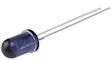
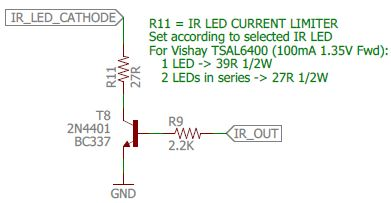
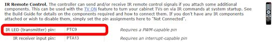
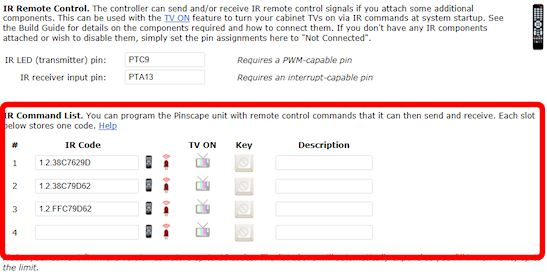

= IR Remote Control

The Pinscape software is equipped to send and receive IR remote control codes. This is primarily for the sake of the xref:tvon.adoc[TV ON] feature, which can power up your TV(s) at system startup by sending them the necessary IR codes. But you can also use it to transmit any remote control codes you wish at any time, and to translate received IR codes into Windows key presses, allowing a remote control to effectively serve as extra "buttons" on your cabinet.

There are two completely separate hardware projects here: an IR transmitter, which sends out the codes to your TV, and an IR receiver, which can receive codes from your remote control in order to learn the codes specific to your TV or to accomplish those button-press capabilities we mentioned.

The expansion boards include both the IR transmitter and receiver as standard features. You can also build them as add-ons for a standalone KL25Z with a small amount of external circuitry.

== Wiring the transmitter and receiver

An IR transmitter isn't anything too exotic. It's really just an LED that emits infrared light. Consumer electronics use a pretty standard range of IR wavelengths, so all we have to do is select an IR LED that emits light of the right "color".

Physically, an IR LED looks like other small LEDs. The only obvious difference is that the case is often opaque or dark plastic rather than the clear plastic you'd find in an optical-wavelength LED.

The Pinscape software controls an IR LED through a GPIO port on the KL25Z. The software rapidly turns the LED on and off to form a pattern of flashes that your TV interprets as a remote control command.

An IR receiver is a more specialized device, purpose-built to read and demodulate signals from an IR remote transmitter. But fortunately they're quite cheap and easy to connect. They're actually easier to connect electrically than an IR LED is, because they don't need much in the way of additional parts.

=== Connecting an IR emitter to the expansion boards

The IR transmitter LED connects to the "TV ON" pin header on the main expansion board, also labeled JP4. This header has six pins; the IR LED connects to the two pins in the column labeled *IR+* .

You don't have to connect anything else to these pins besides the IR LED. Just connect the LED so that its *long leg* connects to the *IR+* pin, and the *short leg* connects to the *IR-* pin.

=== Connecting an IR receiver to the expansion boards

Simply install the IR receiver chip directly in its spot in the expansion boards. You'll need to bend the legs at a 90° angle to that it doesn't stick out too far, as it nestles in under the KL25Z.

=== No expansion boards: using a pre-built kit

If you're not using the expansion boards, and you'd rather not build any external circuits by hand, there are some ready-made kits available. The ones I've seen are designed for Arduinos, which is another microcontroller (similar to the KL25Z, but different hardware) that's popular with robotics hobbyists. I haven't tested any kits myself, but I've heard from a couple of people who have successfully used this kit:

*  link:https://www.amazon.com/dp/B01E20VQD8/[Amazon.com: MagicW Digital 38khz Ir Receiver 38khz Ir Transmitter Sensor Module Kit for Arduino Compatible]

If that product link isn't working, you might try searching for similar products on Amazon or at hobby robotics vendors like link:https://pololu.com/[Pololu] or link:https://adafruit.com/[Adafruit] . The transmitters and receivers for IR remotes are fairly standardized, so there's a fairly good chance that similar kits will be compatible with the KL25Z electronics and the Pinscape software.

Wiring the receiver:

* Connect *VCC* on the receiver board to one of the 3.3V pins on the KL25Z (pins 4 or 8 on J9)
* Connect *GND* on the receiver board to one of the GND pins on the KL25Z (pins 12 or 14 on J9)
* Connect *DATA* on the receiver board to the GPIO pin you've selected for input. Any interrupt-capable GPIO pin can be used, which means that you can use any PTAxx or PTDxx port. Configure the port you select as the IR receiver pin in the Pinscape Config Tool settings. See xref:#irPinSelection[Selecting GPIO pins] below.

See xref:kl25zPinOut.adoc[KL25Z Pin Out] for the KL25Z pin wiring diagram.

Wiring the transmitter:

* Connect *VCC* on the transmitter board to one of the 3.3V pins on the KL25Z (pins 4 or 8 on J9)
* Connect *GND* on the transmitter board to one of the GND pins on the KL25Z (pins 12 or 14 on J9)
* Connect *DATA* on the receiver board to the GPIO pin you've selected for the transmitter output. A PWM-capable port must be used. Configure the port you select as the IR transmitter pin in the Pinscape Config Tool settings. See xref:#irPinSelection[Selecting GPIO pins] below.

See xref:kl25zPinOut.adoc[KL25Z Pin Out] for the KL25Z pin wiring diagram.

=== No expansion boards: Build your own IR transmitter

The recommended IR LED (TSAL6400) is relatively powerful as LEDs go, so the KL25Z can't drive it directly from a GPIO port. A small power booster circuit is needed. All you need is a simple transistor amplifier. Here's the schematic:

This is the same circuit used on the expansion boards (the diagram above is actually taken from the expansion board schematics).

* Connect the *short leg* of the LED to the wire labeled *IR_LED_CATHODE* . The convention for all LEDs is that the long leg is (+) and the short leg is (-).
* Connect the *long leg* of the LED directly to the +5V power supply.
* Connect the wire labeled *IR_OUT* to the GPIO port on the KL25Z that you're using for the IR output. See xref:#irPinSelection[Selecting GPIO pins] below.
* Connect GND to one of the ground pins on the KL25Z. See xref:kl25zPinOut.adoc[KL25Z Pin Out] .

=== Selecting resistor R11

Choose the resistance value for R11 according to whether you're using one LED or two:

*  *For one LED* , use a 39Ω, ½ Watt resistor
*  *For two LEDs* , use a 27Ω, ½ Watt resistor

=== No expansion boards: Build your own IR receiver

The recommended IR receiver device, TSOP38238, contains both the optical sensor and the demodulation circuitry. You just need two additional parts (a resistor and a capacitor) to connect it to the KL25Z. Here's the connection diagram:

* Connect *IR_IN* to a GPIO port on the KL25Z that you're using for the IR input. See xref:#irPinSelection[Selecting GPIO pins] below.
* Connect *3V3_KL25Z* to one of the 3.3V pins on the KL25Z. See xref:kl25zPinOut.adoc[KL25Z Pin Out] .
* Connect GND to one of the ground pins on the KL25Z. See xref:kl25zPinOut.adoc[KL25Z Pin Out] .

[#irPinSelection]
=== Selecting GPIO pins for the power sensing circuit

The IR transmitter can use any PWM-capable GPIO pin on the KL25Z. The default for the expansion boards is PTC9, but you can use any pin with PWM capability. For a list of PWM pins, see xref:kl25zPinOut.adoc[KL25Z Pin Out] . The Config Tool will also show you the available pins if you go to the IR section on the Settings page and click on the "IR LED (transmitter) pin" box:

The IR receiver can use any interrupt-capable GPIO pin. The default for the expansion boards is PTA13, but you can use any pin in the "PTAxx" or "PTDxx" groups. See xref:kl25zPinOut.adoc[KL25Z Pin Out] for all interrupt-capable pins, or click on the "IR receiver input pin" box in the IR section on the Settings page in the Config tool:

== Positioning the IR transmitter LED

Assuming you're using the IR transmitter to control a TV, it's best to place the LED as close as possible to the IR receiver window on the TV. You can run as much wire as necessary between the LED and the expansion board port (or your own circuit) to position the LED properly.

== Using two IR transmitter LEDs

You can connect two IR LEDs instead of just one. This can be useful if you need to control two TVs, since it lets you position a separate transmitter near each TV's IR receiver. To connect two LEDs, connect them in series:

* Connect the +5V supply to the first LED's long (+) leg.
* Connect the first LED's short (-) leg to the second LED's (+) leg. You can run as much wire between the two as needed to position the two LEDs properly.
* Connect the second LED's short (-) leg to the *IR_LED* connection in the schematic.

[#learnRemoteCodes]
== Learning IR commands from your remotes

Once you have the hardware installed, you can use the Pinscape Config Tool to learn IR command codes from your remotes. Once Pinscape learns a command code, you can use it for various functions:

* Transmit it at system startup to power up your TV
* Transmit it when you press a button
* Send a key press when the IR receiver receives the code

To learn IR codes:

* Launch the Pinscape Config Tool
* Go to the Settings page
* Scroll down to the *IR Remote Control* section
* Under that, you'll find the *IR Command List* section: 

* The IR Command List shows a list of the commands that Pinscape has learned. Initially, this will be empty, so it will just show one empty row.
* To learn the first code, click the "learn" icon (image:images/IR-learn-icon.png[""]
) in the empty first row. This will bring up another window that will lead you through the programming process.
** Get your IR ready, pointing at the Pinscape IR receiver
** Click the *Learn* button in the dialog
** Press and hold the button on the remote that you want to learn
** The "learn" window will show a graphical representation of the learned code, showing the series of on/off light pulses used for the raw bits of the code. If it captures a code successfully, click Save to store the code.
* After you've entered a code into the first blank row, a new blank row will appear. You can continue adding more codes the same way. The "learn" button (image:images/IR-learn-icon.png[""]) programs the code for the row that you click on, so you can go back and replace any row's code with a new code later if you want.
* You can enter a description for each code (such as the name of the remote control button it's associated with) in the Description field. This is just to help you keep track of which buttons you've programmed, so you can enter anything there that will help you identify the button in the future.
* Remember to click "Program KL25Z" at the bottom of the Settings page when you're done, to save the settings in the device.

=== Using a code to power on a TV

The IR remote feature was primarily designed to be used with the xref:tvon.adoc[TV ON] feature that powers up your TVs at system startup, so the remote control code list has a special provision to use a code with the TV ON system.

After you've programmed a code, you'll notice that there's a little TV ON icon (
) in the row next to the code. Just click this icon to activate the TV ON feature for the code. When this icon is activated, Pinscape will automatically send the code at system startup, after a delay that you can program in the TV ON section in the Settings page.

== How to transmit an IR code via a Windows command

In your Pinscape Config Tool install folder, you should find another utility program called *PinscapeCmd.exe* . You can use this program to make Pinscape transmit any of the IR command codes it knows at any time via the Windows command line.

* Open a CMD prompt
* Go to the Pinscape Config Tool folder: `CD /D C:\PINSCAPE` (or wherever it's installed)
* Type `PinscapeCmd SendIR=1`

The *SendIR* command transmits the learned command code in the given slot. If you go back to your IR command list, the number corresponds to the row number in that list.

You can put that command in a .BAT script as well, so you can send IR commands from any programs that can launch .BAT scripts, such as PinballX or PinballY, or automation programs like AutoHotKeys.

== How to transmit an IR code when you press a button

You can program Pinscape to send an IR code when you press a cabinet button. This might be useful if you want to set up a hidden button that turns your TV on or off, for example.

* Open the Config Tool
* Go to the Settings page
* Scroll down to the Button Inputs section
* Click the Remote Control icon in the row for the button you want to assign to an IR command 

* Select the learned IR command code to send from the list 

* Click *Program KL25Z* to save settings
* Now whenever you press that button, the associated IR code will be transmitted

== How to send a Windows keyboard key press when an IR code is received

You can also program Pinscape to send a key press to Windows when the IR receiver sees a given IR code. This lets you turn a remote control into a set of additional "buttons" that you can use to access Windows functions, without festooning your cabinet with even more physical buttons.

To make this work, you'd have to situate your IR receiver where it can "see" IR codes from your remote. The expansion boards don't really make a provision for this, since they situate the receiver right on the main board, where it'll probably be hidden away inside the cabinet. I guess you could open the coin door and point the remote inside. If you really want to use this feature regularly, though, you'd have to come up with a fancier setup where you move the IR receiver somewhere more accessible, like behind an opening in the front of your cabinet.

Aside from those complications with physically getting the IR signal to the receiver, it's easy to set up the IR-to-key-press feature:

* Open the Config Tool
* Go to the Settings page
* Scroll down to the IR Remove Control section
* Click on the key-cap icon for the command you want to associate with a key press
* That will show the same key/joystick selection popup that's used to map buttons to key presses, so just select a keyboard key or joystick button in the usual fashion
* Click *Program KL25Z* to save settings
* Now whenever the IR receiver receives that code, Pinscape will send the associated key press to Windows

