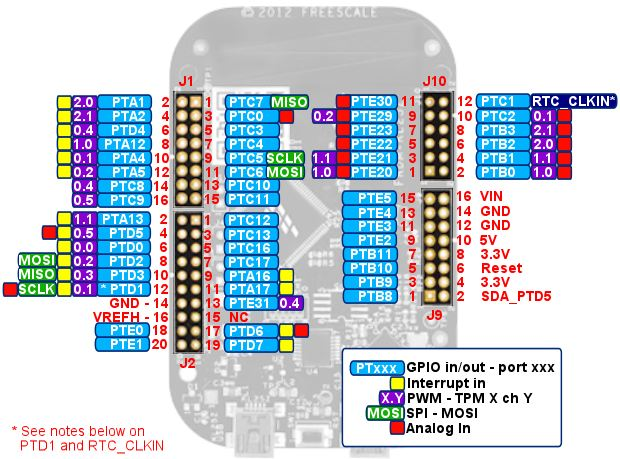
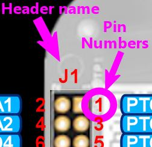
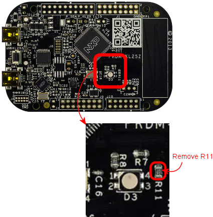
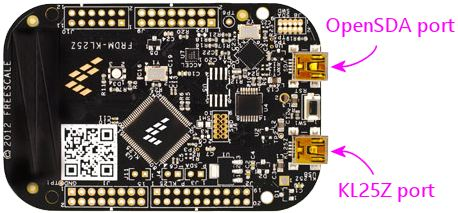

= KL25Z Pin Out

== How to read the diagram

The diagram above shows all of the KL25Z's pin connections, labeled by their "header" name and "pin number".

There are four headers - rectangular blocks of pins arranged in a group. They're labeled *J1* , *J2* , *J9* , and *J10* . In the diagram, each header's name is printed just above or below header itself.

The pins on each header are numbered from 1 to however many pins are on the header. The diagram shows each pin's number alongside the pin.

Throughout the Build Guide, we refer to individual pins using notation like this:

*J9-4*

To find that pin, you go to header *J9* and find *pin 4* on that header.

The reason we use this notation is that the pin numbers by themselves are ambiguous, since every header has a "pin 1" and a "pin 2" and so on. You always have to know which header we're talking about to know exactly which pin we're talking about. So we'll always tell you something like "pin 7 on header J9", or the more compact shorthand "J9-7".

Most (but not all) of the pins _also_ have another name of the form *PTA1* . The "PT" stands for "Port", and the "A1" is another arbitrary label like the pin numbers. These range from PTA0 to PTE31. You can see these names in the little blue boxes alongside the pins on the diagram above. These are the names of the "GPIO" or "General Purpose Input/Output" ports, which are electrical connections to the KL25Z CPU itself. These are very important to us, because they're the KL25Z's gateways to the outside world. They're where we can connect buttons, sensors, and feedback devices.

The other markings on the diagram alongside the GPIO port names indicate the "capabilities" of each port. The KL25Z's physical wiring gives special capabilities to certain ports. The capabilities are important to understand if you're writing software for the device or working it into a hardware design, but you won't have to worry about these if you're using the Pinscape software, since it already takes all of this into account. The Pinscape Config Tool will guide you to the proper port selections whenever special capabilities come into play.

== PTD1 and the blue on-board LED

The port labeled PTD1 needs some additional explanation. It's a GPIO port, but it's also hard-wired on the KL25Z to the blue segment of the KL25Z's on-board status LED - the RGB LED that normally shows the Pinscape firmware's current status by flashing various color patterns ( xref:statusLights.adoc[KL25Z Status Lights] ).

You can use PTD1 as a feedback device output port if you wish, simply by assigning it to an output port row in the Pinscape Config Tool. If you do, its output port use automatically supersedes the status light usage in the Pinscape firmware, so there won't be any conflict at the software level. However, be aware that the on-board wiring to the blue LED will still be there. The blue LED wiring is a fixed, physical feature of the KL25Z board that can't be changed in software. This means that the blue LED segment will turn ON whenever the PTD1 pin is at a "low" voltage, and OFF whenever PTD1 is "high". So the blue LED will light up when the feedback port is OFF and turn off when the feedback port is ON. You can just ignore that if it doesn't bother you, or you can modify the KL25Z as described below to sever the on-board wiring to the LED.

You can also use PTD1 as a button input port, again, simply by assigning it in the Config Tool. As with using PTD1 as an output port, using it as a button input port will automatically supersede its use to control the Pinscape status LED indicator, so the blue segment of the status light will stop functioning. And as with using PTD1 as an output port, using it as an input port won't actually remove the physical connection between the PTD1 pin and the blue LED. The effect as an input port will be that the blue LED will turn on whenever you press the connected button. That should be harmless, but if it bothers you, you can use the procedure below to sever the internal wiring to the blue LED.

I wouldn't attempt to use PTD1 for any other purpose (such as a plunger input, TLC5940 output, etc) _unless_ you sever the LED wiring as described below. The LED wiring shouldn't interfere with using PTD1 as a feedback output port or button input port, but it could create problems for other uses, since it places an electrical load on the pin in addition to whatever else you're connecting. That could definitely interfere with using the port as an analog input or for any high-speed signal I/O.

*Severing the on-board wiring between PTD1 and the blue LED:* To break the connection to the on-board LED and turn PTD1 into a true general-purpose port, remove resistor R11 on the KL25Z board. R11 is a small surface-mount resistor on the top of the board; see the diagram below to help find it. It's labeled with the text "R11" next to the part, so double-check the printed label to make sure you've identified the right part.

R11 isn't too hard to remove, since it has a fair amount of empty space around it on the board. My approach to removing it would be to use a pair of forceps to take hold of the part, and then touch a soldering iron to the part to melt the solder, pulling away gently with the forceps until the part pulls free. You could also just use the tip of the soldering iron to apply some gentle sideways pressure to the part while heating it. Continue pressing it until it comes loose, then flick it away so that it doesn't reattach as the solder cools.

If you do sever the blue LED wiring, the blue component of the Pinscape status indicator light will obviously stop working. That will disable all of blue elements of the flash patterns, and will change purple elements to red.

== RTC_CLKIN (PTC1, J10 pin 12)

Port PTC1 has a special assignable usage, as the reference clock signal input for the real-time counter, which the KL25Z documentation refers to as RTC_CLKIN. This provides an external reference clock signal (a square wave running at a specific frequency) for the KL25Z's on-board real-time module. The RTC is designed to perform time-keeping functions, particularly related to scheduled events.

The Pinscape software doesn't currently use the RTC module, so this pin is free for use as an ordinary GPIO pin.

If any features are ever added to the Pinscape software that require the RTC module to be activated, this pin will have to be used for the clock input whenever those features are activated. I don't contemplate any such features currently, and even if some future use does become interesting, it would be optional - you'd only have to reassign PTC1 to that usage if you enabled the new feature.

(The pin is actually hard-wired on the KL25Z to a pin on the separate SDA CPU - the one that runs the boot loader, for installing new firmware versions. This is designed so that the SDA CPU can be programmed to generate the required external clock signal for the RTC module. The mbed version of the boot loader unconditionally generates that signal on this hard-wired connection, so if the mbed boot loader is installed, PTC1 can't be used as a GPIO pin - the clock generator feeds a 32768 Hz square wave into this pin, making it effectively impossible to use for anything else. Fortunately, the standard PCMicro boot loader that comes with the KL25Z doesn't do this; it leaves the connected SDA CPU output port in a high-Z state, which effectively turns the hard-wired connection into an open circuit and thus allows us to use the GPIO pin normally.)

== SDA_PTD5 (J8 pin 2)

This is another unusual pin that can't be used for any Pinscape function.

Even though the name makes it sound like a GPIO pin, this pin doesn't connect into the KL25Z CPU at all. Instead, it connects to a separate chip on the board where the boot loader resides. "SDA" is Freescale's name for their boot loader system, which is why this pin is labeled SDA_PTD5 instead of just plain PTD5. Confusingly, the boot loader chip has its own set of GPIO ports, with basically the same naming convention as the KL25Z's ports. That's why the name looks like a GPIO pin - it _is_ a GPIO pin, just not a KL25Z GPIO pin. That means that it's not usable for Pinscape purposes, since the Pinscape software has no way to access the pin.

== USB Ports

(Note that the ports are labeled in fine print on the *bottom* side of the KL25Z, so you don't have to just remember which is which.)

The "KL25Z port" is the one that's connected to the microcontroller proper. This is the port that the Pinscape software uses for its USB joystick, keyboard, and LedWiz emulation interfaces.

The "OpenSDA" port _isn't_ connected to the microcontroller. It's connected to a separate processor on the board that's there for the sole purpose of downloading firmware into the microcontroller's flash memory. That separate processor isn't involved in any of the Pinscape functions, so the OpenSDA port doesn't need to be connected at any time except when installing new firmware. But it's also harmless to leave it plugged in all the time - leaving it plugged in doesn't interfere with normal Pinscape operations. The OpenSDA processor just sits there emulating a thumb drive awaiting firmware downloads.

== About the KL25Z

The KL25Z is a single-board computer, incorporating a 32-bit ARM-architecture CPU (Cortex M0+), 16K SRAM, numerous on-board peripheral devices within the CPU (three PWM modules, a 4-channel DMA controller, real-time clock, SPI and I2C bus interfaces, a USB 2.0 host/device controller, three UARTs, an analog-to-digital converter, a digital-to-analog converter, a flash memory controller, and more), and additional peripherals on the board but external to the CPU (a three-axis accelerometer, a touch sensor, a clock generator, and an RGB LED).

The board also includes an integrated "programmer" module with its own separate USB connection. This is what allows us to download new firmware, such as the Pinscape Controller software, directly from a Windows machine.

== GPIO ports and special functions

All told, the KL25Z CPU chip (not the board, but the chip itself) exposes about 80 external connections. About 50 of these connections are exposed through header pins on the KL25Z board. The rest are mostly dedicated to connections with the on-board peripherals; these aren't exposed externally as they can't be reassigned. That's part of why you find the gaps in port numbering on the exposed pins.

Most of the external header pins on the KL25Z are wired to GPIO ports ("general-purpose I/O"), which can be connected to external electronics to send digital signals to and from the KL25Z CPU. The diagram above shows the layout of the header pins and the GPIO port assignments. The pin layout can't be changed by the software; the pins are physically wired this way on the board.

In addition to the basic GPIO functions, many of the pins can also be connected, under software control, to one or more of the on-board peripherals. As with the GPIO port assignments, the set of these possible connections for each pin is hardwired: each pin can only perform certain special functions. The diagram shows which special functions are available on each pin. The software determines which special function a given pin performs at any given time using another on-board peripheral called the "multiplexer". This is a essentially a switchboard that connects pins to special modules. At any given time, a pin can only be connected to one module. For example, a pin that's PWM-capable only generates PWM signals when the software tells the multiplexer to connect the pin to the PWM module.

== PWM limitations

The KL25Z hardware has some rather complex limitations on its PWM outputs. The diagram tries to make these evident, but you have to understand the nature of the limitations to make sense of the information in the map.

The KL25Z generates PWM signals (pulse-width modulation) through on-board peripherals called TPMs (Timer/PWM Modules: yes, it's a nested acryonym). The CPU has three of these modules: TPM0, which has 6 channels; TPM1, with two channels; and TPM2, with another two channels. That's ten channels total across the three modules.

If you look at the diagram, you'll see that there are 23 GPIO pins marked as PWM-capable. This brings us to the first limitation. You can't actually have 23 separate PWM outputs, despite the 23 PWM-capable pins. The PWM signal reaching the pins has to be generated in the TPM module channels, and as we've seen, there are only 10 of these channels in all. Take a look at the map and find PTA1 and PTB2. You'll see these are both marked "2.0" in their PWM boxes. That means both of these pins are assigned to TPM2 channel 0. You _can_ assign both of these channels as PWM outputs, but if you do, you won't be able to control them independently, because they both get their signals from TPM2.0. Change the brightness on one pin and you'll change it to the same setting on the other pin. So despite the 23 PWM-capable pins, you can really only use 10 of them as PWM outputs at once.

The subtler limitation is in the pulse frequency generation. The *duty cycle* of a PWM output is controlled by its *channel* . However, the *period* of a PWM output is controlled by its *module* . All of the channels on a given module share the same period (or, equivalently, frequency). Many PWM applications don't care very much about the frequency, but the frequency is critical for some purposes. For example, if we're using the PWM signal as a clock generator for an external device, we need an exact frequency setting. This means that if we need two such clocks at different frequencies, we have to assign the two functions to pins that map to separate TPMs, to given them independent control over the frequency.

The ability to set independent frequencies isn't just academic. It actually matters for Pinscape if you're using the expansion boards and/or the IR functions:

* The expansion boards use a PWM output to generate the master clock signal for the TLC5940 chips (called the "grayscale clock" in the TLC5940 data sheet). This master clock frequency isn't set in stone, but it's constrained by a number of factors: it has to be fast enough that the strobing effect isn't visible to the eye, and its upper limit is constrained by the KL25Z's data transmission speed, the ability of the physical wiring to conduct signals reliably, and the TLC5940 chip's design limits. For the full technical details, refer the TLC5940 driver source code in the Pinscape firmware (TLC5940/TLC5940.h in the source tree). The setting as of this writing is 350 kHz.
* The IR transmitter uses a PWM channel to generate the IR carrier frequency. This frequency is determined by the IR protocol being used for a given transmission, so it can vary from one transmission to the next. The protocols currently implemented use carrier frequencies ranging from 36kHz to 40kHz.

The requirements for these features to use specific PWM frequencies, combined with the limitations of the KL25Z's TPM hardware, has two important practical implications:

* First, the TLC5940 interface's master clock port and the IR transmitter's data output port *must* be assigned to GPIO ports that use *separate* TPM units. Each function requires the ability to set its own frequency independently of other PWM usages, and since the frequency of a PWM output is set at the *TPM unit* level, each function must have free control over an entire TPM unit. Therefore each must be assigned to a separate TPM unit.

The Pinscape Config Tool knows about this requirement, and it will automatically guide you to select appropriate GPIO pins if you're using both functions. It'll warn you if you attempt to assign the two functions to the same TPM unit. You must not ignore these warnings; the device won't function properly if you do.

* Second, if you're using a TLC5940 chip and/or the IR transmitter, *and* you're also using GPIO ports as regular feedback output ports, be aware that the GPIO ports you're using might have their PWM frequencies fixed by the TLC5940 or IR transmitter functions. This might be an issue if you're using booster circuitry with the outputs, because the TLC5940 clock setting is a high frequency that might be too fast for booster circuits. Booster circuits that use optocouplers in particular might not work properly, because most optocouplers have a speed limit of about 80kHz, well below the TLC5940's 350kHz setting.

You can mitigate this by assigning your PWM feedback outputs to GPIO ports that use other TPM units. Refer to the matrix below for the associations between GPIO pins and TPM units.

Here's a matrix showing the available GPIO ports for each TPM unit. Remember, the frequency of a PWM port is set at the *unit* level, so all of the ports associated with TPM Unit 0 will operate at the same frequency, all of the ports assigned with Unit 1 will operate a second common frequency, and all of the ports on Unit 2 operate on a third common frequency. Each *channel* represents a separately controllable *duty cycle* that operates at the common frequency for its unit. For example, PTA4 and PTC2 are both on Unit 0, Channel 1, so they represent the same PWM output; they can't be separately controlled, as they share the same frequency (set on Unit 0) and the same duty cycle (set on Unit 0 Channel 1).

[cols="1,1,1"]
|===
|TPM Unit|Channel|GPIO ports

|0
|0
|PTD0

|1
|PTA4, PTC2, PTD1 (blue on-board LED)

|2
|PTA5, PTC3, PTD2, PTE29

|3
|PTC4, PTD3, PTE30

|4
|PTC8, PTD4, PTE31

|5
|PTC9, PTD5

|1
|0
|PTA12, PTB0, PTE20

|1
|PTA13, PTB1, PTE21

|2
|0
|PTA1, PTB2, PTB18 (red on-board LED), PTE22

|1
|PTA2, PTB3, PTB19 (green on-board LED), PTE23

|===

== Why is the pin layout so random?

Blame the Arduino.

The layout is as it is because the KL25Z's designers took Arduino compatibility as the starting point. The Arduino is a popular hobbyist platform that started off on some rather primitive 8-bit hardware. One of the features was a very rigid assignment of particular functions to particular pins - PWM output, analog in, UART RX/TX, etc. The KL25Z is much more flexible in the way it maps these special functions to pins, but it's not infinitely flexible; it too can only expose certain functions on certain pins. In order to achieve the desired pin compatibility with the Arduino, the KL25Z's designers had to arrange the pins in the peculiar order we find them in here. This arrangement allows the pin at each physical position to be assigned to its traditional Arduino role, which allows some Arduino add-on boards to be used directly with a KL25Z. (But be careful if you plan to do this, because there is one other major difference between the Arduino and KL25Z that can seriously affect compatibility: voltage. Most Arduinos run on 5V, whereas the KL25Z is a 3.3V device. The KL25Z will be damaged if exposed to 5V levels on any of its GPIO pins. Many Arduino add-ons generate 5V signals, which makes them incompatible with a KL25Z even if the pin layout matches.)

