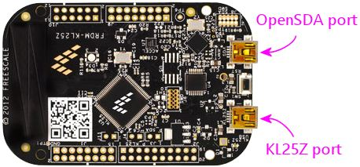

= KL25Z Software Setup

The KL25Z is a "microcontroller", which is basically a tiny computer. Unlike a desktop computer, though, it doesn't require an operating system in the usual sense. There's no equivalent of Windows or Linux to install. Instead, you only have to install one thing: the Pinscape firmware. That serves as both the operating system and the application software. It controls all of the virtual pinball functions of the KL25Z, including the sensors, buttons, and feedback devices, and it handles communications with Windows.

In addition to the Pinscape firmware that runs on the KL25Z, there's a separate Pinscape program that runs on your Windows PC, called the Config Tool. This provides an interactive interface for setting up the device, configuring it, and testing it. You don't need to leave the Config Tool running all the time; it's only needed to set up the device. You can also run it again at any time to change options, update the firmware, or troubleshoot problems (it includes some testing features that can help debug the hardware setup).

The software installation process is all controlled from the PC. The Config Tool handles the KL25Z software setup, so the first step is to install the Config Tool on your PC. You can download it here:

link:http://mjrnet.org/pinscape/downloads/PinscapeConfigTool.zip[PinscapeConfigTool.zip]

To install, download the ZIP file above and unpack it into a folder on your hard disk. Use any location that's convenient. Open the folder and double-click the "PinscapeConfigTool" application.

The config tool should automatically go out and find the latest firmware version and download it for you. The firmware files are fairly small (in the 100K byte range), so this should only take a few seconds if you have a broadband Internet connection.

To install the firmware, click the link "Set up a new KL25Z" in the config tool window. The program will lead you through the process of setting up the device and installing the firmware.

If the Config Tool doesn't recognize your device at all, you might need to manually install a new version of the KL25Z boot loader; see link:http://mjrnet.org/pinscape/BuildGuideV2/bootLoaderUpdate[ *KL25Z Boot Loader update* ] below.

If all goes well, you should see a Pinscape device listed when you get back to the main menu screen. This will give you options to configure settings and test the device's inputs.

You'll also see the LED on the KL25Z flash a status indicator pattern. Alternating green/yellow or green/blue indicate healthy operation. See xref:statusLights.adoc[KL25Z Status Lights] for the full list of status light patterns.

== KL25Z Boot Loader update

In the old days before about 2018, KL25Z's shipped from the factory with a "boot loader" that didn't work with Windows 8 or 10. The boot loader is the part of the device's software that lets you install new software - such as Pinscape - onto the device, so it's a pretty critical component. More recent versions of the KL25Z have a newer version of the boot loader that does work properly with Windows 8 and 10, so if you bought your KL25Z any time after 2018 or so, you probably won't have to worry about this. But just in case you happen to have found a vendor selling dusty old stock from the back of the warehouse, I wanted to mention this.

In most cases, the Pinscape Config Tool will automatically test the boot loader version when you use the *Set up a new KL25Z* procedure described above, and walk you through the update process if it's necessary. If you were able to go through that procedure successfully, you can skip the rest of this section. But if the Config Tool didn't recognize your device when you tried to set it up, you might need to refresh the boot loader manually. The procedure is below.

However, there's an important and rather obnoxious catch-22 you need to know about first: *This procedure might only work on Windows versions 7 and earlier.* It might not work on Windows 8 or 10. Old versions of the factory firmware had a bug that made them incompatible with 8 and 10. This is the obnoxious catch-22: you need the boot loader to _update_ the boot loader, so if you have the old version that doesn't work on your Win 8/10 machine, you can't use it to install the new version that does work on Win 8/10. There are some complex workarounds that people have found, such as running Windows 7 in a virtual machine box. You can find that information in a Web search, but I'm not going to reproduce it here, because it's very complex and tedious, and no one should need it any more. If you just bought a KL25Z, and find that it doesn't work with your Windows 8/10 machine (and you don't have an old Win 7 machine lying around), I'm going to suggest that you send back the KL25Z as defective, and ask the seller to send you a fresher one that was manufactured in 2019 or later.

And again, if the Config Tool recognized your device and you were able to go through the *Set up a new KL25Z* procedure successfully, you *don't* need to worry about this procedure.

Finally, this is a *one-time procedure* that you should never have to do again for this particular KL25Z. It's not necessary to repeat this when updating Pinscape versions.

Here's the procedure:

* In your Web browser, go to link:https://pemicro.com/opensda/[pemicro.com/opensda/]
* Find the section *OpenSDA Firmware (MSD & Debug)* . Click on the *Firmware Apps* link. You'll be asked to create a free account or to provide your email address to receive a download link. Choose the option you prefer and download the file.
* Unzip the downloaded file to a local folder on your hard disk.
*  *Unplug all USB cables from your KL25Z.* If you have any other KL25Z cards already installed, unplug all of those as well.
* Open the My Computer window on your Windows desktop, so that you can view attached disk drives.
* 
*Press and hold* the KL25Z reset button.
*  *Keep holding the reset button* while you plug a USB cable into the *programming* port on the KL25Z, and plug the other end into a USB port on your computer.
* Release the reset button.
* You should see a new thumb drive icon appear in the My Computer window, with a name like *BOOTLOADERAPP* . This represents the KL25Z's programming port. (The name might be different depending on the old boot loader version. As long as a new drive appeared when you plugged in the USB port, that should be the right one, no matter what it's called.)
* In the PEMicro software you downloaded above, find the file *BOOTUPDATEAPP_Pemicro_v111.SDA* . (The digits at the end are the version number, so they can vary.)
* Drag and drop that file onto the KL25Z thumb drive.
* Wait for Windows to finish copying the file, then unplug the KL25Z.
* We're now going to repeat the steps above with a different .SDA file. As before, press and hold the reset button on the KL25Z, and plug in a USB cable between the KL25Z programming port and your computer. Release the reset button. In the downloaded files, find *MSD-DEBUG-FRDM-KL25Z_Pemicro_v114.SDA* , and drag it onto the thumb drive. (As before, the digits at the end might vary.) Unplug the USB cable after Windows finishes copying the file.
* To confirm that everything worked, reconnect the KL25Z programming port to your PC *without pressing the reset button* . The thumb drive should appear again, but it should now be titled *FRDM-KL25Z* . You should also see a steady (non-blinking) green LED on the card while it's plugged in.
* If any of this doesn't match what you see, the update might not have worked. *If you attempted the upgrade from Windows 8 or higher, that's probably the problem.* The old (pre-2018) factory firmware is incompatible with Windows 8-10 and will fail silently and mysteriously, with no error messages, if you're on Win 8-10. If you did the update from Windows 7 or earlier and it still didn't work, it's possible that the procedures have changed since this writing. Try looking for instructions (.txt and/or .pdf files) in the files you downloaded from PEMicro, to see if there's any information on new procedures.
* If all went as expected, your KL25Z is now ready to use. With the updated firmware in place, the device should now work on all versions of Windows from XP to 10 and hopefully beyond.

== Software updates

I update the Pinscape firmware periodically to fix bugs and add new features. I always try to maintain compatibility with existing installations when making changes, so you can generally update to the latest no matter which version you started with. However, it's completely up to you whether or not you want to keep up to date with the latest changes. There's something to be said for not messing with a working system, but it's also nice to have the latest bug fixes and features.

The Config Tool automatically checks for updates (unless you tell it not to) each time you run it, but it doesn't install them on its own. You have to tell it to install updates. So your firmware will never mysteriously change when you're not expecting it.

You can download the latest versions and archived versions of the firmware and Config Tool at the Pinscape web site:

link:http://mjrnet.org/pinscape/swversions.php[http://mjrnet.org/pinscape/swversions.php]

== KL25Z USB ports

The KL25Z features two USB ports. They're not interchangeable - each port has a specific function.

You don't have to memorize which port is which. The ports are labeled in tiny text on the bottom side of the board. Just flip the board over and look for the labels if you're ever in doubt.

The "KL25Z port" is the one that Pinscape uses for all of its joystick emulation, keyboard emulation, and LedWiz emulation functions. This port must always be plugged in during normal operation.

The "OpenSDA port" is the "programming" port. It doesn't actually connect to the microcontroller proper; it's connected to a separate processor on the board that's just there to handle firmware downloads. This port is only needed when you want to update the firmware, so you don't have to leave it plugged in all the time. But you can; it doesn't interfere with normal operations. I find it more convenient to leave it plugged in all the time, especially in a pin cab setting where you'd have to open up the cabinet to plug it in manually.

The OpenSDA port emulates a USB thumb drive, so you'll see a virtual hard disk (usually called "KL25Z") appear on your Windows desktop whenever the cable to this port is plugged in. This isn't a true disk drive, so don't copy random files there - doing so can mess up the Pinscape firmware. This virtual drive's only function is to program the KL25Z's flash memory with new firmware.

