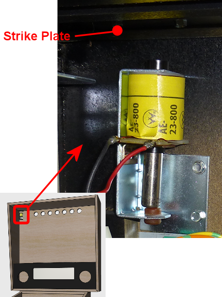

= Replay Knockers

The replay knocker is the device in a real machine that makes the loud knock noise when you win a free game, exceed the replay score, etc. This is implemented in the real machines with a solenoid coil positioned in the backbox so that its plunger strikes a metal plate when fired.

The knocker isn't used all that often, and all it does is make a noise, but I still consider this a must-have toy. When the knocker does fire, it's always at particular dramatic points during play, so it really demands the same dramatic sensory effect as the real thing. Recorded audio played back through speakers is a pale imitation.

== Parts

Knockers are pretty simple mechanisms, so it wouldn't be hard to improvise a DIY version using a push-type solenoid. But there's not much point to that, since you can just buy a real one for about the same money it would cost to build a DIY version. And the real ones comes as full assemblies, so they're easy to buy and install.

There are two parts to buy, both available from pinball parts vendors like Pinball Life and Marco Specialities:

* The knocker assembly itself. Look for Williams/Bally reference B-10686-1. You might be offered a choice of coils. Any of the options available from your vendor should work, but the recommended one is AE-26-1200. These sell for about $25.
* A knocker strike plate. This is a small steel plate that the knocker plunger hits, to enhance the sound effect (and protect the backbox area where the plunger hits). You can substitute a similar metal plate from Home Depot, such as a steel backing plate or tie plate, but the pinball part is cheap (about $3), so you might as well add one to your cart as long as you're ordering the knocker assembly.

== Installation

Modern replay knockers are designed to be mounted vertically in the backbox, on the back wall near the top, so that the plunger strikes the ceiling of the backbox. They have to be installed vertically because the assemblies don't have springs; they depend on gravity to pull the plunger back to the rest position after firing.

Install the knocker as shown above, so that the top of the knocker assembly is about 1" below the ceiling of the backbox. Mount the strike plate on the ceiling just above the knocker assembly.

The knocker assembly should come with the plunger already inserted through the coil, but it can fall out. If it has fallen out, insert it so that the white plastic tip is facing *up* . The white plastic tip is the part that hits the strike plate. Many people find this surprising - it seems like the metal end should be the hammer end. That's understandable but wrong. The metal end is actually the magnetic element that gets pulled into the coil, so it should be facing down.

== Power supply

Modern replay knockers are designed to run on 50V DC power. They'll run on lower voltages, down to about 24V, but the power of the effect will be correspondingly reduced.

50V supplies are expensive difficult to find, but you can find relatively inexpensive 48V supplies on eBay. If your budget can tolerate it, I'd buy a dedicated 48V, 5A supply, which are available for about $20. If you're using any other real pinball assemblies, such as flippers, slingshots, or bumpers, you'll need a 48V supply for those anyway, so you can just attach the knocker through that.

If your budget is tight, you can use an existing 24V supply, but the effect will be a bit weak. You might consider buying a "DC to DC step-up converter" on eBay to boost the power as high as possible; converters that will take the power to about 40V are available in the $10 range. But given that a dedicated 48V supply is only a little more expensive, I think that's a better option.

CAUTION: 48V is a hazardous high voltage. Be careful to turn off power when working inside the cabinet once you have a 48V supply installed. Note that there will be a live +48V voltage to the knocker's red wire any time the power supply is connected, _even when the knocker isn't firing_ , since the knocker is controlled through the black wire.

== Wiring

A new knocker assembly usually comes with a diode already installed, and two wires, one red and one black. Connect the red wire directly to the positive (+) power supply voltage. Connect the black wire to an available output port on your output controller.

If your coil _doesn't_ come with a diode already installed, you must add your own, to protect your output controller and other electronics from interference from the magnetic field from the coil. See xref:diodes.adoc[Coil Diodes] .

The Williams/Bally knocker assemblies come with a Molex 3-pin .093" cable connector. You can cut this off and solder your own wires if you like, or you can buy a matching connector. The matching connector is available from pinball vendors and from electronics companies like Mouser:

*  link:https://www.mouser.com/search/ProductDetail.aspx?R=538-03-09-1032.html[Molex .093" 3-position receptacle]
*  link:https://www.mouser.com/search/ProductDetail.aspx?R=538-02-09-1119.html[Crimp socket (female)]

If you're using the Pinscape expansion boards, connect this to the "Knocker" pin on the JP9 pin header. This is a "timer protected" output, to prevent the knocker coil from getting stuck on. That protects the coil from overheating in case of software failure. See xref:coilTimers.adoc[Coil Timers] .

If you're using an LedWiz, you'll have to use a booster circuit of some kind. The replay knocker will draw 3-4A when activated, which exceeds the 500mA (0.5A) maximum for an LedWiz port. You can connect the knocker directly to the Pinscape expansion board's dedicated "Knocker" output, or directly to any Power Board or Chime Board output port.

== DOF Setup

In the link:https://configtool.vpuniverse.com/[DOF Config Tool] , go to the Port Assignments page. Find the port number where you wired the replay knocker coil. Assign this to "Knocker".

