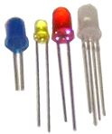
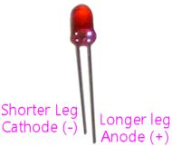
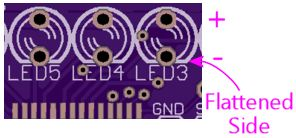
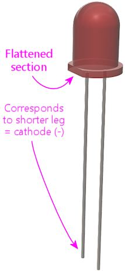
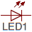
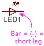

[#leds]
= LEDs

LEDs are in fact diodes - it's right in the name, Light Emitting Diode.
They're just a special type of diode that glows when current is flowing.

Using an LED in a circuit board is mostly like using any other diode in a circuit board, so you might want to take a look at xref:cmpdiodes.adoc#cmpdiodes[Diodes] .
The main difference with an LED is that the physical package is usually a little different.
Through-hole LEDs usually use "radial" packages, with two leads sticking out of the bottom.

== Static electricity warning

LEDs are sensitive to static electricity.
Refer to xref:staticSafety.adoc#staticSafety[Static Electricity Precautions] for tips on handling static-sensitive parts.

== Identifying the positive and negative legs

Regular diodes use a stripe on the body to indicate the negative end, but that doesn't work for most LEDs because of the different package shape.
Instead, LEDs usually indicate the positive and negative sides using a longer leg and a shorter leg:

It's actually kind of mnemonic: shorter = minus.

The negative lead of an LED is also known as the cathode; the positive lead is the anode.
(Here's my handy trick for remembering which is which.
Remember CRT TVs?
CRT stands for Cathode Ray Tube.
We know that a "Cathode Ray" is actually an electron, and that electrons have negative charge.
So the cathode is the negative side.)

== Orienting on a circuit board

The circuit board markings for an LED will indicate the orientation, either by marking one of the pads with a "\+" sign for the "+" leg, or via the outline on the circuit board.
If it's indicated via the outline, one side of the outline circle will be flattened:

The flat side on the diagram corresponds to the flat side on the base of the LED's plastic bubble.
It's pretty subtle on smaller parts - so much so that I can't get a good photo.
Instead, here's a 3D rendering that exaggerates it enough to see clearly:

To orient the LED for installation, line up the flat side on the base of the bubble with the flat side of the outline on the circuit board.
If there's not an obvious flat side, match up the short leg on the LED with the flattened side on the circuit board outline.

== On schematics

The schematic symbol for an LED reflects that it's really a diode, by using the same basic symbol.
But there's also a little embellishment added to show the special light-emitting feature: a couple of little arrows pointing out, representing the photons being emitted.

As with a regular LED, the arrow points from positive to negative, so the side with the "bar" is the negative lead or cathode.

== LED specs

LEDs are characterized mainly by two values: the *forward voltage* and *forward current* .

A lot of people get confused about the forward voltage number, thinking that it means the required supply voltage.
That's a completely reasonable mistake, because for just about any other kind of device, a "voltage" spec would mean just that.
But for an LED, it's something different.
The forward voltage is actually the voltage that the LED "drops" in the circuit, which is sort of like consuming the voltage.
In order for an LED to function, it must be supplied with _more than_ its forward voltage.

For example, if you have an LED rated with a forward voltage of 3.5V, it'll work if you supply it with 5V, since 5V is greater than the rated forward voltage.
It _won't_ work if you supply it with 3V, because that's less than the rated forward voltage.

The supply voltage has to be higher than the LED's forward voltage, but it's more efficient if it's not _too_ much higher.
The higher the voltage, the more power has to be wasted in current-limiting resistors.
For example, if you have an LED with a 3.5V forward voltage, and you have a choice of powering it with a 5V or a 12V supply, you should choose the 5V supply.
Both 5V and 12V are above the required threshold, so either one will work, but 5V is more efficient because it's the lower voltage option.

You often see LEDs rated with a range for the forward voltage, such as "3.2V - 3.4V".
That just means that there are some variations in the manufacturing process, so individual LEDs will each be a little different, but each one should be somewhere in that range.
If you're trying to figure the required supply voltage, just make sure the voltage is higher than the high end of the range.

The other spec for an LED is the forward current.
That's more straightforward: that actually is the current level that you're supposed to use with the LED.
You might also see a separate maximum forward current; this is a level you should never exceed.
LEDs don't vary much in brightness when you change the current level, but they do get hotter, so there's usually no benefit in using a higher current than the recommended forward current.
Doing so just reduces the lifetime of the part.

== Selection

LEDs are usually placed in a circuit solely for their ability to emit light, as opposed to serving some kind of active function that affects the other electronics in the circuit.
This makes them more interchangeable than regular diodes, where the circuit designer might be relying on a particular diode's special electronic characteristics.

So in most cases, the only two things that matter when selecting an LED are its *forward voltage* and *forward current* ratings.
And you don't typically have to match these exactly - you just need compatibility.
What constitutes compatibility depends on the circuit:

* If the circuit has active current regulation, so that it won't exceed a given current level through the LED, an LED is compatible with the circuit if the LED's forward voltage is _lower_ than the power supply voltage in the circuit, _and_ the LED's maximum forward current rating is at least the regulated current level that the circuit uses.

For example, if your circuit board provides 5V power to an LED with current regulated to 20mA, you can use an LED with a forward voltage of 2V (because 2V is less than the 5V supply voltage) and a maximum current rating of 50mA (because 50mA is greater than the regulated 20mA).
You _can't_ use an LED with a forward voltage of 6V, because that exceeds the 5V supply voltage.

* If the circuit board uses a resistor to regulate the current (see xref:ledResistors.adoc#ledResistors[LED Resistors] , and you _can't_ substitute a different resistor, you can use any LED with approximately the same forward voltage that the circuit designer specified, and with a maximum current rating at least as high as the forward current that the circuit designer specified.
I can't give you a hard-and-fast rule for exactly how "approximate" you can be, but let's say within 10% or so.

For example, if your circuit board uses a resistor to regulate current and calls for an LED with a 3.2V forward voltage and 20mA forward current, you can use any LED with a forward voltage of about 2.9V to 3.5V (within 10% of the specified 3.2V), and a maximum forward current of 20mA or higher.

* If the circuit board uses a resistor to regulate the current, and you _can_ substitute your own resistor in place of what the designer specified, you can use any LED with a forward voltage less than the supply voltage in the circuit.

In this case, you'll have to select an appropriate resistor based on the LED you actually end up using.
See xref:ledResistors.adoc#ledResistors[LED Resistors] forthe formulaan on-line calculatorfor selecting the resistor.
When figuring the resistor value, use the LED's forward voltage spec, and use the desired current in the circuit.
The desired current must be less than or equal to the maximum current specified for the LED, and it must also be less than or equal to the maximum current that the circuit can safely supply.
For that, you'll have to consult the circuit board's specifications or ask the designer.

If you're installing an LED in a circuit board, it also obviously has to match the physical size and shape that the board was designed for.

