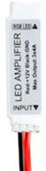
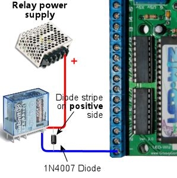
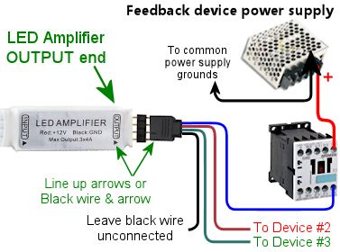

= LedWiz Setup

The LedWiz has long been the most popular output controller for virtual cab builders. It was originally created for video game cabinets, not for pin cabs, but the two have a lot in common: they both use a PC to run their software, and they both use arcade controls built into a custom enclosure. Video game cabs use the LedWiz mostly to control button lamps and other cabinet lights. But a device like the LedWiz that can turn lights on and off can really turn just about anything on and off, so it filled the need when early pin cab builders wanted to install mechanical force feedback devices in addition to lights.

The LedWiz has a lot of virtues. It's inexpensive, it has a "driverless" software design that makes it practically effortless to set up in Windows, it has lots of output ports (32), and it has the ability to control the brightness on all ports via PWM. Its only serious limitation is power handling.

[#LedWizPowerLimits]
== Power limits and boosters

The LedWiz has fairly low power limits, because of its legacy as a video game device. In a video game cab, the only "feedback" devices most people install are small light bulbs and LEDs. The LedWiz's designers chose the power limits accordingly.

The exact limit is 500mA per output port. (To be really technical, there's also a limit on the combined power across groups of ports, but we can mostly ignore that in a pin cab; that only applies if all of the ports are switched on for long periods at the same time, which essentially never happens in a pin cab.)

500mA is plenty for the light bulbs and LEDs that the LedWiz's designers had in mind. But it's not enough for some of the mechanical devices we use in pin cabs. Many types of solenoids, contactors, coils, and motors can greatly exceed this. Some high-power LEDs can exceed it, too. So whatever you're connecting, be sure you know how much current it uses, and be sure it's safely under the 500mA limit. If you can't find information on a device's power usage in its instructions or spec sheet, you can measure it with a multimeter set to Current (Amps) mode.

What should you do if a device exceeds the 500mA limit? Well, for starters, *don't* connect it directly to the LedWiz. If you do, you'll likely destroy at least the one LedWiz port that you connected the device to, and possibly a whole group of eight ports (because each group of eight ports is controlled by a single chip on the LedWiz, and an overload on one port can destroy the whole chip).

What you need in this case is a "booster" circuit of some kind. A booster is something that increases the power handling on a port, which it accomplishes by adding a second electronic switch between the LedWiz and your high-power feedback device. The LedWiz controls the booster's second switch, and the second switch controls the feedback device.

Here are the main types of boosters you can use:

* A booster board from link:https://zebsboards.com/[zebsboards.com] . Zeb's sells several boards that connect to an LedWiz. These use high-power transistor switches, so they're compatible with PWM brightness control. This is the easiest option, because Zeb's products are built specifically for virtual pin cab use, so you won't have to improvise anything to fit them into your system.
* Your own DIY booster circuit using a MOSFET or other transistor. We provide a simple circuit design xref:#diyLWBooster[below] . It's easy to build, and it's powerful enough for just about any type of pin cab device.
* 
An LED light strip amplifier from eBay. Search for "Mini LED amplifier", and look for products similar to the one pictured at right; they go for about $1 apiece if you buy a lot of 5 or so. These use transistor switches based on the same principles as Zeb's boosters or the DIY booster circuits described above. These are designed to be used with RGB light strips, so each unit has three independent channels of amplification, so you'd need 11 of them to boost all 32 ports on an LedWiz. Each channel can typically handle 4A, which is enough for most pin cab devices. The main drawback with these is that it you'll have to improvise a bit to wire them, since they're physically designed to mate with the common LED strips.
* Individual relays. A relay is a mechanical switch controlled by an electromagnet. Normally, the switch is disconnected ("open"). When the magnet is energized, the switch "closes", connecting the attached wires. To use a relay as an LedWiz booster, you connect the relay coil to the LedWiz as though _it_ were the feedback device; that lets the LedWiz turn the relay switch on and off according to the port status. You then connect the actual feedback device to the relay switch. When the LedWiz turns the port on, it energizes the relay, closing the switch and connecting power to your feedback devices. This is fairly easy to set up, and you can find relays that can handle enough power for large devices. The downside is that a relay can't handle PWM for brightness control, so it's not good for lights, and also doesn't work for motors if you want variable speed control.
* A SainSmart relay board (the non-USB type). SainSmart sells boards with different numbers of relays (from 1 to 16) that can be controlled by a device like the LedWiz. This is the same idea as using an individual relay as described above, but the SainSmart boards make it a little more convenient if you want to boost multiple outputs this way. As with individual relays, the SainSmart relays can't handle PWM, so they're not great for lights or adjustable-speed motors.

Note that SainSmart sells two completely different kinds of relay boards: USB and non-USB. For an LedWiz booster, you want the *non-* USB type, also known as an "Arduino module", since they're sold primarily to Arduino users. Don't get the USB type for this use case, since that's a standalone controller that you'd use _instead of_ an LedWiz.

=== What about the "H-bridge hack" I've read about for motors?

Back in the early days of pin cabs, someone came up with the idea of hacking into the LedWiz's internal wiring to connect a special type of booster circuit known as an H-bridge. The idea came from the Arduino robotics world, where H-bridges are often used to control robot wheel motors from Arduino GPIO ports. Someone in the pin cab world must have read about it and thought that "H-bridge" and "motor" just naturally go together, and the idea made its way into the forums and got repeated a lot. But you actually don't need an H-bridge to control any of the common virtual pinball motor devices.

The special feature of an H-bridge is that it can be boost both positive and negative input voltages. That's useful with robot motors because it lets you run the motor bidirectionally. But in a pin cab, we have no need to run our motors in reverse. The motor devices we use - shakers, gear motors, fans, beacons - only need to run in one direction.

So in a pin cab, *you don't need an H-bridge* for your motor devices. You just need one of the general-purpose boosters we cover here. The only special requirement is to make sure the booster you choose has a high enough current limit for your motor. Shaker motors and windshield wiper motors (if that's what you're using for your gear motor) run at about 4A, while fan motors and beacons are typically more like 1A to 2A. The generic DIY MOSFET circuit described later in this section can easily handle any of those loads.

Note that you could use an H-bridge if you really wanted to, but there's no benefit, and they're more complex and expensive to set up than a standard booster circuit. And the H-bridge "hack" for the LedWiz is actively harmful. The "hack" requires you to modify your LedWiz by soldering a wire onto a tiny pin on one of the LedWiz's surface-mount IC chips. It's a difficult soldering job because of the small pins involved, and it runs the risk of damaging the device. So I'd definitely ignore the whole H-bridge idea and use one of the simpler booster options instead.

== Connecting the LedWiz to the PC

Connecting the LedWiz to the PC requires two bits of wiring.

First, you'll need some insulated hookup wire. (I'd recommend 22 AWG, but anywhere from 16 AWG to 24 AWG is fine.) Connect one end to the External Ground terminal on the LedWiz, which is labeled *G* (for Ground) and should be near the USB connector. Connect the other end of the wire to an unused disk power connector on your PC power supply *or* a secondary ATX power supply. Be sure to connect to one of the *black* wires in the disk connector.

Connecting the LedWiz ground terminal. Use ordinary hookup wire (around 22 AWG) to connect the *G* terminal on the LedWiz to the black wire in an unused disk power connector on your power supply. The LedWiz comes in a couple of versions, so yours might not look exactly like the photo, but there should still be a similar *G* terminal.

For more on connecting power wires to the PC power supply, including how to build your own connectors, see xref:powerSupplies.adoc[Power Supplies for Feedback] .

Second, plug a USB cable into the USB connector on the LedWiz, and plug the other end into a free USB port on your PC.

== Positive power supply connections

Some versions of the LedWiz have a set of terminals for connecting the positive (+) voltage from your power supply. *You should simply ignore these and leave them unconnected.* These inputs are unnecessary as long as you use your own diodes for any attached coils or motors, and they complicate the wiring if you do use them. It's best to use your own diodes and ignore these inputs.

The function these inputs serve is to connect some internal diodes within the LedWiz chips across the output port terminals. The diodes are meant to provide a degree of protection against power spikes from inductive devices. That protection is important, but you can get better protection by installing your own external diodes, as explained in xref:diodes.adoc[Coil Diodes] . Doing that will make the internal diodes redundant, allowing you to leave the LedWiz voltage inputs unconnected.

== Basic device wiring plan

Before connecting anything to the LedWiz, please make sure its power draw is safely below the LedWiz's limit of 500mA per output. Any device that draws more power requires a booster circuit; see xref:#LedWizPowerLimits[Power limits and boosters] above. Attaching a device that draws too much power can damage or destroy the LedWiz.

The basic feedback device wiring plan for an LedWiz is pretty simple:

* All of the "-" or "Ground" connections from all of your power supplies should be connected together (see xref:powerSupplies.adoc[Power Supplies for Feedback] )
* Connect the "+" terminal from the power supply directly to the "+" terminal on the feedback device
* Connect the "-" terminal on the feedback device to one of the numbered LedWiz terminals

The LedWiz acts like an electronic switch that connects and disconnects the "-" side of a device to the power supply. The LedWiz can *only* switch the "-" side, so it's important to wire the polarities exactly as described above.

Some feedback devices aren't polarized, meaning they don't care which power input is "+" and which is "-". This is true for most coil devices, like solenoids and relays, as well as for incandescent lamps. If the device doesn't have "+" and "-" markings for its power terminals, simply follow the same wiring plan shown above, but you can attach the wires to the feedback device itself in either order.

Some devices have special requirements beyond the basic diagram shown above. For example, anything with a coil needs a diode (see xref:diodes.adoc[Coil Diodes] ), and most LEDs require current-limiting resistors (see xref:flashers.adoc[Flashers and Strobes] ). We go into more detail about each of the popular pin cab devices in xref:feedbackSect.adoc[Feedback Devices] .

== Use protective diodes if necessary

Most mechanical devices *require* protective diodes. These are required for anything with a coil: solenoids, contactors, replay knockers, motors.

See xref:diodes.adoc[Coil Diodes] for details on what type of diodes to use and how to install them.

Diodes are critical! Coils and motors can damage your PC motherboard and other components if diodes aren't used.

== Fuses

Many cab builders include a fuse in each LedWiz output circuit. This isn't strictly necessary, but I think it's a good idea with the LedWiz because of its low power limits. Fuses can help protect the LedWiz from overloads caused by wiring faults and device malfunctions, reducing the chance that the LedWiz will be damaged if something like that goes wrong. See xref:fuses.adoc[Fuses] for details.

== Windows setup

The LedWiz requires absolutely no Windows hardware drivers. It's completely plug-and-play.

Visual Pinball and PinballX access the LedWiz through DOF, so you'll need to set up DOF as described below.

=== LedWiz.dll

Some older software, such as Future Pinball, accesses the LedWiz through a "DLL" file (a Windows "dynamic link library") called ledwiz.dll. You can download this from the manufacturer's Web site ( link:https://groovygamegear.com/[GroovyGameGear.com] ), but I recommend using my upgraded, open-source version instead. You can find it here: link:http://mjrnet.org/pinscape/dll-updates.html[DOF R3 & LEDWIZ.DLL updates] . My version works more reliably than the official DLL, because it has special logic to work around some recently discovered hardware bugs on the LedWiz itself.

LedWiz.dll should generally be installed in the same directory as each program that uses it (e.g., Future Pinball). You might need to install multiple copies if you're using multiple programs that use the DLL.

You *don't* need ledwiz.dll for Visual Pinball, DOF, or PinballX.

== DOF setup

DOF is required to use your LedWiz with Visual Pinball and PinballX. If you haven't already installed DOF on your system, follow the instructions in xref:DOF.adoc[DOF Setup] .

Once you have the DOF software installed on your PC, follow these steps:

* Point your browser to the link:https://configtool.vpuniverse.com/[DOF config tool]
* Click the My Account tab
* Find "Number of LedWiz Devices" in the list, and set it to "1" (or to the number of LedWiz units you've installed, if more than one)
* Click Save Settings
* Click the Port Assignments tab
* In the "Device" drop-down, select "LedWiz 1"
* Go through the port list (Port 1 through Port 32), and select the type of device that you've physically wired to each output port. The port numbers in the list correspond to the numbers printed on the LedWiz board next to the screw terminals for the ports.
* Click Save Config
* If you have more than one LedWiz, repeat the process for each device by selecting the devices one at a time in the "Device" drop-down at the top of the page
* When done, click Save Config, then click Generate Config to download your updated DOF config files
* Unzip the downloaded files into your DOF install folder

All of this is described in the xref:DOF.adoc[DOF Setup] section as well.

== Power boosters

Let's look at how to use the various booster options with an LedWiz, in case you need more power for devices that exceed the limit of 500mA per output.

=== Zeb's boards boosters

If you're using a booster board from Zeb's boards, see the wiring plans included in the instructions that come with the board.

[#diyLWBooster]
=== DIY booster circuit

Here's a circuit plan for a generic booster circuit that you can build yourself with a few components. This is basically the same circuit used in the Pinscape expansion boards. It's a great general-purpose, high-power booster circuit that can drive just about anything in a pin cab, from motors and solenoids to flashers and button lamps. This circuit is fully compatible with the LedWiz's PWM dimming control.

The power limit for the attached device is determined by the type of MOSFET you choose. The MOSFETs listed below can all handle upwards of 10 Amps, which is plenty for just about any pin cab device. (Shaker and gear motors typically run at around 3A to 4A, and large pinball solenoids like knocker coils need about 4A. All of the other common devices have much lower power needs.)

Here's the circuit plan:

If you need help decoding the schematic, see xref:electronics.adoc[A Crash Course in Electronics] .

The resistors can all be filled with any ordinary resistor of the specified "Ohms" size, except for the 220Ω resistor, which should have a power rating of 1/4 Watt or higher. (You can always use a higher wattage than specified with resistors.)

Which MOSFET to use? Here's a list of parts I've tried that work well:

* BUK7575-55A
* FQP13N06L
* FQP30N06L

But lots of other MOSFETs will work just as well. Any N-channel type sold by an Arduino or robotics company will probably be suitable, since robotics projects often use these parts exactly the same way we do (and for the same reasons). If you want to cast a wider net by looking on Mouser, the basic type of part you need is an N-channel enhancement-mode MOSFET - but that turns up about 8,000 matches on Mouser, so here are some more specific characteristics to look for:

* Low "on" resistance (R~DS(on)~ ), below 1Ω (preferably something like 100mΩ)
* Drain-source voltage (V~DSS~ ) sufficient for your feedback device power supply, preferably above 40V
* Continuous drain current (I~D~ ) sufficient for your feedback device's needs, preferably above 10A
* Through-hole package (for easier soldering)

Here's a Mouser search for those characteristics. This still matched about 1,400 parts when I tried it, so it doesn't exactly narrow things down to a trivial selection, but I'd sort by price, pick one of the cheaper ones, and scan the data sheet to make sure it looks like a suitable part for logic applications.

link:https://www.mouser.com/Semiconductors/Discrete-Semiconductors/Transistors/MOSFET/_/N-ax1sfZ1yzvvqx?P=1z0y3zrZ1yiaumvZ1z0z63xZ1z0y4ci&Rl=ax1sfZgjdhp3Z1yw78ezZ1ypyijjSGgjdhozZ1yw76gfZ1yvixgtSGgjdhp2Z1y9673jZ1yw76gjSGT&Ns=Pricing|0.html[Mouser MOSFETs]

=== Individual relay booster

The idea here is to connect the relay coil to the LedWiz as though _it_ were the feedback device. So you connect the coil exactly as you would any other device.

You must also connect a protective diode across the coil's terminals, to suppress the voltage spike that the coil will produce when it switches off. A 1N4007 diode is a good general-purpose diode that you can use for this. See xref:diodes.adoc[Coil Diodes] for full details.

Then you connect the actual feedback device to the relay's switch terminals. Most relays are of the "double-throw" type, meaning they have three switch terminals: common, normally open (NO), and normally closed (NC). You connect the device to the common and normally open terminals.

When shopping for a relay, pay attention to two important specifications. First, make sure its *coil current* is safely below the LedWiz's 500mA limit. Most small relays are well within this, but some larger relays require more current. Second, make sure that its switching load limits are above the voltage and current required by the feedback device you intend to attach. Pay particular attention the *VDC* (Volts DC) number and make sure it's above the power supply voltage for the feedback device. Maximum DC switching voltages are usually much lower for relays than their AC switching voltages because DC voltage creates arcs more easily in the switch contacts, so you might see a relay rated for 250VAC but only 30VDC.

=== SainSmart relay board as a booster

Start by connecting the relay board to the power supply. Find the pins labeled *GND* and *VCC* , and connect these to your PC power supply (or secondary ATX power supply), using an unused disk connector. Connect GND to the power supply black wire. The SainSmart boards come in 5V and 12V versions. If you have a 5V version, connect VCC to the red power supply wire; for the 12V version, connect VCC to the yellow power supply wire.

SainSmart relay board power hookups. Connect the SainSmart GND pin to the black wire in a disk power cable from the PC power supply. Connect the Sainsmart VCC pin to the red wire if you have a 5V board, or the yellow wire if it's a 12V board.

Next, connect the relay board's input pins to the LedWiz output ports. Find the pins labeled *IN1, IN2,* etc. These are the inputs. *IN1* is the input for the first relay, usually labeled *K1* , and the other inputs correspond to the other relays the same way. Connect a wire between each *INx* pin and an LedWiz output port terminal.

Note that the choice of four LedWiz ports shown in the diagram is arbitrary, purely for the sake of illustration. You can connect any other ports instead, and they don't have to be adjacent as shown.

Finally, connect the output devices. Each relay has three terminals, and you need to identify the *Common* and *Normally Open* connections. The markings vary by board. You might see the legends *NC* , *C* , and *NO* printed on the board next to the terminals. These stand for Normally Closed, Common, and Normally Open. You might instead see a little line diagram like this:

image::images/SainSmartRelayMarkings.png[""]

If you can't find any markings, look for the set of three terminals nearest the relay. The Common is almost always the center terminal, and the Normally Open is usually the top terminal when the relay is oriented like this:

image::images/SainSmartRelayMarkings2.png[""]

Once you identify the Common and Normally Open terminals for the relay, connect your feedback device like this:

=== LED amplifier as a booster

First, connect the LED amplifier to the power supply. You need a 12V power supply for this; you can use a PC ATX power supply, preferably a secondary unit rather than the one that's powering your PC motherboard. Use the *yellow* and *black* wires for 12V. The amp should have a pair of wires attached, one red and one black. Red connects to +12V, black connects to the power supply ground.

Next, connect the LED amplifier to the LedWiz output ports. Run a wire from each of the three *Input* pins on the amplifier to a port terminal on the LedWiz. *Don't connect the amplifier pin labeled "+" or ▶.*

The inputs and outputs on these amplifiers are designed to mate with special 4-pin connectors. They're basically just thick wires, so you might be able to improvise something, but the easiest approach is to buy some of the special connectors. These can be found on eBay: search for "LED male connector". The easiest ones to work with, in my opinion, are this type:

I like these because they use plain wires between the connectors, so you can cut off the LED strip connector (the white connector in the type pictures above) and be left with four wires that you can easily attach to other types of terminals, such as the LedWiz terminals. Using that type of connector, the connection to the LedWiz looks like this:

Note that the specific ports shown in the diagram are arbitrary. You can connect any three ports to each amp, and they don't have to be adjacent. But I'd try to keep things organized cleanly anyway, for your own, so that you can follow your wiring more easily when you come back to it later.

Finally, connect the feedback device to the amplifier. Wire the feedback device's "+" terminal to the power supply "+", and wire the device's "-" terminal to one of the three *Output* pins on the amplifier. The output pins are the same form factor as the input pins, so you can use the same kind of connector described above to connect these.

Note that each output pin on the amplifier corresponds to the input pin across the case from it. You can use that to determine which LedWiz port controls which output.

== Using multiple LedWiz's

You can use more than one LedWiz in the same system, but there's a slight catch: when you buy the second or third or Nth LedWiz, you have to special-order it as the second or third or Nth device.

The reason this is necessary is that each LedWiz unit has a built-in hardware ID that it uses to communicate with Windows over the USB wire. The LedWiz documentation calls this the "device number" or "unit number". This can only be set at the factory, so you have to specifically order each device with a different unit number. If you don't specifically ask, the unit number is usually "1". So if you want to connect a second LedWiz to your system, you have to make a special request for "unit number 2" when you buy the second one. If you want to connect three, ask for "unit number 3" when you buy the third one. And so on.

If you buy directly from the manufacturer, link:https://groovygamegear.com/[GroovyGameGear.com] , look for the "Choose device number" area on the ordering page, and enter the device number you need.

If you buy from eBay or another seller, you'll be stuck with whatever unit number was set at the factory. That's completely fine if you only need one LedWiz in your whole system. But if you want to connect more than one, you'll have to order each unit with a different device number, so you should order from someone who lets you specify this when ordering.

