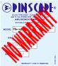

== Copyright and License

[.right]

Copyright ©2016-2023 Michael J. Roberts.

[.right]

This book is licensed under a link:https://creativecommons.org/licenses/by-sa/4.0/[Creative Commons Attribution-ShareAlike 4.0 International License] . In brief, this means that you're free to use, share, and adapt this work for any purpose, without seeking further permission from the author, as long as you give appropriate credit and pass along the same permissions in your adapted material.

The Pinscape Controller firmware and the Expansion Board hardware designs have similar Open Source license terms. See their respective license files for details.

== No Warranty

[.right]

Just to be sure there's no misunderstanding, I want to spell out that this documentation and the related mechanical and electronic designs and computer software have NO WARRANTY of any kind. This entire enterprise is a hobby project, and I don't have a Quality Assurance department to independently test any of it, so the material undoubtedly contains numerous errors. I'm making all of this available at no charge in the hope that it's useful, but I can't guarantee that it'll work or that you'll be successful building any of it. *Work involving electronic circuitry has the potential to damage other connected equipment, including expensive items such as computer motherboards. Proceed at your own risk.* 

*THIS WORK IS PROVIDED "AS IS", WITHOUT WARRANTY OF ANY KIND, EXPRESS OR IMPLIED, INCLUDING BUT NOT LIMITED TO THE WARRANTIES OF MERCHANTABILITY, FITNESS FOR A PARTICULAR PURPOSE AND NONINFRINGEMENT. IN NO EVENT SHALL THE AUTHOR BE LIABLE FOR ANY CLAIM, DAMAGES OR OTHER LIABILITY, WHETHER IN AN ACTION OF CONTRACT, TORT OR OTHERWISE, ARISING FROM, OUT OF OR IN CONNECTION WITH THE WORK OR THE USE OR OTHER DEALINGS IN THE WORK.*

WARNING: Building a virtual pinball machine involves some inherently dangerous equipment and activities, such as power tools and high voltages. Read the manufacturer's instruction manuals for your tools and follow their safety precautions. Wear safety glasses, hearing protection, and other appropriate safety gear for each task. Don't attempt anything that you don't understand or don't feel comfortable with.

CAUTION: Exercise extreme caution when working with electricity, especially with high voltages. Higher voltages can cause electrocution, and even low voltages can start fires and damage other equipment. Always disconnect the power at its source before doing work on anything electrical. Don't just switch it off - unplug it from the wall outlet.

