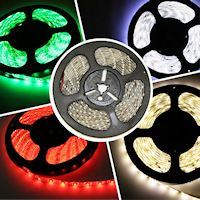
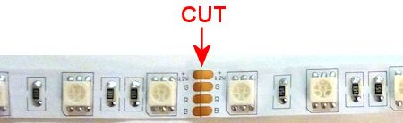

[#lightStrips]
= Undercab Lighting

Some pin cab builders put LED lighting on the underside of their cabinet, to create a pool of light around the machine. This can also be used on the back of the main cabinet and backbox, to create an aura effect on the wall behind the machine. Unlike most of the other feedback equipment, this isn't meant to replicate a feature of the real machines (not an original feature, anyway, although undercab lighting is a popular after-market mod). This is more of an extra feature to add to the arcade atmosphere.

Undercab or behind-the-cab lighting is usually implemented with LED light strips. These are narrow plastic strips with small LEDs mounted about every half inch. The strips can be cut to any length, so they can be adapted to cover whatever area you want to cover. The closely spaced LEDs provide a nice diffuse glow over the whole area.

LED strips are easy to find on eBay, Amazon, etc., because a lot of people use them for home lighting applications.

You can buy strips with single-color LEDs, but for our purposes, you'll want the full-color "RGB" type. These combine red, green, and blue lighting elements that can be controlled independently, allowing them to display any color by adjusting the mix of the three color components. That lets DOF show different color effects for each game, and optionally change the colors in sync with the game action during play.

There are two rather different kinds of the RGB strips that look very similar on the surface, but serve different functions: the standard "dumb" type, and the "addressable" type. The standard type lets you set all of the lights on the strip to the same color. You can set them to any color, but all of the LEDs will show that same color. The addressable kind lets you set each individual LED on the strip to its own separate color.

For undercab lighting, most people use the standard type, because the goal is simply to create a diffuse pool of light. The addressables are much more expensive and much more complex to set up, which makes them hard to justify for ambient lighting. That's not to say you shouldn't use addressables at all - they actually have other uses apart from undercab lighting where you'd want them; see xref:addressableLightStrips.adoc#addressableLightStrips[Addressable Light Strips] . But for undercab lighting, the simpler "dumb" type is more appropriate.

== Parts

*Light strips:* eBay usually has the best prices on these light strips. Search for *5050 RGB LED strip* . Matching listings typically use photos that look something like the one at right.

The strips on eBay are most commonly sold in 5-meter reels (labeled "5M" on eBay). 5 meters is about 16 feet; for a full perimeter around the underside of your cabinet, you'll need about 3.5 meters, so one 5-meter reel will do the job. Don't worry about finding the exact length you need, as the strips can be cut to any length.

Don't buy a "kit"; look for a bare reel only. Many eBay sellers offer kits that come with accessories such as remote controls or wall-wart power adapters. You won't need those in a pin cab installation.

The eBay seller pages for the reel strips often combine a bunch of different options. Here are the common choices and what you should select:

* 3528/5050/5630 type: choose 5050 (usually the only type available in RGB)
* Color: RGB, sometimes called multi-color or full-color
* Length: 5 meters (5M)
* Waterproof/non-waterproof: choose the non-waterproof
* Number of LEDs: 60 per meter (the seller might indicate this as "300 LEDs" if it's a 5-meter strip)

*Wire connectors:* You can find solderless wire connectors for the strips like the one pictured below. Search for "4-wire RGB light strip connector". Look for the type with the white plastic connector at one end. The white plastic bit is designed to clamp onto the end of a light strip to connect it without soldering.

These are optional. You can also just solder wires directly to the copper pads on the strip. That's a little tricky, though; the solderless connectors are easier.

Note that the black plastic plug on these connectors mates with the LED amplifiers below, so these are also helpful if you're going to be using any of the amplifiers.

*Corner connectors:* If you're going to set up a ring around your cab's floor, corner connectors can be very helpful. These look like the ones pictured at right.

image::images/LedStripAmp.png[""]
*Amplifiers:* If you're going to attach the strips to an LedWiz, PacLed, or standalone KL25Z, you *must* use an amplifier to power an undercab strip. These aren't necessary if you're using a Pinscape power board to control the strip, as long as your combined strips aren't more than about 4 meters long. (And if you do need more than 4 meters of strips, you could still avoid the amps by breaking the strips up into 4 meter sections, and attaching each section to its own separate set of power board output ports.)

You can find amplifiers built specifically to work with these strips on eBay, by searching for "LED amplifier". Look for the "mini" amplifier like those shown at right. Don't buy a "remote control" or color changer device - those can look quite similar, but they'll have buttons to change modes. You just want a plain amplifier, since DOF is going to do all of the color control.

To determine the amount of current the strip will draw, check the specs on the product you bought to determine the Amps per meter it uses, and multiply that by the combined length of your undercab strip(s). The typical power spec is 1.2A per meter per color channel (1.2A per meter for the Red channel, and the same for Green and Blue). A typical undercab lighting setup needs about 3 to 3.5 meters of the strips, which comes to about 4A per channel. That's way above the LedWiz's 500mA (0.5A) limit, so you'll need to use an amplifier with the LedWiz. 4A is fine for the Pinscape power boards, though.

== Positioning

The arrangement I recommend is to make a ring around the perimeter of the cabinet, close to each outside edge. I'd attach the LEDs to the flat bottom panel, not to the edges of the side walls, as the glue will adhere better to the flat plywood surface than to the more porous edges.

Another place that some people like to put the strips is on the back of the backbox. A couple of vertical strips, one at each edge, should work nicely there.

== Installation

The first step is to measure out the length you need for each run, and cut the strip into the required lengths.

You can cut the strip only at certain points, where the copper pads are exposed. On all of the strips I've seen, the cut points are spaced about 2 inches apart, every 3 LEDs. There should be a line marked on the strip down the middle of the copper pads. Use a pair of scissors to cut right down the center line.

When deciding where to cut, take into account the extra space you'll need for the wire connections to the end of the strip and any corner connectors you'll be using.

*Connecting wires to the strips:* The easiest way to wire the strips is to use the solderless connectors mentioned above.

To use these, pry open the white clamp cover (there's a little locking tab on one side), so that it looks like image (1) below. Position the end of the strip so that the copper pads on the strip fit over the metal prongs in the connector, as in (2) below. Note the labeling on the strip: the pad labeled "+12V" should line up with the black wire, "G" should line up with the green wire, "R" should line up with the red wire, and and "B" should line up with the blue wire. Once the strip is positioned, close the white plastic cover and make sure the lock tab engages. This should hold the strip in place mechanically and form a good electrical connection to the wires.

If you prefer, you can solder your own hookup wire directly to the copper pads on the strips. I've found it tricky to get the solder to stick, though, since the pads are so small. And even when you get a wire to stick, the solder joints will be fragile, due to the flexibility of the plastic strip. If you do decide to use solder, test your work by applying power to all channels and verifying that the strips light up white, then securely wrap the solder joint and the adjacent inch or so of wire with electrical tape. You want to make the area around the connection stiff enough that it won't bend much while you're working with the strip. The solder isn't nearly as flexible as the plastic strip, so the solder joints will break easily if you flex the plastic even slightly.

*Connecting corners:* If you're making a ring around the perimeter of your cab, use the corner connectors mentioned above to connect adjacent strips at the corners. The corner connectors work just like the solderless wire connectors: snap open the cover of the white plastic bit, fit the end of the strip into it so that the copper pads on the strip line up with the metal prongs in the connector, and snap the plastic cover shut to lock the strip in place.

Corner connectors, with the covers closed (left) and open (right). Fit the end of a strip into each connector so that the copper pads on the strip line up with the metal prongs in the connector.

*Attaching to the cabinet:* The strips come with a self-adhesive backing, so in principle you can just peel off the backing and stick the strips to the bottom of your cab.

In principle, anyway. In practice, the glue on the backing isn't all that strong, at least when used with bare plywood. On my own cab, the strips seemed to attach well initially, but they started peeling and drooping after a couple of months. I've heard the same story from several other people. So you might need to shore up the attachment with something stronger: staples, hot glue, epoxy, or a strong double-sided adhesive foam tape.

If you use staples, be really careful not to pound them in so hard that you break the delicate copper traces on the plastic strips. Also be careful that they don't come into contact with any of the exposed metal traces or pads on the strips, as that could cause a short circuit that could damage the power supply.

If you use hot glue or epoxy, put a tarp down while you're working so that you don't drip any glue on the floor.

If you're using the wiring connectors and/or corner connectors, it's worth gluing or otherwise fastening those to the cab as well, as they add some weight that would otherwise be borne by the adjacent strips.

== Wiring

*Direct connection:* If you're *not* using an LED amplifier (e.g., you're connecting the strip directly to a Pinscape power board), the wiring follows the standard plan for typical RGB devices, as illustrated below.

WARNING:  *Don't* use a direct connection like this with an LedWiz or standalone KL25Z. Doing so will damage or destroy the controller. The current (amperage) is too high for either one to control directly, and the voltage is too high for the KL25Z. You also can't use direct connections with a PacLed, since those are also limited to low current levels. Skip down to the part about using LED strip amplifiers below.

You *can* use a direct connection like this with the Pinscape expansion boards, using Power Board outputs.

* Attach a connector to the end of the LED strip as described above.
* Cut off the black plug from the connector.
* If necessary, solder an additional length of ordinary hookup wire (22 to 24 gauge should work) to each of the RED, GREEN, and BLUE wires coming out of the connector, to make the wires long enough to reach your output controller. Also solder an addition length of hookup wire to the black wire from the connector, but in this case you need it to reach the +12V terminal on your power supply.
* Connect the red, green, and blue wires to available ports on your output controller.
* You must follow the standard DOF rule about RGB devices: the red, green, and blue wires must be connected to consecutively numbered ports, in red-green-blue order. For example, if you plug the red wire into port 15, green has to go to port 16, and blue has to connect to port 17.
* Connect the black wire from the LED strip connector to the +12V terminal on your power supply. You can use the secondary ATX power supply for this; see xref:powerSupplies.adoc#powerSupplies[Power Supplies for Feedback] .

*Connecting through LED strip amplifiers:* The wiring with an amplifier involved looks like this:

* Attach a connector to the end of the LED strip as described above.
* Plug the black end of the connector into the "Output" side of the LED amplifier. The four-pin black plug on the solderless connector mates with the LED amplifier's Output socket. To orient the plug properly, match the *black wire* on the connector to the arrow or "+12V" printed on the LED amplifier body. This should match up with the "+12V" marking on the LED strip itself.
* Plug another connector of the same into the "Input" side of the LED amplifier. Again, the black 4-pin plug on the connector should mate with the Input socket on the amp. Match the black wire on the connector to the arrow or "+12V" marking on the amp body.
* Cut off the white plug at the other end of the connector you just plugged into the Input side of the amp.
* The black wire from this bundle can be left unconnected.
* If necessary, solder an additional length of ordinary hookup wire (22 to 24 gauge should work) to each of the RED, GREEN, and BLUE wires coming out of the connector, to make the wires long enough to reach your output controller.
* Connect the red, green, and blue wires to available ports on your output controller.
* You must follow the standard DOF rule about RGB devices: the red, green, and blue wires must be connected to consecutively numbered ports, in red-green-blue order. For example, if you plug the red wire into port 15, green has to go to port 16, and blue has to connect to port 17.
* The LED amplifier has two loose wires hanging out of the back, one red and one black. These are the power connections for the amplifier. They simply connect directly to your 12V power supply. Connect red to +12V and black to ground. You can use the secondary ATX power supply for this; see xref:powerSupplies.adoc#powerSupplies[Power Supplies for Feedback] .

== DOF setup

In the link:https://configtool.vpuniverse.com/[DOF Config Tool] , go to your Port Assignments page. Find the numbered port that you wired to the RED channel of the light strip. Set this to either "RGB Undercab Smart" or "RGB Undercab Complex". In standard DOF fashion for RGB devices, this will set the next two ports in numerical order to the Green and Blue color channels for the same device. (This is why you have to wire the red, green, and blue wires to consecutively numbered ports in red-green-blue order. It's just the way the Config Tool works with RGB outputs.)

"Smart" and "Complex" are both for undercab lighting, so you can choose either one. They have slightly different behavior to accommodate different taste:

* RGB Undercab Smart shows a fixed color that's customized for each game. The color generally reflects the predominant color of the cabinet artwork for the original arcade version of each game.
* RGB Undercab Complex uses the same color as RGB Undercab Smart as the base color, but also animates the color in response to game action. For example, it might flash white when the strobes fire, or show the same color as the flasher lights in response to some events.

The choice is just a matter of taste. Some people like the added lighting effects of the "Complex" option, and others find it too distracting. If you're not sure which one you'd prefer, I'd recommend giving the Complex option a try first; you can always switch to the more subdued Smart option later if the Complex effects are too much.

