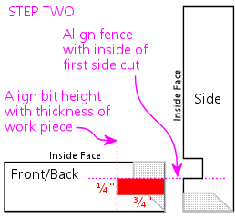
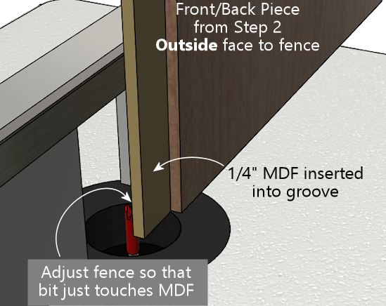
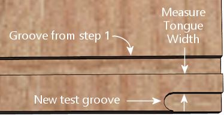
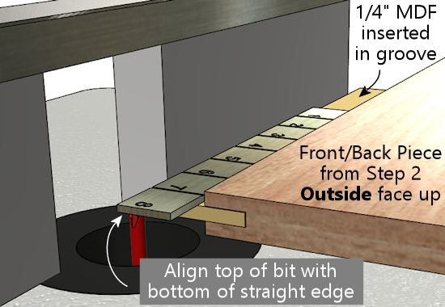
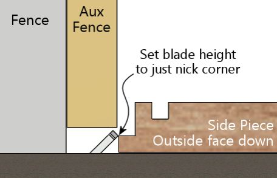

= Lock Miter I: The Plywood-Friendly Way

The original Williams pinball cabinets of the 1990s used a type of corner join known as a lock miter. This join has mitered corners (meaning the ends of the pieces that come together at a corner are cut at 45°, so that the seam is exactly the corner, making it practically invisible), plus an interlocking tongue-and-groove pattern on the inside (that's the "lock" part). There are other good ways to make the corner joins, but the lock miter is one of the best. The corners are seamless, the joints are self-aligning and self-squaring, and they have a lot of internal surface area for strong glue adhesion. Lock miter corners are also make assembly really easy, since the corners snap together like jigsaw puzzle pieces.

There are (at least) two ways to make a lock miter join. The first method, which we'll cover in this chapter, involves making a sequence of cuts (six steps in all) with a 1/4" straight router bit and a table saw. I'm covering this method first because it works very well with plywood, which is what most pin cabs are made of. This method might look a little intimidating at first, because of the number of steps involved, but it's actually not that bad. Most of the steps are pretty simple, and they mostly use natural alignment points that don't require any arithmetic or ruler measurements.

The second method involves a special router bit that cuts the entire tongue-and-groove pattern all at once. That's covered in the next chapter, xref:lockMiterII.adoc[Lock Miter II: The Special Router Bit Way] . That method probably looks easier at first glance, since the bit does all of the work for you. But these bits are notoriously difficult to set up properly. There is a reliable setup procedure, but the time and effort involved in that ends up making the overall degree of difficulty similar to the more manual "plywood friendly" method. The real drawback of the special-router-bit approach is that the tongue-and-groove structures that the router bits cut are too fine for most plywood, so you lose a lot of the strength that the join is supposed to provide.

If you're new to woodworking, both methods are probably going to look like "advanced" procedures that should only be tackled by grizzled veterans with lavishly equipped wood shops. But don't give up yet! I'm a woodworking newbie myself, and I've found that both techniques are doable and can yield great results, even if you're new to this. I've tried to reduce both methods to straightforward recipes that you can follow without any special woodworking expertise and with a modest set of tools.

== Example of the manual method

Here are some photos of a sample corner built with the manual method, to give you a better idea of what it looks like.

Dry fit of a test corner built using the manual lock miter method. This is just a couple of scrap pieces that I ran through the process in this chapter as a beta test. It took about an hour of work; most of that was spent on the "sneaking up" phase for the 45° angled cuts. It came out just about perfect - the two pieces fit together nicely, and the corner is razor-sharp.

A closeup of the grooves, with the front/back piece on the left and the side piece on the right.

Another view of the grooves. The thing I like about this version of the lock miter (the "manual" approach) is that the tongue-and-groove structure comes out so clean and sturdy when rendered in plywood, thanks to the relatively large features. Compare this to the similar pictures of the special router bit results in xref:lockMiterII.adoc[Lock Miter II: The Special Router Bit Way] ).

== Pros and cons of the two methods

If you're considering using lock miter corners for your pin cab project, I'd suggest reading through both methods, so that you can judge for yourself which one you feel more comfortable with. Here's a quick summary of what I think are the high and low points of each approach.

[cols="1,1"]
|===
|Router Bit Method|Manual Method

|Special router bit required ($25-$100+)
|Needs only a 1/4" straight router bit (and can be done with just a table saw, no router needed)

|No table saw required
|Requires a table saw

|Not great for plywood; tongue-and-groove features have poor structural integrity due to small size
|Excellent results with plywood, makes a super strong joint

|Only needs one routing pass over each edge
|Six cutting steps required

|Bit setup is notoriously difficult (but doable if you follow the right procedure)
|Fairly straightforward setup for each cut (but there are still six of them)

|===

I've tried both approaches, and I've found that - surprisingly - the manual method isn't really any harder or more time consuming than the router bit method. It might even be a little easier. You'd think that the special router bits would make things a whole lot easier, given that they cut the entire pattern in one pass over each edge, but the complex setup procedure makes up for it. The manual method involves multiple cuts for each corner, but each one is fairly quick and easy to set up, and the recipe is pretty reliable at getting all of the cuts to line up accurately with one another.

Given that neither method has a clear advantage in terms of difficulty level, my feeling is that the manual method has an edge for a pin cab project, simply because of its better performance with plywood. The main obstacle with the manual method for many people will probably be that it requires a table saw. If you don't have a table saw and you don't want to buy or rent one, the special-router-bit method is a good fallback; even though it's not ideal for plywood, it is workable with at least some plywood.

== How the lock miter works

The lock miter is an elaboration of the plain miter join, which is a simple join where you cut the ends of the two pieces meeting at a corner at a 45° angle:

image::images/plain-miter-join-schematic.png[""]

The plain miter gives you a nice clean corner without a visible seam, but it doesn't make a very strong glue joint, and it takes some skill to execute it well. For one thing, you have to get the two cuts _exactly_ at 45°, or the corner won't be square. The way the two pieces meet means that any error in the cut angle of each piece is doubled in the assembled corner. If you're off by 1° on the cut angle, the corner will be out of square by 2°. The other thing that's difficult with a plain miter cut is getting the two pieces to align correctly during assembly. You have to get the corner aligned across its whole length, and then keep it there while the glue dries. There are corner clamp systems that help with this, but it still takes some skill.

The lock miter improves on this by keeping the 45° angle at the outside corner and adding an interlocking tongue and groove. There are different ways to make the interlocking tabs. The special lock miter router bits produce a pattern that looks roughly like this:

image::images/lock-miter-join-schematic.png[""]

The manual method presented in this section produces this pattern:

The common features are the 45° angled cut at the outside corner, and the interlocking tongue and groove. Like the plain miter, the 45° angle at the outside makes the corner seamless. The addition of the locking tabs makes the assembly step almost effortless, since the pieces can only fit together at exactly the right alignment. And the extra surface area of the tabs forms a strong glue joint. This join is also a little more forgiving of imperfect 45° angles at the corner, since the locking tabs will still keep the corner aligned and square.

You probably noticed that the router bit method and the manual method have slightly different shapes for the interlocking tabs. The differences aren't completely arbitrary. The key difference is that the tongue-and-groove structures in the manual method are coarser. That's what makes the manual method perform better with plywood. The lock miter router bits are forced to use smaller features because their cutting pattern has to form a mirror image. That's how they work their magic trick of cutting both sides of a corner join with the same bit. Every feature has to appear twice, once on each side of the "mirror", so every feature has to be half-sized. The small projections are problematic with plywood, in that the glued plies tend to fall apart when cut so finely. The manual method doesn't have to be symmetrical, since we make each cut individually. That allows for larger features, which hold up better with plywood.

== Equipment needed for the manual method

*1/4" straight router bit:* Just to be clear, we're talking about a bit with a 1/4" cutting diameter (as opposed the shank size - for that, simply match the shank size your router uses).

*Router and router table:* If you already have a hand router, you can buy an inexpensive bench-top router table and use it with your hand router. Most of the the bench-top tables are compatible with many brands of routers, so you can generally mix and match tables and routers. I use a bench-top table from Skil with a Ryobi fixed-base hand router. The table isn't a high-end piece of precision equipment, but it works for the pin cab joinery I've attempted.

* xref:html#routerFenceMicroAdjuster[Router table fence micro-adjuster] :* Optional but really helpful. Provides a way to adjust the fence position in tiny fractions of an inch, to help get the alignment perfect. This is something you can make yourself as a simple DIY project described later in this chapter.

*Table saw:* For the 45° angled miter cuts.

*1/4" MDF scraps:* For use as alignment aids. You just need a couple of scrap pieces, roughly 6"x6" and 2"x6". 1/4" plywood or hard-board will also work.

*Auxiliary fence for your table saw:* A piece of 3/4" MDF or plywood, cut to about the same size as your table saw's fence.

== Doing it all with a table saw

You can create a lock miter using just a table saw, no router required. You need a 1/4" dado stack in place of the 1/4" router bit used in my procedure.

The steps in my procedure are tailored to the router table, so you might want to look for a recipe that's specific to the table saw - there are some equally complete table-saw versions out there. Search the Web and/or Youtube for *lock miter with table saw* . Or you could just adapt my recipe, if you don't mind puzzling out how to translate the router fence alignment steps to the table saw. The alignment points for the cuts are all the same relative to the boards, so it doesn't take much translation. The main thing to watch out for is that you'll need an auxiliary fence for a couple of steps, since the saw blade will otherwise be too close to the main fence.

== Do a practice run

This is a complex enough procedure that I felt the need to do a couple of practice runs on scrap material before I tried it for a real project. You might not need to, but I found it helpful as a confidence booster, to make sure I understood all of the steps.

The other nice thing about a practice run is that it helped me fine-tune my sense of the various alignment points. The procedure is designed to make the alignment points easy to judge, but even so, there's always a little wiggle room when trying to get two things to line up. If anything comes out a little off in the test run, you can use that as a guide to compensate the next time through.

== Preparation

*Get all of the panels ready:* Wait until all of your panels are cut to final sizes before starting the lock miter procedure. You should do all of the lock miter routing across all panels at the same time, so that you only have to do the setup part of each step once.

I'd do the lock miter cutting on all panels *before* routing other features (e.g., floor dados), drilling holes (flipper buttons, say), and cutting openings (like the coin door cutout). The panels are easier to handle whole.

*Include a scrap "side" and "front" piece for testing every cut.* Reserve a small scrap piece of plywood for each, designating one as "side" and one as "front". Make each cut on the corresponding scrap piece first as a sanity check that you're set up correctly. This is especially helpful in the steps where you have to "sneak up" on the final alignments with a series of test cuts. The idea with "sneaking up" is that you start with a cut that's intentionally shy of the real cut line, then you check how close you got, and then gradually re-cut closer and closer until you get exactly to the right spot. I sometimes make the mistake of overshooting the final cut line because I wasn't gradual enough in the re-do cuts. It's nice to know that you're only ruining a piece of scrap if that happens.

*Pre-mark all panels.* The lock miter we're doing involves _two different cutting patterns_ , one for the side panels, and a different one for the front/back panels. It's crucially important that you cut the right pattern in each panel. To avoid switching things around in the heat of battle, mark each piece conspicuously before you start, to indicate whether it's a *SIDE* or *FRONT/BACK* piece. I also like to mark the *INSIDE* and *OUTSIDE* face of each piece so that I don't have to think about that later. The inside/outside orientation matters for every cut. I make all of these markings right along each edge where the lock miter pattern goes, just beyond the cutting area (about 3/4" from the edge), to help make sure I'm cutting the correct edge. I don't want to have to think too much while the router is running - less chance of screwing something up.

*Install a 1/4" straight bit in your router.* This bit will be used for all routing throughout the procedure.

*Set up an auxiliary fence for your table saw.* Simply cut a piece of 3/4" MDF or plywood to roughly the same size as your saw's fence, and attach it to the blade side of the fence with clamps, with the bottom of the aux fence about 3/8" above the table top.

== A few tips, tricks, and precautions

*Always unplug the router* before adjusting the bit height or fence position.

*Make multiple router passes for grooves deeper than 1/4".* Router bits work best doing a little at a time. For deep grooves, start with a first pass at 1/4" deep, then repeat at 1/2" deep, and so on until reaching the target depth. Don't move the fence between passes - only change the bit height.

*Take a close look at your router bit* and notice how it's not perfectly round - it probably has a slightly oval shape, with cutting edges that stick out slightly. When you're aligning something with the outside of the bit, you want to make sure you're using the widest part of the cutting edge as the reference point, since the bit will remove material out to the widest point.

*Table a close look at your table saw blade* and notice how the teeth are a bit wider than the main disk. When aligning an edge with the saw blade, you always want to align with the widest point of the teeth, since the cut line will go out that far.

*To avoid tear-out* at the end of each cut where the router bit exits the board, try putting some masking tape along the trailing edge. If that doesn't work, use a scrap piece of the same 3/4" material, and keep it pressed up against the trailing edge as you push the end of the real work piece past the bit.

== Cutting steps

The cutting procedure works by aligning each cut with a previous cut. I've tried to provide an easy method to hit each reference point without any guesswork. At each step, I'll explain the goal we're trying to accomplish, and then give you the method I use to accomplish it. Each step also starts with a schematic diagram showing the goal, but don't worry about trying to puzzle out the setup from the schematic - it's just there so you can see what the step's cut will look like and how it fits into the overall pattern.

Several of the steps have a setup procedure _and_ a test procedure. The test procedure in each step is optional, so feel free to skip that part if it feels too tedious. The setup steps alone are pretty reliable. But I find that the extra test-and-adjust steps help me get the alignments closer to perfect.

*Step 1:* Inner groove on the side pieces. This groove has to align with the inside face of the front/back piece, so we'll use the thickness of a sample work piece as our alignment guide for the fence. The bit height is simply 1/4".

image::images/lock-miter-join-manual-step-1.png[""]

Set the bit height to 1/4" above the table, using a ruler or other measuring tool of your choice. (For better precision, use good set of calibrated setup bars - search for *router setup bars* on Amazon.)

To position the fence, place one of the work pieces against the fence *vertically* . (It doesn't matter which piece - all we care about here is the thickness, which is the same for all work pieces.) Make sure to keep it tight against the fence. Place a straight edge flat on the table along the edge of the work piece, with one end extending out so that it's alongside the bit. Adjust the fence so that the bit just barely touches the straight edge. Rotate the bit back and forth to make sure that you're testing it at the widest point.

This is a good time to deploy the xref:html#routerFenceMicroAdjuster[fence micro-adjuster] , to help get the alignment perfect.

The alignment on this step is pretty important, so if you want to be extra-careful, you can run a quick test. Take two scrap pieces (from the same plywood as the real pieces, of course), lay one flat, and stand the other one up alongside it as shown below. Mark a line on the vertical piece using the horizontal piece as a straight edge. Route just an inch or so of the marked piece (line facing down and towards the fence), and check that the groove is exactly up against the line. It shouldn't cross the line or cut into the line - it should leave the line intact and just touch it with exactly zero clearance. If it's a little off one way or the other, use the micro-adjuster to compensate, and test it again.

Once you're set up, it's time to the do the actual routing for this step. Route each *SIDE* piece, with the *INSIDE FACE* down.

Remember to route *both ends* of each side piece, for the joins at the front *and* back.

*Step 2:* Cut the center groove in the front/back pieces. The groove's depth has to equal the thickness of the work piece, so we'll set the bit height based on a sample work piece's thickness. The inside of the groove has to align with the outside of the side groove from step 1, so we'll set the fence position using the actual groove in one of the side pieces as a reference point.

Grab one of the side pieces you just cut and fit a piece of 1/4" MDF scrap into the groove as shown below. Place it on the router table with the edge against the fence. Set the fence so that the bit just touches the MDF.

Here's how we're going to do the routing for this step. Route the *FRONT* and *BACK* pieces *vertically against the router fence* , with the *OUTSIDE FACE* to the fence. But we're not quite ready yet - we might want to check the alignment first, and we still need to set the bit height.

If you want to check the alignment to make sure it's right, there's a quick test that you can do before proceeding. Set the bit height to about 1/4" above the table, grab a scrap testing piece, and route it as shown above. This is just a test cut, so you only need to go an inch or two. Now measure the width of the "tongue" on the *inside* face, as illustrated below. I find digital calipers are the easiest way to get a precise reading here. The thickness should be just a hair under 1/4" (6.35mm) thick. Something like 6.2mm to 6.3mm is perfect. This tongue slots into the 1/4" groove from step 1 when you assemble the corner, so it can't be any thicker than 1/4", or it won't fit the groove. It's best if it's just the slightest bit thinner than 1/4", so that it fits easily but snugly. A looser fit isn't a disaster, but it won't be as strong when assembled, and it might not self-align as perfectly. If you're using the fence micro-adjustor, you can use the measurement to figure out how many turns of the screw are needed to get it exactly to a target of, say, 6.2mm. In any case, if you make an adjustment, I'd repeat the test (in my case, because I'm 50% likely to go the wrong direction, even if I'm looking straight at these instructions).

[cols="1,1"]
|===
|Measured Width|Make This Adjustment

|Over 1/4"
|Move fence *back* (away from bit)

|Under 1/4"
|Move fence *forward* (towards bit)

|===

Now we're ready to set the bit height. This is a deep enough groove that it's best to route it in multiple passes, so that we don't try to force the router bit through too much wood at one time.

* First pass: bit height set to roughly 1/4" above the table
* Second pass: bit height set to roughly 1/2" above the table
* Final pass: calibrate to the work piece thickness

For the final pass, calibrate the bit height to match the thickness of the work pieces by placing a work piece flat on the table alongside the router bit. Adjust the bit height so that it matches the plywood thickness (or just a hair beyond). A straight edge on top of the work piece can help get it perfectly aligned.

For each pass, route as shown in the illustration we saw earlier: route the *FRONT* and *BACK* pieces *vertically against the router fence* , with the *OUTSIDE FACE* to the fence. Here's the illustration again:

*Step 3:* Outer groove on the side pieces. This step finishes the "tongue" on the side pieces. The fence position for this cut has to align with the outer side of the front/back groove from step 2, so we'll use a front/back piece from the previous step as a reference point. The bit height has to align to the leftover portion outside the groove from step 2, so we'll also use a front/back piece as a reference for that.

Take a front/back piece from step 2, and insert a scrap piece of 1/4" MDF into the groove. Stand this vertically against the router fence with the *OUTSIDE* face of the front/back piece against the fence. Place it so that the MDF extends just past the bit. Adjust the fence so that the router bit just touches the back of the MDF.

This is another deep cut that's best done in two passes - first at 1/4" deep, then at full depth. So set the bit height to 1/4" above the table for the first pass, route all of your side pieces, and then set the final bit height as described below.

Here's how we're going to do the routing: *SIDE* pieces, flat against the router table, *INSIDE* face down.

Before routing your actual side pieces, though, you can do a quick test to check the fence alignment. You'll need the scrap "side" piece from step 1, that already has the 1/4" wide by 1/4" deep groove set in 1/2" from the edge. Do the test on that piece. Route it as shown above, but you only need to go for an inch or two for this test. Now measure the width of the "tongue" between the two grooves:

It should measure just under 1/4" (6.35mm). This part has to fit into a 1/4" groove, so if it's more than 1/4" wide, it won't fit. You don't it to be too loose, either, so the ideal is something just under 1/4", perhaps 6.2mm to 6.3mm. If it's too wide, move the fence back (away from the bit); if it's too narrow, move the fence forward (towards the bit).

[cols="1,1"]
|===
|Measured Width|Make This Adjustment

|Over 1/4"
|Move fence *back* (away from bit)

|Under 1/4"
|Move fence *forward* (towards bit)

|===

Once you're satisfied with the fence alignment, route all of the side pieces as shown above, keeping the bit height set at 1/4" above the table. Once done, you'll need to make one more pass over all of the pieces at the final bit height.

To set the final bit height, use a front/back piece with a piece of 1/4" MDF inserted into the groove. Put the whole thing flat onto the router table as shown below, with the *OUTSIDE FACE* facing up. Put a straight edge on top of the MDF so that it extends out over the bit. Adjust the bit height so that the top of the bit just touches the bottom of the straight edge.

*Step 4:* Cut the 45° miter on the front pieces.

This step (and the rest of the steps) are on the table saw.

First, set up an auxiliary fence on your table saw. This is just a piece of 3/4" MDF or plywood, cut to about the size of the fence, and clamped to the front of the fence. Leave a gap of about 3/8" between the bottom of the auxiliary fence and the table top, to make room for the blade to extend 1/4" above the table.

Set the saw blade to 45°. Adjust the height so that the blade just nicks the corner of the tongue in a front/back piece, as illustrated below.

This cut needs to be precise, and I haven't found an easy trick like in previous steps to align it with another cut. The best approach I can come up with is to "sneak up" on the final cutting position with a series of test cuts. The good news is that you only have to do a series of test cuts for one piece. Once that one piece looks perfect, just run the rest of the front/back pieces through the saw with the identical fence position, and they should all come out equally perfect.

Start by positioning the fence to remove no material at all, by pushing the work piece right up against the blade, and making the aux fence flush with the work piece:

Now move fence back (away from the blade) by about 1/8".

When you move the work piece back behind the blade and push it up against the fence, the bottom corner of the work piece should now just about line up with the saw blade:

Double-check by eye that the blade is aligned as shown. Remember, it's best to remove *too little* material at this point than too much, since we can adjust things and take off a little more if we have to. That's why we only moved the fence 1/8", even though the ultimate target is closer to 1/4". If it looks like the blade is already going to hit the bottom corner, move the fence a little further towards the blade to open up a small gap.

Do a test cut, with the *front/back* piece *OUTSIDE FACE down* .

Tip: after each fence adjustment (including the first one), initially only run the first few inches of the board through the saw, and inspect the result to make sure the fence isn't already too back. If the fence is too far back, you'll be cutting material off the outside face of the outside edge, which you don't want to do. When this happens, you'll see a little indent along the outside edge where material was cut off. The goal is to get the 45° cut _exactly up to the outside edge of the outer face_ without actually cutting any material off the outer face. Making a partial cut lets you see immediately if you've gone too far, since the outside edge will no longer be a straight line. You can't undo this, which is why I like to include a scrap piece in every batch for these first cuts while adjusting the fence.

When it's exactly right, you should have a sharp outside corner.

If the corner is still a little squared, you just need to adjust the fence back slightly (away from the blade) and try again. *Make small changes* to ensure you don't overshoot. Repeat until the corner is sharp.

You can now run all of the remaining front/back pieces through.

*Step 5:* Cut the 45° miter on the side pieces. This is essentially the same as step 5, just with a different blade position to match the side pieces this time.

You should be able to keep the same blade height from the previous step, but check it with a side piece to confirm.

Adjust the fence position using the same drill as last time. Start by pushing the work piece up against the blade, and making the fence flush with the work piece:

Now back the fence away from the blade by about 1/8".

Move the work piece behind the blade and flush with the fence, and verify that the blade isn't quite going to cut hit the bottom corner. As before, it's better to cut too little at this point, since we can re-cut a little more if necessary.

Do a test cut, with the *side* piece *OUTSIDE FACE down* .

As before, we're looking for a nice sharp corner.

If the corner is still a little squared, adjust the fence back slightly (away from the blade) and try again. *Make small changes* to avoid overshooting. Repeat until the corner is sharp.

You can now run all of the remaining side pieces through.

*Step 6:* Trim the tongue on the inside of the front/back pieces so that it fits into the side slot from step 1.

I do this step last because it's another "sneak up" cut, and doing it last lets us test to see if we trimmed enough off by doing an actual test fit. That's the best test for exact alignment.

We'll use the table saw for this cut. Set the blade so that it's straight up. Position a front/back piece on the table next to the blade, inside face down. Adjust the blade height so that it's just above the top of the tongue - about 1/4".

Put the work piece flush against the saw blade, and move the fence so that it's flush with the work piece.

Now back off the fence, away from the blade, by about 3/8".

Since we have to "sneak up" on the final fence position with test cuts, just do one edge of one front/back piece at first. We'll test the fit and adjust as needed before running the other pieces.

Run a *FRONT/BACK* piece through the saw, *INSIDE FACE down* .

Test the fit against a side piece. The two pieces should fit together at the outside corner without any gaps. If the tongue in the front/back piece is jutting out and preventing the pieces from fitting together, we need to trim it back a little more. Back the fence away from the blade - just slightly - and do another test cut. Repeat until it's a good fit.

Once you have a good fit with one piece, finish the remaining FRONT/BACK pieces.

That's it - you're done! The corners should all fit together tightly. If any of them are so tight that you have to force them together, try manually sanding the sticking points.

[#routerFenceMicroAdjuster]
== Router fence micro-adjuster

Table saws usually come with rack-and-pinion fences that you can adjust fairly precisely by turning a knob. Router tables, in contrast, usually have much simpler fences, without any adjustment mechanism at all. The fence usually just slides freely on a couple of parallel tracks. You move it by hand to where you want it, then tighten some knobs that hold it in place.

That's not a very precise way of positioning the fence, but it's good enough for most applications. There are tasks where you can really benefit from more precise positioning, though. Lock mitering is one of them.

There's a solution, and it doesn't even require spending a fortune on a super-deluxe router table. You can make a really simple micro-adjuster for your existing router table fence. You don't have to make any permanent modifications to the router table, and you can build the micro-adjuster out of scrap wood and hardware you probably have lying around. Here's the one I built:

image::images/router-micro-adjuster.jpg[""]

The wood is all 3/4" plywood, and the two pieces are simply glued together at a 90° angle. (I routed a shallow 3/4"-wide dado that the vertical piece slots into, which makes the glue joint nearly unbreakable.) The screw is a 3" long, 1/4"-20 machine screw. In the vertical plywood piece, I drilled a hole slightly smaller than 1/4", and then worked the screw in so that it cut its own threads into the wood.

I added a DIY knob, in the form of a "donut hole" cut out of 3/4" plywood using a 1" hole saw. (There's a KEPS lock nut on the inside to keep it in place.) I drew a big red mark so that I could easily gauge full turns, half turns, quarter turns, etc. Alternatively, you can buy a plastic knob at Home Depot or Amazon, or skip the knob entirely and make adjustments with a screwdriver.

The micro-adjuster is simple to use. First, set up your fence as close as you can get "by hand" to where you want it. Second, tighten the knob-screw on one side to pin the fence down on that end. Third, position the micro-adjuster behind the fence on the _other_ side (the un-pinned side), with the screw just touching the back of the fence. Clamp the adjuster to the router table so that it stays put at this position. You can now tighten the fence knob on this side to fix the fence position here.

The micro-adjuster as deployed, sitting behind the fence on my router table. It's simply clamped onto the table with an F-clamp. My fence is MDF, so I masking-taped a penny to the back where the screw contacts the fence, to make a harder contact point and prevent the screw from making a divot in the MDF. Note that I also clamped a small wood block behind the fence on the opposite side to set a hard stop, to ensure that the fence can't slip back even slightly on that side. The fence already has a knob that locks it down on each side, but I wanted to ensure that there's absolutely no slippage when we micro-adjust the micro-adjuster side.

Now you can make tiny, precise adjustments to the fence position. When you need to move the fence by a tiny amount, loosen the fence knob on the micro-adjuster side only, and turn the screw in the appropriate direction to move the fence forward or back. When moving it back, you'll have to push the fence against the screw, since the screw won't pull it back on its own, but the adjustment should nonetheless stay very precise as long as you keep the fence pressed against the screw.

If you're using a 1/4"-20 screw like I am, each full 360° turn of the screw corresponds to 1/20 of an inch change in the fence position. (That's the "-20" in 1/4"-20 - it means that the screw has 20 threads per inch.) With a knob, it's easy to gauge a quarter turn, which corresponds to 1/80 of an inch, or even an eighth turn for 1/160". What's more, that's the distance the _screw_ moves. The thing that matters is how far the center of the fence moves, since that's where the bit is. The center of the fence only moves half as far as the screw, since the screw is at one end and the other end is kept fixed in place. So an eighth turn on the knob equals 1/320" of travel at the center of the fence. That's plenty of precision for anything I've ever attempted.

You might wonder how we keep the fence "square" if we're only moving it at one end. Moving just one end obviously will cause the fence to angle slightly on each adjustment. If this were a table saw, that would be a huge problem. But it's okay with a router table! The difference is that router bits are round, so there's really nothing to be "square" to. (Okay, technically, table saw blades are also round, but a saw blade defines a plane that the fence must be parallel to. There's no equivalent parallel plane for a router bit, so it doesn't matter how the fence is angled.)

