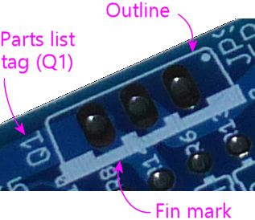
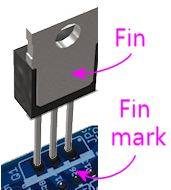

= MOSFETs

A MOSFET is a type of transistor (that's what the "T" in MOSFET is for). MOSFETs are very different from the older kind of transistor we saw in the last chapter (the bipolar junction transistor or BJT), but they're still called "transistors" because they have the same abilities to amplify and switch signals that all transistors have.

Up until around the 1980s, nearly all transistors used in practical applications were BJTs. That completely changed in the 80s, because the manufacturing processes used to create integrated circuit chips favored MOSFETs. MOSFETs are much more prevalent today as a result. They're also widely used as discrete transistors because of their excellent power efficiency. The Pinscape boards use MOSFETs for the high-power switching needed to control feedback devices, which is an application that MOSFETs are particularly good at.

For more on BJTs and transistors in general, see xref:transistors.adoc[Transistors] .

== Static electricity warning

MOSFETs are sensitive to static electricity. Refer to xref:staticSafety.adoc[Static Electricity Precautions] for tips on handling static-sensitive parts.

== Types of MOSFETs

MOSFETs come in four varieties, combinations of two "modes" and two "channel" types:

* Depletion Mode or Enhancement Mode
* N-channel or P-channel

The mode refers to how the switching function works in the device; depletion mode means that the device conducts when _no_ control voltage is applied, and enhancement mode means that it conducts when a control voltage is applied. The difference between N-channel and P-channel MOSFETs is similar to the distinction between NPN and PNP bipolar junction transistors; it refers to the charge polarity of the material used in the semiconducting region.

As with NPN-vs-PNP for BJTs, you don't need to know anything about how these variations work to build a circuit that uses MOSFETs. What's important is simply to know that you always have to use the exact mode and channel type called for in the circuit plan. If the plan calls for an "N-channel enhancement mode" MOSFET, you have to use exactly that type.

All of the MOSFETs used in the Pinscape boards are N-channel enhancement mode devices.

== On schematics

The schematic symbol for a MOSFET is vaguely similar to the symbol for a bipolar junction transistor, but different enough that you wouldn't confuse them with each other:

The direction of the little arrow in the symbol indicates whether it's a P-channel or N-channel device. An N-channel device has the arrow pointing inwards, towards the middle bars; a P-channel device shows the arrow pointing outwards.

The mode (enhancement or depletion) is depicted by the main bar: a broken bar indicates enhancement mode, and a solid bar indicates depletion mode.

The N-Channel Enhancement Mode version is the only one you'll see in current Pinscape schematics, but you might see any of the other types in other schematics.

A MOSFET has three connections to the outside world, called the gate, source, and drain.

image::images/schematic-mosfet-2.png[""]

* The line off by itself on one side is always the Gate
* The line that connects to the little arrow is always the Source
* The remaining line is always the Drain

Note that the gate, source, and drain are often designated G, S, and D on diagrams. If you look at a MOSFET's data sheet to find the order of the case leads, they'll probably label them G, S, D in the diagram.

You might sometimes see the MOSFET symbol enclosed in a circle. That's just a visual affectation; it doesn't change the meaning at all.

== Physical packaging

Like any transistor, MOSFETs come in numerous package types. The Pinscape boards only use one package type, though, known as TO-220, which looks like a little black plastic brick with three legs coming out the bottom, and a big metal heat sink fin on the back.

Front view:

image::images/to-220.png[""]

Back view:

Most devices in this type of case will be printed with text across the front indicating the part number.

== Orientation

The order of the leads isn't standardized for the TO-220 case, so the only way to tell the order for a particular part is to look it up in the part's data sheet. The data sheet will usually include a diagram like this:

G, D, S stand for Gate, Drain, and Source.

The arrangement of TO-220 leads will always be the same for any given MOSFET, so the Pinscape boards can take advantage of this to show you the correct orientation without forcing you to track down a data sheet. This means you can figure out the correct orientation for a MOSFET just by looking at the circuit board markings

As usual, the Pinscape boards show a little outline of each MOSFET, as viewed from above, where it's meant to be installed. For a TO-220 package, the outline shows a rectangle the size of the plastic brick part, with a heavy line on one side. The heavy line represents the metal heat sink fin. So to orient the MOSFET properly, you just have to line up the fin with the heavy line printed on the board.

== Installing in a circuit board

Orient the MOSFET to match the outline printed on the board as shown above. Fit the three leads through the corresponding three holes in the circuit board. Feed the leads through the board as far as you comfortably can.

TO-220 packages usually have little barbs on the leads near the plastic case. This is intentional, to force a little distance between the case and the board to allow air flow for cooling. Just feed the leads through until you reach the barbs, then stop.

Hold the part in place and flip the board over to solder it. Try to keep it at right angles to the board. With the barbs in the leads, it's easy for the part to want to tilt a bit in one direction or the other, so try to keep it straight up and down while soldering.

Solder the three leads to the solder pads. When the solder cools, snip the excess length from the leads.

== Selection

Schematics and parts lists will always specify which MOSFET to use by manufacturer part number. There aren't any generic "units" to describe a MOSFET like there are with resistors and capacitors. Use the manufacturer part number to search for a matching part at Mouser or another electronics vendor.

It's easiest to use the exact part specified in the parts list, but as with BJTs, many MOSFETs have compatible replacement parts that can be safely substituted. Try a Google search term like "IPP121 replacement".

The large MOSFETs in the Pinscape boards are used as on/off switches, which makes it fairly easy to find compatible replacements. The parts list, in fact, lists several options for each one. If you can't find any of those and need to look for other alternatives, here are some tips on what to look for:

* The same type (N-channel enhancement mode)
* The same case type (TO-220)
* The same lead order (G-D-S when viewed from the front), so that the part can be plugged into the circuit board slot in the same orientation marked on the board, _or_ the reverse lead order, so that you can plug it in rotated 180° from the marked orientation
* Maximum drain current (I~D~ , normally listed under "absolute maximums" in a data sheet) of at least 6A, or however much current you need the circuit in question to carry
* Drain-source breakdown voltage (V~DS~ ) at least 55V, or however much voltage you want to be able to switch on the circuit in question
* Gate-source breakdown voltage (V~GS~ ) at least 15V

Even with those criteria in hand, you might find it challenging to search for parts, in part because MOSFET data sheets are packed with a lot of other information, but more because there are just so many MOSFETs on the market. A quick Mouser search shows 20,116 distinct catalog results for "MOSFET"! Even filtering to in-stock, N-channel, enhancement-mode, TO-220 case, V~DS~ ≥ 55V, I~D~ ≥ 6A, V~GS~ ≥ 15V turns up over 650 matches. If you don't have working knowledge of MOSFETs beyond the scant introduction we've provided here, you might want to ask someone who does to sanity-check the data sheet for you before committing to a selection.

