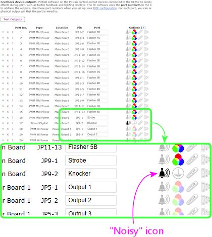

= Pinscape Night Mode

Night Mode lets you tell the Pinscape controller to shut off the noisy feedback devices in your cabinet, so that you can play games more quietly during late night hours without disturbing neighbors or housemates who are trying to sleep. You can designate specifically which feedback devices are noisy, so that the purely visual devices like flasher lights remain enabled.

== Designating the noisy devices

Night Mode only disables the feedback output ports that you specifically mark as "noisy" in your Pinscape settings. To select which ports are noisy:

* Open the Pinscape Config Tool
* Click on the Settings icon for your controller
* Scroll down to the *Feedback device outputs* section
* Click on the "bell" icon for each port that you want to mark as noisy

== Activating Night Mode

There are several ways to switch in and out of Night Mode:

* You can control the mode using commands on Windows.
* You can set up a dedicated hardware pushbutton or toggle switch just for Night Mode. This is a perfect kind of button to put on a custom inside-the-coin-door service panel (see "Adding an extra service panel" in xref:coinDoor.adoc#customServicePanel[Coin Door] ). The bottom of the cabinet also works well for this.
* You can designate a "shifted" button as the Night Mode toggle - one that you're already using as a regular button to send a key to the PC, but "shifted", meaning you press it in combination with another button to give it a second function.

=== Controlling Night Mode via Windows commands

Go to the directory where you installed the Pinscape Config Tool, and you'll find another program there called `PinscapeCmd.exe`. This is a utility program that you can invoke from the CMD prompt to send commands to the controller. You can also use it in batch (.BAT) scripts.

To use the PinscapeCmd program to switch in and out of Night Mode:

* Open a CMD prompt window (Windows+R, type `CMD.EXE` , press Enter)
* CD to the Pinscape folder (e.g., `CD /D C:\PINSCAPE` )
* To turn Night Mode ON, type `PinscapeCmd NightMode=ON` and press Enter
* To turn Night Mode OFF, type `PinscapeCmd NightMode=OFF` and press Enter

The capitalization isn't important. We just showed mixed case for clarity.

NOTE: If you have more than one Pinscape controller device installed in your system at the same time, you have to specify which one you want to send the command to, by adding `Unit= _number_` to the command before the NightMode option:
`PinscapeCmd Unit=2 NightMode=ON`

