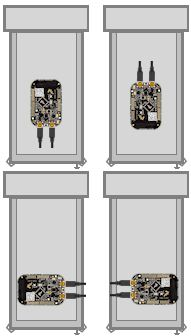
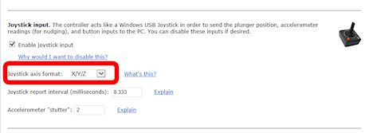

= Accelerometer (Nudge) Setup
:source-highlighter: rouge

The KL25Z has an on-board accelerometer, which is a sensor that measures the amount of acceleration applied to it. With a little classical Newtonian physics, we can use acceleration measurements to infer related information about the physical motion of the pin cab, which we can feed into a physics simulation like Visual Pinball so that nudging the cabinet can translate into a suitable effect on the game.

Analog acceleration sensing adds a whole new kind of "control" to pinball simulation, on par with real flipper buttons and mechanical plungers. Physical interaction with the game via subtle and not-to-subtle nudges is a huge part of real pinball that's completely lost in desktop pinball. Desktop pinball tries to make up for it with a "nudge key" that you can press, but that's not even close to the real thing; it's like trying to replace the feeling of throwing a ball with a button labeled "throw ball". The physical interaction you have with a real pinball machine is automatic, subconscious, intuitive, and the effect on the game is proportional and directional. A pin cab with an accelerometer brings that same mode of interaction to virtual pinball.

The KL25Z's accelerometer is built-in, and the Pinscape software uses it by default to send readings to the PC. So there's very little to set up on the controller side, other than physically installing the KL25Z to take best advantage of the sensor. There are some options you can set to fine-tune the input, though. And there's a small amount of work needed on the PC side to configure pinball programs to use nudge input.

This section is specifically about setting up Pinscape nudging. You might also want to take a look at xref:tilt.adoc#tilt[Nudge & Tilt] , which looks at the subject more generally.

== Positioning the KL25Z

The KL25Z's accelerometer is a three-axis type - it measures accelerations side-to-side, front-to-back, and up-and-down. The accelerometer chip is mounted on the KL25Z board so that the axes align with the plane of the board.

image::images/kl25z-mma8451q.png[""]

To take the best advantage of this, we want to align those native axes on the device with the axes of the cabinet, so that it's easy for the software to translate the sensor readings from the device to the motion of the cabinet. Specifically, the KL25Z board should be roughly flat on the floor, and it should be square with the front and sides of the cabinet.

"Square" with the front and sides means that the sides of the board are parallel with the corresponding cab walls. That makes any of the following orientations work (viewing the main cabinet from directly above):

So that tells us how to orient that board. The exact placement within the cabinet is a little more flexible. To a certain extent, it shouldn't matter too much where you place it, because the board will always move with the cabinet no matter where you put it. But the cabinet's motion has some subtleties because of the way it sways on the four legs, so I think it's best to locate the board close to the front, roughly centered side-to-side. That'll place it closest to where you're actually applying the nudge forces, so it should make it pick up motions in the same directions as your nudges, or at least as close as possible.

Finally it's very important to tightly attach the KL25Z to the cabinet floor. It should be secured to the cabinet so that it moves exactly as the cabinet moves. It shouldn't have any play that lets it slip around on its own; you want it to precisely track the motion of the cabinet. If you're mounting the KL25Z stadalone, attach it with a couple of screws through the mounting holes near the USB connectors, and make sure all four rubber feet are firmly planted. If you're using the expansion boards, the KL25Z plugs in via pin sockets that are a good tight fit, so you just have to make sure the main board itself is securely installed on standoffs.

To summarize:

* Place the board flat on the floor of your cab
* Top side facing up (the side with the IC chips)
* Square with the sides, in one of the four orientations shown above
* Close to the front of the cabinet
* Roughly centered side-to-side
* Mounted securely so that it moves precisely as the cabinet moves

== Config Tool nudge setup

The Config Tool has a few settings for the accelerometer that you can configure. To edit settings:

* Launch the Pinscape Config Tool
* Click the Settings icon for your device
* Scroll down to the *Accelerometer orientation* section.

The most important thing to set here is the device orientation. Select the radio button that matches the orientation of the physical device.

Dynamic range:: this setting lets you change the maximum acceleration that the device can register. There's a trade-off: a wider dynamic range also means lower precision (the ability to distinguish small differences in degree). The KL25Z's accelerometer chip can be set to a maximum range of 1G, 2G, 4G, or 8G (meaning _N_ times the acceleration due to Earth's gravity). The 1G setting has the best ability to distinguish fine shades of differences at small accelerations, down to about 1/10000 of a "G", but any actual acceleration higher than 1G (about 10 meters per second) will just read as the maximum 1G. 8G is at the other extreme: it can distinguish strong accelerations up to 8 times Earth's gravitational acceleration (which are very strong accelerations indeed), but at the low end can only distinguish to about 1/1000 of a "G".

In my opinion, the high-precision 1G setting is the best option for pin cab. A 1G acceleration is pretty strong in this context, and I don't see any practical need to distinguish nudges that are even stronger than that. We're better off with the finer gradations of subtle nudges that this setting can distinguish.

Auto-centering:: If you could mount the KL25Z perfectly flat in your cabinet, it would read "zero" on the X and Y axes all the time naturally. If you have even a slight tilt, though, Earth's gravity will register as a slight constant pull on these axes. Since this is practically impossible to eliminate in the physical mounting, the Pinscape software compensates for it by subtracting out any constant acceleration on either axis. This compensation is called auto-centering.

The auto-centering option is enabled by default, with a default interval of 5 seconds. That means that any time the accelerometer hasn't been registering any significant motion for 5 seconds, the firmware will take the average reading over that period to be the true rest position of the physical device.

You can change this to disable centering entirely, or to change to a longer or shorter period. If you disable auto centering, you can use the joystick viewer in the Config Tool to manually re-zero the readings at any time.

I'd recommend leaving auto-centering enabled. The true physical orientation in space of you pin cab will inevitably change slightly over time, as a natural consequence of your pin cab shifting on its footings. The KL25Z accelerometer is so sensitive that it'll pick up these slight shifts. If you don't allow the software to compensate by auto-centering frequently, you'll see a constant small bias in the readings, as though you were constantly nudging the machine slightly. The constant compensation provided by the auto-centering software keeps these biases from developing.

== Testing nudge input

The Config Tool has a built-in viewer/tester for the joystick interface.

* Launch the Pinscape Config Tool
* Click the Joystick icon for your device

That brings up the joystick viewer window:

This lets you view the information that the device is sending to Windows, to verify that the USB joystick interface is working properly and that the accelerometer, plunger, and button inputs are working as expected.

The little diagram at the left labeled "Accelerometer" shows you the current nudge readings. The little crosshairs in the middle represents the accelerometer reading in 2D space; up/down corresponds to the front-to-back direction on your cabinet, and left/right corresponds to left/right on your cabinet.

*Check the orientation:* When you give your cabinet a push from any direction, you should see the crosshairs jump briefly in the same direction as the force you applied. Push the cabinet from the front, and the crosshairs should briefly deflect upwards; push from the left, and the crosshairs should deflect to the right.

If the crosshairs move in the wrong direction when you nudge the cabinet, go back and check the device orientation setting to make sure it matches the way you positioned the KL25Z in the cabinet.

*Button inputs:* The red circles at the bottom represent the *joystick* buttons. These don't represent the physical button inputs on your KL25Z - they're strictly the joystick button presses that Windows sees through the joystick device interface. If you programmed a button to send a keyboard key instead of a joystick button, you won't see anything light up in the joystick viewer when you press the button.

== Windows calibration = bad

Windows has its own joystick device calibration procedure, which you get to via the Windows control panel called "Set up USB game controllers". Don't use it!

Everyone always wants to run this. They see the calibration option in Windows and think it must be there to help. It _is_ there to help, but only for _real joystick_ devices. It's a disaster to use with nudge/plunger devices, because they're not anything like real joysticks. Nudge/plunger devices only _pretend_ to be joysticks so that they don't need separate device drivers.

If you accidentally ran the Windows calibration before you read this warning (everyone does!), you'll need to delete the Windows calibration. The Windows calibration will screw up the Pinscape readings and make your nudge and plunger inputs act erratically. Fortunately, they made it pretty easy to reset the unwanted calibration data:

* Open the "Set up USB game controllers" control panel (press Windows+R, type *joy.cpl* , press Enter)
* Select the Pinscape device
* Go to the Settings tab
* Click Reset to Defaults

== Visual Pinball setup

VP can use accelerometer input for simulated nudging. This isn't enabled by default; you have to adjust some settings in VP to get it working.

For instructions, see "How to configure VP for an accelerometer" in xref:tilt.adoc#VPNudgeConfig[Nudge & Tilt] .

== FX2/FX3 setup

Pinball FX2 and FX3 can also simulate nudging using an accelerometer, but they don't use the joystick interface that Pinscape provides. Instead, they require input through the XBox controller interface.

To bridge the gap, there's a program called link:https://www.x360ce.com/[ *x360ce* ] that can make a joystick device emulate an XBox controller. That can reportedly be used to make Pinscape nudging work in FX2/FX3.

I don't use this in my own system, so I don't have any details about how to set it up. I anyone wants to write up instructions, I'll be happy to include them here.

== Conflicts with other joystick devices

Windows is happy to let you attach multiple joysticks to your system at the same time, and doesn't have any trouble telling them apart. However, not all applications are so accommodating. Some people have run into conflicts between the Pinscape device and other joysticks or joystick-emulating devices.

There are two main ways to deal with conflicts:

* Temporarily disable one of the devices when running applications where the conflicts occur
* Switch one or the other device to use different "axis" assignment for their data input

These techniques are described in more detail below.

=== Temporarily disabling a device

Many of the Microsoft software development kits (SDKs) include a tool called *devcon* , which lets you temporarily enable and disable individual devices. This can be a good way to deal with a conflicts with another device that you only use with certain applications. That is, you simply disable the other device when you're not using the specific applications it's needed for.

For example, one person on the forums reported a conflict with a special arcade controller device he only uses with certain video game programs. The arcade device was creating a conflict with the Pinscape device in Visual Pinball. But he didn't actually use the arcade device with Visual Pinball, so the simple solution was to disable it when Visual Pinball is running, eliminating the conflict in VP.

*Installing devcon:* The program comes with the Windows SDK, which you can download from the Microsoft site separately or as part of Visual Studio. You might also be able to find a plain devcon download with a Web search, although I don't think Microsoft makes it officially available separately from the SDKs.

*Identifying the device:* To disable a device with devcon, you need to know its USB ID. devcon itself has a way to list devices and their IDs. From a CMD prompt, go to the folder where you installed devcon.exe and run this command:

[source,shell]
devcon listclass HIDClass

That will show you a list of devices with their cryptic internal ID strings on the left, and a device description on the right. The only problem is that the device descriptions aren't very specific; they're mostly vague things like "HID-compliant game controller". I think the easiest way to figure out which one corresponds to your device is the differential approach:

* Plug the device in
* Run the `devcon listclass HIDClass` command
* Unplug the device
* Run `devcon listclass HIDClass` again
* Compare the lists - the item(s) missing from the second list represent the device you just unplugged

*Disabling the device:* Once you've figured out which cryptic ID string corresponds to your device, you can disable it as follows:

* Open a CMD prompt window in *Run as Administrator* mode (necessary because we're messing with device drivers)
* Go to the folder where you installed devcon.exe
* Type `devcon disable "@xxxx"` , where `xxxx` is the full ID string from the "listclass" list

*Re-enabling the device:* Same procedure as above, but replace the *devcon disable* command with *devcon enable* .

*Automating it:* You can automate the disable-enable procedure by putting it into a .BAT script. However, keep in mind that you'll have to run the .BAT script with "Run as Administrator" mode.

[#joystickAxisSettings]
=== Axis settings

Another way to deal with conflicts is to tell Pinscape to report its input on a different set of axes than it normally uses. This can be useful if you're getting conflicting readings on the two devices in a program that can't distinguish between different joysticks, such as Visual Pinball.

Most joystick devices send their input to Windows via the main joystick position axes, known as the X and Y axes. That's how Pinscape normally sends its accelerometer inputs. There's also a third standard joystick axis, called the Z axis, that Pinscape uses for plunger input.

Pinscape has an option to switch its inputs from using the X-Y-Z axes to a separate set of axes, called the "R" axes - Rx, Ry, Rz. The axis assignment change can be made in the Config Tool's Settings page, under the Joystick section:

In case you're wondering, the "R" stands for rotation. In a real joystick, the R axes are used to report twisting motions on the stick. For Pinscape purposes, it doesn't really matter what the "R" axes were designed for; we just use them as an alternative way to send the same inputs.

The Rx-Ry-Rz setting can work around conflicts in VP with other joysticks that use the X-Y-Z axes. VP can't distinguish between joysticks, but it _can_ distinguish the different axes.

If you do change Pinscape to report readings on Rx/Ry/Rz, you have to update the joystick input settings in VP and other programs to match. VP will normally look for input on the X/Y/Z axes, so if you change to Rx/Ry/Rz, you have to tell VP to look there instead.

The downside of using Rx/Ry/Rz axes is that some pinball programs are either hard-coded to use the Z axis for the plunger, or can't use the "R" axes at all. Future Pinball can't use the R axes at all, for example. You'd lose compatibility with such programs if you moved Pinscape to Rx/Ry/Rz. So I always recommend using the default X/Y/Z axis settings whenever possible, and only changing to the "R" axes as a last resort when you have a conflict with another device that you can't resolve in any other way.

NOTE: Pinscape only lets you change to the "R" axes as a group. Both the plunger and nudge inputs have to be on the same axis type.

