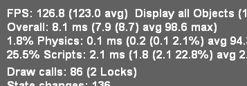

= Optimizing Performance

Virtual pinball is in essence a video game, and video games place special demands on PC performance.
The first prerequisite for adequate performance is adequate hardware, particularly the CPU and graphics card.
You can find advice on selecting suitable components in xref:pc.adoc#pc[Designing the PC] .

Even with fast hardware, though, you'll need to do some tuning to get the best video game performance out of your system.
This chapter offers some advice on things to try.

Here's my quick list of the most fruitful optimizations with VP:

.
Minimize background tasks and other running programs (see xref:#GeneralWindowsOpts[General Windows optimizations] )
.
Use a CPU affinity tool to give VP exclusive access to a group of CPU cores (see xref:#CPUAffinities[Controlling CPU affinities] )

== How to approach system optimization

The whole point of optimizing is to make the game play better, in your subjective view.
It's worth making a point to keep that in mind, because it's easy to get bogged down in the numbers, trying to make specific benchmark figures or performance metrics as perfect as possible.
It's best not to get too obsessed with any one benchmark, because there's no benchmark that captures everything, and there's always a point of diminishing returns when you start focusing on making one number as high as you can get it.

That said, objective metrics are extremely helpful when making adjustments.
For many of the adjustments you can make, there's no one-size-fits-all ideal setting, since the effects vary by system, so you'll have to experiment in many cases to find the right setting.
You'll also have to experiment to see which types of adjustments make any sort of difference.
Objective numbers can be really helpful to see if adjustments are having any effect and if they're moving the needle in the right direction.
It's easy to trick yourself into seeing differences that aren't there if you don't have some kind of hard data to look at.

== Measuring VP performance: frames per second

The most common performance metric in video games is the "frame rate", in Frames Per Second or FPS.
This is the number of times per second that the game software can fully render the scene and update the video graphics.

VP can display the current frame rate and some other statistics on-screen while you play.
Activate this display by pressing F11 while a game is running.

At first glance, it might seem strange that this isn't identical to your video card's refresh rate, usually 60 Hz (updates per second).
The reason for the difference is that most video games (VP included) do their graphics rendering on their own schedule, according to how quickly they can do the computing work to produce each frame.

In order to produce smooth animation, VP's frame rate has to be at least as fast as the hardware refresh rate.
If VP can't produce a new frame in time for the next hardware refresh, the TV will keep displaying the same frame as on the last refresh.
This will make the picture momentarily freeze on the TV, which makes the motion appear jerky.

In practice, it's not good enough for the VP frame rate to merely be higher than the TV's refresh rate.
It has to be _much_ higher, by a factor of two or more.
This is because the FPS rates that VP shows you is an average over many frames.
The actual time it takes to produce any individual frame can vary quite a lot from one frame to the next.
Some frames might take two or three times as long as the average frame to produce.
If your average FPS rate is only marginally above the TV's refresh rate, all of those slower-than-average frames will take longer than one refresh cycle to generate, so you'll see a lot of repeated frames and jerky motion.

What makes a frame take longer than average?
It's a matter of the complexity of the physics and graphics models that go into making up the frame.
You'll typically see the frame rate slow down during multiball sequences, for example, since the physics engine has to compute the motion of the additional balls.

=== How to check your graphics card refresh rate

* Open the Display control panel in Windows
* Go to the Adjust Resolution section
* Click Advanced settings
* In the Adapter tab, click List All Modes

This will show you the list of screen resolutions and refresh rates that your GPU supports.

Most graphics cards and TVs use a standard 60 Hz video refresh rate.
Many LCD TVs have nominal refresh rates of 120 or 240 Hz, but this isn't the video signal rate; it's just the LCD panel update rate, which uses interpolation to synthesize fake frames between the actual frames.
A small number of TVs and computer monitors can accept true video signal rates higher than 60 Hz, but to take advantage of that you also need a video card that can generate such signals.

It's always best to use a graphics mode that exactly matches the native resolution of your TV: 1280x720 for a 720p TV, 1920x1080 for a 1080p TV, or 3840x2160 for a 4K TV.

== How to reduce stutter

The jerky motion that happens when frames are repeated due to slow rendering is called "stutter".
It's more or less impossible to make VP absolutely stutter-proof, since there are occasional oddball situations in any game where the physics computations get extremely complex and overwhelm even the fastest hardware.
But it's at least possible to reduce stutter to the point where you'll hardly ever see it.

There are really two separate sources of stutter, which require separate solutions.

The first source of stutter is the raw computational time that VP spends updating the physics and rendering the graphics.
The physics updates are done on the main CPU, and the rendering is mostly done on the graphics card (the GPU).
So the obvious route to faster updates is faster hardware.
For most people, that's something to consider in the planning stages, but it's not practical in terms of budget to update your whole PC every time a table is too slow.
Barring hardware updates, the main way to increase VP's raw rendering rate is by adjusting VP's graphics options.
We'll cover that below in xref:#VPGraphicsSettings[VP video settings] .

The second source of stutter is a little more subtle.
Windows multi-tasks - runs many programs at once - by letting programs take turns using the CPU.
Windows lets each program run for a fraction of a second, then interrupts it and lets another app take its turn.
With most applications, you never notice this turn-taking, because it happens so quickly that it creates the illusion that every program is running at the same time.
The illusion can start to break down with video games, though.
The problem is that the turn-taking interruptions can happen at inopportune times that make VP miss its window for updating the graphics in time for a video refresh cycle, causing repeated frames and thus stutter.

One obvious way to reduce these interruptions is to minimize the number of other running programs, as outlined in xref:#GeneralWindowsOpts[General Windows optimizations] below.
That only goes so far, though, as you can't shut off everything else.
To deal with the programs that have to keep running, there's a powerful technique known as CPU "affinity", which lets you partition your hardware and give special VP special access to parts of it.
We'll talk about that later in xref:#CPUAffinities[Controlling CPU affinities] .

[#GeneralWindowsOpts]
== General Windows optimizations

You can find lots of advice on the Web about general Windows tuning and gaming PC tuning.
There's so much advice of that sort available that I won't try to reiterate it all in detail here, other than to mention the main points:

* Delete unused programs, especially any bloatware pre-installed by the PC vendor
* Disable unnecessary startup programs
* Remove or disable unnecessary background programs and Windows "services"
* Disable programs running in the "system tray" (the little icon area in the Windows task bar near the clock)
* If you're using Windows 10, turn off all the cloud features in the system "Privacy" settings, to minimize background network access.
* Remove third-party antivirus/antimalware software

The last one (removing third-party antimalware programs) might make you uncomfortable.
It's up to you, obviously, but I think it's worthwhile for a machine that you use as a dedicated pin cab PC and not as your main PC.
There are two reasons I think you can go without.
First, Windows 7 and later have pretty good protection built-in, in the form of Windows Defender.
That's positioned for marketing purposes as "basic" protection only, to give you the impression you need something stronger, but it actually scores fairly high in most independent testing.
Second, you can greatly reduce your exposure to malware by using the pin cab PC exclusively as a pin cab PC: don't store sensitive personal files on it, don't use it for email, don't use it for random Web browsing (limit Web use to trusted sites), and don't download random files (only download from trusted sites).
Email and random Web browsing are the primary vectors for malware, so you can minimize exposure to avoiding those vectors as much as possible.

[#CPUAffinities]
== Controlling CPU affinities

The most powerful tool I've found for reducing stutter is CPU affinity.
This a mechanism inside Windows for assigning each running program to a preferred group of CPU cores.

A "core" is a CPU within your CPU.
The processor chips used in modern PCs, such as Intel i5 or i7 chips, are actually made up of multiple CPUs packed onto one piece of silicon.
For example, an i5-8250 chip contains four complete CPUs.
The term "core" is used to distinguish these CPU sub-units from the chip as a whole, which is also commonly called a CPU.

Windows has built-in support for multi-core chips.
It automatically spreads work across the cores to optimize overall system throughput, and for most purposes you don't even have to think about it.
As usual, though, video gaming doesn't exactly fit the typical program profile that the Windows default settings are designed for.
The core affinity feature in Windows lets you override the defaults to optimize performance for special cases like games.

=== CPU affinity goals

The basic idea is to partition your CPU's cores into two groups: VP, and everything else.
When you're running a table in VP, the game itself is the only performance-critical task in the whole system; everything else can take a back seat and wait its turn.
So we're going to give the lion's share of your PC's computing power to the game, and give all other running programs the leftovers.
For CPU affinity settings, the smallest unit we can work with when dividing things up is one CPU core, so if your CPU has N cores, we're going to allocate N-1 of the cores to the game, and give the one remaining core to everything else.

The point of this partitioning is to give the pinball software the most exclusive access we can to a set of CPU cores.
This reduces the chances that another program running in the system will be able to interrupt VP or its components in the middle of some time-critical tasks.
(And virtually everything VP does is time-critical, since it's a real-time physics simulation.)

In practice, I find that this makes a night-and-day difference in stutter, reducing it from noticeable to practically never on my pin cab.

=== CPU affinity tools

*PinAffinity:* This is a simple CPU affinity setter I wrote specifically for pin cabs.
It's designed to be extremely simple to set up and completely automatic once configured, and it's free and open-source.
You can find it here: link:http://mjrnet.org/pinscape/PinAffinity.html[PinAffinity] .

Instructions for basic pin cab setup are included in the download, but here's a quick overview:

* Download the "bit" version that matches your copy of Windows (32-bit or 64-bit)
* Unzip the files into a folder on your hard disk
* Run PinAffinity.exe
* Use the "Add Program" menu to add the .EXE file for each pinball player program on your system to the designed Pinball program list
* Minimize the PinAffinity window and leave it running in the background while you play.
It automatically sets CPU affinities for new processes as they're created.
* If you wish, you can create a shortcut to PinAffinity.exe in your Start Menu "Startup" folder so that the program automatically launches each time you boot

*Other tools:* On my own cab, I used to use a freeware program called PriFinitty.
Unfortunately, it's no longer available; the developer abandoned the project a long time ago and never released the source code.

Another option is Process Hacker 3, available here: link:https://wj32.org/processhacker/[wj32.org/processhacker/] .
Process Hacker is a full Task Manager replacement, so it's not specifically designed for the pin cab use case, but it has the basic function we need (the ability to set CPU affinities persistently on a per-program basis).
Note that you'll need a "nightly build" version of Process Hacker 3.
The current public release version, Process Hacker 2, can control CPU affinities for live processes but can't save them or apply them automatically to new processes.

=== Recommended CPU affinity configuration

I recommend the following basic configuration:

* Assign three cores to VP (and any other pinball software you use)
* Assign the remaining cores to everything else

PinAffinity uses those settings by default.

Why three cores for VP?
You might have read that Visual Pinball is single-threaded, so it might not seem like it would benefit from more than one core.
It's true that VP's core physics and graphics run on a single thread, but if you look at a VP process with a tool like Process Explorer, you'll see that it has about 20 threads running.
Where are they all coming from if VP is single-threaded?
Mostly from the external subsystems that VP uses.
VPinMAME runs on its own thread; DirectInput and DirectSound create multiple threads to service I/O events; DOF creates a thread for each output controller it accesses; and most video card graphics drivers create several additional threads.

The main VP physics/rendering thread and the VPinMAME thread each consume significant CPU time; the rest of the threads do little actual computing work, as they only exist to service I/O events and timed events as they occur.
The VP and VPM threads probably don't come close to saturating the CPU on your machine; you'll probably see only 10% to 20% CPU usage on these threads.
But even so, they both benefit from having a free core available because they both need "real time" responsiveness to keep up with external events.
In the case of VPinMAME, it has to respond to game events immediately when they happen, and has to maintain precise time sync with the audio playback to prevent audible glitches in the soundtrack.
In the case of VP, the physics/rendering thread has to keep in precise sync with the video refresh cycle; any lag in rendering is visible as stutter.
It also has to respond quickly to input events to avoid perceptible latency (e.g., so that the flippers don't feel sluggish when you press the buttons).

That's why three cores seems to be the sweet spot for VP performance.
We have two threads that run more or less continuously (the main VP physics/rendering thread, and the VPinMAME thread), and a bunch of other threads that need to respond quickly to events but do little work.
If you give this collection of threads three cores to work with, Windows will be able to balance the load so that everything has near-real-time CPU access.

== One video card or two?

One of the frequently asked questions on the forums is whether it's better to use a single video card that can support multiple monitors, or a separate video card for each monitor.
(Most pin cabs have either two or three monitors: the main playfield TV, the backglass TV, and possibly a third monitor for the score display or "DMD" - the dot matrix display.)

This question actually contains two components, so let's unpack it.
The first part is: can my video card handle multiple monitors?
The second part is: would I get better performance by adding an extra video card for the second and third monitors?

The answer to the first part is basically always yes.
All modern gaming cards have support for multiple monitors and provide built-in ports for connecting two to four monitors.
And Windows has excellent, fully automatic support for multiple monitors built in.
When you're setting up your system, there shouldn't be anything special you have to do with either your video card or Windows to configure multiple monitors; you shouldn't have to do anything more than just plugging them all in.

What about performance, though?
Intuitively, it seems like more video hardware should translate to faster performance, for the same reasons that CPUs with more cores run faster.
It seems like an extra card would take some load off the main graphics card.
In practice, though, adding a second card makes most systems run slower.
I can only speculate about the reasons for this, but I suspect that it has to do with contention for the data bus that connects the CPU and GPU.
A second video card creates bus contention that doesn't exist if there's only one video card.
Whatever the reason, most system in practice run faster with a single video card handling all monitors.

"One card is faster" isn't an absolute rule, though.
I have heard from people who found that adding a second card actually did improve performance on their systems.
But this seems relatively uncommon; for most systems, it seems that you'll get better performance by buying one fast video card than by trying to split the load across two or more cards.

== Input lag

A common performance problem in video games is input lag: a noticeable delay between pressing a button and seeing the result on-screen.
On a pin cab, this is mostly noticeable with the flippers.
Input lag makes it feel like the flippers are slow to respond when you push the buttons.

Latency can come from many sources, but in most cases, the culprit turns out to be the TV.
That's the place to focus your efforts to fix the problem, in part because it's almost always the biggest contributor to lag by far, and in part because there aren't really any adjustments to be made anywhere else in the system.
Everything else is probably already running as fast as it can.

You can find more about input lag and how to minimize it in xref:playfieldTV.adoc#tvInputLag[Selecting a Playfield TV] .
We won't repeat all the detail here, but the main point is that you should be sure your TV is set up with as little image processing as possible, especially enhancement modes related to "motion smoothing".
Look for a Game Mode setting in your TV's setup menus; that usually selects the right combination of settings to minimize lag, since this is a concern for video games in general.

== Audio lag

Audio lag is a noticeable delay between visual events appearing on-screen and the playback of the corresponding audio effect.
This fortunately isn't a common problem.
If you experience it, though, here are a few things to try.

Check your sound card's settings.
(Open the Windows "Sound" control panel, select your card, and click Properties.) Make sure that everything is turned off under the Enhancements tab.

Some sound cards have extra properties tabs that control special hardware features of the card.
Check any extra you see and make sure that any processing modes, effects, or enhancements are disabled.

If you're using an add-in sound card (rather than motherboard audio), and it came with its own separate settings program, go through that and make the same kinds of checks: look for any effects or processing modes that might be slowing things down, and disable any you find.

If you're using your TV's built-in speakers through the HDMI video connection, check the setup menus to see if there's a setting specifically for audio delay or audio sync.
Your TV might be intentionally delaying the audio signal so that it syncs up with delays in the video signal processing, and it might let you adjust the delay time.
If so, make it as short as possible.

[#VPGraphicsSettings]
== VP video settings

Visual Pinball has a number of options related to graphics rendering that can affect performance.
To access these options, start VP without loading a game, in editor mode.
On the menu, select Preferences > Video Options.

The effects on performance of the different settings vary by system, and many of them trade off between quality and speed, so you'll have to experiment to find the ideal settings for your system.
Here's an overview of the main settings that affect performance:

* Anti-aliasing: this controls extra graphics processing to make edges look smoother.
Disabling it does the least processing, so it will be the fastest, at the expense of rougher looking edges.
The performance impact of the different anti-aliasing modes depends on your video card.
* Ball reflections, ambient occlusion: these control extra rendering to create more realistic graphics.
Turning them off results in faster rendering times.
* FPS limiter: setting this to 0 (the default) allows VP to render video frames as fast as it can.
Setting it to 1 makes VP synchronize its rendering cycle with the actual video refresh rate.
Some people find that synchronized rendering produces smoother graphics, so you might want to try it to see if it makes any noticeable difference for you.
If not, I'd leave it at the default 0 setting.
* Exclusive full-screen mode: this makes VP take over the monitor completely when running in full-screen mode, rather than sharing it with other programs.
This can improve graphics performance on some systems, but it can cause weird glitches with Windows multitasking, so I'd avoid it unless it makes a big difference for you.

