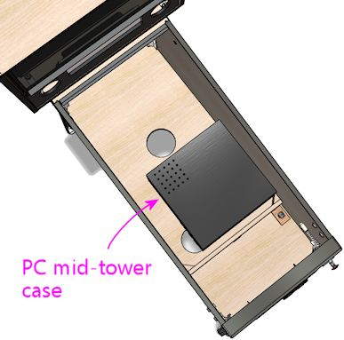

[#pcInstall]
= Installing the PC

This section is about physically installing the PC components in your cabinet.
It's not about building the PC per se - things like how to plug RAM into the motherboard, connect disks, install the graphics card, connect the power supply cables, and so on.
That sort of thing varies depending on the exact mix of parts you're using, so that's more the domain of the instructions that came with your components.
What we're going to talk about here is how all the PC parts fit into the pin cab.

== Location

For a lot of our cabinet design questions, we can follow the example of the real pinball machines, rather than having to invent everything ourselves.
But the real machines don't have PCs inside! So they don't give us anything to go on for where to put the computer.

It might seem at first glance that there's at least a close parallel in the real machines.
The solid-state machines from the 1980s and later might not have PCs inside, but they do contain computers of a sort.
They have a bunch of circuit boards that control the game (including CPUs and RAM, even), located in the backbox.
So if we _could_ follow what the real machines do, we'd put the PC in the backbox.

But that doesn't translate very well to virtual cabs.
The space requirements of the respective "computers" are too different.
In the real machines, the electronics were all purpose-built custom boards, so the designers were able to build them specifically to fit into the available space in the backbox.
We don't have that option; we have to work with standard PC motherboards, which are designed to fit in a standard PC case, not the more confined space of a backbox.
When you take into account that we also have to fit a TV into the backbox, we only have about 1" of depth to work with - which wouldn't even be enough room for a CPU fan, let alone a video card.

With the backbox ruled out, that leaves the main cabinet.
That's assuming you want the project to be self-contained, anyway, which is what most cab builders want.
If that's not a requirement for you, it opens up the additional option of keeping the PC in a separate, external case, and placing it on the floor.

Fortunately, the main cabinet works nicely as the location for the PC.
It's a large space, and it's mostly empty in a real machine, so we don't have to give up any standard real-pinball elements to make space available for the PC.
And even though we're adding a TV to the main cabinet, we actually get more space to work with than in a real machine, because we don't have a physical playfield to contend with.
We just have the TV.
A modern flat-screen TV is much thinner than a typical pinball playfield, because playfields always have a bunch of big solenoid coils and other mechanical parts sticking out from the bottom side.
So we come out a little ahead of the real machines in terms of usable interior space.

== Enclosure options

There are several different approaches to installing the PC.
Here are the ones I've seen on the forums:

* Build the PC in a conventional case, and put the case inside the cab
* Build the PC in a conventional case, and put the case _outside_ the cab, such as on the floor next to it
* Use an "open-frame" case or "motherboard tray", which has the backbone of a regular case for attaching the motherboard, expansion cards, disk drives, and power supply, but doesn't have an enclosure
* Mount the individual PC parts directly in the cabinet, with no case or frame of any kind

I think the last option (no case) is probably the most common.
It's how I set up my own cab, and it worked well for me.
But each approach has its own merits.
I wouldn't say that there's any single way that's best for everyone, or conversely that any of them are flat-out wrong.
So let's look at each one in detail, to help you decide what will work best for your cab, and give you some ideas about how to implement your chosen approach.

=== Conventional case, inside the cab

This is the most straightforward approach: build your PC in a conventional desktop or mid-tower case, and then stick the case inside the pin cab.

Typical PC mid-tower case, 16" x 16" x 7", lying on its side in the cab just behind the cashbox area.

The big question to ask when considering this approach is whether or not it'll fit.
If you're building a full-sized cab, and you're using a typical ATX desktop case or mid-tower case, it should work, although it'll be a little tight.
A typical mid-tower ATX case is in the neighborhood of 16" x 16" x 7", and a standard-body WPC cabinet has a floor space of 20.5" x 50", so there's room for the case's footprint no matter how you orient it.
Vertical space is tighter.
The cabinet interior is about 14" high at the front and about 21" high at the back, but remember that also have to fit a TV into the same space.
What's left over after installing the TV will depend on exactly where you position the TV.
Some people like to put it at the very top edge of the cab, millimeters from the glass, but most people like to set it further in, at about the depth of a real pinball playfield.
The latter case is the more difficult one in terms of space left for the PC, so to be conservative, that's the one we'll assume.
If the TV is about 4" thick, a playfield-level mounting will leave about 7" of vertical clearance at the very front - just enough for the 16x16x7-inch case lying on its side.
But that's only at the very front; you get more headroom the further back you put the PC, since the TV slopes up.
And you'll actually want to put the PC back a little further anyway, to leave room at the front for the coin door and plunger.
So the answer is yes, it'll fit, at least for this hypothetical 16x16x7 case.

Advantages of this approach:

* It's easy to build the PC, since you build it the "normal" way
* It's self-contained
* You can easily remove the whole thing to work on the PC outside of the cab
* The case protects the PC components from loose objects in the cab

Disadvantages:

* It takes up a lot of space; you'll have less space room for other things (such as feedback devices) than with an open-frame case or no case
* Putting an enclosed case inside an enclosed pinball cabinet might make cooling less effective

Considerations if you choose this approach:

* When building the main cabinet, you should consider moving the subwoofer opening further towards the back than the location shown in our WPC-style plans.
(And note that our plans already place it further back than it was in the real WPC machines, where it was nearly centered front-to-back.) The mock-up diagram above uses the subwoofer placement from our plans, and you can see that there's almost no room between the subwoofer opening and the PC case.
Keep in mind that the speaker itself will be slightly larger in diameter than the opening.
* The case will need to be oriented to leave enough clearance for video cables, USB cables, and power cords.
That means that the back plane of the case can't be flush with a wall.
This might affect where the fan intake vent ends up, so figure it out early so that you can take it into account when build the cabinet.
* Position the case so that its air intake and cooling fan exhaust vents aren't blocked.
Ideally, position the intake vent close to an opening in the cab floor, so that the intake can draw in outside air directly (rather than the warmer recirculated air within the cab).
* You probably won't be able to fit a separate intake fan with this arrangement.
That's okay as long as the PC case intake is near a floor vent opening.
The PC's case fan will pull air in through the vent and thus will serve the same function that an intake fan would have served.
* If air flow does turn out to be a problem, you can always take the cover off the case and just use the chassis, similar to the "open-frame" case style discussed below.
(That gives up one of the advantages of using a full case, though: the protection afforded by the complete enclosure.)
* Secure the case in place so that it doesn't slide around the cabinet.
I'd probably use wood blocks (perhaps nominal 2x2 strips) at the edges, and something like an L-bracket to lock it down vertically.
I'd want the top bracket to be easily removable so that you can take the PC out when needed.
One of the big advantages I see in using a full case is that it makes it easy to remove the PC as a unit to work on it outside of the cab.
Perhaps fasten the L-bracket with a thumbscrew or wing bolt, so that you can remove it without tools, or use something more of the nature of a toggle latch.

* You'll need to connect wiring to the PC's soft power button so that you can turn the PC on with the cabinet's power button.
(See xref:powerSwitching.adoc#powerSwitching[Power Switching] .) I'd find the wires leading to the case power button, and splice my own extra wires onto these, running the extra wires outside the case through an available opening.
You can then connect these to your cabinet power button.

Remember that we want to make it easy to remove the whole PC case for maintenance work, so be sure to use some kind of modular, pluggable connector for the switch wiring.
Don't hard-wire it.
When you want to remove the case, you can just unplug that connector to free the wires.
See xref:connectors.adoc#connectors[Connectors] .

=== Open-frame case

An "open-frame" PC case, also sometimes called a motherboard tray, is an interesting compromise between using a full conventional PC case and no case at all.

An open-frame case is basically just the backbone of a regular PC case, without any enclosure.
It has the usual mounting apparatus for the motherboard, power supply, disks, and expansion cards, in the usual spatial arrangement.
Installing all the parts works just like in a regular case, except that there's no cover to put on when you're done.
These cases are sold mostly for people doing test builds and experimentation, where they want easy access for frequent component changes.

Pros:

* Assembling the PC components is as easy as for a conventional case
* Slightly more compact than an enclosed case
* Open air flow for cooling

Cons:

* Still fairly large, even though it's smaller than a full case
* The spatial arrangement of the components is dictated by the frame design (you can't customize the footprint to work around space constraints)
* PC components aren't protected from loose objects in the cab

Considerations for using an open-frame case:

* Secure the frame in the cab so that it doesn't move around.
Some open frames are specifically designed for lab-bench mounting, which would translate directly for a pin cab setup.
Otherwise, you'll have to improvise something.
I'd look for a way to fasten the floor of the frame to the floor of the cab with a few brackets or latches, so that it's not too much work to remove it.
* As with a conventional case, an open-frame case might conflict with the subwoofer placement in our WPC-style plans, so you should plan around that when building the cab.
* As with a conventional case, you'll have to tap into the frame's power button wiring, so that you can connect the motherboard's soft power switch to your cab power switch.

=== No case

Or, to put it another way, use the pin cab itself as the case.
This is how I built my own cab, and I think it's the most common approach.
I like it for its flexibility, especially the ability to position the components to make room for other things in the cab.
But it's more work since you have to come up with custom mountings for everything.

Pros:

* Uses the least space
* You can arrange the components however you want, to minimize the footprint and work around conflicts
* Open air flow for cooling

Cons:

* More work to plan and implement
* Requires ad-hoc support apparatus for the video card
* No protection against loose objects
* More difficult to remove the PC components for service

Tips for a no-case installation:

* The motherboard can go anywhere there's room for it, but I'd recommend placing it in the middle of the cabinet front-to-back, and up against one side.
You probably don't want to put it at the very front, because you need to leave room for the standard pinball equipment like the cashbox, tilt bob, plunger, and flipper buttons.
You also don't want it at the very back, because that makes it hard to reach once everything else is installed.

Possible placement of the PC motherboard and power supply.
This leaves room along the side opposite the motherboard for external USB devices such as key encoders, plunger/nudge devices, and feedback device controllers.

* The PC power supply can be placed up against the wall near the motherboard.
The exact placement isn't critical; it just has to be within reach of the motherboard power connectors.
* The power supply (like the motherboard) needs to be fixed in place somehow.
I secured mine with L-brackets screwed into the cabinet floor and wall.
They're not screwed into the power supply itself; they just hold it place by forming a sort of cage around it.

* I mounted my motherboard on a plywood carrier - so in a way it's just a home-brew version of the "open-frame" case, although with more control of the geometry than you get with a retail frame.
This let me assemble the PC and its expansion cards outside of the cabinet, and drop the whole thing in as a unit.
It likewise lets me remove the assembly when necessary to work on it outside of the cab.
The plywood carrier is fastened to the cab floor with wood screws at the corners.
* PC motherboards attach to a conventional case with M3 machine screws that screw into standoffs, which in turn screw into threaded holes in the case.
The standard standoffs won't work with a plywood carrier, though, because the plywood doesn't have the threaded holes that the standoffs fit into.
As a replacement, you can use M3 or #4 by 1" sheet-metal screws, combined with 1/2" tall nylon spacers underneath.
The sheet-metal screws will self-tap in plywood, so you can simply fit them through the spacers and screw them directly into the plywood.
The spacers take the role of the standoffs to provide a little air space between the motherboard and the plywood carrier.

* Alternatively, it is possible to use the standard standoffs, but it requires some prep work.
It's also much neater, so you might find it worth the extra effort.
The trick is to pre-install a set of #6 T-nuts in the plywood to fit the #6 machine screw bases of the standard standoffs.
T-nuts install from the _back_ side of a board.
You'll have to drill holes for the T-nuts, and possibly (depending on the thickness of the board) route insets on the bottom side so that the T-nuts seat flush with the front surface of the board.
Once the T-nuts are in place, you can screw the standoffs into the carrier as though it were a regular case chassis, and then install the motherboard on top of the standoffs using M3 x 1/4" machine screws.

* Your video card and any other expansion cards will need a support strut of some kind to keep them from moving or coming loose.
The slot on the motherboard isn't strong enough to serve as the only physical support.
Without more support, the cards can wiggle in their slots, and that can momentarily disconnect their pins in the PCI slot.
That's very bad, because PCI slots most definitely aren't "hot pluggable" - they don't let you insert or remove cards with the power on.
At best, a momentary disconnect will crash Windows and make the PC do a hard reset; at worst it could damage the video card or motherboard.
So the video card and other cards must be held rigidly in place.

For my setup, I made a metal bracket that runs between the plywood carrier and the top of the video card at a 45° angle.
It attaches to the video card via the same screw hole that you'd use to screw the card into a regular PC case frame.

* Hard disks can be placed anywhere convenient that's within reach of the data cables and power connectors.
If you're using an SSD (solid-state disk), those are so light that you can secure them to the floor or a wall with adhesive Velcro.
I'd probably even use Velcro for a hard disk, although due to the extra weight, I'd only mount that flat on the floor rather than trying to stick it to a wall.
That way, gravity will be working with the Velcro rather than against it.
I've had problems with Velcro on a vertical surface sliding down the wall over time, so I wouldn't trust it to hold a mechanical hard disk up against gravity.
If you want to mount a hard disk vertically, use something more robust to secure it, like L-brackets with screws.
* This is more of a PC-planning thing, but you can avoid the need for a separate disk of any kind by using an M-SATA drive.
Those are SSD/flash drives that are only about the size of a credit card and plug directly into a slot on the motherboard, so there are no cables to manage and no separate piece to mount.
You need a motherboard with an M-SATA slot to make this work, obviously.

=== External case

A rather different option from what we've been talking about thus far is to "think outside the box": placing the PC in a conventional tower case sitting on the floor next to the cab.

This doesn't yield the kind of integrated, self-contained, stand-alone pinball machine replica that most pin cab builders are shooting for, so it's definitely not to most people's taste.
But it has two features that might make it interesting to some people.
The first is that it lets you share a PC between the cab and other uses, such as using it as your regular desktop PC most of the time.
It's hard to deny that buying a whole separate PC that will never be used for anything but playing pinball is a bit of an extravagance.
By the same token, it's hard to deny that building a giant piece of furniture just to play video pinball is an extravagance; but sharing the PC is one way to rein in the cost where you can.
The second thing that might make an external PC attractive for some projects is that it uses zero space inside the cab.
That's not much of a concern for a full-size cab, but if you're building a sufficiently "mini" mini-cab, you might not have all that much free space to work with - or you might want to save the space for something else, like more feedback devices.

Pros:

* Saves space inside the cab
* Lets you use the PC for other functions when not pinballing

Cons:

* Not self-contained
* You have to connect several cables each time you use it

The only integration work with an external PC is to run the video and USB cables between the PC and the cabinet.
You'll probably want to minimize the number of cables, both to reduce visual clutter and to make it easier to connect and disconnect cables when you want to switch the PC between pinball mode and desktop mode.

My first suggestion is to place a USB hub inside the cabinet.
Connect all the USB devices in the cab to the hub; all of that wiring will be hidden inside the cab, and you won't need to touch any of it when you connect and disconnect the PC.
Then you just need one external USB cable, between the PC and the hub.

My second suggestion is to use Keystone or similar wall plate connectors for the USB cable and all the video cables.
See "External I/O plugs" xref:#externalIOPlugs[below] for more on this.
I'd set up all the external ports on the back wall the cab.
That will at least centralize all the cable connections in one place, which will make it easier to keep the cable bundle neat, and will also make it easier to plug and unplug everything when you move the PC.
Putting the connectors in the back will keep the rat's nest of cabling as out of view as possible.

[#externalIOPlugs]
== External I/O plugs

If you're using a wired keyboard or mouse, or a wired Ethernet connection, you'll need a way to plug these into the motherboard from outside the cabinet.

A simple way to accomplish this is to drill a hole in the cabinet big enough to accommodate the wires, then simply pull the cables through the hole and plug them into the motherboard.
This isn't very convenient when you need to unplug or reconnect the cables, though, since you'll have to open up the cabinet to get access to the plugs.

A better way is to install a set of the appropriate jacks on the exterior of the cabinet.
Then you can easily plug the devices into the external jacks at any time, and just as easily unplug them.
This is fairly easy to set up, thanks to connectors you can buy for home theater and office installations, where many people want to put USB connectors and Ethernet cables in wall outlet plates.

For the keyboard and mouse connector, I recommend placing two USB connectors (one for each device) on the floor of the cabinet near the front.
For the Ethernet connection, I recommend putting a port on the back wall the cabinet near the power inlet.

WARNING: Before you install these jacks, you should figure out how all the internal parts in your cabinet are going to be laid out, so that you're sure the chosen locations for the jacks won't get in the way of anything else.
The jacks require cutting holes in the cabinet, so you can't easily move them if the locations end up conflicting with something else.

=== USB, keyboard, mouse

For the keyboard and mouse ports, here are the parts I recommend:

* Keystone wall plate insert with 2 openings
* Keystone snap-in USB 3.0 female-to-female couplers (quantity 2)
* Keystone PS2 (6-pin mini DIN) female-to-female coupler (optional, if you're using an older keyboard with a PS2 connector instead of USB)
* 4-foot standard USB cables (male A to male A) (quantity 2)
* 4-foot PS2 keyboard male-to-male cable (optional, if you're using the PS2 keyboard connector instead of USB)

NOTE: you can get a 3-gang plate if you want to install the keyboard, mouse, and ethernet in one spot, and you even get a 4- or 6-gang plate if you want to add even more connections beyond these.
I personally prefer having the keyboard and mouse connections near the front of the machine, since that's where I tend to use those devices, and I prefer to have the Ethernet port in back to keep that cable out of the way. That's why I recommend separate plates for these - it's simply because I like to locate the two sets of plugs at opposite ends of the machine. But if you want to minimize the number of holes to drill, you might prefer to put everything in one plate instead.

To install: figure out where the plugs will go. I recommend the floor of the cabinet near the front. Using the wall plate insert as a template, mark the area on the floor inside the cabinet where the rectangular middle section of the plate will go.
This is the area to cut out. Note that you should mark this area from the inside to make sure there's room for the screw tabs on either end of the plate.

If you're using a jigsaw to cut this out, drill a hole at one corner big enough to start the cut, then carefully cut the rectangular area out with the jigsaw. If you're using a router, carefully route along the cutting outline.

Once the hole is cut, mount the plate on the inside of the cabinet, with the outside of the plate facing out through the opening. Screw down the plate with four 1/2" wood screws, one through each screw tab.

Insert the two USB couplers (or one USB coupler and one PS2 coupler, if you're using that type) into the square openings from the inside of the cabinet. They should attach so that the jack on the underside (exterior) of the cabinet is flush; the body of the coupler should stick up into the interior of the cabinet. Grab the matching 4' cables and plug one end of each cable into the corresponding coupler. Plug the other end of each cable into a suitable port on the motherboard.

That's it! This will give you a neat, recessed opening with the two jacks for the keyboard and mouse. You can now plug your devices into the jacks without having to open up the cabinet.

=== Ethernet

The procedure for the Ethernet connection is the same as for USB ports. Here are the required parts:

* Keystone wall plate insert with 1 opening
* Keystone Cat6 (RJ45) female-to-female coupler
* 4' standard Ethernet Cat6 patch cable

As before, find the location in the cabinet where you'd like to install the port. I recommend putting this connector on the back wall the cabinet near the power inlet, since it's tidier to keep the Ethernet cable behind the machine rather than having to route it underneath. Repeat the procedure to mark and cut the opening required for the plate. Install and screw in the plate as before, pop in the Ethernet coupler, and connect the short Ethernet cable between the coupler and the motherboard Ethernet jack. Now you can plug an external Ethernet cable between the external cabinet jack and your router or wall plate.

=== HDMI

Keystone HDMI coupler modules are available that work just like the USB and Ethernet modules. Follow the same procedures as described above.

=== Other video

DVI-D, DisplayPort, and VGA connectors are too large for the standard Keystone jacks, so you generally can't find these as Keystone modules. However, you _can_ find non-Keystone wall plates specially made for the various video connectors. So if you're using an external PC and need a set of video connectors, don't give up when you can't find them in Keystone modules; instead look for one-off dedicated plates for the video connector types you need. The procedure to set those up is generally the same as for the Keystone plates.

