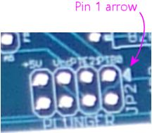

[#pinHeaders]
=  0.1" Pin Headers

A very common type of connector used on printed circuit boards is the "pin header", so named because it has a series of metal pins that fit into sockets on a mating cable connector.
The Pinscape boards use this type of header for most of their external connections.

image::images/pinHeaderSample.png[""]

Pin headers in this style come in different sizes, but the most common (and the one used on the Pinscape boards) size is 0.1" pin pitch.
This means that the pins are spaced at intervals of 1/10 of an inch.
(To be more precise, that's the distance between the center points of adjacent pins, when viewing the header from directly above.) You'll sometimes see this expressed as 2.54mm pitch, which is of course the same as 0.1".

0.1" headers come in single and double rows.
They're listed in a parts list according to the number of rows and columns: 2x09 for two rows of nine pins, for example.

== Pin numbering

There's a standard convention for numbering the pins on the headers.
If you have to look at the schematics, this will help you relate the wiring on the schematics to the physical pins on the board.

On the schematics, the pin numbers are indicated by little numbers printed next to the pins on the connector symbols:

On the Pinscape boards, the pin numbers aren't printed as such.
Instead, there's a little white arrow pointing to pin #1:

Once you've identified pin #1, you can determine the rest of the pin numbers just by counting them off starting at pin #1.
The numbering pattern is always the same:

* For a single-row pin header, the pins are simply numbered sequentially across the row
* For a double-row header, the pins are numbered in "column" order:

image::images/pinhead-dual-row-numbering.png[""]

== Installing in a circuit board

The pictures above show how these look before you install them on the board.
The black part is a plastic base that holds the pins at the proper spacing.
You'll notice that the metal pins stick out of both sides of the base.
The *long* part at the top is the connector, where you attach the mating cable socket.
The *short* part at the bottom goes through holes on the board and gets soldered into place.

To install in a circuit board:

* If using a breakaway strip, use needle-nose pliers to break the strip to the required number of pins
* Insert the short end of the pins through the holes in the top of the board
* The plastic base should sit flat against the board as pictured above
* Hold the assembly in place and flip the board over
* Solder the pins to the pads on the bottom of the board

Some people ask if it's okay to just solder a couple of the pins, since that should be enough to hold the whole assembly in place mechanically.
The answer is no: you have to solder *all* of the pins.
The solder isn't only there to fasten the pin headers mechanically - it also makes the electrical connection between the pin and the solder pad.
Each pin needs its own separate electrical connection to its pad, so every pin has to be properly soldered.

== What to buy

The common 0.1" pin headers are interchangeable with each other and with 0.1" connector plugs.
Any of the following options should work for the Pinscape board and KL25Z headers.

*Option 1: Individual parts.* The obvious thing to do is buy each size you need individually.
If the parts list says you need a 2x8 for one header and a 2x10 for another, you go to Mouser and order a 2x8 and a 2x10.
Our parts lists give you an exact Mouser part number for each size individually, so you can just order the items on the parts lists if you want to go this route.

*Option 2: Breakaway strips.* Alternatively, you can buy breakaway pin strips, which are extra-long versions that you can break up into sections to get the various sizes you need.
These have from 20 to 50 pins in each row, and they're designed to be broken into smaller pieces at any pin.
The plastic bases are notched so that you can easily split them up by hand or with pliers.
This is the "buy in bulk" approach, so it's usually a little cheaper than buying the pre-cut sizes individually.
It also simplifies things a little by cutting down on the number of different parts you have to order and keep track of.

*Product options:*

*  link:https://www.pololu.com/[Pololu] has inexpensive unbranded single-row and double-row strips.
These are under Electronics > Connectors > 0.1" Male Headers.
* TE Connectivity (at Mouser):
** link:https://www.mouser.com/search/ProductDetail.aspx?R=571-5-826629-0.html[5-826629-0] (1x50)
** link:https://www.mouser.com/search/ProductDetail.aspx?R=571-5-826925-0.html[5-826925-0] (2x50)
* Molex (at Mouser):
** link:https://www.mouser.com/search/ProductDetail.aspx?R=538-90120-0160.html[90120-0160] (1x40)
** link:https://www.mouser.com/search/ProductDetail.aspx?R=538-70280-0448.html[70280-0448] (2x50)

== Shrouded pin headers

The plain pin strips pictured above are simple to set up, but they have the drawback that there's nothing to prevent you from accidentally plugging in the mating cable backwards.
An alternative is to use "shrouded" headers.
These have the same arrangement of metal pins as in the plain headers, and attach to a printed circuit board the same way, but they add a plastic box - the shroud - surrounding the pins.

The shroud offers some mechanical protection for the pins when the mating cable is unplugged, but its big benefit that it has a notch on one side (see the illustration at right) that accepts a corresponding "key" on a mating connector.
The key is a little bump that fits into the notch; it makes it impossible to insert the cable backwards because the key won't fit in the other side where there's no notch.

image::images/idc-keying.png[""]

Most IDC connectors (for xref:ribbonCables.adoc#ribbonCables[ribbon cables] ) have these keying bumps.
Crimp housings sometimes have them and sometimes don't.
Crimp housings that don't have the keying bumps will fit perfectly well into keyed shrouds, so there's no compatibility problem, but they'll fit backwards as well as forwards since they don't have the bumps to prevent backwards insertion.
So you can use them, but you don't get the orientation sensing of the keyed kind.

The pins in a 0.1" shrouded header are identical to the pins in a 0.1" plain header, so you can often substitute a shrouded header anywhere a plain header is called for, or vice versa.
However, the shroud takes up extra space, so there's not always room for it in a tightly packed board.
Before substituting a shrouded header for a plain pin strip, make sure there's not another component (or another header) within the shroud's footprint on the top of the board.

The Pinscape expansion boards are designed to leave enough space around most of the data connectors to allow shrouded headers to be used.

Shrouded headers *won't* fit on the standalone KL25Z's pin pads.
They're spaced too tightly.

=== What to buy

Molex 70246 series:

* link:https://www.mouser.com/search/ProductDetail.aspx?R=538-70246-0801.html[70246-0801] (2x04)
* link:https://www.mouser.com/search/ProductDetail.aspx?R=538-70246-1001.html[70246-1001] (2x05)
* link:https://www.mouser.com/search/ProductDetail.aspx?R=538-70246-1201.html[70246-1201] (2x06)
* link:https://www.mouser.com/search/ProductDetail.aspx?R=538-70246-1401.html[70246-1401] (2x07)
* link:https://www.mouser.com/search/ProductDetail.aspx?R=538-70246-1601.html[70246-1601] (2x08)
* link:https://www.mouser.com/search/ProductDetail.aspx?R=538-70246-2001.html[70246-2001] (2x10)
* link:https://www.mouser.com/search/ProductDetail.aspx?R=538-70246-2401.html[70246-2401] (2x12)

== Matching connectors

A 0.1" pin header obviously only forms half of a connection.
We now need something to plug into this header.
There are two main types of matching connectors available:

* 0.1" crimp pin housings.
A housing is the shell of a plug, which you have to build out with crimp pins.
The idea is that you crimp a special little metal pin socket to a piece of hookup wire, and then insert the socket into the housing.
You repeat for each pin position.
When you plug the populated housing into the pin header, each pin socket mates with one pin on the header, forming a connection to the attached hookup wire.
 Crimp pin housings are best when you specifically want to wire each pin separately, with a separate piece of hookup wire.
This is appropriate when the far ends of the individual connections are scattered.
For example, you'll want to connect the pins in the button input header on the Pinscape boards to the various buttons scattered around your cabinet, so a crimp pin housing is a good choice for that connector.
 See below for more details on crimp pin housings.

* Ribbon cables.
A ribbon cable is a flat cable with several conductors side-by-side.
These are mated with IDC plugs, which is a connector that attaches to a ribbon cable via some little teeth that puncture the insulation and grab the wires.
It's easy to assemble custom ribbon cables with these connectors, because you just line up the connector on the cable and squeeze the teeth into place.
 Ribbon cables are ideal when you want to connect two like pin headers on different boards.
You don't have to mess around with a bunch of individual hookup wires, and the connectors are quick and fairly easy to install because they install for all of the conductors at once.
This is the right choice for the Pinscape board-to-board data connectors, such as the PWM data connection between the main board and the power board.
 See xref:ribbonCables.adoc#ribbonCables[Ribbon Cables] for details on buying and building these cables.

== 0.1" (2.54mm) crimp pin housings

This is one option for connecting to the common 0.1" pin headers detailed above.
It's ideal when you specifically want to connect individual hookup wires to the pins, rather than using a single combined cable like a ribbon cable.
For example, this is perfect for connecting buttons to the Pinscape expansion board button input header, since it lets you run an individual hookup wire to each button switch.
That's good for buttons because they're scattered around the cabinet; a combined cable like a ribbon cable wouldn't be convenient for that since you'd have to split it up into individual wires to route it.

A "housing" is the _shell_ of a plug.
It's a plastic shell that holds the metal prongs that make up the plug, but it doesn't actually come with the plugs pre-installed.
It's up to you to install the prongs, which are more technically called crimp pins.

This all takes some specially designed parts and tools.
The crimp pins are specially designed to fit the housing, and they're specially designed to attach to hookup wire by crimping.
They have little flaps that fold around the wire and grasp it to form a connection.
You have to use a special tool (called a "crimp tool", naturally) that folds the flaps into just the right shape.

=== What to buy

Each manufacturer designs its crimp pin housings to work with its own crimp pins.
You shouldn't try to mix and match housings and crimp pins; if you buy a Molex housing, you must use the matching Molex crimp pins.

*  link:https://pololu.com/[Pololu] has inexpensive crimp pin housings in sizes from 1x1 to 2x20 (although not in all possible sizes in between).
** The housings are under Electronics > Connectors > Crimp Connector Housings
** The matching crimp pins are under Electronics > Connectors > Female crimp pins for 0.1" housings (they're also linked from the pages for the individual housings)
* Molex makes housings from 1x2 to 2x32 under their CGRIDIII series:
** Single-row housings: 90156-01XX (search for 90156-01 on Mouser for a list)
** Double-row housings: 90142-00XX (search for 90142-00 on Mouser for a list)
** Female crimp pins: 90119-0109 (for 22-24 AWG wire), 90119-0120 (for 26-48 AWG wire)
* Harwin makes housings from 1x2 to 2x12 under their M20 series:
** Single row housings: M20-106XX00 (XX = number of pins, 02 to 12)
** Double-row housings: M20-107XX00 (XX = pins per row, 02 to 12)
** Polarizing key: M20-003
** Female crimp pins: M20-116004X, M20-118004X (X = 2 gold/tin plated, 6 tin plated)

=== How to assemble

For instructions on assembling these connectors, see xref:crimpPins.adoc#crimpPins[Crimp Pins] .

