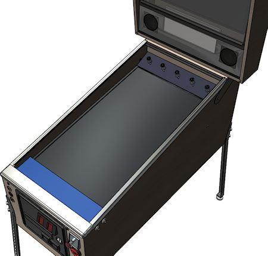
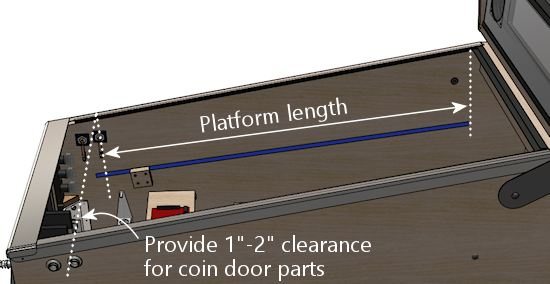
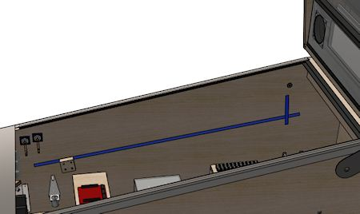
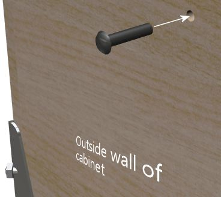
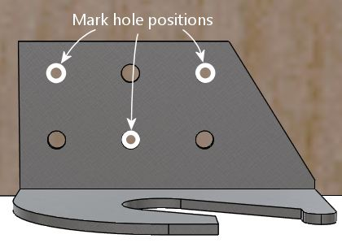
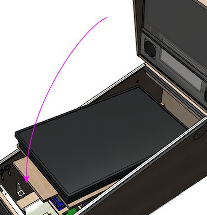
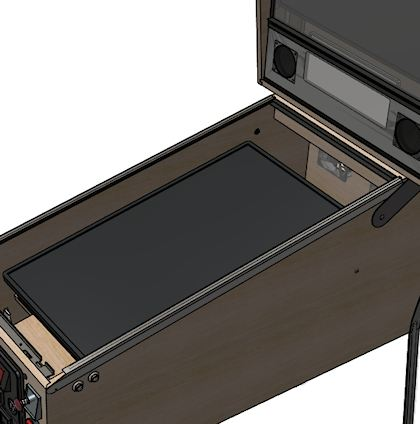
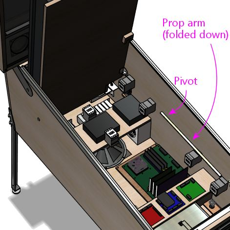

= Playfield TV Mounting

This section is about how to install the main TV - the one that takes the place of the playfield.

This section tries to address the two big questions about installing the TV. The first is where to position the TV in the cabinet, which is as much a matter of aesthetics as of function. The second is the engineering question of how to physically attach the TV to the cabinet, once you've figured out where you want it.

Where to place the TV is one of the top questions that new cab builders ask on the forums. It's one of those things that seems self-evident at first glance, but has a lot of subtlety when you look more closely. It's obvious that the TV has to lie on its back near the top of the cab, but that doesn't quite answer the question, since it leaves a few inches to play with to move the TV up and down and front to back. Those few inches can make a lot of difference aesthetically - it's that matter of what _exact_ positioning is ideal that raises all of the forum questions. This chapter surveys the options and their respective pros and cons. I have some opinions about what looks best, which I'll share, but I'll also try to give equal time to the alternatives. I don't think there's a single right answer, because everyone has their own priorities for their cab and their own sense of what looks best.

After the survey of positioning alternatives, this section presents my attempt at an all-purpose, universal TV mounting system. When I was building my own cab, I found the TV mounting to be one of the more challenging problems. The TV makers don't expect you to use a TV like this, and the people who make pinball machines don't think of putting a TV inside, so neither world gives us an example we can look to for ideas, and neither world offers a ready-made hardware solution we can apply. Every cab builder has always been on their own to work out their own unique, ad hoc scheme. That always seemed like a waste of energy to me; I've always thought there should be at least a basic template we can follow. I think I've managed to come up with something like that. This chapter provides a general-purpose design that should be flexible enough to work with most TVs and most cabs, using standard parts that you can readily buy. It's at least an option to consider, and even if it isn't a good fit for your cab, it might still give you some ideas to draw on. If you're looking for even more ideas, at the end of the chapter, I'll outline a few alternative mounting schemes that other cab builders have used.

We're assuming here that you've already picked out a TV to install. If you're still shopping for a TV, there's a separate section with advice about that, xref:playfieldTV.adoc[Selecting a Playfield TV] .

== Orientation

The playfield TV is always installed in "portrait" mode, to fit the proportions of the cabinet. This represents a 90° rotation from the standard way you view a widescreen TV.

But should it be 90° clockwise or 90° counter-clockwise?

Most virtual cab builders install it with the *bottom of the TV* facing *left* in the cab:

In principle, it really shouldn't matter. Windows and all of the pinball software _should_ let you select whatever rotation you want. But this is one of those cases where you can save yourself some hassle by doing it the same way everyone else does it. There's still a lot of older software in use in the pinball ecosystem, and some of it might not be as adaptable as modern programs. I don't know of any actual examples of software that will outright fail to work with other rotations, but I know from helping people out with PinballY that monitor rotation in general can cause configuration headaches, especially with some of the commercial games.

== Positioning options

Before we get to the mechanics of installing the TV, let's consider exactly where you want to position it. To a first approximation, of course, it goes "where the playfield goes". But a TV isn't quite the same as a regular playfield, in either its nature or its size and shape. So saying that the TV goes where the playfield goes is too vague to constitute a plan. It leaves a couple of important questions unanswered:

* Should the TV screen be flush with the top glass, or set in a bit like a real pinball machine's playfield?
* Should the TV be all the way at the front, flush with the lockbar, or should you set it back a few inches to make room for a plunger?

Judging by how often these questions come up on the forums, many new cab builders agonize over these quite a bit.

I want to offer some thoughts about how to decide these questions. Most new cab builders focus on how the placement will affect _playability_ . That's certainly the right priority. But the thing is that playability actually won't be much affected, no matter what TV positioning you go with. When you're playing, your eye adapts to whatever setup you have, and before long you won't even notice it. It's the same principle that makes the curtains around a movie theater screen disappear once the film starts rolling. When you're playing, it doesn't much matter where the TV is relative to the rest of the cab. All of that disappears; your eye pays attention to the table. This should be reassuring if you're been agonizing over the question, because it means that you'll likely be happy with your cab's playability no matter what you decide.

TV placement can make a big difference to the aesthetics of the cab, though. Since playability isn't much of an issue, I think the aesthetics are the better focus when making these decisions. In addition, there are some functional considerations, since the TV placement affects the space layout inside the cabinet. You might have space constraints that decide some of these variables for you, before you even get to think about how it'll look.

[#plungerTVSpaceConfict]
=== The dreaded plunger space conflict

See also "Positioning the plunger" in xref:plunger.adoc#positioningThePlunger[Plunger] .

One of the key space constraints that affects TV placement is the plunger. This is an issue because the most natural placement of the TV and of the plunger put them into conflict: they both want to occupy the same space.

The natural place for the TV is all the way at the front of the cabinet. The natural place for the plunger is where it goes on the real machines. The problem is that the plunger sticks into the cabinet by about 3", so if the TV is all the way at the front, it overlaps the plunger.

image::images/plunger-tv-conflict.png[""]

Why isn't this a problem on the real machines? In part, it's because the plunger sits just above the playfield on a real machine, so they're in different planes vertically and thus don't collide. In addition, on the real playfields, they cut a notch out of the playfield at that corner specifically to make room for the plunger. That lets you lift up the playfield without hitting the plunger.

If we could cut a notch out of the TV, we could solve this the same way, but that's not really an option. Our options all involve moving either the TV or the plunger to make room for the other:

* Move the TV down a couple of inches to clear the plunger. I don't think I've ever heard of anyone doing this; I think it would put the TV lower than anyone wants it. In addition, you'd now have the problem that the plunger sticks out visibly above the TV, so you'd have to do something to cover that up.
* Move the plunger upwards far enough to clear the TV. I don't think this would be practical given the space constraints, but maybe you could make it work by sharing the work: move the TV down slightly and move the plunger up slightly. The plunger would stick out above the TV, so you'd have to cover it up somehow.
* Get rid of the plunger and use a Launch Ball button instead. The button doesn't create the same space conflict, so you can put it where the plunger would normally go and still have the TV all the way at the front. If you're not particularly attached to the idea of a plunger, this option has the additional upside that it's a big simplification overall, in that plungers are complicated on a virtual cab by their very nature. A lot of us would never consider doing without a plunger, though, since it's such an iconic pinball element.
* Move the plunger down to clear the TV. This requires moving it down by about 3". Some cab builders take this approach because it lets them both have a plunger _and_ put the TV exactly where they want. I personally don't like the resulting look, though - it gives it a kind of weird home-brew vibe and makes it too obvious that it's not a real pinball machine.
* Move the TV further back to clear the plunger. This has the downside that it creates a gap at the front of the cab before the TV starts, which is unacceptable to some cab builders (who want the TV at the very front). In my opinion, though, a gap at the front isn't a problem, and you can even turn it into a virtue. For one thing, you can fill the space with something resembling the apron on a real machine. I think a 3D element like this adds some nice texture to the otherwise flat expanse of TV screen, and it's an opportunity for some added decorative graphics. For another, you're going to have a front-to-back gap _somewhere_ , because a 16:9 TV simply doesn't have the same proportions as a standard cab. If you put the TV at the very front, the gap all ends up at the very back. I think it creates a more balanced look to split the gap between the front and the back.

Which option is best comes down to the priority ranking you would assign to these three goals:

* I want a plunger
* I want the launcher at normal height
* I want the TV at the very front

Basically, you get to pick two of these, but you can't have all three. Pick the two that you think are the most important, and that decides the question for you:

* I want a plunger, I want it at normal height: then you should move the TV back. Personally, I rank these priorities highest, and this is the solution I like best.
* I want a plunger, and I want the TV at the very front: then you have to lower the plunger to clear the TV. I think that looks weird, but tastes vary.
* I want the launcher at normal height, and I want the TV at the front: then you have to dump the plunger and go with a Launch Ball button. I wouldn't want to forego the plunger, but not everyone feels as strongly.

=== Inset depth

The first decision you have to make about TV positioning is whether to install the TV screen flush with the top of the cabinet, or recessed into the cab by some distance. In the latter case, most cab builders think of this in terms of placing the TV at the normal playfield depth of the real machines.

These two main options are illustrated below, for the sake of clarifying our descriptions, but I wouldn't try to make an aesthetic judgment from the diagrams alone. The differences in question are subtle enough that it's hard for an illustration or photo to capture the full effect.

First, placing the TV flush with the top:

Playfield TV flush with the top of the cabinet, taking the place of the top glass. The top glass can be added if you set the TV back by about 1/4" to make room.

And second, recessing the TV into the cabinet to about the depth of a normal playfield:

TV at roughly the same depth as a normal pinball playfield.

In comparing these for aesthetics, note that we've made the "filler" areas at the top and bottom more conspicuous than they'd be in a real build. You'll probably make these a darker color in your actual build (probably black, maybe with some graphics decorations). We wanted to make it obvious in the illustrations that they're not part of the TV screen, which they might appear to be if we made them a flat black.

====  Pros and cons

Aesthetically, I have a strong preference for the inset version. I've seen both setups in person, and I find the flush-top version to look too much like a video game, with the whole top being a TV screen. Setting the TV screen down into the cabinet makes it look more like a regular pinball machine, and creates more of a 3D effect. It also lets you add a raised apron at the front, which adds another 3D element to contrast with the flatness of the TV screen.

Some people prefer the flush-top version on the theory that the simulated pinball tables _already_ depict a portion of the inset depth. I don't find that reasoning convincing, because most of the pinball programs let you adjust the point of view to show as much or as little of the side walls on the TV as you want. The less the better, as far as I'm concerned, because video images of the walls take away TV space that could be used for actual playfield area, and they don't look as realistic as real side walls.

In terms of playability, I don't think it makes any difference one way or the other. For the most part, once you're into a game, your eye only pays attention to the active playfield, and mostly ignores the surroundings.

Functionally, each version has its advantages. The inset version makes room for a flasher panel at the back, which I see as a major plus, as well as LED strips along the sides. It also leaves an air gap for cooling between the screen and the top glass (if you're including top glass).

The flush-top version has the advantage that it rotates the screen slightly closer to a head-on viewing angle. Everyone knows that the picture degrades on many flat-screen TVs when viewed from too steep an angle off to the side, so this might be a concern for some TVs. However, I think a lot of cab builders get overly worried about this. Keep in mind that the viewing angle difference between the "inset" setup and the flush-top setup is only about 2-3°, and they're both pretty far from head-on. I think on most TVs it will make little or no difference. If you're concerned about it, test your TV from the two angles and see if it makes a big enough difference to be the deciding factor.

A second advantage of the flush-top setup is that it consumes a little less vertical space in the cabinet. That's usually not a big deal one way or the other in a full-sized cab, but the extra space might make a bit difference in a mini-cab.

====  What is the standard real playfield depth?

If you're using an inset to simulate the playfield depth of the real machines, what's the authentic distance?

We actually have a fairly large range to choose from, because the real machines vary quite a bit, mostly by vintage. In the 1970s and earlier, most machines had very shallow playfield insets: the playfield surface was typically only about 1½" to 2" below the top glass, all the way from front to back, and the top of the apron was almost flush with the glass. In the 1980s, the depth started to increase to make room for the three-dimensional features that became common, such as ramps and two-level playfields. A mid-1980s machine might have an inset of 3" at the front and 6" at the back. Note that this generation started sloping the playfield relative to the top glass, so that it had more headroom at the back, to allow for taller ramps and other features. As the years went on, the 3D features got even taller. By the 1990s, the playfield depth had increased to around 4" at the front and 8½" at the back. It reached a plateau at that point; the latest Stern machines tend to be about the same.

====  Recommendations

I much prefer the "inset" style over the flush-top design aesthetically, so that's my first recommendation. I'd only use a flush-top design if you have to due to some kind of physical constraint, like an oversized TV that can only sit on top of the side walls.

Assuming you're going with the inset style, the depth and angle are pretty flexible, since the real machines cover such a wide range. I don't think you need to replicate the precise measurements of any particular real machine - I think all you need to do to look "right" is to maintain the general proportions. Specifically, I'd say this means:

* the playfield should be set in by at least the height of the ball (about an inch)
* it should be angled slightly upward (about 5° to 6° relative to the floor)
* for WPC-style cabinets, the angle should be less than the angle of the top glass, so that the back of the TV is set in deeper than the front
* for older EM-style cabinets, the angle should usually be about the same as the top glass

In terms of looks, that gives us a pretty wide range to work with. There is one practical consideration that I'd add: if you're using an apron at the front and/or a flasher panel at the back, you'll need to leave a little extra vertical space for those. Exactly how much depends on how you want those features to look. For example, the flasher panel can be horizontal, tilted, or vertical:

I personally like the tilted style best, but that's probably a matter of taste more than anything else. In terms of space, a flat flash panel only needs about 1¼" of headroom, for the height of the domes. A tilted flasher panel needs more, depending on the angle; I'd give it at least 2". A vertical panel needs at least an inch (for the diameter of the domes), but you'd probably want to leave some margin for visual borders as well.

To summarize my recommendations:

* Use the inset style
* Choose a depth based on the era your cabinet is based on:
** For a WPC-style cabinet, inset the playfield by about 2" from the top of the wall at the front and 4-5" at the back
** For an EM-style cabinet (1970s or earlier), inset by a uniform 1½" to 2", or as much as needed to make room for the flasher panel

=== Front-to-back positioning

The second decision you have to make about TV positioning is where to put it front-to-back. Assuming you're building a cabinet to something like the standard proportions, the playfield area will be longer than a 16:9 TV, so there will be some leftover space front-to-back. The extra space typically amounts to about 6" in a standard-body cab.

The question here is whether to split the extra space between the front and back ends of the cabinet, like this:

image::images/tv-with-apron.png[""]

...or to put it all at the back, like this:

In either case, some space at the back is actually nice to have, in that it's a natural place to put a flasher panel (see xref:flashers.adoc#flashersAndStrobes[Flashers and Strobes] ) or an LED matrix ( xref:addressableLightStrips.adoc[Addressable Light Strips] ).

Space at the front can also be functionally useful, because of the potential conflict between the TV and the plunger, as described in "The dreaded plunger space conflict" xref:#plungerTVSpaceConfict[above] . So you might have already decided to set the TV back to make room for the plunger.

Even if you're not forced to set the TV back by your plunger setup, I'd still consider it a valid aesthetic choice. Splitting the extra space front and back makes for a more balanced look, in my opinion, and I like the way an apron-like area in the front adds a 3D element.

But many cab builders are very attached to the idea of having the TV all the way at the front, so that might be a higher priority for you. For what it's worth, I also thought that way when I was planning my cab layout, and only reluctantly accepted a front gap after determining that it was the only workable solution for the plunger conflict. But as it turned out, I think I'm happier with the apron-style setup than I would have been with no front gap.

== De-case it or not?

When I built my virtual cab, it was common practice to "de-case" your playfield TV, meaning that you disassembled the TV and discarded the outer plastic case, keeping only the bare LCD panel and circuit boards. The point was to remove the bulky exterior bezels around the perimeter of the screen, which at the time were often quite wide. On many TVs, the case extended a couple of inches below the bottom of the viewable screen area to make room for buttons and input jacks. That was a huge problem for cab builders, because we use the TVs in "portrait" mode - turned sideways. So if there was a wide area at the bottom of the TV, it became a wide area along the left or right side when we turned the TV sideways. Obviously quite undesirable in a cab. The solution was to get rid of the case. After de-casing, you'd normally be left with a bare LCD panel. That still had a bezel of a sort, in the form of a metal frame holding the panel together, but it was typically fairly thin - maybe 1/2" wide - and the same on each side.

De-casing is no longer common. There are two big reasons for this.

The first is that it's simply not possible for many newer TVs. Older LCD TVs were built around self-contained panels, so you could fairly easily open up the case and extract the panel. The panel was usually a sealed unit, so it would stay in one piece when you removed it. With many newer TVs, it seems that the TV _is_ the panel. That is, there's no longer anything like a separate component inside that you could call "the panel"; instead, the exterior plastic case serves as an exoskeleton that holds the parts of the panel together. If you take off the case, you're left with a bunch of loose parts that won't stay together on their own. Several people on the forums have reported discovering this the hard way.

The second reason is that there's no longer as much of a need to remove the case (even if you could). The whole motivation in the old days was to get rid of the bulky exterior bezel surrounding the viewable screen area. Newer TVs generally don't have that bulky exterior in the first place. The exterior bezels on newer TVs are usually as minimal as the interior frames were on the old de-cased panels, thanks to the exoskeleton design. Newer TVs also don't tend to have any buttons or input jacks anywhere on the front, so there's no need for one side to be any wider than the others.

I'd only consider de-casing a newer TV if you can find information on the Web about how to safely de-case _the particular model_ you're using. In the absence of reliable information on the specific model, I'd plan on using the TV with its case intact. Take this into account when shopping by looking for a TV that has minimal bezels. Use the full case width stated in the spec sheet when figuring which TVs will fit in your cab. If you're designing a cab around a selected TV, figure the cab size based on the TV's case width.

== Side trim

Unless you're building your cabinet to a custom width to exactly fit your TV, you'll probably have some space left over side-to-side between the TV and cabinet walls. Most people want to hide the gaps as much as possible.

The best option I know of is to use black acrylic strips, custom-cut to the required width.

You can have acrylic cut to a custom size by a local plastics store or hardware store. If you're on the west coast, check for a local link:https://tapplastics.com/[TAP Plastics] store.

You can also order custom plastic online at link:https://www.ponoko.com/[Ponoko.com] . They have two drawbacks compared to a local shop: you'll have to pay for shipping, and their maximum sheet length is about 31". A TV in the standard-body size range will usually be about 36" wide. You can deal with that by splitting the trim along each side into two pieces, but that leaves a seam.

You attach the trim on top of the TV's side bezels using a strong foam tape.

== Tilt-up mounting

In a real pinball machine, the playfield is mounted on a hinge at the back, so that you can tilt it up like the hood of a car.

This gives you easy service access to the interior of the machine. There's nothing to disassemble, no fasteners to remove; you just take off the lockbar and lift the playfield.

The reason we're looking at how the real machines do this is that we can use it as a model for how to mount the TV in a virtual cab. Access to the interior is just as important for a virtual cab. And we can copy more than just the idea - we can adapt the mechanisms used in some of the real machines. As I've said before, it often pays to look at how the real machines accomplish things, because they came out of decades of experience solving some of the same problems.

=== How it works in a real machine

The exact mechanism used on the real machines varies by manufacturer and vintage. The particular version that I think translates best to a virtual cab is the one used in Williams machines from the 1980s and early 1990s. They used a simple but clever scheme, with a hinge bracket attached to the bottom of the playfield, and a pivot bolt fastened to the side of the cabinet.

Here's a more schematic view:

Taking away the side wall of the cab for a moment, here's how this all fastens to the cab:

The main fastener is the carriage bolt. (That's a type of bolt with a smooth round head on the outside, without any screwdriver slots. This makes it visually inconspicuous on the outside.) On the inside, we slip a pivot nut over the bolt. The pivot nut is basically a round metal sleeve that threads onto the bolt; it provides a smooth pivot point for the bracket. A conventional hex nut is added on the end to hold lock the assembly in place.

The nice thing about using a carriage bolt as the pivot is that it only intrudes into the cabinet by about an inch. It doesn't get in the way of anything inside the cab for maintenance access.

Going back to the bracket, note how it's open at the bottom. The bracket isn't in any way permanently attached to the pivot pin, like it would be in a regular door hinge. Instead, the playfield bracket just sits on top of the pivot. It's held in place by gravity (a playfield is heavy enough that gravity does a very good job of it!). If you want to remove the playfield entirely, it's a simple matter of tilting it up like this and then lifting it straight out of the cab:

image::images/real-playfield-hinge-4.png[""]

That's the really clever thing about this arrangement. With this simple mechanism, we get two levels of access, both without any tools needed:

* For routine access, just tilt up the playfield (or TV in our case) like a car hood
* If you need to remove the playfield (TV) entirely, unplug the power and video cables from the TV and lift it out

There's a surprising third benefit to this design: it's fairly cheap. Using the real pinball parts, it comes to about $20. It would be hard to create a similarly functional mounting with generic parts from a hardware store, and even if you could, it probably wouldn't be any cheaper.

=== Adapting it to a TV

Here's my all-purpose plan for adapting this to a virtual cab TV. The general design should work with virtually any TV and with any cab size, although you'll have to adjust the dimensions if you're not using the standard WPC cab size.

* Create a plywood base, approximately the size of a standard playfield
* Attach the TV to the plywood base using the VESA mounting holes on the back of the TV
* Attach the pinball playfield brackets to the back of the base, just like they'd attach to a real playfield
* Attach the pivot nuts to the side walls of your cab, just like they'd attach to a real cab
* Drop the TV into the cab so that the brackets rest on the pivots, just like in a real cab

When I say this plan is "all-purpose", I mean not only that it'll fit different cab sizes, but that it'll work with any of the TV placement options we've discussed. The diagrams show the setup I like best, with a recessed TV set about midway front-to-back, with an apron at the front and flasher panel at the back. But that's all for the sake of illustration. The plan doesn't force any of those decisions on you. It's flexible enough to work with many alternative setups:

* You can put the TV anywhere you like front-to-back. The plan uses a platform that holds the TV, running most of the length of the cab. You can place the TV anywhere you like on the platform.
* You can use this plan for a flush-top TV or a recessed TV. It's just a matter of where you position the hinge pivots.
* You don't have to use an apron or flasher panel with the plan. They're optional add-ons.

At each stage in the plan, I'll point out where your TV placement design decisions come into play.

=== Parts

The easiest way to implement this design is with the real pinball parts. The playfield brackets in particular are highly specialized for this job; there's no generic equivalent. Fortunately, the parts aren't expensive.

* Playfield holder bracket (left side), Williams/Bally 01-8726-L-1
* Playfield holder bracket (right side), Williams/Bally 01-8726-R-1
* Pivot nut, 7/16", Williams/Bally 02-4244; or 1/2", 02-4329 (quantity 2)
* Carriage bolt, 3/8"-16 x 1-3/4", black, Williams/Bally 4322-01123-28B (quantity 2)

In addition, there are some generic hardware parts, which you can get from the pinball vendors or from a hardware store:

* Washer, 3/8" x 1" outside diameter (quantity 2)
* Hex nut, 3/8"-16 (quantity 2)

Finally, the mounting base and bolts:

* Good-quality 1/2" to 3/4" hardwood plywood (at least 2' x 4')
* M4 or M6 bolts as needed for your TV's VESA mount, 20mm length for 1/2" plywood, 30mm length for 3/4" plywood (quantity 4)
* Washers to go with the M4/M6 bolts (quantity 4)

The plywood base isn't going to be visible, but you should use high-quality material anyway, because it needs to be strong and (maybe more importantly) flat. The cheaper stuff they use for framing and roofing doesn't tend to be all that flat. You want a nice flat piece here so that the TV sits securely and doesn't wobble due to a warped base.

CAUTION: *Don't* use particle board or MDF. Particle board is terrible at supporting point weights, as we need to do at the hinges. It also tends to sag over time.

=== Strength and weight

The pivot setup puts all of the TV's weight on the hinges when the TV is raised, so it's reasonable to ask if the hinges are strong enough.

We know that the mechanism has a proven track record on the real machines, so as long as we're not asking more of it in terms of weight than the real machines do, we should be safe. I'd estimate that a pinball playfield (assembled) is in the range of 50 to 75 pounds.

A modern TV in the 40" range is under 20 pounds, and the plywood should be around 10 pounds. That leaves us with a weight budget of about 30 additional pounds for other features that we might want to attach - apron, flasher panel, and solenoid devices to simulate flippers and bumpers.

So I think we're very safe! The only thing to be concerned about might be a full slate of unusually heavy feedback devices. Contactors wouldn't be a problem by any means as they're quite light. Real pinball mechanisms are heavier, though (they're the main reason the real playfields are so heavy), so if you're using those you might want to keep track of how much weight you're adding at each stage. You can always split things up so that some of the devices are mounted to the TV platform and others are mounted in the main cabinet.

=== How to install

Here's the step-by-step procedure for building and installing the universal, all-purpose tilt-up mounting system.

*Step 1: Measure your TV's depth.* Place the TV on its back on the plywood sheet you're going to use for the base, making sure it's flush with the VESA mounting area, like it's going to be when installed. Measure the height from the bottom of the platform to the top of the TV.

This measurement will let us figure the alignment position of the platform in the cabinet that will position the TV's screen surface where you want it.

*Step 2: Mark where the TV will go.* Choose where you want the TV to go in the cabinet, as described earlier in this chapter. In particular, figure out the inset depth where you want the TV screen surface to lie - flush with the top of the cabinet, or set into the cabinet by some distance.

In your cabinet, measure and mark the positions where the *bottom* of the platform will go towards the front and back of the side walls. The front point should be right around the flipper buttons, and the rear point should be around the rear shelf.

At each point, calculate the desired *TV screen inset depth* (the distance you want between the top of the cabinet and the TV screen) *plus* the TV-and-platform depth measured in Step 1.

For example, if you like my recommended inset of about 2" at the front and 4" at the back, and your combined TV-and-platform depth is 4", you'd mark a spot 6" below the top at the front and 8" below the top at the back.

Once you mark the front and rear spots, mark a straight line through the points with pencil or painter's tape. This will be the position of the bottom of the platform.

Mark both side walls the same way.

[#tvFrontStops]
*Step 3: Install the front stops.* When the TV _isn't_ tilted up, it needs something near the front to support its weight. I call these the "front stops" - the stops where the front of the TV rests.

Each stop will have to support about a quarter of the weight of the whole assembly (the combined weight of the TV, plywood base, and any feedback toys you attach to the bottom of the base).

You can use a sturdy metal post or a wood block for each stop. It only has to extend into the cabinet by about 3/4" of an inch to do the trick, since we're going to make the plywood platform base almost as wide as the cabinet. I'd suggest using a piece of 3/4" plywood cut to a convenient size, say 2" x 2", fastened to the cab wall with four #6 x 1¼" wood screws.

Align the top of each stop with the position where the bottom of the platform will rest, as marked in the previous step. (If you used painter's tape to mark the position, you might want to remove it before installing the block on top of it!)

*Step 4: Figure the length of the base.* The base should cover the area from about an inch or two behind the coin door mechanisms, to about directly underneath the backbox shelf.

If you're using the standard-body WPC plans, the result should be about *40"* .

*Step 5: Create the plywood base.* Cut the plywood base sheet as shown below, making the following adjustments first:

* Adjust the width to equal 1/4" less than the *inside* width of your cabinet
* Use the overall length you calculated in the previous step.

TV platform template for a standard-body WPC cabinet. Adjust the length and width for your cabinet as described above.

The cutouts at the front are there to provide clearance around the flipper buttons and plunger. They also make it easier to mount an apron at the front, which we'll come to later. The cutouts at the back are for mounting a flasher panel.

The shape shown is only a suggestion - it's really just the simplest shape that fits the requirements. I wanted to provide something that you can use "off the shelf", but at the same time I don't want to imply that this shape is the only one that will work. Don't hesitate to adjust it to fit any special requirements of your own. Just pay attention to the core requirements that went into this design:

* It needs to fully cover your TV's VESA mounting area
* The front should come as close to the coin door as possible (while clearing the protrusions on the inside), so that you'll be able to reach in through the coin door and lift up the TV when you want to access the cabinet interior
* The area near the back where the hinge brackets are mounted needs to be at full width
* The area near the front where it'll rest on the front stops needs to be at full width
* Front cutouts are required to make room for the flipper buttons and plunger mechanism
* Rear cutouts aren't required, but are helpful for attaching a flasher panel

*Step 6: Measure for the hinges.* I'm a fan of using the actual work pieces to make the measurements whenever possible, since there's less chance of making a mistake reading the ruler, and less accumulation of rounding errors. So now that we have the platform ready, we can use it to figure where the hinges go.

This step will also give us a chance to test the fit, to make sure the platform looks as expected and fits the cabinet properly.

Place the platform in the cab where you want it to be situated when finished. Rest the front end on the front stops we installed earlier, and hold up the back end, aligning the bottom of the platform with the pencil line or painter's tape that marks where it goes.

Judge the position mostly by the front: you want this to be within easy reach through the coin door, so that you can use it to lift up the TV when you want to access the interior, while leaving enough clearance that it won't collide with the coin mechanisms and other protrusions inside the door. Also check that the back lines up where expected, right around the front of the backbox shelf. Exact alignment isn't important.

Once it's in the right position, get out your pencil or painter's tape and make another mark, this time making the position of the rear cutout.

You can take the platform out, leaving behind the new rear marking.

[#tvHingePosition]
*Step 7: Determine the hinge position.*

Now we come to the question of exactly where to position the pivot point. It should be pretty apparent that the vertical position is purely determined by the desired TV depth. But the front-to-back position doesn't have to go at a fixed point. It has to go somewhere _near_ the back to make the balance work, but beyond that, should it go at the very back, or somewhere closer to the midpoint? Remember from the picture earlier of the real pinball playfield that _they_ positioned it quite a ways from the back. And they did that for a reason, which will become clear shortly.

I'm going to give you a one-size-fits-all location for the hinges, but I also want to let you know how I came up with it, and explain the trade-offs involved. You might want to check my work and figure out if you want to adjust the location for your cab.

First, the one-size-fits-all location: put the pivot point forward of the rear shelf by about the combined depth of your TV and platform, plus 1/2":

This is just a rule of thumb, so it might not be perfect for your setup. But it should be pretty good for most cabs. The reason this works is that it's just far enough forward to create clearance with the backbox shelf to allow the TV to tilt up almost to the vertical.

Now to the details.

The pivot point is at the nexus of some conflicting geometric constraints. On the one hand, a pivot point that's further forward in the cabinet creates more clearance between the playfield and backbox. On the other hand, the further forward the pivot point, the longer the overhang at the back that has to dip into the cabinet, which means you need more empty space within the cabinet to accommodate it.

To illustrate, if we put the pivot point too far forward, we get lots of clearance above, allowing us to lift the TV more than 90°, but we create space conflicts in the cabinet below:

image::images/forward-pivot-3.png[""]

If we put the pivot point too far back, we leave plenty of room in the cabinet below, but we can't raise the TV very far before it hits the backbox shelf:

Note how the further-back position allows us to tilt the TV higher than the further-forward position when we take all of the constraints into account. But if we look between these two extremes, we can actually do even better.

There's no solution where we're completely free of the constraints, but there's a happy medium between the two extremes where we get the best overall combined clearances, and the greatest overall tilt-up angle. That's the good news. The bad news is that I can't give you the magic optimal number for your cabinet. It's probably obvious from the diagrams that the number will be different for every combination of TV size, cab geometry, and what's installed inside the cab. The optimal number for your cab is going to be unique to your cab. So there are two ways you could approach this:

* Mock up your cab's geometry (with a cardboard model, say, or with a CAD program) and work out the optimal location by experimentation
* Pick a pretty-good-but-not-optimal location based on the rule thumb provided earlier

Even though I'm picky about these things, I think it might be just fine to go with the pretty-good solution in this case. In my own cab, I used a less sophisticated hinge mechanism that only lets me tilt up the TV by about 60°, and while that's sometimes an obstacle, it's more than adequate for most jobs. I think the pivot system I'm describing here will do better than that even if you don't optimize the pivot position perfectly - you should be able to get around 80° without trying too hard to find the perfect position. The optimal solution will be slightly better, but I think there will be diminishing returns; if the TV is in the way at 80° tilt, another another few degrees won't get it out of the way completely. And remember that this hinge mechanism also makes it easy to remove the TV entirely, so tilting up the TV isn't the last resort for the rare cases when you need unobstructed access.

*Step 8: Mark the bracket position.* Using the distance to the pivot figured above, hold the bracket against the side of the cab, with its top aligned with the "bottom of the platform" line marked earlier, and the pivot opening centered on the pivot distance.

Make two measurements/markings, as illustrated below:

* Measure and record the distance between the "back of platform" and the edge of the bracket. We'll need this number when we install the bracket on the platform later.
* Mark the circle where the pivot goes. We'll need this location to drill the holes for the pivot bolts.

Remove the bracket and mark the center of the pivot circle. This is the drilling location for the pivot carriage bolt.

*Step 9: Install the pivots.* Drill a 7/16" hole in each side wall at the marked pivot position. Insert a 3/8" x 1-3/4" carriage bolt into each hole from the outside. Place a 1" diameter washer over each bolt on the inside, then thread a pivot nut into each bolt and tighten. Add a hex nut and tighten.

image::images/tv-platform-assembly-3.png[""]

*Step 10: Install the platform brackets.*

Flip the platform over so that the bottom side is face up. Place the bracket onto the platform, using the "distance to bracket" that we measured and recorded in step 8, and aligning the outside edge of the bracket so that it's flush with the edge of the platform.

Mark the locations of the three holes illustrated below.

Drill holes for #6 machine screws at the marked positions.

Fasten the bracket to the base with #6 machine screws and nuts in the drilled holes. Use #6 wood screws in the remaining three holes to further strengthen the attachment.

(In terms of strength, this method of attachment should be at least as strong as on the real pinball machines I've looked at. They use two machine screws mated with T-nuts, plus four wood screws.)

*Step 11: Figure the TV position.* You could figure the TV mounting position on the platform by measuring and dead-reckoning, but let me suggest a more direct approach that I think is a little easier. What we'll do is create a template for the VESA drill holes, and position the template on the platform using the TV itself itself. That will let you see exactly what it looks like in place, and fine-tune the final position.

To create the template, put the TV face-down, and stretch a strip of paper over the back of the TV, covering the VESA mount area. You can Scotch-tape together a few sheets of 8½-by-11 paper if you don't have something big enough. Use masking tape at the sides and/or front to hold the paper in place.

Locate the four VESA mounting holes on the back and poke holes in the paper at those spots.

image::images/tv-install-measure-12.png[""]

Install the platform in the cab, placing it on the hinges and lowering it to the front stops.

image::images/tv-install-measure-14.png[""]

Now flip the TV over, and place it on the platform. Position it where you want it to go when this is all done.

Once you're happy with the position, untape the template from the TV, and tape it to the platform instead. Be careful not to let it move at all while you're transferring it.

Use the holes in the paper to mark the positions of the VESA drill holes on the platform. Remove the template.

*Step 12: Attach the TV.* Drill holes for the VESA mounting bolts at the positions marked in the previous step. Drill 3/16" holes for M4 bolts or 1/4" for M6 bolts. Attach the TV to the base with the appropriate bolts. Use washers on the outside.

Remember that the typical orientation is with the bottom of the TV facing the left of the cabinet.

*Step 13: Install and test.* Hold the TV-and-platform assembly up so that it's almost vertical. Position it over the pivots in the cabinet. Lower the brackets onto the pivots. Once they're seated, lower the TV onto the front stops. Test the tilt action, checking clearances at the front and back.

*Step 14: Add something to hold the TV up.* You'll need something to hold the TV in the tilted-up position when you want to work inside the cabinet.

One option is to install a prop rod. The Williams System 11 and WPC machines use this approach. On my own machine, I improvised one using 1" aluminum "L" channel, cut to a suitable length. It's attached to the cabinet wall with a large bolt as the pivot.

On the cabinet side, it's probably good enough to use a large wood screw (perhaps #8) screwed into the cabinet wall as the pivot. This does have to carry some weight, though, so I wanted something more robust in my own cab. I used a bolt screwed into a separate wood plate, with bolts on each side of the plate, and the plate screwed into the cabinet wall with four wood screws.

You could do the same thing more simply with a carriage bolt inserted through the side of the cab wall, if you don't mind another external bolt head adorning your artwork.

On the playfield side, I made a little wood bracket to keep it locked in place when deployed:

The prop-arm approach above has worked well on my machine, and it's not too difficult to set up. If you want a simpler approach, you could use a lanyard or luggage strap in combination with a couple of eyelets - one on the playfield, one on the backbox. Simply attach hook strap to the eyelets to hold the TV up.

Whatever solution you use, make sure it's sturdy enough. It won't actually have to support a lot of weight most of the time, since most of the weight will be on the pivots when the TV is tilted up. But you should make it a little stronger than that, so it won't break or get dislodged if you accidentally bump the TV while working.

=== Hanger brackets

There's one more engineering detail on the real machines that I want to mention.

In the design above, the front end of the playfield rests on a couple of "stops" on the sides of the cab wall, as described in "Install the front stops" xref:#tvFrontStops[above] .

The real machines do something a little different. They use "hanger brackets" to support the front of the playfield. These are metal hooks at the very front of the playfield that fit into slots on the lockbar:

In terms of the main job of holding up the playfield at the front, our front stops work just as well. However, the hanger brackets serve another function that our stops don't accomplish: the brackets also serve to keep the playfield from tilting _up_ whenever the lockbar is in place.

Why is that important? Most of the time it's not, since gravity is enough to hold the playfield down. However, there's one situation where this changes: if you want to tip the machine up onto its back for transport. When you do that, the playfield will want to tip away from the lockbar. On the real machines, the hanger brackets will prevent it from going anywhere, since the lockbar will hold them in place. Our front stops won't do that. If you have a glass cover, the glass will stop it - assuming it's strong enough to support the weight. I'm not sure I'd want to count on that, especially if I were putting the thing on a truck.

Given that we're using the standard pinball parts for the hinges, you might wonder why we didn't also use the standard hanger brackets instead of the improvised front stops. The problem is the fit. The hanger brackets are only available in certain sizes that are designed to fit real playfields. TVs are usually too deep for these to fit directly. It would be possible to adapt them with some more complex construction, but I thought the design was already complicated enough as it is.

I don't have a good alternative solution hold-down solution, unfortunately. I think the best bet if you want to ship the machine anywhere would be to simply remove the TV and box it up separately. It's some consolation that we've made it easy to remove the TV, at least!

=== Apron mounting

Once you have the platform assembled, it's fairly easy to add an apron equivalent, if you have unused space in front of the TV that you need to fill.

My suggestion is to build a simple box out of thin plywood. The apron doesn't have to carry any significant amount of weight, so this box doesn't have to be especially strong. Attach it at the cutouts we left at the front for the flipper buttons and plunger.

For the visible part of the apron, acrylic works nicely, since it has such a nice flat, polished surface, and it makes a great base for attaching a decal with custom graphics. You could also just use a thin plywood sheet with a nice paint finish. Attach it with whatever means are convenient, such as glue or foam tape, but I recommend Velcro to allow easy removal and replacement should you ever want to make changes.

For ideas about designing the apron's cosmetics, see "Apron" in xref:extras.adoc#apronDesign[Finishing Touches] . That section includes a template for laser-cutting an acrylic cover with cutouts for standard-sized pinball instruction cards.

On the real machines, the apron sits well above the playfield, usually 2 to 3 inches. You probably don't want quite that much depth on a virtual cab; this is more about creating an impression than exact duplication. I think a vertical distance of about 1" or a little less looks good. On the other end, the apron should be set in a little from the top glass as well, perhaps another 1" on that side.

=== Flasher panel mounting

Adding a flasher panel at the back is basically the same as adding an apron at the front. Build a little box to serve as the platform, and mount the panel on top of that.

See xref:flashers.adoc#flashersAndStrobes[Flashers and Strobes] for more on designing and building the flasher panel itself, including the electronics and how to connect it to the software.

One extra detail that you have to pay attention to with the flasher panel is clearance with the lip below the backbox shelf. Depending on how your panel is set up, the domes might stick up above the bottom of the lip. If they stick up too far, they might hit the lip when you lift the TV.

The easiest way to be sure is to test it, but you can also figure it out from the measurements when planning. The key is that everything rotates around the pivot point, so everything always stays at exactly the same distance from the pivot point - that is, everything moves along a circle centered at the pivot. That means that the flasher domes won't collide with the lip as long as the highest point on each dome is within the limit circle of the shelf lip:

== Alternative tilt-up design with a sliding pivot

The later WPC machines and modern Stern machines use a different, more elaborate design that I at least want to mention, even though I don't think it translates well to a virtual cab.

The newer machines use a sliding pivot point that lets the playfield _slide forward_ before tilting up. They switched to this new system because it provides more vertical clearance than the old fixed-hinge system, allowing for longer playfields and taller ramps.

This approach might look attractive for a virtual cab, too, because it solves some of the geometry problems that we discussed xref:#tvHingePosition[earlier] in "Determine the hinge position". But on closer inspection, I don't think it actually works that well for a virtual cab. The problem is that moving the pivot point forward like this ends up blocking access to a larger portion of the cab interior. That's fine on a real pinball machine, because the cab interior is mostly empty anyway - most of the parts you want to get to for service are on the underside of the playfield. But in a virtual cab, we tend to install lots of stuff in the cab, so the slide-and-pivot design works against us in that respect.

Given those geometry drawbacks, as well as the added complexity, I don't think most virtual cab people will want to implement a design like this. So I'm only going to offer an overview of how it works, rather than going into such great detail as I did with the fixed hinge system. I'd be happy to revisit the subject if there's enough interest, though, so let me know what you think.

In the Williams WPC machines, they implement the pull-out system with a rather complicated "slider bracket" mechanism, which uses spring-loaded levers and latches to provide the sliding capability and lock the pivot point in place at the forward and aft positions. The slider brackets are mounted to the bottom of the playfield, taking the place of the simple pivot brackets of the older design. As in the older design, the slider brackets rest on top of pivot nuts mounted to the side of the cabinet. The difference is that the slider brackets let you move the playfield back and forth across the pivot point, so that you can pull it out (as illustrated above) before tilting it up. The slider bracket system works nicely in the real machines, and I think it would be possible to adapt to a virtual cabinet, but the parts are expensive - about $75 for a set of the slider brackets. If you're interested in investigating further, the Williams part numbers for the slider brackets are are A-17749.1-1 (left side) and A-17749.1-2 (right side); those mate with the same pivot nuts (02-4244 or 02-4329) and 3/8"-16 x 1-3/4" carriage bolts as in the older design.

Stern's modern machines also have a pull-out system, but they use a completely different mechanism. Stern's system is simpler and cheaper, but some Stern owners say that it's a bit clunky to operate. Stern's design essentially inverts the Williams design: it uses pivot pins on the _bottom of the playfield_ instead of on the side walls, and has rails mounted on the side walls that the pivot pins ride on. To slide the playfield forward, you slide it along the rails until it reaches stops at the front. The clunky part is that the Stern rails don't have the spring latches that lock things in place at the different positions in the Williams design; instead, they rely on gravity and little bumps in the rails. Here's an illustration of how the mechanism works:

image::images/stern-pull-and-lift-3.png[""]

As you can see in the illustrations (which I've tried to keep to scale), the bottom of the playfield ends up positioned much further forward in this design than in the fixed-hinge system. That's really the whole point, since that's how this system deals with the geometry problems of the fixed-hinge system, but it's a negative for a virtual cab because it only gives you access to the front half of the cab. You're likely to have things mounted further back than this.

If you do want to go with this system, I think you could easily adapt the step-by-step installation procedure outlined earlier for the fixed hinge system. The parts in the two systems are analogous, so you should be able to use the same techniques to measure and align everything. Here are the Stern parts you'd need:

* Pivot brackets, 500-5329-03 (alternates: 500-5329-00, 500-5329-01, 500-5329-02) (quantity 2)
* Left side wall support rails, 535-5990-00
* Right side wall support rail, 535-5989-00
* Carriage bolts, #10-24 x 1-1/4", black (to attach the side support rails to the walls) (quantity 6)
* #10-24 hex nuts (quantity 6)
* #10 lock washers (quantity 6)
* Playfield slides (attach to the rear outside bottom edges of the playfield), 535-5988-01 (quantity 2)

Also see the link:https://back-alley-creations.myshopify.com/blogs/whats-new/ez-slide-playfield-support-and-slide-bracket-set.html[EZ slide playfield support brackets] at Back Alley Creations. That's an after-market replacement for the original Stern support rails that's supposed to offer smoother operation. (The Stern parts are all metal, without any wheels or bearings, so there's a lot of metal-on-metal scraping involved. The "EZ slide" replacements use a smooth plastic for the rails to make it less of a nails-on-chalkboard experience.)

== Rail mounting

A simpler alternative to the tilt-up mounting is to rest the playfield on rail supports along the sides of the cabinet. This still lets you access the cabinet interior when needed, by removing the TV, although it's not as convenient as simply lifting the TV without removing it as you can do with the tilt-up design.

While this is a little simpler to build than the tilt-up mounting, I wouldn't use it myself. I consider it too inconvenient, since you'd have to entirely remove the TV (and unplug all of its cables) every time you wanted to get into the cabinet. That would turn minor work into a big hassle.

Some random thoughts if you use this type of design:

* For the supports, I'd only use rails along the sides of the cabinet, not across the width of the cabinet. Cross-bars make it more difficult to reach into the cabinet.
* Be sure your TV is adequately supported underneath. Some TVs might not be strong enough to be suspended from the sides only. You might still want to mount the TV to a plywood base via its VESA anchors, as in the tilt-up mounting design above, then rest the plywood base on the rails rather than placing the TV directly on the rails.
* A base would also allow you to build the flasher panel and/or apron area into the TV assembly, as in the tilt-up design. This lets you remove the whole thing as a unit when you need to access the cabinet interior.

== Routed slot mounting

If you want to use a TV that's slightly wider than the interior width of your cabinet, you can route grooves in the side walls that the TV fits into.

This is similar to the "rail" design above, in that the TV is supported from the sides. As with the rail design, you should make sure that your TV is strong enough to be suspended this way, and if not, add some kind of base underneath to support it.

The main attraction of this approach is that it can produce a "wall-to-wall" video screen effect, by hiding the TV's bezels in the grooves. I can see the appeal, but it has too many functional tradeoffs for me. In particular, with a routed slot mounting, you'd only be able to get the TV in and out by sliding it through the front wall. In other words, you'd have to _remove the front wall_ to get the TV out, and that's impossible with a conventional cabinet design, since the front wall is permanently attached. To me, it's a must that you be able to access the interior of the cabinet at any time, so I wouldn't use this approach unless I could find a way to make the TV easily removable without having to disassemble the whole cabinet.

== Permanent installation

Some people install their TVs permanently, fastening them directly to the cabinet with screws, nails, or glue, with no provision for tilting up the TV or otherwise moving or removing it. You can't beat the simplicity of this approach, but I'd personally rule it out for any cab project of my own, since it would make maintenance and repair so difficult.

