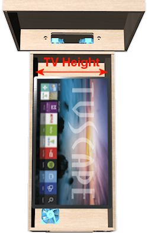

= Selecting a Playfield TV

For most cab builders, the playfield TV is the most important piece of hardware in the system. A pin cab is, after all, fundamentally a video game. The weight of this importance makes it tough to decide on the perfect TV, but it's even more complicated because of the physical constraints of a pin cab, and the special performance demands of video gaming.

I'd love to simplify this by offering a list of Amazon "buy it now" links for the best TVs for the job. Unfortunately, I really can't, because any such list would be out of date by the time you're reading this. TV product life cycles are only about six months these days.

In fact, even "real time" recommendations on the forums can go stale quickly. If you talk to someone who already finished their project, they probably bought their TV at least a few months ago, so their particular model might already be hard to find. Your best bet is usually to share notes with other people who are out shopping right now.

Since I can't give you a list of models to choose from, I'll instead try to offer some advice to help you figure out what to buy. This section attempts to answer the questions that new pin cab builders often have when looking for a TV (and maybe answer some questions you didn't know you should ask).

Note that this chapter is about _selecting_ the playfield TV. We'll get into the details of actually installing it later, in xref:playfieldMounting.adoc[Playfield TV Mounting] .

== Size constraints

Whatever else you look for in a TV, it has to fit your cabinet. Obviously that means it can't be bigger than the available space. Most people want a TV that's as big as possible within that constraint, to minimize any "dead space" not covered by the TV image.

There are two ways to approach this problem of finding the ideal fit:

* Pick a TV that fits your cabinet
* Build a cabinet that fits your TV

Most people go with the first approach, because they've already decided to use the standard dimensions of a real pinball machine. Using standard dimensions is important if you want it to look authentic, since the real machines all come in about the same size and have recognizable proportions. Building to a standard size also lets you use off-the-shelf pinball parts for your cabinet hardware (lockdown bar, side rails, legs, and so on), which is another key part of making it look authentic.

Not everyone feels compelled to use standard dimensions, though. If you're doing your own woodworking, you can tailor the machine's dimensions for a custom fit to any TV of your choosing. This gives you more flexibility in picking out a TV. The tradeoff is that a non-standard size and proportions can harm the illusion that it's a real machine. You'll also need to buy custom parts for some of the cabinet hardware, since off-the-shelf parts are sized to fit the standard cabinet widths and lengths. Custom parts are almost always more expensive than standard parts and can be harder to find.

In either case, whether you're picking a TV to fit your cabinet or sizing your cabinet to fit a TV, the dimensions that matter are the *inside width* of the cabinet and the *exterior height* of the TV. You're going to turn the TV sideways to mimic the layout of a pinball playfield, so the height of the TV has to fit across the width of the cabinet.

Note that the *width* of the TV isn't a constraint in most cases. Normal pinball playfields are considerably more elongated than 16:9 TVs, so any TV that fits into the available cabinet width will easily fit front-to-back, with room to spare.

== Leftover front-to-back space

As mentioned above, a 16:9 TV will fit front-to-back in a normally proportioned cab with room to spare, meaning there will be some extra space that the TV doesn't fill. Assuming you find a TV that's nearly as big as possible for the cabinet width, the extra space will amount to about 6" in a standard body cabinet, and about 7" in a widebody.

Some people are bothered by that leftover space, and some aren't.

Before you decide that it's a problem, consider that you can put the space to good use. If you're using a plunger, it will jut into the front of the cabinet by about 3", which might necessitate moving the TV back that far. You can fill the gap that creates with an "apron", similar to on a real pinball machine, with an instruction card and price sheet. A 3" apron at the front still leaves 3" to 4" at the back. This is an ideal place to put a row of flasher domes, for bright lighting effects during play.

Some new cab builders get very fixated on the idea of covering every available millimeter with video display, and especially hate the idea of any extra space at the front. They insist on having the TV start exactly zero millimeters from the lockbar. I understand this instinct; I had the same thoughts myself when I was first building my cab and discovered the space conflict between plunger and TV. I ultimately decided that the plunger was important enough to justify the space at the front. Once I had everything assembled, I found that it makes absolutely no difference when playing to have the TV set back a few inches. If you think about it, you'll see why: your brain pays attention to the parts of the visual field where the action is taking place, and essentially makes you blind to the rest. It's the same effect as when you're watching a movie: you really don't see the curtains around the screen, you just see what's on the screen. A few inches of "curtains" in the form of an apron won't even register visually during play.

If you're still absolutely certain you can't live with any leftover space front-to-back, there are a couple of options for eliminating it:

* Build your cab to a non-standard size, shortening it from the standard length to eliminate the excess space. This can make the proportions of the finished product look unusual or "wrong" if you're used to seeing the real machines, but that doesn't bother everyone, and some cab builders prefer that to the excess space. A non-standard length also means you can't use a standard pinball glass cover or side rails.
* Use an ultra-wide TV instead of a 16:9 set. A few TVs are available with 21:9 aspect ratios. That's actually even more oblong than standard playfields (which are about 18.7:9), so it goes too far the other direction, but you could tuck some of the extra TV length into the area under the backbox.

This approach has some downsides. For one, it's hard to find ultra-wide TVs in our size range. The format never caught on with consumers, so there aren't very many models available. For another, you might be making things hard on yourself when it comes time to setting up software. Almost everyone uses 16:9 TVs or monitors for playing pinball, so most of the software assumes that layout.

== Picking a TV based on cabinet size

If you're basing your design on a pre-determined cabinet size, you need to pick a TV that fits the cabinet.

TV sizes are always stated in terms of the "diagonal" size, which is the distance between diagonal corners on the display area. However, recall that the relevant dimension for fitting to a pin cab is the TV's *height* . How do you translate between height and diagonal size? You can get a rough approximation using this formula:

stem:[D = 2.04 × (W − 1)]

W:: The inside width of the cabinet in inches (the distance between the inside surfaces of the cabinet side walls)
D:: The nominal diagonal size in inches of the biggest TV that will fit. This formula assumes a ½" bezel all around.

But that's only an approximation, because manufacturers always round the diagonal size up, and because the the size of the bezel varies from model to model. So use the formula as a guideline, not as an exact specification. Shop for TVs with a stated diagonal size within an inch (plus or minus) of the size you get out of the formula. Then check each TV's specifications to get its actual height.

When you're looking at the TV specs, the one to pay attention to is usually called "height without stand". Most flat-screen TVs come with a stand that you can choose to attach or not. In our case, we won't need it, since we're going to lay the TV on its back rather than stand it up on a tabletop.

Applying the formula, we get the following results for the standard cab dimensions:

[cols="1,1,1"]
|===
|Type|Cab inside width|Max. TV size (diagonal)

|Standard body
|20.5"
|39.8"

|Wide body
|23.25"
|45.4"

|===

So if you're building a standard body cab, you should be able to fit most 39" TVs, and possibly a 40" TV, if it has a narrow enough bezel. For a widebody, you can fit about a 45" TV.

== Building a cab around the TV

If you're willing to customize your cab dimensions to fit your TV, you're much less constrained in your TV options. You can go out and find the perfect TV first, then measure it and design your cabinet plans around the TV's dimensions.

I'd recommend adding ¼" to ½" to the exterior height you measure for the TV to get the cabinet inside width. This will give you a little extra room for getting the TV in and out of the cabinet.

Remember that the TV height determines the *inside* width of the cabinet, but most other dependencies are tied to the *outside* width. The width of your lockdown bar, front and back cabinet walls, and glass cover all depend on the outside width. If you're using standard ¾" plywood, the outside width will be 1.5" wider than the inside width.

=== Custom-width cabinet hardware

There are two main pieces of cabinet hardware that depend on the cabinet width: the lockdown bar and the glass cover.

You can buy a custom-made lockdown bar with a tailored width from link:https://www.virtuapin.net/[VirtuaPin] and others. Search for "custom lockdown bar". The prices on these are about twice the price of the standard lock bars, but it will let you create an authentic look for your custom cabinet.

You won't be able to find custom-width playfield glass from pinball vendors, but it should be easy to find locally from any window glass shop. Ask for 3/16" tempered glass. Window glass vendors should be able to cut this to any custom size for you. Alternatively, you can use acrylic (plexiglass), which you can buy in custom sizes from local vendors like link:https://tapplastics.com/[TAP Plastics] .

== Squeezing in a too-big TV

The perennial question that new cab builders ask is: how do I cram in a TV that's slightly too big for my cabinet design?

Part of the reason this comes up so often is that you can't buy a TV in just any size. You can only buy a size they actually sell. It's unlikely that you'll find a TV for sale that's a perfect fit to any standard cabinet plans. So you have two options: (a) you can pick a TV that's slightly smaller than the ideal, which (being smaller) will easily fit, but which (being smaller) will leave an unsightly gap around the edges. Or (b) you can pick a TV that's slightly bigger than ideal, and find some "hack" to make it fit.

The other part of why this comes up so often is that most new cab builders hate option (a) and believe they won't be happy unless they find a way to cram in a too-big TV.

My advice is to suppress your knee-jerk reaction to option (a). When we were considering the related problem of the leftover front-to-back space earlier, I mentioned that you won't really notice the space while playing, because your brain tends to focus so much on the action and ignore the periphery. Well, the same thing applies to leftover space side-to-side. Despite what your instincts might tell you, it really won't make much of a difference during play if you leave a little blank space on each side of the screen. In fact, if you look closely at real pinball machines, you'll observe that they give up about half an inch on each side of the playfield for wood rails around the perimeter.

What you gain by going with the "next notch down" option is an easy fit, a simpler design, and the ability to maintain easy access to the cabinet interior after the TV is installed. I consider these to be important features.

Okay, I tried. I know some people just can't be convinced of this. So what if you have your heart set on a TV that's a little too big? Is there any way you can squeeze it in without redesigning the whole cab? Yes, there are some options.

=== De-case it

One approach is to "de-case" the TV - remove the outer plastic case and just use the internal LCD panel.

A few years ago, this was practically a standard practice among cab builders. At the time, the plastic cases were quite a lot larger than the panels inside, so the only way to get a reasonable fit was to take the cases off.

Times have changed, though, and most cab builders now leave their TVs intact. There are two main reasons for this. The first is that cases have shrunk to the point where they're practically no bigger than the panels inside, so de-casing doesn't offer a meaningful size reduction. The other is that many newer TVs simply can't be de-cased without damage. The way manufacturers have managed to make modern cases so svelte is that they've removed the internal supports that made older models bulkier. That means the cases themselves now have to serve as exoskeletons that hold everything together. There's a big risk of cracking the delicate glass panel that holds the LCD elements if you remove the structural support provided by the case.

I'd advise against de-casing for any newer set. If you want to attempt it despite the risk, I'd try to get advice first from someone who's disassembled the same model. The pin cab community is small enough that you probably won't find anyone there, so you might try casting a wider net. For example, perhaps look for someone who's successfully repaired the type of TV you have.

=== Route grooves for the TV

Another way to make a slightly-too-big TV fit is to make the cabinet a little wider on the inside, but only where the TV goes, by routing out grooves in the side walls wide enough for the TV. Here's how this might look:

image::images/RoutedTVGrooves.png[""]

I'm not a big fan of this approach for two reasons. First, it weakens the side walls. Second, it makes it much more difficult to remove the TV if you want to access the inside of the cabinet for repairs or upgrades. I see easy access to the interior as a top priority. If you use routed grooves, you'd have to remove either the front wall or the back wall of the cabinet to take out the TV, and to do that you'd have to take off the legs. That's enough to make me rule out this approach if it were my own cab.

A similar alternative is to route out grooves like this all the way to the top of the side walls. That would at least let you remove the TV from the top, but it would weaken the walls even more than simple grooves.

Despite my strong reservations, routed grooves like this are fairly popular among cab builders. But the tradeoffs are too onerous for me to recommend this approach.

=== Use thinner plywood

Rather than routing grooves, you could simply use thinner plywood for the walls. That would increase the inside width without changing the exterior dimensions. You'd still be able to use off-the-shelf hardware (like the lockbar), since that's all sized according to the exterior width.

One downside of this approach is that the cabinet would obviously be a little less sturdy. But that's probably okay for home use, since your cab won't have to stand up to the punishment a public arcade machine receives. The other downside, probably more important, is that flipper buttons and some other parts are sized for the plywood width, so you'll have some ill-fitting parts to deal with.

Also, keep in mind that you'll have to make adjustments to the carpentry if your plans call for miter joints or the like. Joint dimensions will depend on the plywood width.

== TV features and performance

So far, we've been focused exclusively on picking the right size of TV. But that's hardly the only criterion. You also want a TV that displays a good image, and one that works well for games, which have somewhat different characteristics from ordinary video sources.

Let's look at some of the specific features to consider, and the performance metrics you should pay attention to.

=== 1080p vs 4K vs 8K

1080p HD TVs were the standard for pin cab playfields for a long time, largely because that was the highest resolution we could get in this size range. Starting around 2017, though, the industry starting moving towards the "Ultra HD" standard, also known as "4K". And in mid 2019, an even newer generation known as "8K" has started to become available.

The difference between 1080p, 4K, and 8K is pixel resolution. In other words, the pixels on 4K sets are smaller than on 1080p sets, and the pixels on 8K sets are smaller still. A 4K set has four times the number of pixels per unit area as 1080p, and 8K has four times the pixels per unit area as 4K. The smaller the pixels are, the harder it is for the eye to discern individual pixels; smaller pixels blend together better to make a more realistic image.

Higher pixel resolution comes at a cost in performance, though (in addition to the higher dollar cost). More pixels means more work for the PC. The PC has to fill in every pixel on the display on every video frame, so the larger number of pixels means the PC has to do more computation on every frame. If you use a 4K TV, you'll need a more powerful CPU and graphics card to keep up with the higher computational load. So if you want to use 4K, you'll need a more powerful and thus more expensive computer rig. 8K likewise requires a more powerful computer than 4K.

====  Recommendations

If I were building a new cab right now, I'd go with 4K for the playfield TV. It's well supported by the operating system and pinball software, and the price premium for a 4K TV over a 1080p TV isn't that large. You will have to spend more for a 4K-capable video card, but even that is entering the mainstream, and enough options are available that the price doesn't have to go into the stratosphere.

I wouldn't go as far as 8K right now, though. It's much more expensive than 4K right now, and I'm skeptical that it will even make much of a visible difference in a pin cab application, since at this viewing distance, 4K is already approaching the limits of the human retina's ability to resolve pixels. (Although I'm sure some people will be able to see the difference.)

Finally, on the off chance you come across a 720p set, skip it. 720p used to be common in this size range; it's almost extinct at these sizes now, but you might still see a few on sale. They're cheap, but they're really not suitable for the playfield. 720p simply isn't adequate resolution for the viewing distance of a playfield TV. (720p _is_ generally just fine for a backglass TV, though. That's a smaller TV at a greater distance, and the graphics it displays aren't as demanding.)

=== LCD, LED, QLED, OLED

There are currently two main display technologies available: LCD and OLED. There's also an older flat-panel technology called plasma that's not currently being manufactured, but you might still see used sets or remainders available. Here's a brief overview of each panel type.

*LCD:* This is currently the most common display type. An LCD panel uses liquid crystal pixels that can range between (almost) opaque and (almost) transparent. A backlight is placed behind these pixels. When the liquid crystal turns opaque, it looks black (or at least dark gray) because it's blocking the light from the backlight. When it turns transparent, it looks white because it lets (most of) the light from backlight through.

*LED:* This is really the same thing as an LCD TV, but it uses an LED-based backlight instead of the fluorescent backlights used on older LCD TVs. "LED" is a marketing term that the manufacturers use as an intentional bit of misdirection, because they know that consumers think of LCDs as an older, boring technology. But an LED TV actually is an LCD TV by a different name.

*QLED:* This is yet another marketing term for an LCD TV. In this case, it's an LCD panel with a special type of LED backlight called a QLED or quantum-dot LED. Quantum sounds even more cutting-edge than LED, doesn't it?

All of these LCD TV types, whether the manufacturers call them LCD, LED, or QLED, are fundamentally the same backlight-and-shutter design. The fundamental weakness shared by all LCD panels is that the shutters can't turn 100% opaque, so they can't display true blacks, just varying shades of dark gray. Some panels are better at this than others, and it's one of the big quality differentiators among LCD models. LCD panels also have inherent limits on viewing angle because of the way light has to be funneled through the shutters. Again, some models are better at this than others.

The backlight type does make some difference. LED backlights generally produce better color fidelity than fluorescent tubes did, and they use less power and run cooler. All of that is great for a pin cab, so if you're considering an LCD TV, I'd definitely give priority to the LED models. But you'll hardly have to even think about that since practically all of the TVs in this size use LED backlights. QLED backlights supposedly have even better color fidelity than regular LEDs, according to the manufacturer's claims, but I haven't seen any independent testing confirming this.

*OLED:* This is a truly is a different display type, not just a variation on the LCD. An OLED panel is an array of small "organic LED" pixels, each of which can be turned on or off individually. There's no backlight, since the OLED pixels emit their own light directly. ("Organic" doesn't mean that they grow them without antibiotics and pesticides, but rather refers to the chemical components making up the emitter.)

On paper, OLED has big advantages over LCD. Producing light at the pixels rather than blocking light with a shutter allows for true blacks, which makes for higher contrast and better-looking images. Emitting light directly at the display surface (rather than blocking light from a backlight) allows for unlimited viewing angle. However, OLED is still a relatively immature technology, and reviews of current models are mixed. There are several potential drawbacks. The first is brightness: current OLED models are only about half as bright as LED-backlit LCDs. The second is display lag. Console gamers have reported substantial lag in many available OLED sets. A third is "burn in", where pixels get "stuck" if a static picture (like a pinball playfield!) stays on the screen for too long at a time. Early OLED models also had problems with pixel lifetime, which was particularly problematic in that the color components in the pixel can degrade over time at different rates, causing the color balance to change as the panel ages. Newer OLED panels will probably have better longevity and color stability, but I'm not sure the problem has been completely solved yet. In any case, don't dismiss OLED because of these concerns. These are just things you should dig into when you're researching models. These concerns might disappear entirely over the next few model years as the technology matures.

*Plasma:* There used to be yet another display technology known as plasma. These used gases trapped in tiny glass cells to generate light. As in an OLED, the individual pixels emitted light (rather than blocking light like in an LCD), so plasmas had many of the same virtues as OLEDs. But they were never as popular with consumers as LCDs, and never as cheap to manufacture, so the electronics companies eventually all stopped making them (the last ones were built around 2015). Plasmas generally had excellent picture quality, but they had a couple of drawbacks for virtual pin cab use. For one, they generated a lot of heat; for another, their glass panels were fragile and not meant to support their own weight when laid on their backs, as we need to do in a pin cab. I'd avoid them for pin cabs as a result. But it's really moot now given that you can't buy them anyway.

*Recommendations:* Most of your options in our size range will be LED-backlit LCD TVs. Fortunately, that also happens to be an excellent choice for our needs. It's a mature technology that the TV manufacturers have gotten very good at building, so many excellent TVs in our size range are available.

I'd also consider OLED if you can find a suitable model. I think OLED will eventually be a superior option, because the light-emitting pixels are inherently superior to the shutter-based LCD design for producing high contrast and for wide viewing angle. However, there aren't many OLED models available yet, so your options will be limited. They're also more expensive, and the technology might not be mature enough yet to be an ideal fit for gaming. Be sure to look carefully at the concerns mentioned above relating to OLED, particularly display lag and image retention. If you find an OLED you like, do some research on the Web to see if any console gamers have experience with it, since console gaming places the same demands on a TV as virtual pinball.

=== Flat vs. curved screens

It almost goes without saying, but a pinball playfield is best simulated with a flat-screen display.

This is generally an easy requirement to fill with current TVs, since most LCD and OLED models have perfectly flat screens. But some models are now available with a convex curvature across the width of the panel. This is supposed to give you a wrap-around effect like in a large-format movie theater. Some people like the effect, others see it as little more than a sales gimmick. Whatever your feelings about it for a living room TV, though, I'd recommend against it for a virtual pinball playfield TV. A playfield TV is oriented in portrait mode, which defeats the purpose any wrap-around effect. The curvature will only serve to distort the geometry of the image.

[#tvInputLag]
=== Input lag

One of the really important differences between video gaming and regular TV viewing is that gaming is interactive. The animation on the screen responds to actions you take in the game. This exposes an element of TV performance that's not noticeable in normal passive viewing: "input lag". This is the amount of time that passes between the TV receiving the electronic signal for a video frame, and the video frame actually appearing optically on the display panel.

Input lag is important (in a bad way) to video gaming because it creates a time gap between when you press a button and when the resulting action appears on screen. If the time gap is long enough for you to perceive, it makes the gaming action feel leaden and unresponsive. You want the flipper to flip the instant you press the button, not a couple of seconds later after the ball has already rolled off the end!

Don't confuse input lag with "refresh rate", "response time", or "pixel cycle time". The refresh rate refers to how many times per second the TV draws a video frame. The response time or pixel cycle time refers to how quickly a physical pixel can change color. These times are important in their own right, because they affect how smooth motion looks on the display. But they're entirely different things unrelated to input lag.

====  Where to find input lag numbers

I've never seen a manufacturer list input lag in their spec sheets, so you have to dig a bit to find information on it.Manufacturers do often quote pixel cycle times, response times, and/or refresh times, but remember that input lag isn't in any way related to those.

Your best bet for finding concrete data on input lag is console gaming Web sites, since console gamers use regular TVs like we do.One good site is link:https://displaylag.com/[displaylag.com] . They measure input lag with special equipment and post the numbers on their site.They have a large database of current models that they update regularly.

[#inputLagLimits]
====  What's an acceptable input lag?

Short answer: 40ms or less.

You don't need a TV with zero input lag, and it's impossible to find such a thing anyway.As long as the actual lag time is below a certain threshold, you won't be able to perceive any lag time at all, so anything below that threshold might as well be zero.

Human time perception varies according to context, but for video gaming, the main thing that matters is action/reaction timing.An action/reaction sequence is something like this: You push a button.A light appears on screen.Did the light appear exactly when you pushed the button, slightly before, or slightly after?When researchers do this experiment, they find that time gaps of up to about 50ms are perceived as exactly simultaneous.In other words, humans can't tell the difference between truly simultaneous and about a 50ms delay.It's not a matter of how smart you are or how closely you're paying attention; it's simply a fact of human nervous system physiology.Our neurons can only move signals so quickly, and as a result our brains perceive events that are very close together in time as though they were perfectly simultaneous.

This doesn't mean a TV with a 50ms input lag time is automatically good enough.You don't perceive the TV's lag time in isolation, but rather in combination with all of the other sources of latency in the overall system: delays from the key encoder device, the USB connection, the Windows video drivers, the pinball software itself.The latency from these other components varies, but in a well-tuned system it might add up to around 10 to 20ms.So that leaves us with 30 to 40ms to work with for the TV.

====  What causes input lag?

Input lag is caused by the internal digital processing that the TV does to the image before realizing it on the display. Most of this is processing that enhances the picture in some way: resolution up-scaling, frame interpolation, sharpness enhancement, noise reduction, motion smoothing. Modern TVs all do these enhancements digitally, by putting the pixels into a memory buffer inside the TV and running some software algorithms over the pixels. The software processing takes time, just like on a PC, and that processing time is what causes the lag.

Note that input lag has nothing to do with the physical pixels, so you can't guess anything about input lag based on what type of panel technology the TV uses. LCD, LED, OLED, plasma - none of those are inherently faster or slower in terms of input lag. It's purely a function of the digital image processing going on inside the TV.

====  How can you minimize input lag?

The best way to minimize input lag is to buy a TV with low input lag. You can't generally find this information on manufacturer spec sheets, but you can check gamer Web sites like link:https://displaylag.com/[displaylag.com] . As described xref:inputLagLimits[above] , you don't need a TV with zero input lag (such a thing doesn't exist), you just need a TV with input lag low enough to be imperceptible. I'd use a threshold of 30ms to 40ms, and rule out sets with much higher lag times.

Definitely stay away from sets with unusually high lag times. Some TVs currently on the market have lag times above 100ms, which will be maddeningly obvious during game play.

Even if your TV has great lag time numbers on paper, you'll still need to adjust its menu settings to get the best performance out of it. Even the fastest TVs can have bad lag times when all of their picture enhancement modes are enabled, and all of those modes are usually enabled by default when you first take your new TV out of the box. Every TV has its own menu settings that affect lag in different ways, so you might need to do a little Web research or experimentation, but here are a couple of rules of thumb applicable to most TVs:

* Turn on "Game Mode". Most TVs have a few master modes you can select from, with names like Movie, Pro, Vivid. One of these is usually a Game mode. If your set has such a mode, select it. In most cases, the main purpose of this mode is to minimize input lag, so it's the easiest way to go straight to the right settings on most sets.
* Turn off all picture and motion enhancement features: sharpness, noise reduction, high frame rates (120Hz or 240Hz, for example), and especially anything related to motion smoothing. Motion smoothing is the worst offender because it usually involves buffering up several frames for interpolation purposes, which deliberately delays the display by that many frames.

====  Effect of connector types on lag

In some cases, you might see different lag times with different connector types. Most newer TVs use HDMI connectors exclusively, so you might not have any other options. But if your TV has a mix of connector types (HDMI, DVI-D, DP), and you can't eliminate lag via mode settings, you might try different connector types to see if one type is better than the others.

There's nothing inherently good or bad about any of the connector types that affects input lag, so don't look for a rule like "DVI-D is fastest". Any such claims you see on the Web would only apply to a particular TV model, if they're even true. The only reason connectors would have any effect is that the internal electronics in some TVs have a faster path for some connectors than others.

=== Picture quality

This is probably the easiest metric to find opinions on, since everyone buying a TV for any use cares about it. You can simply look at user reviews on Web stores that sell the TV to get an idea of what people think of different models. For professional reviews, you can check Web sites and magazines that specialize in consumer electronics.

Basic video picture quality is generally excellent for most newer TVs, so user reviews are more useful for ruling out the occasional problem model than for distinguishing among the best models.

=== Viewing angle

image::images/ViewingAngleDiagram.png[""]
Some types of displays produce a better image when viewed head-on than when viewed at an angle. LCD panels tend to have this property. Viewing from a steep angle can make the picture look dimmer, washed out, or uneven.

The position of the playfield TV is in a full-sized cabinet creates an off-axis viewing angle of about 50° to 60°, depending on the height of the player, so it's important to find a TV that maintains its image quality when viewed from that kind of angle.

Unfortunately, the manufacturer claims for viewing angles in the specifications aren't usually helpful, because they only tell you the range where you can see any image at all. In fact, they usually quote the viewing angle as 180°, which is just the maximum for viewing a planar surface. We're really interested in the range of angles where the picture quality holds up without significant loss of brightness or uniformity. The best way to check is to look at the set in person and specifically try viewing it from about 60° off axis.

If you can't check your candidate models in person, you can at least check user reviews for any red flags about viewing angle. Viewing angles are generally excellent in newer 1080p and 4K LCD panels, and people have come to expect this, so other buyers will probably have noticed if a model has any problems with this.

Note that viewing angle is almost never an issue with OLED or plasma displays. These technologies have their light emitters located directly at the surface of the display, which makes them viewable from any angle.

=== Motion artifacts

Some TVs are better than others at displaying moving objects realistically. Pinball simulation obviously involves a bunch of rapidly moving objects, so motion rendering is an important element of the overall picture quality in a pin cab TV.

When a TV doesn't handle motion well, you'll perceive effects known as motion artifacts:

* Blur (a moving object looks fuzzy)
* Ghosting (a moving object looks washed out or partially transparent)
* Jitter or judder (objects jerk or vibrate rather than moving smoothly)

It's commonly understood that the "pixel refresh time", also known as "response time", tells you how well a TV renders motion. Yes and no; the refresh rate is important, but it doesn't tell the whole story. Don't get too attached to the idea that you can just look for a TV with the fastest pixel update speed and call it a day. One problem is that there's no standard way to measure these values, so manufacturers can pick whatever measurement is the most favorable; this makes it fairly meaningless to compare the numbers for different models. The other issue is that the apparent smoothness of motion depends on other factors besides the pixel response time. It's more complex than that because motion perception happens in the human visual system, not in the TV. Motion artifacts like those listed above are caused by the interactions between your visual system and the display technology. Faster refresh rates generally reduce these artifacts, but other factors contribute to the artifacts as well, so refresh rate isn't a perfect proxy for motion rendering quality.

The best way to determine a TV's motion handling is (as always) to view it in person with suitable content. If possible, watch the TV in action playing a pinball video game, or some other video game with small moving objects against a fixed background. If that's not possible, try ESPN - sports tend to have a lot of motion of the right sort.

If you can't check the TV in person and you can't find another pin cab builder using the same TV, try user reviews on Web stores. Motion rendering is important to regular TV viewers, especially sports fans, so you should at least be able to check for complaints about particular motion artifacts or problems.

=== Image retention

Some TVs suffer from a problem known as image retention, or "pixel burn-in", where pixels get "stuck" if you leave a static image on the screen for too long. This leaves a sort of ghost image stuck on the screen. This was a major problem in the ancient days of CRTs. This is, in fact, why they invented "screen saver" programs. The job of the screen saver is to keep varying the image displayed so that no one pixel will ever be held on at the same color for long periods.

Image retention has always been a concern for gamers because many video games have portions of the image that are fairly static for long periods. For example, console games often have score displays and on-screen controls that are always in the same place. Pinball is even worse in that most of the playfield just sits there motionless most of the time.

Fortunately, image retention is practically non-existent for LCD panels. If you're considering an LCD TV (whatever the backlight type - LED, QLED, fluorescent), you'll probably be immune from any concerns about pixel burn-in.

OLED sets are a different matter. Some OLED TVs are reportedly affected by image retention. If you're looking at an OLED model, look for reviews from console gamers to see if anyone has had problems with image retention on that model.

