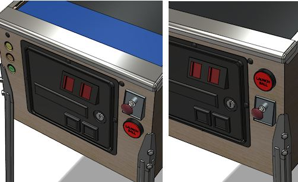
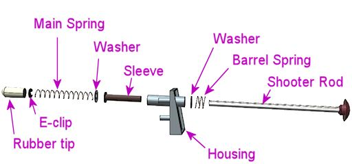

[#plunger]
= Plunger

The plunger is certainly one of the defining features of pinball. It's as iconic as the flippers and steel balls. It's also one of the trickier parts of building a virtual cab. Plungers obviously aren't standard input devices for PCs, like keyboards and mice. There really isn't anything in the standard set of PC input devices that's at all equivalent. If you want a plunger for your cab, you need specialized hardware, purpose-built for the job.

Happily for us cab builders, such specialized hardware exists. There are a couple of commercial options available, and the Pinscape software offers multiple sensor options that you can build yourself.

In this chapter, we'll look at the plunger hardware options available, and some of the issues involved in planning and installing them. The good news is that there are lots of good options if you want a plunger, but all of them require some planning work.

== Plunger or Launch button?

The first decision you should make about plungers is whether you want one at all. Most real pinball machines have plungers, but a plunger isn't an absolute necessity for a virtual cab. A simple Launch Ball button is adequate - although a compromise, because it doesn't give you the same degree of control as a physical plunger.

There are really three configurations to choose from:

* Plunger _and_ launch button. The most popular option among pin cab builders. Lets you choose the best type of control for each game.
* Launch button only. Simpler and cheaper, but sacrifices the control of a real plunger for skill shots.
* Plunger only. This is an option if you're using Pinscape or a Zeb's Boards plunger, because these devices can do double duty as virtual Launch buttons when needed.

=== Option 1: Plunger _and_ Launch button

image::images/PlungerAndLaunchButton.png[""]
I haven't done a scientific survey of cab builders, but I think the most common answer to "plunger or launch button?" is "both". With the plunger in the standard position, there's room directly below it for a Launch button, at least in a full-sized cab.

Some cab builders flip this arrangement upside down, with the Launch Button in the normal plunger location and the plunger located below it. I don't personally like the appearance of that; it always looks to me like the plunger got installed in the wrong spot. If part of your motivation for installing a plunger is a more realistic look, this works against that purpose. Aesthetics aside, though, there are some pragmatic advantages to the inverted arrangement. One is that it's arguably more ergonomic: the plunger-on-top arrangement makes the Launch Ball button a little inconvenient to reach, since the plunger sticks out enough to be in the way. The other is that it gets the plunger out of the plane of the TV, which makes it possible to position the TV all the way forward against the front wall of the cab. If you were going to move the plunger down from its normal spot anyway to accommodate a TV, this arrangement can at least get some extra mileage out of that.

=== Option 2: Launch button only

Some pin cab builders choose to forego a plunger entirely and just use a Launch Ball button. This is a perfectly viable option functionally, because all of the PC pinball programs let you operate the on-screen plunger via the keyboard. And it doesn't make your machine look unrealistic, since a number of popular real arcade pinball machines also used button launchers.

If you're accustomed to playing pinball on your desktop PC, you already know how button-based plunging works. The convention on most desktop pinball games is that you press and hold the Enter key to start pulling back the plunger. As long as you hold down the Enter key, the plunger keeps retracting at steady pace. As soon as you release the Enter key, the game fires the plunger from however far back it was at the the moment of release. You control the strength of the launch by timing the release. To make this work with a pin cab, you just wire the Launch Ball button to act like the Enter key.

This time-based plunger action is a compromise for playability, obviously. It doesn't give you the same control you'd have with a physical plunger, and it's not a very good translation of the mechanics of a real plunger. But it at least serves the function, letting you make do with just a button if that's your preference.

=== Option 3: Plunger only

If you use a Pinscape Controller plunger or one of the plunger kits from link:https://www.zebsboards.com/[Zeb's Boards] , it can serve double duty as a Launch Ball button for tables that don't have conventional plungers, such as _Medieval Madness_ or _Terminator 2: Judgment Day_ . This makes it possible to play every type of game using just the plunger, so that you don't have to install a separate Launch button.

If you're using another plunger device, you should stick with the "plunger and Launch button" option. The ability to simulate the launch button is a feature of the plunger device, and other devices besides Pinscape and Zeb's don't generally have this ability.

If you're building a Pinscape Controller plunger, see xref:zblaunch.adoc#zbLaunchBallZB Launch Ball] for details on how to set this up. If you're using a Zeb's Boards unit, consult the owner's manual for the device.

=== Which option is best for you?

The only reasons I'd consider _not_ including a plunger in your cab is if you're on a very tight budget, or you want to keep the project very simple. A plunger has such strong advantages that I'd only decide against one because of some external constraint like that. In terms of functionality and aesthetics, I think there's no contest.

If you do decide on a plunger, I personally think it's best to include a Launch button as well, so that you can use the control type that exact fits each game. But if your plunger can simulate a Launch button (as Pinscape and Zeb's Boards plungers can), this is only a slight edge functionally. You can choose according to whether you think more buttons will make your cab look cooler or make it look cheesier.

Why do I give the plunger such high priority? There are two main reasons. The first is aesthetics: a plunger makes your pin cab look more like a real pinball machine. The plunger is practically a defining feature of pinball, so its presence will instantly convey to anyone looking at your cab that it's a pinball machine. Yes, there are some real arcade pinballs that use launch buttons or gun triggers or something else in place of a plunger, but to some extent they do that to stand out from the crowd. With pin cabs the challenge is to make them stand out less from the real machines than they already do by virtue of their virtual-ness.

The second reason is that plungers are actually useful for game play. If you're not an experienced pinball player, plungers might seem pretty binary: you pull it back and let it go. But if you've played more seriously, you know about the venerable tradition of the _skill shot_ , an element of many tables where you can score a bonus by launching the ball with just the right speed or timing. That requires precise control. A good virtual plunger can give you that control; a button just can't. The extra control adds to the fun for games with skill shots.

To summarize, here are the advantages of each option:

[cols="1,1"]
|===
|Plunger|Launch Button

|Realistic
|Simple

|Skill shots
|Cheap

|Classic look
|Modern look

|===

== Choosing a plunger device

This can be a tough decision. There are several options available, with different tradeoffs. Let's look at what's available and the relative advantages of each option. We'll start with a quick comparison chart for easy reference, then go into the details on each of the options.

The prices shown are only estimates, and of course they're likely to change over time, as prices tend to do! For the DIY options, the estimates are even more approximate, since there are different ways you can build the projects. For example, many of the DIY plans include custom 3D-printed parts. If you have your own 3D printer at home, you can fabricate those for the cost of the filament, which might only be a few dollars; but the same parts might cost $10 or $15 if you have to order them from a commercial 3D print service. And for that matter, you can sometimes make do without the 3D-printed parts, by substituting something improvised. To be conservative, though, my estimates assume that you're using the recommended 3D-printed parts and ordering them through a commercial print service.

Also note that the Pinscape options all require a KL25Z microcontroller board to run the Pinscape software. I didn't include the price of the KL25Z in the price estimates, since I'm assuming that you're already pricing that into your system for its other features. A single KL25Z can handle the plunger along with all of the other Pinscape functions, so you just need the one. If you _weren't_ already planning to include a KL25Z in your system anyway, you should add $15 for the KL25Z to the price estimates for the Pinscape plunger options.

[cols="1,1,1,1,1,1"]
|===
|Device|Type|Price (est.)|Degree of difficulty|Accuracy|Features

|VirtuaPin plunger kit
|Commercial
|$160
|Easiest
|Not tested
|15 buttons, accelerometer

|Zeb's Boards plunger kit
|Commercial
|$150
|Easiest
|Not tested, est. Very Good (<1mm)
|19 buttons, accelerometer

|Pinscape potentiometer
|Open source
|$20
|Medium Low
|Very Good (<1mm)
|All Pinscape features

|Pinscape with Oak Micros potentiometer
|Open source
|$25
|Low
|Very Good (<1mm)
|All Pinscape features

|Pinscape TCD1103
|Open source
|$50
|High
|Excellent (0.1mm)
|All Pinscape features

|Pinscape AEDR-8300
|Open source
|$30
|High
|Excellent (0.1mm)
|All Pinscape features

|Pinscape VCNL4010
|Open source
|$10
|Low
|Good (1mm)
|All Pinscape features

|Pinscape VL6180X
|Open source
|$20
|Medium
|Low (1cm)
|All Pinscape features

|Pinscape TSL1410R
|Open source
|N/A
|Medium High
|Very good (0.25mm)
|All Pinscape features

|===

("Not tested" means that I don't have any hands-on experience with that device, so I can't say how well it works compared to the options that I've tried in person.)

*Top picks:* I've tried to provide all of the details to let you make a fully informed decision yourself, but if you want my summary opinion, here are my top picks according to what you consider the most important priority:

* If you want it super easy: the Zeb's Boards kit
* If you want it super cheap: Pinscape with potentiometer or VCNL4010
* If you want the Pinscape features, with fairly easy setup: Pinscape potentiometer, VCNL4010
* If you want the best performance, and you're up for a more challenging build: Pinscape AEDR-8300 or TCD1103

Now let's look at the available options in depth.

*Commercial options:* The two available commercial options that I'm aware of are from link:https://virtuapin.net/[VirtuaPin] and link:https://zebsboards.com/[Zeb's Boards] . You might also see an old product called the Nanotech Mot-Ion Adapter mentioned in the forums, but that was discontinued years ago and is no longer available for purchase.

* VirtuaPin's product uses an IR proximity sensor to detect the plunger position. That's a nice design in principle because it's physically simple and reliable, but when I tested their version 2 product years ago, I found that it was too low-res for my needs. Their version 3 product (current as of 2021) uses a different sensor that has better native performance, but I haven't tested their implementation. The v2 sensor resolution was the only problem I had with this product, though; otherwise it's a solid offering, well packaged and easy to set up. It includes a button encoder that lets you connect about 15 cabinet buttons, and an accelerometer for analog nudge input. It's not expandable, though, and 15 buttons is a bit limiting for a decked-out pin cab.
* The Zeb's Boards plungers use slide potentiometers as sensors. I haven't tested any of Zeb's plunger products myself, but I consider the basic physical sensor type sound because the same sensor type works well with the Pinscape software. The Zeb's Boards products include button input connections and accelerometer nudging features similar to the VirtuaPin product. Zeb's has an excellent reputation for technical support.

The big advantage of the commercial products, and it really is a big advantage, is ease of setup. They both come as complete packages, with all necessary parts included, and installation is simple for both. They also come with official technical support from the vendors (with a personal touch, too, since both are small businesses; you won't have to talk to an outsourced tech support call center).

The downside of the pre-packaged products is that they're closed systems with somewhat limited feature sets. Not overly limited - they both have good coverage of the basic pin cab necessities. But the cost of keeping things simple is that they don't offer much configurability or flexibility to expand beyond their fixed features. And of course the software is proprietary, so there's no way to add features or fix bugs yourself; you have to rely on the vendors for bug fixes and feature upgrades.

*Pinscape options:* Pinscape is a semi-DIY option. "Semi" in that you have to buy all the parts and do all of the physical setup work yourself, but you don't have to figure everything out from scratch, and you don't have to write any of the software. This build guide has plans that you can follow for a number of plunger sensor options, including parts lists and assembly instructions, so while it's not as easy as ordering a finished product and plugging it in, it's also not a research project. And of course all of the software is already written. If a research project is what you're looking for, though, this can be a good starting point. It's all open-source, so you're free to modify the sensor designs and software if there are things about them you want to improve.

All of the Pinscape options naturally require the Pinscape software running on a KL25Z, so you should factor the cost of the KL25Z (about $15) into the overall price if you weren't already planning on a Pinscape device anyway. (If you were, you won't need a separate KL25Z for the plunger - a single KL25Z can handle all of the Pinscape functions simultaneously.)

The Pinscape software has built-in support for the following sensor types:

* Potentiometer: A potentiometer is a variable resistor, in this case one with a sliding lever that smoothly varies the electrical resistance level as you move it from one end to the other. They make these primarily for audio mixing panels and similar control panels, but they also work well for plunger position sensing, since the plunger slides back and forth in a straight line. The plunger travel range is about 80mm long, so we need a sliding potentiometer with a slightly longer travel than this. Suitable pots around 100mm long are easy to find.

The performance of these sensors is pretty good. In my testing, you get accuracy of about 1mm, which is good enough for smooth on-screen animation and tracking. The only negative is that the analog nature of the device means that there can be some random noise in the signal, which shows up on-screen as "jitter". It's pretty minor, and the Pinscape software has a filtering option to reduce it, with some trade-off in accuracy.

Pots are the least expensive type of plunger sensor, since the only required part (other than KL25Z) is the potentiometer, which runs about $6 at Mouser. If you want to keep it really cheap, you can improvise your own mounting apparatus out of plywood and generic fasteners (L-brackets or that sort of thing). If you want to make it a little tidier (at slightly higher cost), the plans in this guide include a 3D-printable mounting bracket that you can fabricate.

* Oak Micros's potentiometer (no longer available): This works the same as the DIY potentiometer above, but it comes with an easy-to-install mounting bracket and saves you the work of sourcing the parts and assembling and wiring everything. I don't think this is available any longer, because Oak Micros announced in June 2021 that they're no longer shipping any of their products. You can check the original announcement on vpforums to see if there are any updates:

link:https://www.vpforums.org/index.php?showtopic=44795.html[Announcement: Oak Micros Plunger Kit Mk II]

* VCNL4010: An IR proximity sensor that can measure the distance to a nearby object, such as the end of the plunger. For a Pinscape setup, you mount the sensor near the end of the plunger, so that it can measure the distance between itself and the plunger; that serves as a measurement of the plunger's current position. This sensor is cheap (about $7.50) and easy to set up (maybe even easier than the potentiometer), and it's completely non-contact (no wear and tear from moving parts). Its performance isn't quite as good as some of the other options (the potentiometer, AEDR-8300, and TCD1103 are all more precise), but it's still pretty good. Given its low price and easy installation, it's worth considering.
* TCD1103: This is an optical imaging sensor that detects the plunger position by rapidly taking pictures of the plunger. The TCD1103 chip is a high-resolution CCD (a type of camera sensor) that produces great quality images, which makes for excellent performance in the position sensing. It's capable of reading the plunger position to better than 1/300", with great stability, which makes for a very smooth on-screen response. The downsides of this sensor are that it's complex to build, and fairly expensive. It requires some additional electronics to interface to the KL25Z, as well as a small lens to focus the plunger image onto the sensor. I've designed a printed circuit board and 3D-printable mounting bracket (both open-source, of course) to bring it all together, so it's fairly straightforward to assemble one of these systems using my plans. However, there are enough parts involved that it does take a little online shopping work to source everything - plus, the printed circuit board uses SMD (surface-mount) components, which can make the soldering job intimidating if you haven't worked with these before. But I really like this sensor for its excellent performance and the fact that it has no mechanical contact with the plunger (so there are no moving parts to wear out). See xref:tcd1103.adoc#tcd1103[Plunger Setup (TCD1103)] .

This is a fairly expensive option. The sensor chip all by itself costs about $15 at Mouser, and you'll also need a lens (around $8), lens holder (about $1), circuit board ($6-$15), a 3D-printable mounting bracket (around $10 if you have to order it from a commercial 3D print service), and a few other electronic parts ($5), for a total around $50.

* AEDR-8300: This is a specialized IC chip known as a "quadrature encoder", which uses optics to detect motion across a pattern of uniformly spaced, alternating black and white bars. The sensor tracks motion by counting the bars it passes. The bars are closely spaced, 75 line pairs per inch, and the sensor can determine its position to half the width of a bar, so the position reading is accurate to 1/300". This is an excellent sensor in terms of accuracy and stability; when set up properly, it really does achieve that 1/300" accuracy, which makes for silky smooth animation and tracking in the on-screen plunger. The big downside is that it's rather complex to set up, both because it requires a bunch of specialized (but easily fabricated) parts, and because the AEDR-8300 chip itself is a tiny SMD (surface-mount) chip that can be intimidating to work with if you haven't done SMD soldering work before. See xref:aedr8300.adoc#aedr8300[Plunger Setup (AEDR-8300 Encoder)] .

This option requires a custom circuit board ($5), the electronics for it ($10), a laser-cut acrylic piece (about $1, although it's only practical to order in quantities of about a dozen), and a 3D-printable bracket ($15), which adds up to about $30 in parts.

* VL6180X: This is a "time-of-flight" IR distance sensor, which means that it measures the distance between the sensor and a nearby object by measuring the amount of time it takes for a pulse of light to reflect off of the object and return to the detector. For use with a plunger, you position the sensor at the end of a tube that you place around the plunger, with the sensor pointing at the plunger tip to measure the distance to the tip. The software works out the plunger position using the distance reading, knowing that the sensor is always at the same fixed position. These are relatively cheap and very easy to set up, since you can buy pre-built boards featuring these sensors from several hobby-electronics companies. Unfortunately, I don't consider these accurate enough to be usable - close, but not close enough. They nominally take distance readings in 1mm increments, but they're really only accurate to about 1cm. That makes the on-screen plunger animation very "chunky" when you connect them to a pinball program. They need about 10x better accuracy to be really workable; maybe the next generation in a few years will achieve that. I don't recommend these, but given how easy they are to set up, some people might find them "good enough." See xref:vl6180x.adoc#vl6180x[Plunger Setup (VL6180X Distance Sensor)] if you want to read more about these.

You can buy pre-built boards with this sensor for about $15 from Sparkfun, Adafruit, and some other hobby robotics companies. You'll also need to improvise some kind of mounting bracket, which might add a little cost if you come up with something requiring 3D printing.

* TSL1410R/1412S: This is the late, great, original Pinscape sensor, but sadly, the manufacturer stopped making it and the supply dried up a long time ago. This sensor was a linear photosensor array, consisting of a single row of 1280 pixels (1410R) or 1536 pixels (1412S). The row of pixels was by a magical coincidence roughly the same length as the overall plunger travel distance of about 80mm, so the idea was that you placed the sensor near and parallel to the plunger rod, and placed a light source on the other side; the software read the position by taking a snapshot of the pixels and scanning the image for the shadow cast by the plunger. This worked pretty darn well and was only middlingly difficult to set up, although the sensors themselves were fairly pricey (about $40). But alas, it's more or less impossible to build this design now since it's more or less impossible to find the sensors. But for the sake of historical reference, you can still read about it here: xref:tsl1410.adoc#tsl1410[Plunger Setup (TSL1410R Optical Sensor)] .

The sensors listed above are the ones that are already supported in the software. But they're not the absolute last word in sensors by any means. It's perfectly possible to add new sensor types, if you come up with something not already supported. The software internally uses an abstract pass:[C++] class for the basic plunger interface; each actual sensor's code is written as a subclass of this abstract base class. Adding a new sensor is a matter of adding a new subclass. You can do that yourself through the miracle of open-source software, or you might well be able to persuade me to write the code if you come up with something that improves on the sensors already supported.

*Fully DIY options:* It's certainly possible to come up with a whole new design of your own, without any commercial products involved and without basing anything on the Pinscape software or hardware plans. I don't think full DIY is the best option for most people, given that the Pinscape software is open-source, meaning that can use it as a starting point no matter how radically you want to change or customize it. That should save you a ton of time compared to starting completely from scratch. On the other hand, if you're as fond of tinkering with these things as I am, the challenge of building a whole new system from scratch might be way more appealing than just adapting an existing piece of software.

It would obviously defeat the purpose of "fully DIY" to give you a list of particular DIY options here. But purely to spark your imagination, I'll mention some approaches I've heard about, without going into too much detail:

* Use a computer mouse that's either attached to the plunger rod, or positioned so that it can scan something attached to the plunger rod. See "My Mouse Plunger Setup (aka... Cheap :)": link:https://www.vpforums.org/index.php?showtopic=38064.html[www.vpforums.org/index.php?showtopic=38064] .
* Some early pin cab builders created a sort of hybrid of the plunger and launch button by using a microswitch at the end of the plunger travel as the sensor. The switch was connected to a button encoder as the Enter key, so that pulling back the plunger by any amount acted like pressing Enter, and releasing it would hit the switch again and release the Enter key. You launched the ball using the desktop convention of a timed plunger pull based on how long you held down the Enter key. This isn't a position sensor by any means, but it's simple and at least creates the appearance of a plunger.
* One person on the forums several years ago used an LVDT (liner variable differential transformer), a type of position sensor that uses inductive coils to sense the position of a metal rod. Sounds perfect for a plunger sensor, doesn't it? The snag is LVDTs are super expensive (hundreds or even thousands of dollars) and hard to come by. LVDTs were apparently popular in industrial applications ten or twenty years ago, but they seem to have been largely replaced by optical and magnetic quadrature sensors in more recent times. The ones still on the market are ridiculously expensive specialty products that are way out of range for a pin cab project. It also looks like the electronics to interface one to a microcontroller are pretty complex.

[#positioningThePlunger]
== Positioning the plunger

Before you start drilling holes for your plunger, you should carefully consider all of the other things that have to fit into the same area, to be sure you don't have any conflicts when you start installing things.

A standard plunger sticks into the cabinet by about 5¾" from the inside of the front wall. It occupies the area out to a minimum of about 1⅝" from the inside right wall for the plunger rod itself, but your plunger sensor might require extra clearance on top of that. For example, the Pinscape AEDR-8300 sensor requires a plastic part to be attached to the plunger rod, which increases the clearance area to about 1¾" from the inside right wall.

Clearances required around the plunger.

Things to take into account when determining the plunger position:

* The TV. On a real pinball machine, the plunger is in roughly the same plane vertically as the playfield. They make this fit on a real machine by cutting a plunger-sized notch out of the playfield at that corner. That's not helpful for virtual cabs because you can't cut a notch out of the TV. If you're positioning the TV in the same plane as the plunger, you'll have to leave a gap between the front of the cabinet and the front of the TV to make room for the plunger. If you don't want to leave a gap, you'll have to move the plunger down far enough to get it out of the way of the TV.

See also "The dreaded plunger space conflict" in xref:playfieldMounting.adoc#plungerTVSpaceConfict[Playfield TV Mounting] .

* The right wall of the cabinet. This constrains how far to the right the plunger can go. The standard plunger position, shown in the drilling template below, is positioned about as far to the right as it can possibly go, due to the bolts on the housing. Don't try to move it further right.
* The flipper buttons. The plunger is usually in the same plane as the flipper buttons. If you're using standard leaf switches like on a real machine, there should automatically be enough room , since the "right wall" constraint above leaves enough room (just barely) for the buttons and switches on a real machine.
* The coin door. This limits how far left you can move the plunger. On a standard-width cabinet, there's about 1" of clearance between the plunger housing and the coin door. (You'll have more clearance if you're building a widebody cabinet or a custom size that's wider than standard.) This isn't usually a significant constraint since you usually want the plunger positioned as far right as it can go.
* The right front leg. If you're using real pinball parts for the legs, this constrains how far down you can move the plunger from the standard position. You can move down by at most about 3" from the standard position.

*Plunger on top vs. Launch button on top:* Most cab builders who include both a plunger and a Launch button put the plunger on top. But some people invert the stacking, placing the Launch button in the normal plunger spot and moving the plunger down a few inches.

Above left: Exterior appearance with the standard plunger placement, with plunger on top and Launch button below. Above right: Inverted arrangement with the plunger on the bottom.

The main reason to put the plunger on the bottom is to make room for the TV to come all the way to the front of the cabinet. With the plunger on top, you'll probably have to push the TV back a few inches to leave enough room for the plunger; some people hate the idea of that gap between the TV and the front of the cabinet. I personally find the gap benign, and in fact I even prefer a little set-back, so that you're not looking straight down at the flippers. The inverted arrangement also looks weird to my eye, since the plunger is _always_ at the same spot in the real machines.

Lowering the plunger to get it out of the way of the TV, so that the TV can be moved all the way forward to the front of the cabinet.

If you decide to move the plunger down to make room for the TV, be sure to measure everything carefully with your actual TV. The shape of your TV case is important here, since that determines how far down you'll have to move the plunger to clear the back of the case. Also pay attention to the slight upward tilt of the plunger rod relative to the housing. The rod is angled upward at about 3°, which makes the front of the rod slightly higher than the holes drilled in the front wall (see the diagram below). The open area needs to be about ¼" higher than the top of the drilled holes in the front wall.

If you're including a Launch Ball button in the position where the plunger normally goes, make sure you leave room for its intrusion on the inside of the cabinet when positioning the TV. It requires about about 1½" clearance from the inside front wall. This usually isn't a problem, because you'll probably want to position the TV at least 2" from the inside front wall anyway, since a standard lockdown bar covers up about that much space.

image::images/PlungerLoweredForTV.png[""]

== Drilling the holes

See "Plunger and Launch button" in xref:cabBody.adoc#ballShooterRouting[Cabinet Body] for a drilling template for the plunger opening, and measurements for the standard placement of the plunger and Launch button. Remember to make any adjustments to those plans if you're repositioning the plunger vertically.

== Standard ball shooter hardware

If you buy a commercial plunger kit, the plunger assembly is usually included in the price. If you're building one yourself, here are the parts you need.

You can buy fully assembled ball shooters from any pinball parts supplier, such as Pinball Life or Marco Specialties (see xref:resources.adoc#resources[Resources] ). Nearly all machines made since about 1980 use the same assembly, which you can find listed at the pinball parts vendors under these Williams/Bally part numbers: B-12445-1, B-12445-6, B-12445-7.

Alternatively, you can buy the individual parts separately, if you wish to customize anything. Pinball Life lets you choose colors for the knob and rubber tip, but you'll have to buy _à la carte_ if you want a custom knob. You can also buy a "knobless" shooter rod, which lets you create your own custom knob for a unique look.

Springs are available in different tensions. I'd recommend a lower tension spring for virtual pinball use, because you're never going to hit an actual ball. The energy has to go somewhere when there's no ball to hit, so it usually goes into rattling the cabinet. Lower spring tension reduces the speed and cuts down a bit on the rattling.

Here are the individual parts, with Williams/Bally part number references:

* Shooter rod: 20-9253
* Shooter housing: 21-6645-1
* Shooter housing sleeve: 03-7357
* Barrel spring (¾" long x ⅝" diam): 10-149
* Inner spring (5½" long x ½" diam): 10-148-1
* E-clip (⅜" shaft, 5/16" groove): 20-8712-37
* Washers (25/64" x ⅝", 16 gauage, qty 2): 4700-00051-00
* Rubber Tip: 545-5276-00

There's also a special mounting plate that goes with the ball assembly, which for some reason is never included in any of the complete assemblies or pin cab kits. It's not an absolute requirement, but it makes the installation easier and cleaner. You'll also need some specific machine screws, which also aren't included in the assemblies or kits; they're common parts you can easily find at a hardware store.

* Ball shooter mounting plate: Williams/Bally 01-3535
* #10-32 x ⅝" machine screws (quantity 3; ¾" length will also work)

*Custom knobs:* Pinball Life sells a "knobless" shooter rod, which gives you the option to create your own completely custom knob. Use your 3D printer to create something unique. Fasten it with epoxy.

*  link:https://www.pinballlife.com/index.php?p=product&id=1608.html[www.pinballlife.com/index.php?p=product&id=1608]

Custom knobs are popular "mods" for real machines. You can find lots of after-market options on the Web by searching for "custom pinball shooter". These will work just as well for virtual cabs.

=== How to assemble a standard plunger

Assemble the parts in the order shown in the diagram above:

* Slip the barrel spring over the shooter rod and push to the knob end
* Slip the washer over the shooter rod and push down to the barrel spring
* Insert the nylon sleeve into the shooter rod opening in the housing (from the inside of the housing)
* Insert the shooter rod into the opening the housing (from the outside of the housing)
* Slip the other washer onto the shooter rod
* Slip the main spring onto the shooter rod
* Attach the E-clip to the rod. You'll have to hold the spring back while you do this, since the spring will be compressed in its normal position. The E-clip fits into the groove near the end of the rod. Use needle-nosed pliers to snap it into position.
* Fit the rubber tip over the end of the rod. (This is optional in a virtual cab; you probably don't need the tip unless you're using some kind of optical sensor that requires it. Leaving it out will save a little space if you have tight clearance to the TV.)

=== How to install the ball shooter assembly

The plunger is designed to be fully assembled before you install it, so start by assembling the parts as described above.

Insert the housing into the drilled opening in your front panel, from the outside. Fit the plunger mounting plate over the screw holes in the assembly on the inside wall of the cabinet. Fasten with three #10-32 x ⅝ machine screws. Make the screws fairly tight, since the plunger is subject to a lot of mechanical force when you use it (but don't overdo it - you don't want to strip the threads in the housing).

