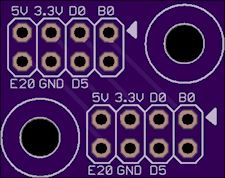
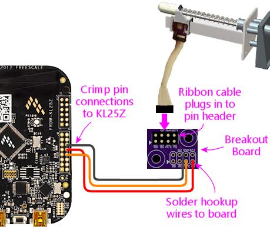

[#plungerSensorBreakoutBoard]
=  Plunger Sensor Breakout Board

If you're using Pinscape on a standalone KL25Z - *without* the expansion boards - this section shows how to create a little circuit board to interface between the plunger sensors and the KL25Z. This gives you a place to plug in the standard connector that we use for all of our plunger sensors.

You can skip this section if you're using the expansion boards, because they already come with a dedicated plunger connector built-in.

== Why do you need the breakout board?

You don't _need_ it, but if you're using a standalone KL25Z, the breakout board makes the connection to the plunger sensor much more convenient and tidy.

Each plunger sensor has to be connected to a set of header pins header pins on the KL25Z. The problem is that the pins needed for any given sensor type aren't grouped together physically. They're scattered around the KL25Z pin headers. It would be nice if they could be grouped together, because then you could just plug in a small header onto the appropriate group of pins. But we can't group them, since the KL25Z's pin header layout wasn't up to us to decide.

The breakout board solves this problem by serving as an interface between the scattered pins on the KL25Z and the grouped pins on the plunger sensor cable.

* On the KL25Z, you connect hookup wires (via crimp pins) to the scattered plunger pins on the KL25Z pin headers
* These wires connect to the breakout board
* The breakout board internally routes these wires to a single 8-pin header for the plunger sensor cable
* The plunger sensor cable plugs into this 8-pin header

The 8-pin header matches the layout of the plunger header on the Pinscape expansion boards. This lets you build the plunger sensor cabling the same way as you'd build it for the expansion boards. It also means that you can easily transfer your sensor to the expansion boards if you decide to switch to those in the future.

If you're using the expansion boards, you don't need the breakout board, since it has the equivalent connect already built in.

== How to order the board

You can order one from link:https://oshpark.com/[OSH Park] for about $2.50 delivered. Actually, that $2.50 will buy you _three_ copies of the board (that's their minimum order size), so you'll have a couple of extras to share, or just in case.

To order from OSH Park:

* Download the board design: link:http://mjrnet.org/pinscape/downloads/plunger-breakout-board.zip[mjrnet.org/pinscape/downloads/plunger-breakout-board.zip]
* Unzip that and pull out the *.brd* (board design) file
* Go to link:https://oshpark.com/[oshpark.com]
* Follow the instructions on their site to upload the .brd file above
* Click through the ordering process

== Parts

* The board (see above)
* One 2x4-pin 0.1" pin header, such as link:https://www.mouser.com/search/ProductDetail.aspx?R=855-M20-9760446.html[Harwin M20-9760446] , or a 2x4 section of a breakaway header (see xref:pinHeaders.adoc#pinHeaders[0.1" Pin Headers] )

== How to assemble

*Step 1: Solder the pin header.* Fit the 2x4 pin header to the top of the board in one of the matching outlines (either one you prefer), with the short end of the pins facing the board. Feed the pins through the holes, making sure the plastic base is seated flush with the top of the board. Solder the pins on the bottom side. Solder all eight pins.

*Step 2: Determine where it'll be installed.* I recommend installing the breakout board close to the KL25Z, to keep the wiring run short. Keep it within about a foot of the KL25Z if possible.

*Step 3: Cut wires.* Cut a set of wires as needed for your sensor. See the sensor chapter for the specific wires you need. Cut each wire to the length needed to connect between the KL25Z and the breakout board, according to where you plan to situate the two boards.

*Step 4: Strip wire insulation.* Strip about 3/16" of insulation from the end of each wire.

*Step 5: Attach crimp pins.* Attach a crimp pin to *one end* of each wire. Use the type of crimp pin that matches the wire housings you're using to connect to the KL25Z, because these pins will fit into those housings. See xref:crimpPins.adoc#crimpPins[Crimp Pins] for instructions on how to attach them.

NOTE: If you're already using the KL25Z's 5V, 3.3V, and/or GND pins for other purposes, and you already have a crimp pin in any of those slots, you'll have to tap into your existing wire, since you obviously can't add a second crimp pin to the same slot. So instead of adding a crimp pin on any affected wires, splice into the existing wire:

* Snip the wire in two at a convenient point
* Strip a little insulation from each end of the snipped wire
* Make a three-way solder joint between the two ends of the snipped wire and the new wire to the breakout board
* Cover the exposed solder joint with electrical tape

*Step 6: Solder the wires to the breakout board.* Solder the bare end of each hookup wire to the appropriate slot in the breakout board - the one where you *didn't* install the pin header. Again, refer to the specific instructions for your selected sensor type for which wires to connect.

*Step 7: Insert the crimp pins.* Insert the crimp pins on the hookup wires into the appropriate slots on the KL25Z crimp pin wire housings. Once again, the appropriate slots depend on your sensor type.

You're ready to go. When you finish building your plunger sensor, you can simply plug in the ribbon cable to the pin header on the breakout board. Be careful to observe the "pin 1" arrow on the board - it must line up with same side of the ribbon cable that goes to the marked pin 1 on the plunger sensor side.

image::images/plunger-breakout-pin1.png[""]

