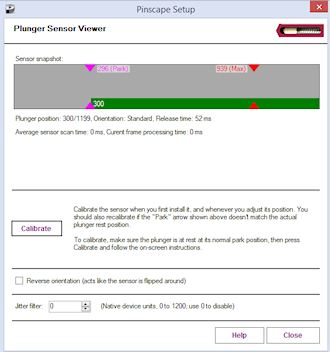

= Pinscape Config Tool Plunger Setup

The first step in setting up a plunger is to configure the proper sensor type and hardware connections.

* Launch the Pinscape Config Tool
* Go to the Settings page for your device
* Scroll down to the *Plunger Sensor Setup* section
* Select your sensor type from the drop list 

If you're using the expansion boards, the pin connections to the KL25Z should be set automatically.
If you're using a standalone KL25Z, you have to set the GPIO pins to match the physical pins where you connected the sensor.

The wiring details are different for each sensor type, and the individual sensor-specific chapters cover that in detail, so refer to the appropriate chapter for the type of sensor you're using for wiring instructions.

== Initial testing

After you've configured the plunger sensor type and pin connections, you're ready to test and calibrate the plunger.
Return to the main screen, and click the plunger icon for your device:

This will bring up the plunger sensor viewer.

The green bar in the "sensor snapshot" area shows the plunger position that Pinscape software detects.
The first thing to check is to make sure that this tracks the plunger when you move it.
When you pull back the plunger, the green bar should move *towards the right* , and should track the physical plunger motion linearly.
The "plunger position" number printed just below should *increase* as you pull the plunger back.

If the bar moves backwards (it moves to the left as you pull back the physical plunger, and the plunger position number decreases), the sensor is installed backwards from the expected orientation.
But that's okay! The software can compensate.
All you have to do is checkmark the box "Reverse orientation" towards the bottom of the window.

If the bar doesn't move at all, there's something wrong with the sensor or the wiring to the KL25Z.
First, go back to the settings page, and double-check that the sensor type and GPIO pin assignments are correct.
If that all looks good, it must be a problem with the physical wiring.
Check all of the connections: make sure everything is plugged in where it's supposed to be plugged in, and carefully inspect all of the solder joints and crimp pin connections.

== Calibrating with the Config Tool

Before you can use the plunger in games, you have to calibrate it, to align the software's numeric readings with the physical range of the sensor.
Calibration is done from the sensor viewer window we used above to view and test the sensor operation.

To calibrate:

* Launch the Pinscape config Tool
* Click the Plunger icon for the device to bring up the plunger sensor viewer
* Click the *Calibrate* button
* Follow the on-screen instructions

The calibration process runs for about 15 seconds, during which you should move the plunger over its range per the on-screen instructions.
The process stops automatically after the software has collected the sensor range data.
The calibration information is saved in the KL25Z's non-volatile memory, so the device remembers it across reboots and power cycles.

The calibration procedure is basically a one-time operation - you only have to do it when you first install the sensor.
There's no need to repeat it routinely (for example, you *don't* have to recalibrate every time you reboot Windows or power up the machine).
You only need to run through the calibration again if you uninstall and reinstall the sensor.
Recalibration is necessary at that point because you'll probably have changed the sensor's physical alignment, at least slightly, so you'll want to recalibrate to get the software back in sync with the new physical setup.
You can also recalibrate any time the sensor seems to be off (e.g., the on-screen plunger isn't coming to rest at the normal park position).

== Calibrating with the calibration button

If you installed a dedicated calibration button, you can also calibrate using the button instead of going through the Config Tool UI.
There's no good reason to do that, as the Config Tool has a friendlier UI that shows more information about what's going on, but the button will work, too, if you prefer to use that for some reason.
The procedure is described in xref:calbtn.adoc#calbtn[Pinscape Plunger Calibration Button] .

== Windows calibration = bad!

Windows has its own joystick device calibration procedure, which you get to via the Windows control panel called "Set up USB game controllers".
Don't use it!

Everyone always wants to run this.
They see the calibration option in Windows and think it must be there to help.
It _is_ there to help, but only for _real joystick_ devices.
It's a disaster to use with nudge/plunger devices, because they're not anything like real joysticks.
Nudge/plunger devices only _pretend_ to be joysticks so that they don't need separate device drivers.

If you accidentally ran the Windows calibration before you read this warning (everyone does!), you'll need to delete the Windows calibration.
The Windows calibration will screw up the Pinscape readings and make your nudge and plunger inputs act erratically.
Fortunately, they made it pretty easy to reset the unwanted calibration data:

* Open the "Set up USB game controllers" control panel (press Windows+R, type *joy.cpl* , press Enter)
* Select the Pinscape device
* Go to the Settings tab
* Click Reset to Defaults

== Jitter filter

Near the bottom of the Plunger Sensor Viewer window, there's a setting called "Jitter filter":

This sets the size of the "jitter window." When you set this to a non-zero value, the window will be shown visually in the sensor snapshot area, as a little box around the end of the plunger position bar.

When the jitter window is set to a non-zero value, raw sensor readings that vary within the window will be ignored.
Any time the raw sensor reading goes outside the current window, the window will move far enough to contain the new reading.

The point of the jitter filter is to make the on-screen plunger stand still when the _real_ plunger is standing still.
That might seem something that should happen anyway, without any filtering, and you're right - it _should_ happen anyway! But remember that we're dealing with an electronic measuring device, and all measuring devices have some inherent imprecision.
Suppose you're asked to measure the length of a line with a ruler, to the nearest 1/32 of an inch, but the ruler only has markings in 1/8 inches.
You plop down the ruler and squint at where the end of the line falls between the nearest 1/8" marks, and you come up with the nearest estimate.
Now you hand it over to a friend and ask what they think.
Chances are that their reading will be just a little different from yours, since you both had to interpolate between the 1/8" marks.
And if you go back and take another reading yourself, you'll probably get a third value.
Plunger sensor readings are like that: the sensor takes samples hundreds of times a second, and each sample has a little of that inherent measuring error, so each successive sample is likely to be slightly different from the last one even when the true position isn't changing.
That shows up in the on-screen plunger as jitter.
You see those slightly variations from one sample to the next as little motions of a pixel or two on-screen.

If the sensor is accurate enough that those little measurement errors are too small to see in the on-screen plunger, the jitter filter can be set to zero.
The AEDR-8300 sensor is that accurate.
The "analog" sensors - the potentiometer and the IR distance sensors - tend to have higher inherent measurement errors that make jitter filtering helpful.

To tune the jitter filter, start by setting it to zero.
Observe the green plunger position bar.
If it's simply standing still, you're set; you don't need a jitter filter at all.
That should be the case with the AEDR-8300 sensor.
If it's jittering at all, gradually increase the jitter window size.
Observe the light green box around the end of the plunger bar.
When the jitter window box is standing still (even though the raw reading, shown by the dark green bar, might still be jittering around within the box), the window is big enough.
You can try reducing the window size to see if the green box stays steady with a smaller value.

Smaller is better with the jitter window because a bigger window means less precision when you do actually move the plunger.
Filtering like this always trades precision for stability.
You want to apply just enough filtering to get rid of the noise (or reduce it to a tolerable level) without filtering out too much of the true information you're trying to measure.

== Axis selection

The Pinscape software normally sends plunger readings to the PC using the "Z" axis, since that's the convention that almost all pinball player software uses.
I recommend sticking with that default, since it's the most widely compatible option.

However, for special situations, the Config Tool gives you the option to use a different set of axes, known as the "R" axes.
This change can be made in the Config Tool's Settings page, under the Joystick section:

image::images/Pinscape-joystick-axis-setting.png[""]

For more on the "R" axis settings, see "Axis settings" in xref:nudge.adoc#joystickAxisSettings[Accelerometer (Nudge) Setup] .

== Auto-zeroing (quadrature sensors only)

If you're using the AEDR-8300 sensor, you should see a checkbox option to "Enable auto-zeroing", and a box to enter the timing if this is enabled.

This option *doesn't* appear for other sensor types.
If you don't see it, it's because it's not applicable to your sensor.

When auto-zeroing is enabled, the Pinscape software will automatically reset the software plunger position to the "park" position (the point where the plunger comes to rest on its own when you're not moving it) whenever the sensor hasn't detected any motion for the specified time period.

The point of auto-zeroing is to correct for accumulated errors in the software's notion of where the plunger is currently positioned.
A quadrature sensor like the AEDR-8300 doesn't actually know _where_ the plunger is at any given time; this type of sensor can only detect motion, so it only knows _how far_ the plunger has moved from the starting point.
These distance measurements are quite precise, but like any sensor, there's always some measurement error, and little errors add up to big errors over time if you just let them keep accumulating.
Imagine if you had to measure a mile-long distance with a one-foot ruler: you'd try to carefully line up the starting point and ending point of each one-foot interval, and take a careful measurement each time, but you'd always have a tiny bit of uncertainty in each measurement.
After adding up five thousand of those one-foot sections, the tiny errors would add up to at least a few inches, and probably several feet.
That's basically how a quadrature sensor measures position: it adds up the net effect of many tiny motions to figure the overall position.

Auto-zeroing helps avoid long-term error accumulation by periodically resetting to a "known state", by assuming that a plunger that's been sitting still for a long period must be sitting at the normal rest position.
When there's no motion for a long period (you can specify exactly how long that is via the "Auto-zero after" box), the software simply sets the current internal position counter to equal the park position.

