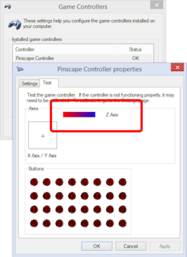
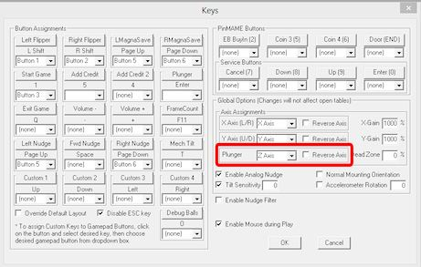
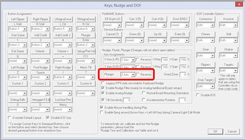
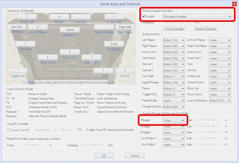

= Plunger Setup on the PC

Most of the popular pinball player programs have support for plunger devices built in, but they all require you to configure some option settings to enable the plunger support and fill in the details of your device.
This section explains how to set up Visual Pinball and Future Pinball, and how to do some simple tests to make sure everything's working properly.

Windows itself generally doesn't require any special setup to work with a plunger.
Plungers emulate joysticks, and Windows has excellent plug-and-play support for joysticks built in.

== Plunger device basics

Before getting into the details of setting up the software, it's worth understanding how a plunger device communicates with Windows and the pinball player software.

At the Windows device level, all of the plunger devices pretend to be joysticks.
The Windows joystick interface defines several "axes" that report the positions of the moving parts of the joystick.
A regular joystick typically has an X axis and Y axis that report the left/right and up/down position of the stick.
These are reported numerically, on arbitrary scales; for example, the left/right axis might report position values from -1000 for "all the way left" to +1000 for "all the way right".
That's just a made-up example; the actual numerical ranges depend on the individual device, and they're usually in abstract units that don't correspond to inches or centimeters or any other real units.

The convention used by all of the plunger devices I know of is to use the joystick "Z" axis to report the plunger position.
For a real joystick, the Z axis is supposed to represent some kind of vertical motion of the stick, but that's just a convention; Windows doesn't know or care what the physical geometry of the device is like.
If the device reports "Z=500", Windows just passes along "Z=500" to any application software (like VP) that asks.

As with all joystick axes, the numerical range of the Z axis is arbitrary and abstract.
But Visual Pinball does define one special point on the Z axis: Z=0 (zero) is assumed to be the resting position of the plunger.
That's the position where the plunger sits when it's in equilibrium, when it's not in motion and when you're not pulling it back.
If you run through the plunger calibration procedure in the Pinscape Config Tool, one of its jobs is to identify the resting position and calibrate it so that it reports Z=0.

Visual Pinball and the other pinball programs that know about plunger devices all use this joystick interface.
They look for a joystick device in the system, and if one is found, they read the Z axis value to determine the position of the physical plunger.
Visual Pinball uses this to control the simulated on-screen plunger, so that the simulated plunger action in the game can be controlled by moving the physical plunger.

== Plunger device axis setup

Some plunger devices give you options about which axis to use.
The Z axis is the most common choice, since that's the one that almost all of the pinball player programs expect you to use.
However, in some rare cases you might need to choose a different axis to avoid conflicts with other devices.

If your device does use some joystick axis other than the Z axis, be sure to substitute that axis for the Z axis in all of the settings throughout the rest of this section.

== Testing with the Windows joystick control panel

You can run a really simple test that your basic plunger hardware setup is working using the Windows joystick control panel.
This is a good early test because it doesn't depend on your Visual Pinball or Future Pinball settings; it just tests the basic USB joystick input.

* Press Windows+R
* Type *joy.cpl* into the Run box
* In the Game Controllers list, double-click on your plunger device
* Look for the "Z Axis" bar on the properties page
* Move your plunger

If all is working, you should see the on-screen Z Axis bar track the motion of your physical plunger as you move it back and forth.

(If you set up your plunger on the Rz (rotational) axis, there should be a "Z Rotation" bar instead, and that should track the plunger motion.)

If the Z Axis (or Z Rotation) bar doesn't move, your plunger isn't sending USB readings to Windows properly.
Go back and check your plunger hardware settings to make sure they're correct.
If you're using Pinscape, you can use the Pinscape Config Tool's plunger tester to see the raw input from the plunger, to make sure that the position sensor is working.

If your plunger device doesn't appear in the Game Controllers list, make sure it's connected to USB and that it's configured properly in its hardware settings.

*Important: do not calibrate!* The Game Controllers control panel has a "Calibrate" button under the Settings tab that many people see and think it would be a good idea to click.
Don't! This particular calibration process is designed for real physical joysticks only.
It's unsuitable for plunger/nudge devices and it'll make your device act erratically.
If you clicked the Calibrate button at some point thinking it would improve matters, you should undo that, by returning to the Settings tab and clicking "Reset to default".
That will erase the troublesome calibration data and restore normal operation.
(This advice applies to the Pinscape Controller and most of the other nudge devices I know about, but there might be exceptions.
If your device's owner's manual tells you to use the Windows joystick calibration despite what I just said, go with the owner's manual's advice.)

[#plungerPreferencesSetup]
== VP and FP plunger preference setup

Most of the pinball player programs have option settings that let you specify whether or not a physical plunger is attached, and if so, how it should be read.
If your plunger isn't working with a given pinball player program, the first thing to do is check the program's options and make sure the plunger is enabled and is using the correct joystick interface.

*Visual Pinball 9:* Open the VP editor.
Select *Preferences > Keys* from the menu.
Find the "Plunger" section.
Set the plunger axis to match the one reported by your plunger device; this is usually the Z axis.
If you changed your Pinscape settings to Rz (or you're using a different plunger controller that uses something other than the Z axis), select the appropriate axis here.

VP 9 plunger settings in the Keys preferences dialog

*Visual Pinball 10:* Open the VP editor.
Select *Preferences > Keys, Nudge & DOF* from the menu.
Find the "Plunger" section.
Set the plunger axis to match the one reported by your plunger device; this is usually the Z axis.
If you changed your Pinscape settings to Rz (or you're using a different plunger controller that uses something other than the Z axis), select the appropriate axis here.

VP 10 plunger settings in the Keys preferences dialog

*Future Pinball:* Open the Future Pinball editor.
Select *Preferences > Game Keys and Controls* from the menu.
Select your plunger device from the "Mouse/Joypad Controller" drop list, and make sure the "Enable" box is checked.
Find the Plunger axis setting, and select "Z-Axis" from the drop list.
(Or select the actual axis that your plunger device uses, if different.)

Future Pinball plunger settings in the keys & controls preferences dialog

== Testing your plunger with VP or FP

It's a good idea to test a new plunger device with a stripped-down starter table in each player system, to make sure that the basic hardware and software setup is working.
Once you know the plunger is working in a test table, you can be sure that any problems you have with individual tables are those tables' fault, not something wrong with your basic setup.

You should go through these steps with each player program that you'll be using, including each version of VP if you've installed more than one.
The preference settings are specific to each program and version, so it's possible for VP 10 to be working but VP 9.9 to be broken, or vice versa.

Here are the basic steps to test the plunger device in VP:

* Run VP and go to the blank editor (cancel out of any initial "Open File") dialog
* On the menu, select *File > New* to create a new blank table
* Make sure the Properties panel is showing on the right; if it isn't, click the Options button in the left tool window
* On the menu, select *Edit > Select Element* , then scroll down to the Plunger object and click on it
* In the Properties window, make sure *Enable Mechanical Plunger* is check-marked
* Press F5 to run the game
* Try moving your plunger

If everything's set up correctly, the on-screen plunger should track the motion of your physical plunger.
If the on-screen plunger doesn't move, go back through the xref:#plungerPreferencesSetup[plunger preference setup] steps above.

The procedure for Future Pinball is simpler, because FP doesn't have an equivalent of the "Enable Mechanical Plunger" checkbox that VP uses.
It's just always enabled.
So simply create a blank table and run it, and test that the on-screen plunger tracks the motion of your physical plunger.

== Fixing individual tables

Okay, if you've made it this far, your plunger is sending joystick input to Windows successfully and is working with test tables in the pinball players you're using.
Ideally, we'd be done at this point: just load up some tables and play.

There's just one slight problem with that: some individual tables might not work properly, particularly with Visual Pinball, and particularly with VP 9.
This is despite the fact that we know that the plunger input is correctly reaching VP itself.
The snag is that individual VP tables don't always use the built-in VP plunger object, or don't use it properly for real plunger input.
Some tables use their own improvised scripting code that doesn't take plunger devices into account.

VP tables that don't work properly with a plunger device can usually be fixed, sometimes easily and sometimes with a bit of work.
That's a fairly big subject, so we cover it separately in xref:tablePlungerFixup.adoc#tablePlungerFixup[Fixing VP Plungers] .

