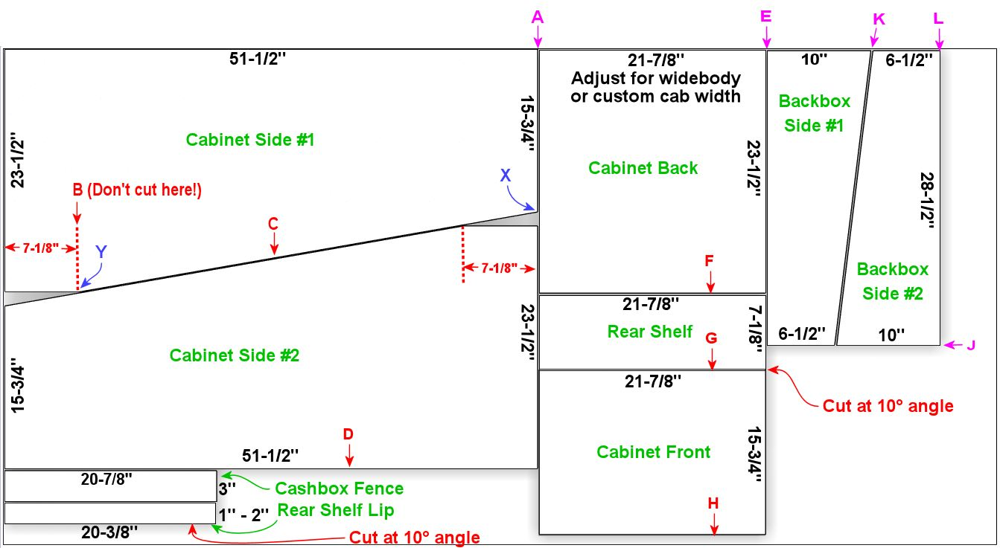
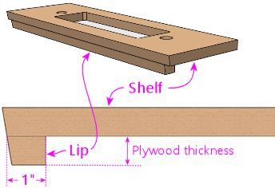
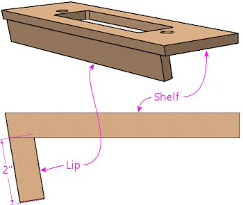
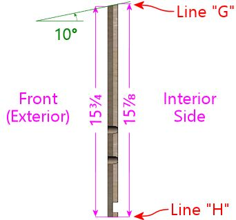
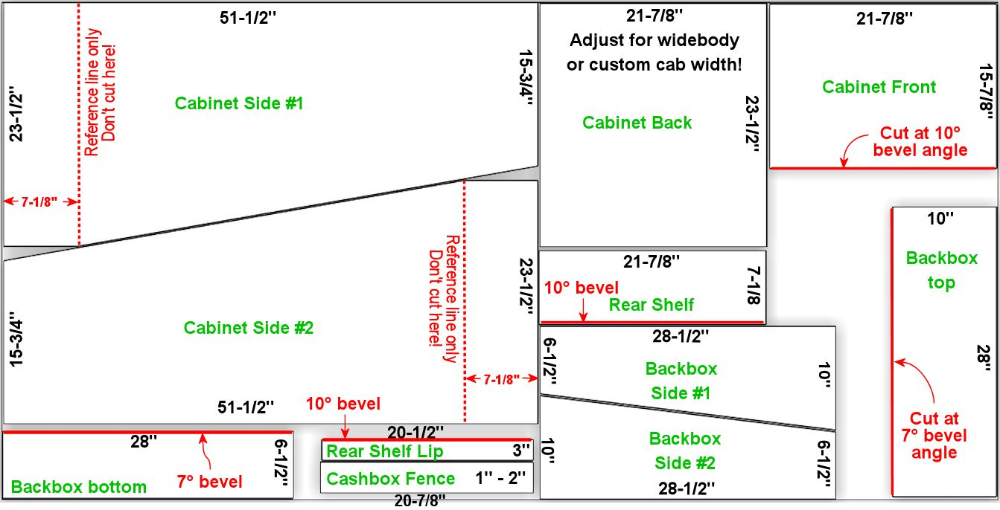

[#plywoodCuttingPlans]
= Plywood Cutting Plans for Cabinet Construction

If you're building a pinball cabinet from scratch, the first step is to buy some plywood sheets and cut them up to form the panels making up the cabinet. This chapter provides a few options for how to divide up the plywood.

The standard pin cab plan calls for two thicknesses of plywood: 1/2" for the main cabinet floor and the back of the backbox, and 3/4" for everything else. Most commercial pinball machines use particle board rather than plywood for the 1/2" parts, to cut costs, but it's a nice upgrade to use plywood instead if your budget permits it. In any case, it makes no difference to any of the cutting or building plans.

Index to the layouts:

*  xref:#groupBySizePlan[Layout 1: Best grouping of same-size pieces]
*  xref:#singleSheetPlan[Layout 2: Single 3/4" sheet plan]
*  xref:#carFriendlyPlan[Layout 3: Car-friendly plan]

== Adjustments for joinery

The cutting plans all assume that you're using mitered corner joins for the main cabinet, where the outer edges of the corners meet at 45° angles. This assumption is important because it means that the finished size of the cabinet on a given side will exactly match the size of the panel on that side, since the panel extends all the way to each corner. If you're using a join that doesn't have mitered corners, such as a rabbet or butt join, each corner will have one piece that doesn't extend all the way to the outside corner, meaning that it will have to be cut a little shorter than the finished cabinet size on that side, to make up for the overlapping section in the join. See xref:cabBody.adoc#cabJoinery[Cab Body - Joinery] .

== Adjustments for cabinet width

The dimensions shown are all for the standard-width WPC cabinet. If you're building a widebody or custom-width cabinet, you'll have to adjust the widths accordingly.

== How to use the plans

Don't start by marking all of the cut lines shown on the plywood sheet. That won't produce accurate results, because your saw blade will remove some of the material between the pieces at each cut, which you can't easily account for in the initial marking. Instead, measure and cut one section at a time. This lets you make the next measurement based on the actual new edge left over from the previous cut.

Also, to make sure that your saw blade's width is accounted for in each cut, always align the saw on the "outside" of each cut, so that the blade's width is positioned in the "leftover" portion of the plywood rather than within the work piece you're cutting. Align the edge of the blade on each cut with the outside edge of the work piece.

[#groupBySizePlan]
== Layout 1: Best grouping of same-size pieces

This layout groups the pieces in such a way that pieces of the same size are grouped together, so that you only have to make one cut at a given measurement point. The benefit is that it almost guarantees that the grouped pieces will exactly match on that dimension, since they're all cut along a single line. It ensures that the side walls will end up being exactly the same length front-to-back, the front and back walls are exactly the same width, and the backbox sides are the same height. Another benefit is that this layout is efficient in terms of your time, since it minimizes the number of measurements and cuts.

The downside of this plan is that it doesn't make efficient use of the plywood. It requires two sheets of 3/4" plywood, but it only uses a small portion of the second sheet. You might check with your lumber supplier to see if they sell half sheets or smaller project boards, since you only need about 28" x 18" for the second piece.

link:http://mjrnet.org/pinscape/BuildGuideV2/cab-body-plywood-layout-1.png[
] 

Plywood sheet #1 - 4' x 8' x 3/4" nominal thickness. Dimensions are all for the WPC standard-body design.Click the image for a larger view.

1. Measure from one edge of the sheet to 51-1/2", to the cut line marked "A" in the diagram above. Cut across the whole sheet on this line. Set aside the smaller portion.

2. We're now going to cut the diagonal line "C" for the side panels. On the "A" cut line, measure 15-3/4" to the point labeled "X", and mark that spot. On the opposite side, pencil in the line marked "B", 7-1/8" from the edge. ("B" is just a reference point - don't cut along this line.) Then measure 23-1/2" along "B" from the edge to the point labeled "Y", and mark that spot. Draw the diagonal line "C" through points "X "and "Y". Cut all the way along "C".

3. The piece you just cut out is one side wall of the cabinet. You just need to cut out that 7-1/8"-long flat portion where the diagonal edge flattens out. Mark a line 23-1/2" from the opposite side, parallel with the opposite side, and cut along that line to make the flat portion. The finished side piece should look like this:
+

4. On the remaining piece, you can repeat the measurements from step 2 to mark the 51-1/2" line "D", or you can simply use the finished first side piece as a template, since both sides should be identical. Either way, mark line "D" and cut along the line to cut out the second side piece.

5. Repeat step 3 with the second side piece to cut the 7-1/8" flat portion.

6. From the remains of the 51-1/2"-wide section, cut the two small rectangular pieces shown at the bottom: the cashbox fence (20-7/8" x 3"), and the rear shelf lip (20-3/8" x 1" to 2").
+
For the rear shelf lip, cut one side with the saw blade at a 10° tilt (bevel angle). This will match the tilt in the front edge of the shelf. I'm giving you a size range for this piece because you'll probably want to adjust it according to your TV setup plans. In the original WPC machines, the lip is set up like this:
+

+
For a virtual cab, though, you might want to extend the lip to about 2", by cutting the piece to 2" wide and turning it sideways:
+

+
This is just a suggestion - you can make the lip longer or shorter than 2" as needed. The right length depends upon how your TV and other devices (such as a flasher panel at the back) are arranged. The smaller size used on the WPC machines is enough to allow installation of the plastic trim piece that holds the back of the glass cover. On a virtual cab, a longer lip can be used to fill the space between the top of the TV and the top of the cabinet.

7. Now we'll work on the (almost) half-sheet that was left over from the first step, after cutting along line "A". This section should be about 48" x 44". Mark cut line "E" by measuring 21-7/8" from one edge.
+
For widebody or custom cabinets, adjust this dimension! 21-7/8" is for the WPC Standard Body design, which fits the standard Williams lockbar (Williams/Bally part number D-12615, A-18240). If you're building a widebody that's matches the original Williams "Superpin" cabinet, to fit the off-the-shelf WPC widebody lockbar (A-16055, A-17996), the width should be 24-5/8". If you're building to a custom size, you can determine the width to use here by adding 1-3/8" to your desired inside cabinet width (the distance between the inside faces of the side walls - essentially, the width available for the main TV).
+
*Make sure the board is oriented so that "E" goes down the longer (48") dimension!* Otherwise you won't have enough material for the three pieces shown.

8. Using the 21-7/8"-wide section we just cut, mark line "F" 23-1/2" in from one edge. Cut along this line. This yields the back wall of the cabinet.

9. Continuing with the remainder of the 21-7/8"-wide section, mark line "G" 7-1/8" from one edge. *Cut along the line with the saw blade at a 10° tilt.* The 7-1/8" line is the *longer* face for the angled cut - the other face should end up about 7" long. This yields the rear shelf for the cabinet.
+
If your saw can't easily cut at an angle like this, you can get away with making a square cut. Cut the piece at the shorter 15-3/4" size in this case. The angle is to make the top edge of the piece align with the diagonal slant of the cabinet sides, so that all the edges are flush. But this isn't actually all that critical; it's only a slight aesthetic imperfection if you can't make the edges flush, and it's an imperfection you'll almost never have to look at anyway, since the whole area is covered by the lockbar! The only time you'll see it is when you take the lockbar off to get inside for service.

10. Set the saw blade back to straight up (no tilt/bevel angle). Still using the remainder of the 21-7/8"-wide section, mark line "H" 15-3/4" from one edge, using the *shorter face* after taking into account the tilted cut on line "G". Remember that we just cut the one edge of this piece ("G") with a 10° bevel angle. That will be the *top* of the front wall, which needs the angled top edge to match the slope of the side walls. The other side, line "H", which we're cutting now, is the bottom of the front wall.
+
When marking the cut line "H", be very careful that you're measuring 15-3/4" from the *shorter* side of the beveled edge "G" from the previous step. The distance to "H" on the longer face should end up being about 15-7/8". Here's the side profile of the finished piece, to give you a better idea of what we're going for:
+

+
This will use almost the entire rest of the piece, but there should be just enough left that you still have to trim this little bit.

11. There are only two pieces left to cut out of the remainder of the first plywood sheet: the sides of the backbox. The leftover piece should be about 22" x 48" (or less than 22" if you're building a widebody or wider-than-standard-body cabinet). Mark line "J" by measuring 28-1/2" from one edge. Cut along line "J".

12. On the 28-1/2" piece we just cut, mark the diagonal line "K" by measuring a point 10" from a 28-1/2"-long edge at one end, and 6-1/2" from the same edge at the other end. Cut along this line. This yields the first backbox side piece.

13. On the other piece, you can either repeat the measurement to mark the square line "L", or you can use the first backbox side piece as a template to mark the cut line, since the two sides are identical. Cut along the line.
+
We're finished with the first plywood piece! Time to move on to the second sheet.
+
link:http://mjrnet.org/pinscape/BuildGuideV2/cab-body-plywood-layout-2.png[
]
+
Plywood sheet #2 - 4' x 8' x 3/4" nominal thickness.Click the image for a larger view.

14. These pieces will form the top and bottom of the backbox. Start by cutting line "A", at 28" from one edge.
+
You can cut along line "A" all the way across the board if you like, but as you can see, we only need the top corner for these pieces. If you want to keep more of the rest of the board intact as a large leftover piece, you can just cut about 18" in along line "A".

15. Mark line "B", at 10" from the outer edge. *Set your blade to a 7° tilt.*
The blade should be tilted so that the face you're cutting into will be the wider side. If your saw only tilts the other way, so that the opposite face will be the wider one after the cut, flip everything around and measure line "B" at 6-1/2" in instead of 10" in.
+
Once you have it set up, cut at line "B" with the 7° tilted blade.
This yields the backbox top (or the backbox bottom, if you had to flip things around for the 6-1/2" cut).
+
Sanity check on the angled cut: The result should be 10" side on one face, and about 9-29/32" wide on the opposite face. If you did the 6-1/2" cut, the result should be 6-1/2" wide on one face. and slightly wider, about 6-19/32", on the opposite face.

16. *Set your saw back to 0° for square cuts.* Orient the remaining piece so that the angled cut with the narrow face is facing the saw blade. Measure line "C" at 6-1/2" from the angled edge (or 10" from the angled edge if you flipped things around in the previous step). Cut along this line. Make the same sanity check as in the previous step for the angled cut.
+
link:http://mjrnet.org/pinscape/BuildGuideV2/cab-body-plywood-layout-3.png[
]
+
Plywood sheet #3 - 4' x 8' x 1/2" nominal thickness.Click the image for a larger view.

17. Now we're going to switch to 1/2" plywood (or particle board). The first cut is the backbox back wall. This is a simple rectangular piece, 28" x 27-3/4".

18. The second cut is the cabinet floor, another simple rectangular piece, 50-5/8" x 21".
+
If you're building a widebody or custom cabinet size, adjust the size to match. Here's how I calculate the floor size: start with the outside dimensions of your cabinet, then subtract 7/8" from each dimension. This accounts for the thickness of the walls left over outside of the dado grooves that the floor fits into (about 3/8" on each side, for 3/4" total), with another 1/8" of wiggle room, in case of any irregularities in the dado depth or floor edge. You can add back the 1/8" if you want a tighter fit; you can always do a test fit and sand it down a little if necessary.

19. There are a few more miscellaneous pieces that you'll need to cut out of the leftover plywood. These are covered in detail in xref:cabBody.adoc#cabinetBody[Cabinet Body] , but here's a quick summary:
+
* Two corner supports for the cashbox fence, each 3" long, with a triangular cross section (exact sizing is unimportant); these can be made from a nominal 2x2 board cut in half diagonally (at 45°) lengthwise
* Two corner braces for the front leg brackets, each 6" to 8½" long (at your discretion), cut in a triangular cross-section (with two 1-1/16" sides and a 1-1/2" hypotenuse)
* Two corner braces for the back leg brackets, each 6" to 21½" long (at your discretion), cut in a triangular cross-section (same as the front corner braces)
* Two 4-3/4" x 3/4" strips of 1/2" plywood, for DMD panel guides
* Two 15" x 3/4" strips of 1/2" plywood, for translite guides
* One 27-1/8" x 3/4" strips of 3/4" plywood, for a translite guide
* Two 12-3/8" x 1" strips of 3/4" plywood, for translite guides
* One 27-1/8" length of 3/4" reducer molding (or a similar shape fashioned from a 1x2), for backbox trim at the top of the translite
+
The woodworking on the plywood pieces isn't finished after you cut the last piece. Most of these parts require some additional work with a router, drill, and/or jigsaw. This is all covered in detail in xref:cabBody.adoc#cabinetBody[Cabinet Body] .
+
For help with the triangular wedge-shaped pieces, see xref:cornerBraceCutting.adoc#howToMakeCornerBrances[How to Make Corner Braces (and other wood prism shapes)] .

[#singleSheetPlan]
== Layout 2: Single 3/4" sheet plan

It's just barely possible to make all of the 3/4" pieces fit into a single 4x8 sheet. Plywood's not cheap, so this plan is easier on the budget. But this plan requires more measuring and cutting work than the xref:html#groupBySizePlan[group-by-size] plan above, because it's not possible to group the pieces as nicely given the more limited space. Also, there's not enough spare room to allow for expanding any of the pieces to widebody widths, or to any custom width larger than the standard-body design. This plan will really only work for a standard-body build.

You'll have to be very careful with this plan to minimize wasted material between cuts, since everything is packed so tightly.

Note that "single" refers only to the 3/4" material. You do still need a second sheet, of 1/2" material, for the cabinet floor and backbox back wall.

link:http://mjrnet.org/pinscape/BuildGuideV2/cab-plywood-single-sheet-layout.png[
] 

Plywood sheet #1 - 4' x 8' x 3/4" nominal thickness. Dimensions are all for the WPC standard-body design. For the beveled cuts, the dimensions are all given for the *longer* face on the resulting piece.Click the image for a larger view.

link:http://mjrnet.org/pinscape/BuildGuideV2/cab-body-plywood-layout-3.png[
] 

Plywood sheet #2 - 4' x 8' x 1/2" nominal thickness.Click the image for a larger view.

[#carFriendlyPlan]
== Layout 3: Car-friendly plan

I don't own a pickup truck, so it's always a huge hassle for me to transport large sheets of plywood. One easy workaround is to ask the store to break down the sheets into smaller pieces that I can fit into my car. This is a free service at most Home Depot and Lowe's locations - they'll usually cut full plywood sheets into two or three pieces for you at no added charge. There are some caveats; they don't guarantee that the measurements will be exact, and they'll only do straight cuts parallel to the edges of the board. They also warn you that the big industrial panel saws they use might not leave a very clean edge. They don't consider this a "finish" carpentry service, just a convenience for easier loading.

As an example, I came up with the layout below to fit my car. You might be able to use this directly if it fits your car as well, but more likely you'll need to adapt it for your car's cargo area size. There are two rules you need to observe when creating your own layout. First, leave some dead space on each side of the store cuts - ideally about 1/2" on each side of each cut. That leaves margin for error in case the store is a little off with their measurements, and it lets you trim the edge more cleanly if their saw leaves a rough edge. Second, when you figure which pieces you can fit into a given area, leave a similar dead zone between pieces to account for your own saw blade's width - about 1/4" spacing between adjacent pieces should be sufficient.

This layout has an interesting bonus feature: if you happen to be building _two_ pin cabs at once, there's enough leftover material that you can build the second cab with only one addition sheet of 3/4" plywood. (I don't think there's a way to avoid the need for a second sheet of 1/2" ply for the second cab, though, or at least another half sheet.)

My layout requires two pieces of 3/4" plywood plus one piece of 1/2" plywood. At the store, ask them to cut up each piece like this:

link:http://mjrnet.org/pinscape/BuildGuideV2/cab-body-plywood-layout-car-1.png[
] 

These are the cuts to make at the lumber store, to break down the sheets into smaller pieces for transport. The plan requires two sheets of 3/4" plywood plus one sheet of 1/2" material. You can have the store cut all three sheets the same way.Click the image for a larger view.

1. Grab two 4'x8'x3/4" plywood sheets and one 4'x8'x1/2" plywood sheet, and take them to the panel saw station

2. Ask the store associate to make a cross-cut in each sheet at 59" from one edge

3. Now ask the associate to make a rip cut in each of the *larger* (59" wide) pieces, at 24" - in other words, cut it in half length-wise

NOTE: The 59" measurement is based on making the smaller side of this cut as wide as I can fit in my car. The second piece ends up being about 37"x48" with this cut, and I can fit about 37" across my cargo area. If your car can accommodate a piece wider than 37", you can make more efficient use of the plywood by reducing the 59" measurement - but don't go below 52", since that part is for the cabinet side panels, which are 51.5" long. By the same token, if 37" is too wide for your car, you can increase the 59" measurement in order to make the other side narrower, assuming your car can fit a piece longer than 59".

*Attention wide-body or custom width cabinet builders:* You might have to change the final rip cut for the 1/2"-thickness sheet! Figure out how wide your cabinet is going to be on the outside, and make the final cut at that width or wider, *instead of* the 24" measurement above.

Here's how I mapped the cabinet panels onto the broken-down plywood sheets:

link:http://mjrnet.org/pinscape/BuildGuideV2/cab-body-plywood-layout-car-2.png[
] 

link:http://mjrnet.org/pinscape/BuildGuideV2/cab-body-plywood-layout-car-3.png[
] 

link:http://mjrnet.org/pinscape/BuildGuideV2/cab-body-plywood-layout-car-4.png[
] 

Note that you don't need a full second 4'x8' sheet of the 3/4" plywood - a half-sheet would be perfectly adequate, if your lumber store offers it. A half-sheet isn't workable for the 1/2" section, unfortunately, since the cabinet floor piece is longer than 48".

