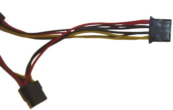
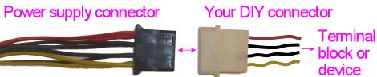

[#powerSupplies]
= Power Supplies for Feedback

Feedback devices require power, so you'll have to provide power supplies in your cabinet for the devices you install.

All the common devices run on low-voltage DC power.
You'll probably have a mix of devices with different voltages, so you might need multiple power supplies to cover the different voltages.
In this section, we'll help you figure out the set of voltages you'll need, and provide pointers for what to buy.

== Common voltage levels

Here are the common voltage requirements for most of the feedback devices found in pin cabs.

[cols="1,3,2"]
|===
|Voltage|Devices|Source

|5V
|Flasher LEDs
| xref:#PowerSupplyTypeATX[ATX PSU] or xref:#OEMPowerSupplies[OEM 5V supply]

|6.3V
|Round button lamps (#555 incandescent)
| xref:#PowerSupplyType6V3[Step-down] from 12V, or substitute xref:#PowerSupplyTypeATX[ATX 5V]

|12V
|Shaker motor +Gear motor +Fan motor +Beacons +Strobes +LED strips +Some solenoids +
| xref:#PowerSupplyTypeATX[ATX PSU] or xref:#OEMPowerSupplies[OEM 12V supply]

|14V
|Square button lamps (#161 incandescent)
| xref:#PowerSupplyType14V[Step-up] from 12V, or substitute xref:#PowerSupplyTypeATX[ATX] 12V

|24V
|Contactors +Some solenoids +Chimes and bells
| xref:#PowerSupplyType24V[OEM 24V supply]

|30V-50V
|Replay knocker +Real flippers +Real slingshots +Real bumpers
| xref:#ReplayKnockerVoltage[High-voltage supply]

|===

Go through the list above and find the devices that you plan to install.
For each one, note the type of power source required and add it to the list of components for your system.

You'll only need one power supply of each type, even if you have multiple devices that use it, because all the devices that need a particular voltage can share the same power source.

Below, we'll go into the details on what to buy for each power source and how to set it up.

[#InterconnectingGrounds]
== Interconnecting grounds

Whatever combination of power supplies you're using, there's an extra step you should take with each one: connect the "ground" terminals of all of your power supplies together.

"Ground" has several different technical meanings in electronics jargon, so let's make sure we're talking about the same thing.
The ground terminals that I'm talking about interconnecting are the *negative DC terminals* .
On ATX power supplies (the standard type of PC power supply), these are the *black wires* on all the connector cables coming out of the box.
On a power supplies with screw terminals, this is the negative DC output terminal, usually marked with one of the following:

*  *-* (a minus/negative sign)
*  *-V*
*  *-24V* (or whatever voltage the supply produces)
*  *0V*
*  *G*
*  *GND*
*  *Ground*

In all cases, this is one of the power supply's *DC output* terminals, not anything on the AC input side that connects to the wall plug.

The point of interconnecting the power supply grounds is to ensure that all the different circuits at all the different voltage levels have a common reference point for 0V.
This allows them to work together in a single system.
This is important for the feedback devices because they connect to the output controller, which in turn connects to the PC (through the USB cable).
Without a common 0V reference point, the common connections through the PC could allow hazardous current flows between power supplies.
Interconnecting the grounds prevents this.

Note that it's not necessary to make any extra connections for step-up or step-down voltage converters.
These are inherently connected to the common ground through their power input wires, as long as the power supply they're connected to is itself connected to the common ground point.

=== Wiring suggestions for ground interconnects

The important thing is to connect all the grounds together electrically.
Exactly how you wire this is up to you.

The easiest way is to simply daisy-chain a hookup wire from one power supply ground to the next.

A somewhat neater approach is to install a "power distribution block" or "ground bar".
This is basically a metal bar with a number of screw terminals for attaching wires; since it's one big metal bar, all the terminals are electrically connected, so any wires you connect will all be shorted together, exactly as we want.
Adafruit makes a nice power block that you can buy directly from their site or via retailers like Mouser.com: link:https://www.mouser.com/search/ProductDetail.aspx?R=485-737[Adafruit 737] .
It looks like this:

You can find similar products at home supply stores and hardware stores, where they're usually called "ground bars".
The Adafruit setup is a bit nicer because it has a plastic housing for easy mounting; the hardware store type is usually just a plain metal bar with screw terminals.
In any case, both types provide screw terminals that are all connected together electrically.
Simply connect a wire from each of your power supply's Ground terminals to a terminal on the bar.

== Individual power supply descriptions

Now let's look at the common types of power supplies you can use in a pin cab.

[#PowerSupplyTypeATX]
=== ATX power supplies

ATX PSUs - the same type that you're probably using for your PC motherboard - are great for feedback power because they're cheap sources of the most common voltages you need, 5V and 12V.
They crank out tons of power at a low price; the cheaper ones only cost about $30 and provide 300W or more.

It might be tempting to take advantage of the fact that you _already_ have an ATX PSU in your cab to power the PC motherboard, and give it double duty powering your feedback devices as well.
But I'd recommend against that.
You really should buy a second ATX PSU that you can dedicate entirely to your feedback system.

The reason to use a separate power supply for feedback is that many of the devices are electrically "noisy", meaning that they inject voltage spikes and dips into the power supply circuits when they operate.
The mechanical devices in particular (solenoids, contactors, motors) can cause the power supply voltage to fluctuate quite a lot when they switch on and off, because of the sudden change in load.
If you connect these devices to the PC's power supply directly, you'll subject your motherboard to that electrical noise and the fluctuating voltages.
It's best to use a whole separate PSU to better isolate your motherboard from all of that and keep its power supply as stable as possible.

There's no need to match your ATX PSUs, by the way: you don't have to buy the same make or model for the secondary unit that you're using to power your motherboard.
Any cheap, low-end ATX PSU rated around 300W of power should be perfectly adequate for feedback device power.

====  How big an ATX power supply do I need?

For powering feedback devices in a pin cab, most people are fine with a low-end ATX PSU rated at 300W or higher.

Figuring out the exact size of the ATX PSU you might need isn't easy, because the spec sheets for ATX supplies don't usually list the exact power limits at the different voltage levels (3.3V, 5V, and 12V).
They only tell you the _total_ power.
These supplies always have lower internal limits on the individual voltages.
Some manufacturers list the specs at that level of detail, but most don't; usually they just advertise the total Wattage.
Fortunately, even a low-end ATX supply (300W, say) has enough power for the standard feedback devices, so in practice there's usually no need to figure out the exact specs you need.
Just buy a cheap ATX PSU and it'll probably work fine.
If you feel that you have an unusually power-hungry set of feedback devices, you might upgrade to something in the 500W range, but I think it's diminishing returns beyond that.

If you want to figure out exactly what you need, start by grouping your devices into 5V and 12V groups.
Don't include devices that you'll power from separate power supplies, such as 24V contactors or 50V solenoids.
(However, _do_ include any devices that you'll connect indirectly to the ATX power supply via things like voltage step-up or step-down converter boards.) Figure out the "worst case" for how many of the devices in each group will be activated *simultaneously* .
That tells you the maximum current (Amps) needed at any one time at each voltage.
Once you know that highest simultaneous current draw, multiply it by the voltage to get the wattage.
If you can find manufacturer specs for your ATX supply that tell you the individual power limits for the 5V and 12V rails, use that to make sure the power supply is big enough; if the specs don't include that level of detail, I'd make a wild guess that you can expect at least 30% of the rated total power to be available on each rail.
So for a 300W power supply, I'd expect at least 100W to be available on the 12V rail, for a limit of at least 8A.

====  How to connect devices to an ATX power supply

The connectors on an ATX power supply are all designed to plug into matching connectors on PC motherboards, video cards, and disk drives.
Pin cab feedback devices aren't equipped with the matching connectors, though, so we have to improvise a bit to break the ATX power supply out of its connector jail.
There are three main ways to do this:

* Use a breakout board.
This is the easiest way.
A breakout board is a small circuit board that you can buy on eBay or Amazon that has a PC motherboard socket and a bunch of screw terminal connectors for the voltage outputs - ground, 3.3V, 5V, 12V.
Plug the main 24-bin motherboard power cable from the power supply into the socket in the breakout board, and connect your devices to the appropriate screw terminals.

If you buy a breakout board, you can skip all the details below about overriding the soft power circuit and wiring up your own disk-type connectors.
Simply use the screw terminals on the breakout board to connect hookup wire between the devices and the breakout board.

To find suitable boards, search for *ATX 24-pin breakout board* .
The easiest kind to use is the type with screw terminals for the voltage outputs.
These are currently about $15 on Amazon.
(Some boards use other types of plastic plugs for the outputs, which doesn't really help if you just want to use hookup wire directly.)

* Attach your own matching connectors to your feedback devices.
This is a little more work than using a breakout board.
Follow the steps below if you want to go this route.
* Snip off the disk connectors from the ATX power supply cables, and connect the devices directly to the exposed wiring, by soldering or using a screw terminal strip.
This procedure is basically the same as creating your own matching connectors, except that you get to skip the connectors and just connect directly to the wires.
Follow the steps below.

[#ATXOverrideSoftPower]
====  Overriding the soft power circuit

In order to use an ATX power supply with feedback devices, you have to override its "soft power" control circuit.
This is a circuit inside the power supply that allows the computer operating system to switch the power on and off under software control.
This is how Windows powers off your computer when you select "Shut Down" from the Start menu.

The snag this creates for our secondary ATX power supply is that the default condition is "power off".
The motherboard has to send a signal to the power supply to turn the power on in the first place.
With a secondary ATX supply, we're not connecting it to a motherboard at all, so we have to send this signal ourselves.

Fortunately, overriding the "power on" signal is extremely simple.
It's just a matter of shorting together a particular pair of wires in the big 24-pin connector that you'd normally plug into the motherboard.

* Find the large 24-pin motherboard connector.
On older units, this might be a 20-pin connector.
See the illustration below.
* The wires to the connector are all color-coded.
Find the *green* wire.
There should be only one green wire, and it should be the fourth wire from the left if you're holding the connector as shown below.

* Find the *black* wire next to it to the left.
* Connect the green and black wires together.

Exactly how you connect these two wires is up to you.
Here are some options:

* Use a piece of solid hookup wire around 22AWG in thickness, and about 1" long.
Strip both ends.
Insert the ends in the pin connector sockets for the black and green wires.
Tape it securely in place with electrician's tape.
This is simple and doesn't permanently modify the PSU, in case you ever want to return it to service as a regular PC power supply in the future.
The downside is that it can be flaky.
To improve reliability, use wire that's thick enough to fit snugly in the sockets without any play, and make sure it's inserted far enough that it won't work its way loose.

* If you don't mind permanently modifying the power supply, you can simply cut the black and green wires at the ends where they enter the connector plug housing, strip the ends, and solder them together.
Wrap the exposed solder connection with electrician's tape to insulate it.
This approach is simple, and it's more reliable than the jumper wire technique above, but it permanently modifies the cable.
You won't be able to use the power supply as a regular PC power supply in the future.

You can test your wiring simply by plugging the power supply into AC power.
If the fan turns on, your wiring worked, and the power supply will now be permanently powered on.
If the fan doesn't turn on, check your wiring; if you used the non-permanent jumper wire technique, try jiggling the wire to see if you just have a loose contact.
Also make sure the "hard" power switch (usually located next to the AC power cord) is switched on - that cuts the AC power input when switched off, so you'll want to leave that switch in the on position permanently.

If your jumper wire looks solid and the fan still won't turn on, or if it mysteriously shuts off after a few minutes, your power supply might require a minimum load to operate.
More on this below.

====  Minimum load

Some ATX power supplies have a load sensor circuit that shuts off power if the computer isn't drawing at least a minimal amount of current.
This is meant to prevent the power supply from operating when unplugged from the motherboard.

You probably won't have to worry about this, because most ATX power supplies don't have anything like this.
The cheaper ones are less likely to have them than more expensive ones.

You can easily test for a load sensor by plugging your PSU into AC power, after overriding the "soft on" circuit as described above.
If the fan doesn't turn on, you might have a load sensor that you'll have to deal with, but you should double-check the easier stuff first to make sure you're not on a wild goose chase: make sure the hard power switch on the back of the unit is switched on, make sure it's plugged in to a working AC outlet, and make sure your green-to-black jumper wire is installed properly (see xref:#ATXOverrideSoftPower[Overriding the soft power circuit] above).

If the fan is running, leave the PSU on for about five minutes without anything else attached.
If the fan is still running, you probably don't have any sort of load sensor, so you don't have to worry about the rest of this part.

If the fan won't turn on at all or turns off after a few minutes, you probably have the load sensor.
Like the soft-on circuit, you can work around this and force the PSU to operate, but the procedure is a little different.
You can't just cross a pair of wires in this case; what you have to do is provide the minimum load that the sensor is looking for.

The easiest way to set up a minimum load is by installing a resistor between a *red* and *black* wire in the motherboard connector (the same connector that has the green wire for the soft-on circuit).
Use a *10Ω, 10W* resistor, such as a link:https://www.mouser.com/search/ProductDetail.aspx?R=280-CR10-10-RC[Xicon 280-CR10-10-RC] .

As with the soft-on circuit, you can wire this to the ATX motherboard connector plug by inserting wires into the sockets, or you can clip the wires and solder them to the resistor leads.
There are several black wires and several red wires going to the 24-pin connector; you can pick any of them, since they're all wired together inside the power supply.

The 10Ω resistor creates a constant load of about 500mA, or 2.5W.
This should be enough to satisfy the load sensor on any power supply that has one.
Unfortunately, the resistor simply wastes this power by turning it into heat, but 2.5W is a tiny fraction of the available power even for a very cheap, low-end ATX PSU.
The cheapest ones supply about 300W, so wasting 2.5W won't make a noticeable dent in your power budget.

Note that the 10Ω resistor will get pretty hot: remember that its whole purpose is to waste power by producing heat.
You should mount it in an open area where it gets some airflow and where nothing else will come into contact with it, particularly wires (the heat could melt their insulation).

[#ATXDiskPlugWiring]
====  How to connect 5V and 12V devices

I recommend using the disk connectors to connect feedback devices.
These are the large 4-pin female connectors, also often (incorrectly) called "Molex connectors", that look like this:

image::images/ATXDiskConnector2.png[""]

An ATX power supply typically has at least two cables attached with one or two connectors of this type per cable, in a daisy chain arrangement.
You'll probably also find one or two of the thinner SATA power connectors on each able as well.

I like using the large 4-pin connectors because they have a high current capacity (about 10A per pin), and they're fairly plentiful.
They also use a standard plug format, so you can build a mating connector that you can simply plug in without modifying the PSU wiring.

The wires connected to these plugs are color-coded to tell you the voltage on each wire.
The wire colors are standardized across all ATX power supplies, so they'll be the same no matter what brand you're using.

[cols="1,1"]
|===
|Wire Color|Voltage

|Black
|0V (Ground)

|Red
|+5V

|Yellow
|+12V

|===

The easiest way to use these connections is to cut off the plug with wire cutters, strip the ends of the wires, and solder your own hookup wire to the ends, to extend them to the needed length to reach the devices you want to connect.
(Be sure to cover the exposed wire and solder joints with electrician's tape for insulation when you're done.) You can then run your hookup wire to a terminal block for distribution to different devices, or you can run the wires directly to the devices that use them.

The slightly more difficult, but neater and cleaner, way to use these is to build mating connectors.
The official brand name for the connectors is Amp Mate-N-Lok.
Here are the parts you need to build a housing with crimp pins:

*  link:https://www.mouser.com/search/ProductDetail.aspx?R=571-14804260[TE/AMP 1-480426-0] 4-pin housing
*  link:https://www.mouser.com/search/ProductDetail.aspx?R=571-606201[TE/AMP 60620-1] male crimp pins, quantity 4 per housing

These are crimp-pin housing, so it's best to use a crimping tool to assemble them.
See xref:crimpPins.adoc#crimpPins[Crimp Pins] .

If you build the housing, you can attach hookup wire and run it to a terminal block for distribution or directly to the devices.
So it gives you the same end result as cutting off the connectors and soldering the wires, but it's nicer because you don't have to modify the power supply wiring at all.
You just plug in the connector.

I recommend using 20 AWG wire for these connectors, since this will fit the crimp pins and provide plenty of current carrying capacity (about 11A).
You want a fairly high current limit for these wires, since they'll probably be carrying power to multiple feedback devices.

By the way, the two black wires going to this connector are both 0V/Ground connections, in keeping with the standard color coding.
The reason there are two copies of the ground wire is that the extra wire doubles the current carrying capacity of the cable.
The ground connection has to handle all the current going through both the +5V and +12V wires to this connector, so it makes sense that they'd provide twice as much wire capacity for it.

[#OEMPowerSupplies]
=== Single-voltage OEM power supplies

You can find cheap, no-brand power supplies on eBay in a variety of common voltages needed in virtual pin cabs, including 5V, 12V, 24V, and 48V.
eBay sellers often call these LED light strip power supplies, but they're really designed for sale to manufacturers who will incorporate them them into finished products, so they're sometimes called OEM power supplies (for "original equipment manufacturer").

These units are your best option for voltages you can't get from an ATX PSU, particularly 24V for contactors and chime coils, and 48V for replay knockers and other pinball coils.
You can also find OEM PSUs in 5V and 12V, but I prefer using an ATX power supply for those voltages.
ATX supplies are usually cheaper for the amount of power you get, and they have a safer design.

As unbranded OEM parts, these units tend to be inexpensive, but by the same token, and they're not at all consumer-friendly.
They don't come with any instructions, and they don't even come with AC power cords, since they're meant to be installed inside a product that provides one.
You'll have to wire the AC line power yourself.
That involves hazardous voltages, so if you're not somewhat comfortable with DIY electronics, you might want to find another option.
You'll probably also have to improvise a protective cover for the AC power wiring, since these units usually have exposed screw terminals for the AC wires.

====  Where to buy

eBay is the place to buy these.

To find them, search eBay for the "24V power supply", or whatever voltage you're looking for.
You should be able to find 5V, 12V, 24V, and 48V versions.
They should look approximately like the picture above: bare metal cases with a set of screw terminals on the back.
There are generally no switches, controls, or indicator lights; there's sometimes an adjustment screw to fine-tune the output voltage, but that's usually it as far as controls go.

When you find items that match this description, do a little comparison shopping to find a good value.
It's always important to comparison-shop on eBay, since some sellers set asking prices that are completely uncompetitive.

====  Choosing power capacity

In addition to the output voltage, you'll also have to choose the power capacity you need.
Higher power is more expensive, naturally, so you're wasting money if you buy something much bigger than you need.
Higher-power units also tend to be physically larger.
However, you do have to be sure to get something adequate for your needs, or you'll overload the PSU.
A properly designed power supply has protective circuitry that momentarily cuts power to the attached devices if it's overloaded, but I don't necessarily trust the cheap OEM supplies to have that protective circuitry built in.

To determine the power capacity you need, make a list of the devices you're planning to attach to the supply.
Estimate how many of them will typically be activated _simultaneously_ .
Add up the current draw in Amps of the largest devices that will be activated at the same time.

For example, if you're using a 24V supply for a set of contactors, you could reasonably expect three or four of the contactors at most to fire at the same time (both flippers, a couple of bumpers).
Each contactor draws about 500mA, or half an Amp, so four of them at once would draw 2A.
To be conservative, I'd add 25% to 50% as a safety margin, so in this case I'd look for a PSU rated for 3A or higher.

eBay sellers will typically quote ratings in both Amps and Watts, but some will only give you one or the other.
Fortunately, it's easy to convert in either direction.
Use this formula:

stem:["Watts" = "Volts" * "Amps"]

For example, if a seller tells you that a 24V power supply is rated for 120W, you can use the formula to calculate that it can supply 5A (120W ÷ 24V = 5A).

====  Wiring

Wiring these power supplies is fairly easy.
They usually come with screw terminals, so connecting hookup wire is just a matter of stripping a bit of insulation off the end, wrapping the bare wire around the screw, and tightening the screw.

The one snag is that they usually don't come with AC power cords, so you'll have to buy that separately.
You can buy these at hardware stores and electronics stores, or you can use an extension cord or an old PC power cord if you have one lying around.
To convert an extension cord or PC power cord, cut off the female end, cut off a few inches of the outer insulation (being careful not to cut the wires inside), and strip about 1/4" of insulation off the ends of the three inner wires.

The AC power cord's inner wires should consist of a black wire, a white wire, and a green wire.
Connect the black wire to the power supply's "L" terminal, connect the white wire to "N", and connect the green wire to "G".
The "G" terminal might instead be marked with the "ground" symbol(
).

Here's a wiring diagram showing the typical markings on the generic eBay power supplies, and how to connect each terminal.
Your unit might have different markings.
If the markings are different and the correspondence with the diagram isn't obvious to you, check with the seller or ask for help on the forums.
Connecting the AC power to the wrong terminals could be hazardous, so be sure you've identified the correct terminals.

For safety, be sure to cover the terminals with an insulating cover after the wires are connected, and make sure that no bare wire is left uncovered.
These power supplies usually come with a plastic cover for the screw terminal area, but if yours doesn't include one, you should improvise something to protect against accidental contact.
The AC power cord wiring carries hazardous high voltage, so you want to make absolutely sure that you can't accidentally touch those wires while working in the cab, and also make sure that nothing else in the cab (including loose parts) will ever come into contact with them.
Any short circuit involving the AC wiring could cause a fire or other severe damage.

[#PowerSupplyType24V]
=== 24V power supplies

A few devices require 24V power supplies, particularly the Siemens contactors that many cab builders use to simulate flippers, slingshots, and bumpers.
The coils in 1960s chime units also run on 24V, and you can also use 24V for the replay knocker, although I recommend using a higher voltage for that ( xref:#ReplayKnockerVoltage[see below] ).

The easiest way to get a 24V source is to buy a cheap no-brand 24V single-voltage supply on eBay.
See xref:#OEMPowerSupplies[OEM power supplies] above.

If you're only using your 24V supply for contactors, a 3A/72W unit should be sufficient.
If you're using it for a replay knocker and/or a chime unit, I'd look for at least 6A, and preferably 8A to 10A.

[#PowerSupplyType6V3]
=== 6.3V step-down converter

image::images/FrontPanelButton.png[""]
Most cab builders use the small round arcade buttons of the type pictured at right for the main front panel buttons: Start, Exit, Extra Ball.
The standard type has an integrated lamp for illuminating the button.
These are usually type #555 incandescent bulbs, which require an unusual power supply voltage of 6.3V.

If you're using these buttons, check the type of lamp inside.
It might be an incandescent bulb or an LED.
If it's an LED, it will run fine on 5V, so no special voltage is needed.
If it's an incandescent #555 bulb, though, it's designed to run on 6.3V.
(If you're not sure which is which, incandescents are the type with a visible wire filament inside a clear glass bulb or tube.)

If you have the incandescent type, there are three main options for how to deal with their special voltage needs:

* Ignore the special voltage and just use 5V from your ATX power supply.
Many cab builders do this because it's convenient.
The bulbs will work with a 5V supply, but they'll be noticeably dimmer than with the 6.3V they're designed for.
For many cab builders, the reduced brightness is an acceptable tradeoff for the convenience of using the existing 5V supply.
* Avoid the whole problem by replacing the bulbs with LEDs.
Pinball and arcade supply vendors like link:https://www.pinballlife.com/[Pinball Life] sell drop-in LED replacements for #555 bulbs that fit the same sockets.
Search for "#555 LED" at Pinball Life or your arcade supplier.
The LED replacements should run equally well on 5V or 6.3V, with no significant change in brightness.
* Use a step-down voltage converter to convert 12V from your ATX power supply to 6.3V.
Use the 6.3V converter output to power the bulbs.
This allows the bulbs to operate at full brightness, but it's slightly more work (and expense) because it requires buying and installing the converter.
The rest of this section explains how to set this up.

====  What to buy

You can find fixed-voltage 6V step-down converters at link:https://www.pololu.com/[pololu.com] .

If you prefer the variable voltage type, search on eBay for "DC to DC step down".
This should turn up several small devices that look roughly like this:

These come in a variety of voltage and power ranges.
They'll state voltage ranges like this: "7-32V to 1-28V".
This means that the device accepts input voltages from 7V to 32V, and produces regulated output voltages from 1V to 28V.
For our 6.3V bulbs, we need something where 12V is within the input range, and 6.3V is within the output range.
So "7-32V to 1-28V" will work: our required 12V input voltage is within the quoted input range of 7-32V, and our required 6.3V output voltage is within the quoted output range of 1-28V.

Note that you should find one with a _range_ of outputs ("1-28V"), rather than a set of discrete outputs ("3V, 3.3V, 5V...").
A range of outputs means that the device has an adjustment screw that lets you select any voltage in the range.
A list of discrete outputs means that it has a switch that can only select among the listed voltages.
We need the adjustment-screw type because we need to dial in an unusual voltage that won't be offered on any of the pre-selected switch types.

The device will also quote a power level, in Amps, Watts, or both.
Each #555 bulb requires 0.25A, so if you have four such bulbs, you need 4 × 0.25A = 1A.
This gives you the minimum; buy something rated for that much or higher.
Most of the devices you find on eBay will be rated for much higher power levels than you need; you can buy anything that meets your minimum requirement.

====  How to wire the converter

These converters are simple to wire.
They usually have four screw terminals with these markings:

* IN+
* IN-
* OUT+
* OUT-

The markings should be printed either on the top of the circuit board near the terminals, or on the bottom of side of the board directly under the terminals.
Sellers sometimes include diagrams in the eBay listing page showing the terminal assignments, so check for that and make a screen shot of the page if you find it.
That might come in handy later.

Once you identify the terminals, the connections are straightforward.
Use hookup wire to make the following connections:

* IN+ connects to +12V (yellow wire) from your secondary ATX power supply
* IN- connects to 0V/Ground (black wire) from your ATX power supply (or, equivalently, you can connect it to the terminal block where all of your power supply grounds are interconnected: see xref:#InterconnectingGrounds[Interconnecting grounds] ).

Before you proceed, you must adjust the output to the 6.3V we're after.
You need a voltmeter for this step.
Set your meter to read VOLTS.
Connect the meter's leads to OUT+ (red lead) and OUT- (black lead) on the converter.
Turn on the ATX power.
Find the adjustment screw on the converter; this is normally a small slotted screw sticking up from a small plastic box on the top of the unit.
Watching the voltmeter reading, turn the screw.
Observe the effect on voltage.
Adjust the screw until the output voltage reads 6.3V.
Let it sit for a minute to make sure it remains stable.
Once you have the right voltage dialed in, you can turn off power and put away the meter.

Now you can complete the wiring:

* OUT+ connects to one of the power terminals for each button lamp.
Incandescent lamps aren't polarized, so both terminals are equivalent.
You can daisy-chain this connection from one button to the next.
* OUT- can be left unconnected.
(It's already be connected internally to IN- within the converter, so you don't have to wire it to anything yourself.)

[#PowerSupplyType14V]
=== 14V converter

If you're using large rectangular arcade buttons on your cabinet (for example, for front-panel buttons), these sometimes come with #161 incandescent bulbs to illuminate the buttons.

As with #555 bulbs, these bulbs require an unusual power supply voltage, in this case 14V.
You can power these with the 12V supply that you probably have available from the ATX power supply, but they'll be quite dim if you do; they need 14V to operate at normal brightness.

You have three options with these, as with the #555 bulbs: you can accept the reduced brightness and use the conveniently available 12V; you can replace the incandescent #161 bulbs with LED substitutes, which should run at full brightness at 12V; or you can provide a special 14V supply for them.

If you want to provide a 14V supply, and you also have a 24V supply in your system, the easiest way is to use exactly the same procedure described above in xref:#PowerSupplyType6V3[6.3V step-down converter] .
The only differences are that (1) you use the 24V supply as the input to this second converter, and (2) you'll dial in 14V when it comes time to adjust the output voltage.

If you don't have a 24V supply available, there's another alternative: you can use a "step-up" converter to convert 12V from your ATX power supply into 14V.
This is almost exactly the same procedure as using a step-down converter, but in this case you have to specifically search for a "DC-to-DC *step-up* converter".
A step-up converter has the ability to increase the input voltage, whereas a step-down converter can only limit the input to a selected lower voltage.
Step-up converters are slightly more expensive, so the 24V step-down option is cheaper if you already have a 24V supply.

[#ReplayKnockerVoltage]
=== 30-50V supply for replay knocker (and other pinball coils)

If you're using a real pinball replay knocker, it's probably designed to operate on 50V.
This is the case if you bought a new knocker assembly from a pinball parts vendor; if you have an older knocker salvaged from a machine made before the 1990s, it might have a lower-voltage coil.

Similarly, if you're using real pinball assemblies for your flippers, slingshots, or pop bumper effects, and they're for machines from the 1990s or later, the coils in those are also designed for 50V operation.

Many pin cab builders run their 50V knocker coils using 24V power supplies, since that's the highest voltage supply that most cab builders install.
This will work, but the effect will be weaker than it should be.
To get the full effect like in a real machine, you need a higher voltage.
You don't necessarily need the full 50V, but the closer you get, the stronger and more realistic the effect will be.

There are two straightforward ways to get a supply voltage closer to 50V.

CAUTION: 50V is a hazardous high voltage, so use appropriate caution if you install any type of supply in this range.

*Add a 48V power supply:* The easiest option is to buy a dedicated 48V power supply.
You can buy OEM power supplies that produce this voltage.
See xref:#OEMPowerSupplies[OEM power supplies] earlier in this chapter for instructions on buying and installing these.

*Use a step-up voltage converter:* This is almost exactly like setting up a step-down voltage converter, as described in xref:#PowerSupplyType6V3[6.3V step-down converter] .
Follow the instructions in the 6.3V converter section, except that when you search for the part on eBay, look for a "DC-to-DC *step-up* converter".
The "step-up" part is key, because you need a converter that can convert from 24V to a higher voltage.

Which option is better?
It depends on your setup, since each solutions has pros and cons.
A dedicated 48V supply is easier to set up and will have much higher power limits (Amps/Watts).
But a step-up converter is cheaper and takes up less space.

My recommendation: if the only thing you're going to connect to the high voltage supply is a replay knocker, shop for each type, and use whatever's cheaper.
If you have multiple high-voltage pinball coils that will share the supply, forget the converter and go with a dedicated 48V supply.
It's too difficult to find a step-up converter with enough power capacity for multiple devices.

=== Variable supply for shaker motor

Most shaker motors nominally run on 12V, but some people find that the shaking effect is too strong if they use the full voltage.
You can moderate the effect, if you wish, by reducing the voltage.

Note that if you're using a MOSFET-based output controller to control your shaker motor, such as a Pinscape power board or one of Zeb's booster boards, there's no need to adjust the voltage.
You can adjust the strength via software instead.
See xref:#AdjustShakerViaDOF[Adjusting shaker strength via DOF] below for how to do this.

If you're using a relay to control your shaker, though, the only way to adjust the strength is to adjust the power supply voltage to the motor.

The easiest way to do this is to use a variable step-down voltage converter, as described in xref:#PowerSupplyType6V3[6.3V step-down converter] .
Follow the same procedure described in that section, but in this case, connect the converter output to the shaker motor's power input rather than to button lights.

In addition, you're not looking for a specific voltage in this case.
You're only looking to adjust the shaking effect to your liking.
So instead of using a voltmeter to dial in a specific voltage, you need to find the right setting by experimentation.
Start by setting the output to the full 12V (using the voltmeter as in the 6.3V setup instructions).
Run the shaker and observe the effect.
If it's too strong, adjust the voltage downwards and try running the shaker again.
If it's still too strong, turn it down some more; if it's too weak (or the shaker won't start at all), turn the voltage up.
Repeat until you get the effect you want.

[#AdjustShakerViaDOF]
====  Adjusting shaker strength via DOF

If you're using a relay to control your shaker motor, the only way to control its strength is by adjusting the supply voltage.
If you're using a MOSFET-based output control, though, such as a Pinscape power board or one of Zeb's booster boards, you don't need any voltage adjustment hardware.
You can adjust the strength in DOF instead.

If you're already set up DOF, here's how to adjust the shaker strength in software:

* Open the link:https://configtool.vpuniverse.com/[DOF Config Tool]
* Log in
* Click the Port Assignments tab
* In the "Device" drop-down, select the output controller device where your shaker motor is attached
* On the right side of the page, look for the section near the top labeled "Shaker Motor"
* Adjust the "Max Intensity" setting
* Click Save Config
* Click Generate Config
* Unzip the downloaded config files into your DOF folder
* Try running the shaker motor via a DOF test table in VP
* If the shaker effect is still too strong, go back to the config tool and decrease the Shaker Motor Max Intensity setting; if it's too weak, increase the setting

See xref:DOF.adoc#dofSetup[DOF Setup] for more details on setting up DOF, using the Config Tool, and using DOF test tables in VP.

