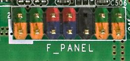
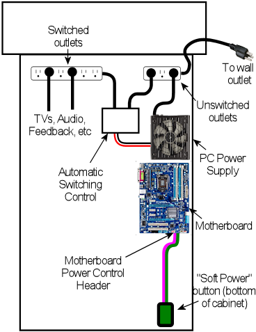
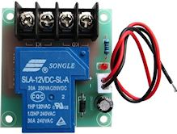
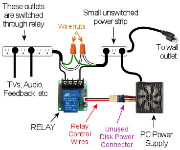
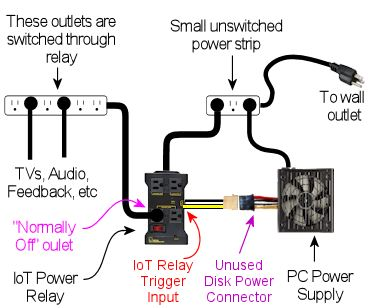
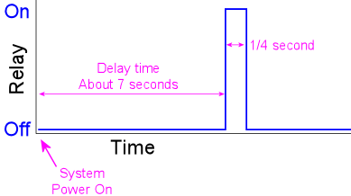
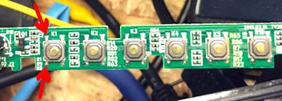
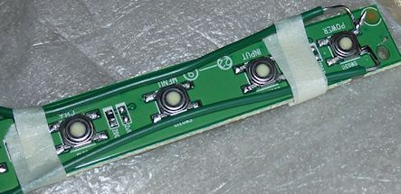

[#powerSwitching]
= Power Switching

When you push the ON button your virtual cab, you want everything to turn on automatically: all the TVs, the audio system, the feedback devices, etc.
Likewise, when you're done playing, you don't want to run around shutting everything off separately; you just want to press the OFF button and have the whole thing shut down.

There are some challenges to achieving this kind of power integration, but they can all be overcome with a little planning and setup work.
This chapter covers what you need to know to achieve single-button on/off control.

== Soft power control through the computer

The key to whole-system power control is to let the computer control the power.
Modern PCs are designed for "soft power" control, which means that the operating system software controls the power to the motherboard.
This is how Windows shuts off power when you select "Shut Down" from the Start menu.

Using the soft power control on the PC motherboard itself is easy.
You just need to wire a pushbutton to the power control pins on your motherboard.
These pins are usually part of the "Front Panel" or "F_PANEL" header.
If you were going to install the motherboard in a regular desktop case, the case would have a 10-pin connector that you'd plug into this header on the motherboard.

The exact location of the front panel header varies by motherboard, but it's usually easy to find.
Look for a 10-pin connector near one of the edges of the motherboard.
It's usually labeled F_PANEL or FRONT PANEL.

Intel defined a standard arrangement for this header a long time ago, so almost all motherboards use the same setup.
You should check your motherboard's documentation to be sure, but the power switch pins are almost always the *red pins* in the diagram above - pins number 6 and 8 in the standard numbering.

To power up the PC via the soft power control, all you have to do is connect those two red pins together for a moment.
To turn the power off through Windows, just momentarily connect them again.

To connect a pushbutton to the soft power controls, you simply connect one terminal of the pushbutton to one of the red pins, and the other terminal to the other red pin.
It doesn't matter which order they're connected in.

The standard place on a virtual cab to mount the power button is on the bottom of the cabinet, at the lower right corner.
See the "Floor" section in xref:cabBody.adoc#mainCabFloorPlan[Cabinet Body] for the standard location in the WPC cabinet plans.

=== Type of connector use with F_PANEL

The standard F_PANEL connector uses two rows of pins with 0.1" pin spacing.
This is a standard type of connector.
To learn more about how to build a plug to connect here, see "0.1" pin headers" in xref:connectors.adoc#connectors[Connectors] .
I'd recommend building a connector using a 0.1" crimp pin housing, as described in that section.

== Controlling everything else through the PC

If you have a desktop PC, you've probably noticed that your monitor shuts itself off whenever you power down the computer, and turns itself back on when you boot up the computer.
You don't have to worry about switching your monitor on and off separately; it just follows the PC's lead.

That's the template for how the cab should work.
We want the TVs and everything else in the cab to follow the PC's lead when turning on or off.

Unfortunately, we can't count on the other devices in a pin cab to switch themselves on and off with the PC the way a computer monitor does.
Computer monitors only do this because they're specifically designed for it.
They work by way of the video signal.
When there's no incoming video signal, a monitor assumes that the computer is turned off, so it goes into standby mode.
Regular TVs usually don't have this feature, nor do audio amplifiers or the miscellaneous power supplies we use in a pin cab for feedback devices.
So we have to give them some help, by adding our own power control machinery that we design to mirror the PC's power state.

There are two main options for implementing this, but they both work the same way: they control power to the *AC outlets* for the TVs and other devices, according to whether the PC is on or off.

The basic idea is that we install a power strip inside our pin cab, with a set of outlets for plugging in the AC power cords for the various devices.
But we have two kinds of outlets in the power strip: one special outlet for the PC, and a bunch of outlets for everything else.
The special outlet for the PC is always powered - that is, you effectively leave the PC plugged into the wall outlet all the time.
The other outlets are *switched* , meaning that they only receive power when the switch is on.
When the switch is off, they don't receive any power at all, so it's exactly like completely unplugging whatever's plugged into them.
We use those switched outlets for the TVs, audio system, and all feedback devices.

Conceptual outline of how the PC can control power to other devices.
The PC is plugged into an outlet that always receives AC power, allowing it to be switched on and off through the PC's "soft power" button.
The TVs, audio system, and feedback devices are plugged into a second set of outlets that are controlled by an automatic switching control.
The automatic control cuts AC power to the secondary outlets whenever the PC is off, forcing all the other devices to turn off.

The final piece of the puzzle is how the outlet switch is controlled.
It's not a "switch" in the sense of a wall switch that you operate manually.
Rather, it's an electronically controlled switch, controlled by the PC's power state.
When the PC is on, the switch turns on automatically.
When the PC is off, the switch turns off automatically.

Since everything except the PC is plugged into switched outlets, all of those devices have no choice but to follow the PC's lead.
When the PC is off, the switch cuts their power off at the source, so they have to turn off immediately whether they want to or not.
They don't need any in-built circuitry to know whether the PC is on or off; we override all of that and control their power at the source.

Let's look at the two main ways we can implement this "switched outlet" setup.

=== Option 1: Smart power strip

You can buy pre-packaged "smart power strips" from Amazon or Best Buy that implement the sort of behavior we've been describing.
This is supposed to be the easy way to implement a switched outlet, since it's plug-and-play.
Just plug your computer into the designated outlet and the strip does its magic.

The reason I hedged by saying it's _supposed to be_ the easy way is that it doesn't always turn out to be that easy.
Some people run into snags with it, which we'll come to in a moment.

If you want to buy a smart power strip, try searching online stores for "smart power strip" and "green power strip".
("Green" because they save energy by cutting power to idle devices.) The specific product I used in my cab is an APC P7GB, which works well for me.

A retail smart power strip will have a specially designated "master" outlet or "computer" outlet, which is where you plug in the PC.
The smart switching feature works by monitoring this special outlet to see if any power is flowing through it.
When the sensor detects power flowing through the master outlet, the strip figures that the PC is on, so it turns on power to the other outlets.
When the master outlet isn't drawing any power, the strip assumes that the PC is off, so it cuts power to the other outlets.

The good thing about this design is that doesn't require any special cooperation with the PC.
It doesn't need any special connections to the PC or any special software.
It works purely by monitoring the PC's power usage through its main power plug.

The weakness of the design is that nearly all PCs draw a little bit of power even when they're off, so the sensor in the smart strip that detects power usage in the master outlet has to be calibrated to allow for that.
The smart strip can't just wait for the power level to drop to absolute zero, because that never actually happens.
To make matters worse, there's no "standard" idle power level; every PC is a little different, and it can even depend upon what's connected to the computer, since some USB devices draw power through the PC even when the PC is off.
The maker of a smart strip doesn't know what kind of PC you're going to use with it, so they can't tailor the threshold level to your particular model.
They just pick a level based on averages across many models.
This _usually_ works, but not always.
Some PCs are so energy-efficient that they always stay below the threshold levels, so a smart strip might never detect that those PCs are on.
Other PCs draw enough power when turned off that they remain above the threshold levels at all times, so a strip might never detect that those PCs are off.

Every strip has its own power threshold level, and every PC has its own power characteristics, so it's not easy to predict if a given strip will work with a given PC.
The only way I know to find out is to test the specific pairing.
So if you're going to test a smart strip, buy it from a store with a good return policy, in case it doesn't work with your computer.

Another disadvantage of the packaged smart strips is that they usually have a mix of switched and non-switched outlets, which means that they don't have very many switched outlets.
For example, my APC P7GB only has three switched outlets out of 7 total, which isn't enough for all the things I need to plug into switched outlets.
That's easily solved by plugging a regular dumb power strip into one of the switched outlets to create more switched outlets, but that takes up extra space in the cab, so it would be tidier if the smart strip had more switched outlets built-in.

[#DIYSwitchedOutlets]
=== Option 2: DIY switched outlets

NOTE: there's a retail product called the IoT Power Relay that's almost exactly like the DIY solution we're about to describe, but it comes pre-built, saving you the work of finding the component parts and assembling them.
You might also prefer it for safety reasons, if you're uncomfortable working with high-voltage wiring.
See xref:#IoTPowerRelay[Option 3] below for more details.

A second way to implement automatic power switching is to build it yourself.
This is more complex than buying a retail smart power strip, but it's more reliable and more flexible.
It eliminates the problem that some smart strips have with properly sensing the on/off status of the computer.
If you have any problems getting a smart strip to work with your computer, you can use this approach instead.
This approach also makes it easier to add more switched outlets; the smart strips usually only have three or four switched outlets, which might not be enough for a decked-out pin cab.
(With a smart strip, you can always plug a dumb power strip into one of the switched outlets add more switched outlets, but that takes up more space in the cabinet.
If you build your own DIY switcher, you can start with a dumb strip that already has enough outlets for your needs.)

You'll need three things to build your own switched outlets:

* A small power strip (the ordinary "dumb" kind) with 2 or 3 outlets, to provide the *unswitched* outlets for the PC and the switched power strip
* A second ordinary power strip, with 6 or so outlets, to provide the *switched* outlets
* A 12VDC relay that can switch large power loads of at least 120VAC and 20A

For both power strips, I recommend buying strips equipped with surge suppressors.
The primary strip will be running your PC, and the secondary strips will be running your TVs, so both would benefit from surge suppression.

Relays that switch large loads are also known as *contactors* .
You can find suitable devices on eBay, built into little circuit boards that simplify the wiring.
Here's a picture of what to look for:

Search on eBay for "12V contactor board".
You should be able to find listings that look similar to the picture above.
(You don't need to find an exact match - the picture is just to give you an idea of what they look like.) The most common type currently listed has output limits of 250VAC and 30A, which is safely above our minimums.
Make sure the control signal is listed as exactly 12VDC.

WARNING: Be sure that your relay or contactor has a diode installed across the coil.
This is important because it protects the 12V power supply and your PC electronics from the voltage spikes caused by the relay's magnetic coil.
If you use an eBay contactor board, it'll probably have such a diode pre-installed, but you should visually inspect the board to make sure.
If you're using a plain relay or contactor you bought as a separate component, you'll have to install a diode yourself.
See xref:diodes.adoc#coilDiodes[Coil Diodes] for wiring instructions.

Here's the basic wiring diagram:

The theory of operation is simple.
When the PC is ON, the PC power supply sends power to the disk connectors.
This provides 12V to the relay, which turns the relay on, which in turn connects AC power to the switched power strip.
When the PC is in one of the "soft off" modes, the PC power supply turns off power to the disk connectors, which cuts the 12V power to the relay.
This switches the relay off, which cuts AC power to the switched power strip.
This is equivalent to unplugging everything connected to the switched power strip, so all the TVs and other devices will turn off.

Most of the connections shown are just a matter of plugging in power cords: plug the PC power supply into the unswitched outlet, plug the TVs and other devices into the switched outlet.
But there are three DIY steps required:

*Step one:* Find an unused disk connector on your PC power supply.
Connect the *control wires* from the relay board to the disk connector wires as follows:

*  *Red* relay wire → *Yellow* power supply wire
*  *Black* relay wire → *Black* power supply wire

See xref:powerSupplies.adoc#ATXDiskPlugWiring[How to connect 5V and 12V devices] in the Power Supplies chapter for instructions on how to connect wires to the disk connector plug.

*Step two:* Make absolutely sure everything is unplugged for this step, because we have to cut into the AC power wiring.

On this step, we're going to cut the power cord in half for your *second* power strip: the one with 6+ outlets that's going to become the switched power strip.
You don't have to cut it _exactly_ in half, though; you should cut it where it will be most convenient for your physical layout.
To figure out where that is, you should take a moment to do a rough fit in your cabinet to determine where you're going to situate the two power strips and the relay.
Look at the diagram above and observe how the power cord from the second strip is going to be split into two parts, with the relay in the middle.
Find a good point to cut the power cord so that you'll have a little slack on both sides of the cut when all of this is assembled.

Inside the power cord, you're going to find three internal wires.
They should be color coded black, white, and green.
The black wire is the one that we're going to connect to the relay.
This is the "hot" or "line" wire that carries the voltage, so it's the one we want to interrupt to switch the outlets off.

The white and green wires are going to simply connect directly across both halves of the split power cord.
In the diagram, we showed them connected by wire nuts, because we're assuming that you're going to have to cut the cord in half all the way through, severing all three wires inside.
If you're really careful, you might be able to save that step by cutting only the black wire in half and leaving the white and green wires intact.
If you can manage that, there's no need for the wire nuts.
If you do end up having to cut the cord fully in half, though, reconnect the white and green wires by stripping a bit of insulation off the ends (about 1/2" worth), feeding the ends into a wire nut, and twisting them together until their securely in place.
Make sure there's no exposed bare wire sticking out of the nut when you're done.
As shown in the diagram, connect green to green and white to white - all we're doing here is undoing the cut and restoring the green and white wires to their original condition.
You might want to wrap the nuts and some of the surrounding wire in electrician's tape when you're done to secure everything in place.

The black wires connect to the input and output terminals on the relay.
It doesn't matter which black wire goes to the input and which goes to the output; either way is equivalent.
The relay terminals might be labeled *input* and *output* or *K0* and *K1* .
Many of these boards have four terminals; when they do, each pair of terminals is simply connected together.
For example, there might be two terminals labeled K0; these are wired together inside the board, so you can just pick one of the two to connect one black wire.

*Step three:* Secure everything in place and cover the high-voltage wiring for safety.

Once everything is wired, permanently fasten the relay board to the cabinet floor (or wall) with screws.
I'd also recommend using standoffs, to leave a little open air under the board.
Secure the power strips in place.
I'd also secure the cut power cord portions, perhaps with wiring staples, to ensure that the wire nut joints aren't jostled or stressed and that the black wires can't be accidentally pulled out of the relay terminals.

Finally, you'll have to improvise a cover for the entire relay assembly, so that there's absolutely no exposed metal or wire.
The black wires will carry AC line voltage, which is hazardous high voltage.
You don't want to allow anything loose in the cabinet to come into contact with the AC wiring, and you don't want any risk of touching it yourself while working in the cabinet.
Remember that *the AC line voltage will be live on these wires whenever the cabinet is plugged in,* even when the computer is turned off.
I'd recommend going to Home Depot and getting a plastic electrical junction box, of the type used inside the wall in your house wiring for switches and outlets.
Get a box big enough that the relay board will entirely fit into it.
Place it over the relay board and screw it into the cabinet so that the relay is permanently covered.

[#IoTPowerRelay]
=== Option 3: IoT Power Relay

There's a retail product, called the IoT Power Relay, that implements the functionality described in the xref:#DIYSwitchedOutlets[DIY option] above, but without the need for you to buy individual components and assemble them.
You can buy these from Amazon and other online retailers; search for *IoT Power Relay* .
As of this writing (February 2021) they sell for about $27.

The IoT Power Relay is set up to trigger based on just about any AC or DC voltage, so you can set it up exactly as described above for the DIY option, using the 12V wires (yellow and black) from one of your primary PC power supply's unused disk connectors as the trigger source.
Note that the IoT Relay's trigger input is polarized, so you have to connect yellow and black in the correct order.
Be sure that the yellow wire from the disk plug connects to the "+" terminal of the IoT Relay trigger input, and the black wire from the disk plug connects to the "-" terminal of the relay trigger input.

Once you have that wired up, just get an ordinary "dumb" power strip, and plug it into one of the IoT Relay's "Normally Off" outlets.
The Relay may have outlets marked "Normally Off", "Normally On", and/or "Unswitched", depending on which revision you get.
For our purposes, you can ignore everything except the "Normally Off" outlets.
Those are the ones that switch ON when the trigger voltage from the main power supply switches on.
Note that you don't even need an extra dumb power strip if you only need two switched outlets, since all versions of the IoT Relay have at least two switched outlets built in.
For most cabs, though, that's probably not enough - you'll probably have four or five things that you want to plug into the switched power strip (secondary ATX power supply, 24V power supply, DMD or DMD video panel, backglass TV, audio amplifier).
The extra power strip is just there to provide those additional outlets.

== The TV Power Memory Problem

Now we come to the eternal bane of pin cab builders everywhere: power memory, or more typically, power forgetfulness.

If you've been following along for the first part of this chapter, your cabinet is now set up (or you at least have a plan) so that everything in it will turn on and off automatically with the computer.
This happens thanks to our "smart strip", which controls AC power to every outlet (apart from the computer's own outlet) according to computer's power status.

The "power memory problem" in a nutshell is that many TVs won't turn on with this setup.
Instead, they'll go into "standby" mode, where they'll stay dark while awaiting an IR remote control command.
A TV in standby mode won't show a picture even if it's receiving an active video signal.
This is bad for our "smart strip" system, because the smart strip makes the TV _think_ it's being plugged in anew each time the PC is powered up.
If the TV is designed to go into standby mode each time it's plugged in, the TV will effectively remain off, defeating our wonderful one-button power control.

=== How to tell if your TV has the problem

The only reliable way to determine if a particular TV has the power memory problem is to test it.
If you're still shopping and want to test a TV before you buy it, you really have to find the exact model you're considering in a showroom or friend's house and test that specific TV.
Don't count on similar models from the same manufacturer working the same way; it's not consistent across product lines.

The thing that really makes it hard to shop for this feature is that it's almost impossible to find good information about this online.
You won't find it listed in a spec sheet or Amazon product page, and most people won't even know what you're talking about it if you ask.
Your best bet is to ask on the virtual pin cab forums, because at least some people there will understand the question; even so, there are so many TV models that it's always hard to find someone who owns the exact one you're considering.

If you do have a way to test a model in person (or by proxy), you can get a definitive answer using the following text procedure.
Ideally, you should try this using the same video input on the TV that you're going to use when it's installed in your cabinet.
For example, if you're going to connect it to your PC by HDMI, run the test with the TV set to view an HDMI video source.
The reason this is important is that some TVs have different behavior on this test with different sources.

Here's the test:

* Plug in the TV
* Turn it on
* Let it run for a couple of minutes
* Unplug the TV *without* turning it off first
* Wait a few minutes
* Plug it back in

On that last step, if it turns back on and returns to showing the same video source as before, hooray! The TV has good power state memory.
It should just work automatically with a smart strip in a pin cab, so you shouldn't need to pursue any of the solutions below.

If the TV goes into standby mode after being plugged back in, it has the problem.
You'll need one of the solutions below if you want to use it in your cab and you want single-button power control to work properly.

=== Solutions to the TV power-on problem

Fortunately, the power memory problem can be solved.
Here are several possible solutions, in order of DIY-ness.

====  Solution 1: Buy a TV that doesn't have the problem

The easiest solution to this problem is to not have it in the first place.
You can simply decide when buying a TV that power memory is a must-have feature, and reject any models that lack it.

My guess is that about 50% of the people in the pin cab forums would agree with that approach, because they really don't want to mess with any of the workarounds.
Personally, I *don't* like this approach, because power memory is hardly the most important thing to me about choosing a TV.
I think it's much more important to consider picture quality, motion blur, input latency, physical fit for the cabinet, price, and probably a few other features, before worrying about whether it has power memory.
You might rule out some otherwise superior candidates if you consider this a deal-breaker.
I'd only consider power memory a "nice-to-have" feature, meaning I'd only use it to decide between sets that are otherwise equals.
The power memory problem is solvable by the other means we'll see below, so it's really not the end of the world if your TV needs a little help powering on.

====  Solution 2: Keep the remote handy

Of the 50% of cab builders who _don't_ think power memory is the king of all TV features, I'd guess that about 50% of them throw in the towel on single-button power-up if their TVs don't have it.
Because there's always the easy manual solution: keep the remote handy and press the On button every time you power up the cabinet.

This really isn't a terrible solution.
I'm too much of a perfectionist to accept it for my own cab.
It's not the inconvenience of it that's the problem for me; it's just that it makes the project feel a little unfinished.
But in practical terms, it costs no significant amount of time and is only a minor inconvenience.
If you can live with the rough edge, and the solutions below seem like more trouble than they're worth, you can stop here and call it done.

====  Solution 3: Tape down the On button

For some TVs, you can get away with a simple hack.
It's inelegant (which is, after all, the proper definition of "hack"), and it doesn't work at all on most TVs.
But it's worth trying, because if it does happen to work on your TV, it's a really simple solution that you can implement in a matter of minutes.

Here's the idea.
On some TVs, if you keep the on/off button pressed down _all the time_ , the TV will turn on and stay on whenever you plug it in.
If your TV works this way, you can improvise some simple mechanical way of keeping the button pressed down permanently.

Before you start thinking about how to stick the button down, test your TV to see if the trick works for it:

* Unplug the TV.
* Manually hold down the On/Off button.
* Keep holding down the button while you plug in the TV.
* Keep holding it down continuously for a couple of minutes.

Don't let go even briefly on that last step.
The point is to test to see if holding the power button down for 10 seconds or 30 seconds or 60 seconds activates some special hidden action, like powering the TV back off, or rebooting it, or bringing up a service menu.
"Long press" gestures often do something special like that on modern electronics, since everything these days needs to have a way to reboot it in case of software crashes.
30 seconds is almost always enough for a "long press" to take effect, but I'd give it a couple of minutes just to be sure.

If the TV turned on and stayed on, *and* you didn't activate some special hidden action by holding down the button for a long time, the hack will work.

To implement the hack, you just need to fashion something mechanical to hold down the button permanently.
For some models, it's as easy as wrapping some duct tape around the bezel to apply pressure to the button.
If that doesn't work for your TV's geometry, try taping a small object (a few pennies, perhaps) between the button and the tape, or try fashioning the right shape out of a paper clip or a little strip of sheet metal.
If you have a 3D printer, maybe you can come up with the right shape for a custom plastic clip.

The big limitation of this hack is that it only works for certain TVs.
Many TVs will respond by cycling repeatedly between On and Off or activating some special action.
That's why you should try the test before worrying about how to implement the hack.

====  Solution 4: Pinscape TV ON system

If you're using the Pinscape expansion boards, there's a feature built in to help deal with TVs that won't turn on automatically when plugged in.
The Pinscape boards have a power sensor that tracks the power supply status, and two mechanisms for sending an ON command to the TV: a relay that can be hard-wired to the TV's On/Off button, and an IR emitter that can be programmed to send the TV's IR remote control command code to turn on.
These features can be configured in the Pinscape software to send the TV ON signal (by relay and/or remote) after an adjustable delay interval after the rest of the system powers up, to give the TV a chance to "boot up" and make itself ready to receive commands.

See xref:tvon.adoc#tvon[TV ON Switch] for full details.

====  Solution 5: eBay timer board

You can build your own equivalent of the Pinscape TV ON feature using a type of electronic timer circuit board available on eBay.

WARNING: I recommend against using this solution, because it requires taking the TV apart; it's only included here for reference.
If possible, use the Pinscape IR transmitter solution instead.
See xref:tvon.adoc#tvon[TV ON Switch] .
The IR approach is non-invasive and fairly easy to build.
You can use it even if you're not using Pinscape for anything else.

This approach works by simulating a manual button press on the TV's On/Off button, shortly after the system power is turned on.
We don't physically press the button, but rather simulate it electronically, by soldering wires to the button's switch contacts and connecting them briefly at the proper moment.

There are three important details required to make this work properly:

* We have to sense when the TV power switches from OFF to ON
* We have to wait a few seconds after that, to give the TV time to initialize
* We have to simulate a _momentary_ button press only; we can't continuously hold down the button.

To accomplish all of this, we need a timer circuit.
The circuit has to be triggered by the power coming on.
It then has to pause for a delay time, long enough for the TV to get ready to accept command input, then it has "press the button" for just a moment.
Here's what the timing looks like:

We're assuming that the timer is controlling a relay (an electronic switch).
The "button press" is simulated by the relay toggling on briefly.

To implement this, we need the timer circuit itself, and then we need to connect it electrically to the TV's On/Off button.

*Buying a timer:* Suitable boards are available on eBay, but unfortunately it's rather difficult to find the needle in the haystack for this sort of item.
The ones you're looking for are no-brand hobbyist products sold by Chinese companies, so there's not a particular store or product name I can point you to.
You'll have to sift through the listings to find the right thing, but here's an eBay search term you can use as a starting point: "relay cycle timer".

To find the right timer, first make sure you find something with a relay.
Most of the timer boards you'll find do use a relay, but some use solid-state switches (such as MOSFETs) instead.
A relay is important for this application.
Second, read through the descriptions and look for a list of "modes".
The mode you're looking for should be described like this: "when the power turns on, the relay is disconnected, then delay T1, turn on the relay, delay T2, turn off the relay".

When you get the board, you'll have to program it according to the instructions (if any are provided) to set the correct mode and delay times.
Set the initial delay time to about 7 seconds, and the second delay time to about 0.25 seconds.
You can test that it's configured properly by cycling the power: each time you plug it into power, there should be about a 7 second delay, and the relay should click ON and immediately OFF.

*Connecting to the TV:* You'll have to be comfortable with taking the TV apart at this stage, because we have to connect some wires to the On/Off button.

There are no generic instructions for taking a TV case apart, so you're on your own for this part.
Your goal is to open the case and expose the little circuit board containing the On/Off button.

CAUTION: Needless to say, use extreme caution with this step.
In modern LCD TVs, the LCD panel and polarizing filter are very thin, brittle plastic sheets and often have no structural support other than the outer case, so it's very easy to crack them during the removal process or after the case is off.
Removing the case will also void the warranty, so you're assuming the entire risk of breaking something by proceeding.

Once you get the case open, you should find a little circuit board located under the area where the buttons on the case are situated.
It's usually long and narrow, and looks something like this:

The red arrows in the photo above show the soldering points for the button leads.
The little squarish silver objects are the buttons.
These are normally situated immediately under the exterior plastic buttons on the TV's bezel; pressing on the exterior plastic button has the effect of pushing down on this metal part, which is the real button.

Once you find this circuit board, identify which button corresponds to the On/Off button on the outer case.
Do this by position: just find the inner button that's situated underneath the On/Off button on the case.
You can also do this by counting buttons from right to left, since there should be the same number of silver buttons on the circuit board as plastic buttons on the case.

Next, identify the switch leads.
There are probably four leads to these switches, one at each corner.
On the TVs I've looked at, the leads are in pairs that are electrically connected together, so there are really only two wires here even though it looks like four.
Put your multimeter in continuity test mode and check the leads in pairs.
Find a pair that are *not* connected normally, but that become connected when you press the button.
These are the leads you want to solder to.

The next step is possibly even more delicate and tricky than opening the case.
You have to solder wires to the button leads you just identified.
To do this, use fine hookup wire, 24 AWG or thinner.
Strip a very short length of insulation from the ends, around 1/8".
Melt a little solder onto the end of the wire.
Position the end of the wire at the desired contact point.
Now get out some tape (I used thin strips of masking tape here) and secure the wire to the board a couple of inches away from the contact point.
The idea is to hold it in place at the desired position before soldering so that the solder can just flow over the junction with everything already positioned properly.
Once everything is in place, heat the end of the wire for a few moments, long enough for the solder to melt and flow onto the switch lead.
Remove the soldering iron carefully and try to hold everything very still for a few moments so that the solder can solidify over the junction point.
If all went well, the wire should stick to the switch lead.
The connection will be delicate at best, so you'll want to secure the wire with a couple more pieces of tape to minimize mechanical stress on it.

TV On/Off switch with wires soldered to leads

Repeat this process for the second lead.
Once both are soldered and held securely in place with tape, test your work with the multimeter.
Use continuity test again.
Connect the meter leads to the free ends of the wires you just soldered.
The meter should read open/no connection.
Press the button, and the meter should read closed/connected.
If that works, you're set.
Put the TV case back together, taking care to run your newly attached wires out a suitable opening.

Now you just need to connect the newly attached wires to the timer board relay.
Attach the wires to the relay *common (COM)* and *normally open (NO)* terminals on the timer board.
(If the relay only has two switch terminals, those are the two to use!)

Finally, to power the relay board itself, connect its DC+ and DC- terminals to the appropriate voltage inputs from the *secondary* ATX power supply.
For example, if it requires 5V for power, connect its DC+ input to the red +5V wire on the secondary power supply, and connect its DC- input to the black 0V/Ground wire on the secondary power supply.
See xref:powerSupplies.adoc#powerSupplies[Power Supplies for Feedback] for advice on connecting wires to the power supply.

Note that you *must* use a secondary ATX power supply to power the timer board ( _not_ the main PC power supply), and the secondary power supply must be plugged into the *switched* power strip.
That's key to the whole scheme, because the timer board has to be powered up at the same time as the TV in order for the countdown to start at the same time the TV receives power.

====  Solution 6: DIY timer circuit

This works much like the eBay timer board described above, except that it saves you the trouble of tracking down the right item on eBay.
The tradeoff is that you have to assemble your own circuit board instead.
But you don't have to design the circuit: you can just build it from my plans.

WARNING: As with the eBay timer board, I recommend against using this solution, because it requires taking the TV apart.
If possible, use the Pinscape IR transmitter solution instead.
See xref:tvon.adoc#tvon[TV ON Switch] .

You can download the schematic, in EAGLE and PDF format, along with and an EAGLE printed circuit board layout, here:

link:http://mjrnet.org/pinscape/downloads/TVOnTimer.zip[TVOnTimer.zip]

WARNING: *Beta test warning:* I haven't built or tested this incarnation of the schematic linked above, which is an EAGLE rendition of the original hand-drawn schematic I used to build the TV ON timer in my own cab.
The circuit I built based on the hand-drawn original is well-tested (I've used it for several years without a hitch), but I could have made errors doing the EAGLE translation.
I also haven't done a test run of the board design, although my experience has been that EAGLE PCB layouts work fine as long as the schematic is sound.
If you're willing to be a beta-tester for these plans, please let me know how it goes!

*Before ordering parts, check your TV's timing!* If you need different timing, you will need to order different values for parts C8 and/or R10.
These parts determine the initial delay time.
The delay time can be calculated from these as:

stem:[1.1 × R × C]

where *_R_* is in Ohms and *_C_* is in Farads.
With the default values as shown in the shematic, the delay is stem:[1.1 × 2.2M × 2.2uF = 5.3] seconds.
Before you order parts, test your TV to determine if it requires a longer delay time:

* Unplug it
* Wait a few minutes
* Plug it in
* Use a timer to wait for 4 seconds
* Press the On button

If the TV turns on, try the test a few more times to make sure the timing is reliable.
If so, the default 5 second delay should work.
If your TV ignores the first button press on some trials, it probably needs a longer delay time.
Try the test again with longer wait times until you find the shortest reliable waiting period.
I'd add a second or two to the result as a cushion.
Now you can reverse the timing formula above to find new values R10 and/or C8.
For example, if you need a delay of 7 seconds, you could keep the resistance value the same and calculate a capacitor value of 2.89uF.
Round up to the next common size, which in this case is 3.3uF, which would make the actual wait time about 8 seconds.

*Build the board:* Assemble the circuit, following the schematic or using the printed circuit board (PCB) design provided in the plans.
The circuit is complex enough that I'd recommend building it on the PCB rather than ad hoc.
You can have the PCB manufactured by link:https://www.oshpark.com/[OSH Park] for about $12 for three copies of the board, or at any PCB maker of your choice.
You'll have two copies of the board left over to give to friends or use on your next cab!

*Install the TV wires:* The next step is to open your TV and solder wires to its On/Off button.
The procedure is described in the section on eBay timers above.

*Connect the board:* Once you have wires connected to the TV's On/Off button, connect the other ends of the wires to one of the "K1" relay switches, on the Normally Open side.
If you're connecting directly to the relay, connect to pins *4 and 8* or pins *9 and 13* .
The relay in the spec is double-pole, meaning that it can switch two separate televisions on at the same time.
That's why you have your choice of which relay pins to connect.
If you have a second TV that needs the same treatment, you can simply connect it to the other pair of pins.
If you use the PCB design, connect the TV wires to JP12 pins *1 and 2* (labeled "TV1" on the board silkscreen) or pins *3 and 4* ("TV2").

*Connect power to the board:* Finally, connect the power inputs to your *secondary* ATX power supply.
As with the eBay timer, the scheme is predicated on the timer getting its power through a source that's switched on at the same time as the TV, because the power-on time is the start of the delay timer countdown.
If you're building from the schematic, connect VCC to +5V (a red wire) from the ATX supply, and connect GND to ATX ground (a black wire).
If you're using the PCB layout, connect an ATX red wire to the JP7 +5V (marked on the silkscreen), and connect a black wire to JP7 GND.
See xref:powerSupplies.adoc#powerSupplies[Power Supplies for Feedback] for advice on connecting wires to an ATX power supply.

This circuit design is designed for this single function, so there's no need to "program" it as with the eBay timers.
All you have to do is plug it in and it should work.

====  Solution 7: Use a USB IR transmitter

I'm only going to provide an outline for this solution, because I haven't tried implementing it myself.
You'll have to do a little product research to fill in the details.

You can buy a device for your PC that lets you plug an IR transmitter into a USB port.
Software on the PC can then command the IR transmitter to send a signal.
You can use one of these to send the ON command to your TV via IR remote during the Windows boot process.

I don't have any specific product recommendations, but your best bet might be to search for "winlirc transmitter" or "winlirc blaster".
winlirc is open-source software that lets Windows send and receive IR commands, so a winlirc-compatible device with a transmitter should serve the function we need here.

Once you find a suitable device, install it on your PC and arrange the IR emitter so that it's within range of your TV's remote receiver.
Now you just need to set up a script on the PC that sends your TV's ON command while Windows is booting.
You should be able to do this by creating a .CMD file containing the command line sequence to send the IR command, then placing a shortcut to the .CMD file in your Start menu's Startup folder.

