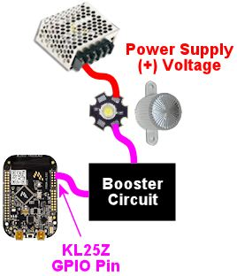
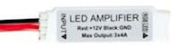

[#psOutputsStandalone]
= Pinscape Outputs Setup (Standalone KL25Z)

The standalone KL25Z (without the expansion boards) is capable of controlling feedback devices such as LEDs, motors, and solenoids.
However, there are some important limitations you should be aware of:

* The GPIO pins on the KL25Z have _extremely_ low power limits, so you can't ever connect a feedback device directly to a GPIO pin.
*All* devices have to be connected through "booster" (amplifier) circuits, which you have to build separately and connect to the KL25Z.
You really do need boosters for *everything* , even small LEDs, because the GPIO power handling limits are simply too low to connect anything directly.

There are several options for booster circuits that you can use for different types of devices.
Full instructions are provided later in this section.

* The number of devices you can connect is limited by the number of available GPIO pins, because each output device requires its own dedicated GPIO pin.
The KL25Z has about 50 GPIO pins in all, but remember that many of them will be needed for other purposes, such as button inputs and plunger sensor connections.
In the default configuration, there are only about 20 pins available for feedback devices.
You can change the pin assignments with the Config Tool, so you can take some pins that are assigned by default to other functions and reassign them as feedback outputs, but that will of course reduce the number of pins available for those other functions.
* The KL25Z only has 10 PWM channels.
PWM is needed if you want to control the brightness of an LED or the speed of a motor; without PWM, a GPIO pin can only act as a simple on/off switch.
10 channels isn't enough for the standard five-flasher setup, since each RGB flasher needs three PWM channels (one each for red, green, and blue).

If you can live within these limits, the standalone KL25Z makes a great output controller at low cost.
If you need more outputs in general or more PWM outputs in particular, you might want to consider adding the Pinscape expansion boards - which were specifically designed to overcome all of these limits - or one of the commercial I/O controller devices.
See xref:expan.adoc#expan[Expansion Boards Overview] for more on the expansion boards, and xref:ioControllers.adoc#ioControllers[I/O Controllers] for a survey of the commercial alternatives.

An additional option for adding more outputs, if you run out of available GPIO pins, is to simply add a second KL25Z.
The Pinscape software is set up so that you can run multiple KL25Z's in the same system.

== Viewing and assigning output ports

Most of the GPIO pins on the KL25Z can be assigned to different purposes using the Pinscape Config Tool.
The default configuration for a standalone KL25Z (without the expansion boards) assigns 22 pins as output devices, but you can add more output ports by reassigning pins assigned to other purposes, such as button inputs.

To view the list of ports currently assigned as output pins:

* Run the Pinscape Config Tool
* Go to the Settings page
* Scroll down to the *Feedback device outputs* section

That will show you a list of all of the pins assigned as output ports.
Each port has a port number, which is used to identify the port in the link:https://configtool.vpuniverse.com/[DOF Config Tool] .
That port number is just an abstract label, for DOF's sake, that doesn't mean anything in terms of KL25Z hardware.
To find the KL25Z hardware pin, scan across the row to find the GPIO pin.

Each row also show a port type, which can be Digital Out or PWM Out.
Digital ports are simple on/off ports, with no ability to control brightness or intensity.
PWM ports can set different brightness levels on the output, so they're best for LEDs and other lighting devices.
("PWM" stands for "pulse width modulation", which means that the port switches on and off very rapidly.
The ratio of "on time" to "off time" determines the effective brightness or intensity.) PWM ports are also good for shaker motors and fans, since the intensity control can be used to adjust the speed of the motor.

The KL25Z has an inherent hardware limit of 10 PWM ports.
Further, only certain pins (about 20 of them) have PWM capability at all.
There's no need to memorize which pins are which; the Config Tool's pin assignment dialog always shows you the available pins of each type.

A "Virtual" port is simply a port that's not connected to anything.
It still shows up over the USB connection, so DOF and other PC software can access it as though it were actually there.
But when DOF sends it a command, it'll just harmlessly ignore the command.
Virtual ports let you satisfy DOF's expectations that a certain number of ports are present even if you don't have enough physical GPIO pins available for all of the ports DOF expects.

To add a new output port, go to the feedback device outputs section as described above, then:

* Find one of the ports that's currently marked "Virtual".
If there aren't any of those, click the "+" icon in the blank row at the very end of the list.
That will add a new Virtual port.
* Click the pin assignment box (currently "Virtual") in the port row you want to assign.
This will open a pin selector dialog.
* In the pin selector, click the type of port you want to add at the right (Digital Out or PWM Out).
* Select the GPIO pin you want to assign.

WARNING: A pin can only be assigned to one function at a time.
The dialog will allow you to select pins that are already assigned to other functions, but if you do, the pin will show a little error icon () next to the pin.
You *must* resolve any such warnings before the device will work properly.

To determine what a pin warning means, simply click the warning icon.
This will pop up a dialog explaining what's wrong.
The usual problem is that you've assigned the same pin to two or more functions.
That's simply not workable at a hardware level, so you'll have to remove the conflicting assignment(s).
The warning message in the popup will tell you exactly where the conflicting use is assigned.
Go to the appropriate section of the Settings page and remove that conflicting assignment.

== Wiring KL25Z outputs

The basic wiring plan for a KL25Z output looks like this:

The complication is that little box labeled "booster circuit".
That's required because the KL25Z itself only allows a tiny, tiny amount of current to flow through each GPIO pin.
Too much current will damage the KL25Z by overheating its delicate internal wiring.

The reason we show the booster circuit as a little box rather than an electronic schematic is that you have multiple options for what to put there.
We'll look at some common options in a moment.

Note that the diagram above also leaves out other details specific to the type of output device.
For an LED, you'd need a current-limiting resistor somewhere in the wiring; see xref:ledResistors.adoc#ledResistors[LED Resistors] .
For a coil, solenoid, motor, etc., you'd need a diode to protect against the magnetic field effects; see xref:diodes.adoc#coilDiodes[Coil Diodes] .
See the descriptions of the individual types of feedback devices for more details on each one's special needs.

Remember, the exact KL25Z pins that correspond to output ports are under your control! That's why we're not just printing a list here - there is no fixed list to print.
To find out what's currently assigned in your setup, look at the Settings page in the Pinscape Config Tool as described above.

=== NPN booster

This is a simple and inexpensive booster you can build for a low-power device, up to about 600mA at 40V.
That's enough for a small incandescent lamp (e.g., a #555 bulb in a front-panel button), a flasher LED, or a small relay.

The power supply (+) and GND connections are meant to connect to the secondary power supply that you're using for the feedback devices.
Note that you should provide a wire directly to the power supply ground from the transistor's emitter, as shown, rather than connecting it to a Ground pin on the KL25Z.
The KL25Z ground pins ultimately do all connect back to the power supply grounds, but they go through the computer's USB port, which has limited current carrying capacity.
It's important to bypass that with a wire directly to the power supply ground to avoid forcing too much power through the USB port.

The 2N4401 is a common transistor that should be easy to find, but there's nothing magical about that particular part.
There are hundreds of similar "small signal transistors" that can be substituted.
Common substitutes: BC547, 2N3904, PN2222.
If you do substitute a different transistor, check its data sheet for the power limits, since the limits quoted above (600mA, 40V) are specifically for the 2N4401, and other transistors might have different limits.
The maximum values to look for in the data sheet are the "Absolute Maximum" ratings for:

* Collector-Emitter Voltage (V~CEO~ ): maximum power supply voltage for the feedback device
* Collector current, continuous (I~C~ ): maximum feedback device current

Any ordinary 2.2K resistor will work.
(The smallest resistors are usually 1/8 Watt, which is perfectly fine for this job.
Higher wattage resistors will work as well but are unnecessary.)

=== DIY MOSFET booster

This is my go-to booster circuit.
It's the one used in the Pinscape power boards.
It's versatile enough for just about anything you'd want to put in a pin cab, including high-power toys like shaker motors and replay knockers.
The exact power limit depends on the specific MOSFET you choose, but common MOSFETs are readily available that can handle way more than you'd ever need, upwards of 10 or 20 Amps.

This circuit is more complex than the NPN booster above, but it's still pretty simple - only five parts.

If you need help decoding the schematic, see xref:electronics.adoc#electronics[A Crash Course in Electronics] .

The resistor slots can all be filled with ordinary resistors with the specified "Ohms" values.
There's no special Wattage rating needed for any of these.

Which MOSFET to use? Here's a list of parts I've tried that work well:

* BUK7575-55A
* FQP13N06L
* FQP30N06L

But lots of other MOSFETs will work just as well.
Any N-channel type sold by an Arduino or robotics company will probably be suitable, since robotics projects often use these parts exactly the same way we do (and for the same reasons).
If you want to cast a wider net by looking on Mouser, the basic type of part you need is an N-channel enhancement-mode MOSFET - but that turns up about 8,000 matches on Mouser, so here are some more specific characteristics to look for:

* Low "on" resistance (R~DS(on)~ ), below 1Ω (preferably something like 100mΩ)
* Drain-source voltage (V~DSS~ ) sufficient for your feedback device power supply, preferably above 40V
* Continuous drain current (I~D~ ) sufficient for your feedback device's needs, preferably above 10A
* Through-hole package (for easier soldering)

Here's a Mouser search for those characteristics.
This still matched about 1,400 parts when I tried it, so it doesn't exactly narrow things down to a trivial selection, but I'd sort by price, pick one of the cheaper ones, and scan the data sheet to make sure it looks like a suitable part for logic applications.

link:https://www.mouser.com/Semiconductors/Discrete-Semiconductors/Transistors/MOSFET/_/N-ax1sfZ1yzvvqx?P=1z0y3zrZ1yiaumvZ1z0z63xZ1z0y4ci&Rl=ax1sfZgjdhp3Z1yw78ezZ1ypyijjSGgjdhozZ1yw76gfZ1yvixgtSGgjdhp2Z1y9673jZ1yw76gjSGT&Ns=Pricing|0.html[Mouser MOSFETs]

As with the NPN booster above, the power supply (+) and GND connections are meant to connect to the secondary power supply that you're using for the feedback devices.
(Don't connect "Power Supply GND" through a KL25Z Ground pin.)

If you're connecting a device with any sort of coil (including solenoids, relays, contactors, and motors), be sure to use a diode with the device, as explained in xref:diodes.adoc#coilDiodes[Coil Diodes] .

NOTE: the old version 1 Pinscape Build Guide had a similar circuit plan for a MOSFET booster, but that plan added a Darlington transistor chip between the GPIO pin and the PC817.
This newer version dispenses with that extra chip.
The purpose of the Darlington was to boost the weak signal from the KL25Z to better drive the opto, because I was concerned in the early days about the optos being sensitive enough for the KL25Z to drive them directly.
Experience has shown that the extra boost isn't needed, so I've simplified the circuit plan to remove the unnecessary extra part.
The older plan will still work just fine, too, it's just more complicated than it has to be.

=== Pre-built MOSFET booster

Thanks to the popularity of Arduinos and hobby robotics, you can buy pre-built boards that implement roughly the same circuit as the DIY MOSFET booster above.

There's no name-brand board or seller that I can point you to, unfortunately.
The boards I've seen are sold on eBay and Aliexpress.com, so the sellers are small shops that come and go.
If I gave you a link here, it would probably be gone by the time you tried it.
So instead I'll tell you what to search for on those sites: try something like "Four channel MOSFET board".

Most boards like this will have a very similar design to the DIY MOFSET circuit shown above.
The one big difference will be that the resistor between the signal input terminal (where you connect the KL25Z GPIO pin) and the optocoupler will typically be smaller than the one in the DIY circuit.
That's because generic boards like this will always be intended for use with an Arduino, which has much higher power capacity on its GPIO pins that the KL25Z does.

So I recommend the following procedure:

* Set up the board as recommended by the manufacturer, but *add a 1K resistor* between the KL25Z GPIO pin and the input terminal on the board.
* Test it (with the Pinscape Config Tool's output tester, for example) to see if the output turns on as expected.
If so, you're done!
* If it doesn't turn on, try removing the 1K resistor and replacing it with a 680Ω resistor.
Repeat the test.
If it works, great; if not, drop to 470Ω and try again.

The point of the extra resistor is to reduce the current on the GPIO port to a safe level for the KL25Z.
The KL25Z has a maximum limit of *4mA* per port.
These boards are usually designed to work at about 20mA, because the Arduino can tolerate the higher current.

If you have a multimeter, you can test the actual current being drawn on the port to verify that it's within the safe range, below 4mA.
You can try resistors below 470Ω if necessary, but if you do you should measure the current to verify that it's not too high.

=== Sainsmart booster

There's a non-USB version of the Sainsmart relay boards, designed mostly for Arduino users, that can be be used with the KL25Z.
Some people using the Pinscape software have successfully used that as a booster.
However, I don't recommend it, because I've heard too many bad things about reliability.
The relays reportedly have a short lifetime (weeks or months) when used in a pin cab.
The transistor solutions above are much more reliable, and probably cheaper.

=== LED strip mini amplifier

If you search on eBay for "LED strip mini amplifier", you'll find products that look like this:

Some people have used these successfully with the KL25Z as a power booster circuit.
However, I don't recommend doing this, because some of these devices are electrically incompatible with the KL25Z and can damage it if attached directly.
It's difficult to tell whether a given mini-amp is safe to use with the KL25Z, so my advice is simply to avoid them entirely.

== Testing and troubleshooting

The best way to test your connections is using the Pinscape Config Tool:

* Make sure all of the wiring is in place for the feedback device you want to test
* Run the Config Tool
* Click on the Output Tester button
* Find the port you want to test in the list
* For a PWM port, use the slider to test the brightness control.
For a digital out port, use the ON/OFF button to test it.

The output tester sends commands directly to the KL25Z via the USB connection, so it bypasses other software layers (such as DOF and VPinMAME).
If a port is working in the output tester, you can be confident that the hardware and wiring is all working correctly, and that any problems you're having with it in Visual Pinball or other programs are purely software configuration issues.
If a port _isn't_ working in the output tester, the problem is probably in the wiring or in the feedback device itself.

=== Voltmeter tests

You can do some simple testing with a voltmeter to confirm that the KL25Z is sending the right signal to the GPIO pins.

This test has to be done with the power on, so be careful! Make sure that you only touch the meter's probes to the pins you want to test, and that you don't short together adjacent pins.
The pins are closely spaced, so you have to be really careful about this.

* Disconnect the output from the GPIO pin you want to test (including both the feedback device *and* the booster circuit)
* Power up the system
* Run the Pinscape Config Tool
* Click on the Output Tester button
* Set your meter to DC Volts
* Connect the meter's black probe to one of the KL25Z's ground (GND) pins, _or_ to any convenient ground connection to your power supplies.
(Remember that all of the grounds should be interconnected, as described in xref:powerSupplies.adoc#powerSupplies[Power Supplies for Feedback] , so any of these points should be equivalent.)
* Connect the meter's red probe to the GPIO pin you want to test
* When the port is *off* in the output tester, it should read close to 0V (exception: an Active-Low port should read close to 3.3V)
* When the port is *on* in the output tester, it should read close to 3.3V (exception: an Active-Low port should read close to 0V)

If this test passes, your KL25Z is working correctly, and the software is configured properly so that the software port is connected to the physical GPIO pin.
Any problems must be in the wiring to the booster circuit and/or to the feedback device.

If this test fails, either your KL25Z hardware is broken, or you have a problem with the software configuration.
Check carefully that the pin you're looking at in the output tester matches the physical pin that you're testing on the KL25Z.
Look very closely - make sure that you don't have the KL25Z flipped upside-down, for example, since that would make all of the pins in the mirror-image locations from where you think they are.

== DOF Setup

To set up your standalone Pinscape device with DOF, you of course have to install DOF on your PC first.
See xref:DOF.adoc#dofSetup[DOF Setup] for instructions.

Once the DOF software is installed, you use the link:https://configtool.vpuniverse.com/[DOF Config Tool] to tell DOF that you have a Pinscape unit, and to tell it which KL25Z pins are attached to which output devices.

* Open the link:https://configtool.vpuniverse.com/[DOF Config Tool] in your browser
* Click the My Account tab
* Set *Number of Pinscape devices* to 1 (or if you have more than one KL25Z running the Pinscape, select the appropriate number of devices instead)
* Set *Number of KL25Z devices* to *0* (see xref:#output_standalone_psOrKl25z[below] if this seems confusing)
* Save changes
* Go to the Port Assignments page
* Select "Pinscape 1" in the Device drop list
* Go through the port list, assigning each port number in the DOF list to the device that you wired to that port on the KL25Z

The port list in the Port Assignments page uses the same port numbering (Port 1, Port 2, etc) that's shown in the Pinscape Config Tool output port list.
This *isn't* the GPIO port name or physical pin number on the KL25Z.
It's just the abstract port number from the output port assignment list.

To figure out what DOF's "Port 1" or "Port 2" means in terms of the physical GPIO pin on the KL25Z, you have to look at the output port list in the Pinscape Config Tool's Settings page.
In the output list, find the same port number shown in DOF - if you're looking for DOF's "Port 1", you want the first row, #1, in the Pinscape output list.
Trace across the row to find the KL25Z port name and pin.
If you want to see a picture of where that pin is physically located on the KL25Z, click the pin name in the row - that will pop up the pin selector, which will show the pin location highlighted on a picture of the KL25Z.

=== Using two (or more) KL25Zs

If you like the idea of using a standalone KL25Z as your output controller, but you need more ports, there's an easy solution: add a second KL25Z.
Or even a third or fourth.
Additional units give you more output ports - and on secondary units, you don't even have to share GPIO pins with other functions like buttons and plungers.
You only need those input pins on the first KL25Z unit, so nearly all of the pins on secondary units can be reassigned as outputs.

The Pinscape software is set up so that you can have up to 16 separate KL25Z units in your system.
The only additional setup work required to add a second KL25Z is to give it a unique ID, using the Pinscape Config Tool:

* Detach all of your other KL25Z units
* Attach the new one you want to program with a new ID
* Run the Pinscape Config tool
* Go to the Settings page for the unit
* In the *USB ID* section, set the ID to LedWiz Unit 9
* In the *Pinscape ID* section, set the ID to Pinscape Unit 2
* In the *Joystick* section, un-check the "Enable joystick input" box

Repeat this process for each additional KL25Z, advancing to the next LedWiz Unit number and Pinscape Unit number for each additional device.

(The USB ID doesn't actually have to be an LedWiz unit number at all, and doesn't have to be in this exact order.
That's just the recommended order for the widest software compatibility.
You should, however, use Pinscape unit numbers 1, 2, and so on, in that order.
The DOF Config Tool is difficult to set up otherwise.)

Why disable the joystick input? Because you want to make sure that only one of the KL25Z units is sending accelerometer (nudge) readings to the PC.
Pinscape sends those readings by default, so you have to turn off the readings in all of your secondary units to avoid confusing the PC with a barrage of different information from different units.

*DOF setup:* To set up a second Pinscape unit with DOF:

* Open the link:https://configtool.vpuniverse.com/[DOF Config Tool] in your browser
* Click the My Account tab
* Change the "Number of Pinscape devices" to the appropriate number
* Save changes
* Go the Port Assignments page
* Select "Pinscape 2" in the Device drop list
* Set up the ports for the devices attached to the second KL25Z
* Repeat for additional units

[#output_standalone_psOrKl25z]
=== Is it a "Pinscape device" or "KL25Z device" or both?

The online link:https://configtool.vpuniverse.com/[DOF Config Tool] has a confusing bit of terminology in the device setup section on the "My Account" page.
In the list of devices, you'll find separate entries for "Number of Pinscape devices" and "Number of KL25Z devices".

For Pinscape boards, use *only* the *Pinscape devices* option.
Always leave "Number of KL25Z devices" set to zero (0).
This applies whether you're using the expansion boards or a standalone KL25Z.

This is confusing because the Pinscape software does happen to run physically on a KL25Z board, so it might seem like you should enter the same number for both line items.
Don't.
Pretend that you've never heard of a KL25Z and that you have zero of them.

The Config Tool has the "KL25Z devices" line item for historical reasons that date back to the first version of the Pinscape software, when it was limited to 32 output ports.
It should more properly be titled "Number of Pinscape v1 devices", because that's what it really means.
In any case, just ignore it and leave it set to zero.

