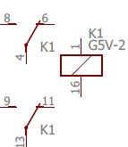
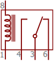
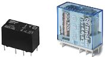
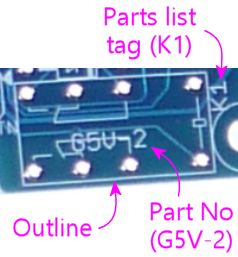

= Relays

A relay is a mechanical switch controlled by an electromagnet, allowing one circuit to control another circuit. Because the switching is done mechanically, there's no need for the two circuits to be connected electrically, which simplifies control interfaces between incompatible circuit types. One very common use along these lines is controlling a high-voltage AC power line circuit from a low-power DC logic circuit.

The Pinscape main expansion board includes a relay for the TV switching function. It uses a relay precisely because of the isolation the relay provides: it doesn't require any electrical contact between the TV and the Pinscape boards, so it doesn't have to make any assumptions about how the TV control switches are wired.

This chapter is about relays as electronic components in general. There are a couple of specific ways that relays are commonly used in pin cabs that we cover separately in other sections:

* Relays can be used as an interface between the popular LedWiz feedback controller and higher-power devices such as solenoids and motors. The LedWiz can't be directly connected to large devices because of its relatively low power handling limits. Relays can be used to bridge that gap, although there are better alternatives, such as MOSFETs. This is covered in xref:ledwiz.adoc[LedWiz Setup] .
* Some pin cab builders use USB-controlled relay boards from Sainsmart as their output controllers. These are turn-key controllers that let you switch a bank of mechanical relays via USB commands, so they can be used for many of the same functions as an LedWiz. They're covered in xref:sainsmart.adoc[SainSmart Relay Board Setup] .

== Protective diodes

The physical mechanism inside a relay that operates its switch is an electromagnet. This is a type of electromagnetic coil, which means that it's affected by a phenomenon known as "flyback current" that affects all coils. Flyback current is essentially a type of electrical interference or noise that gets injected into the circuitry attached to the relay coil, and this interference can be harmful to other components in the same circuit.

There's a standard remedy to protect against this harmful interference, which is to connect a diode to each coil. We cover this in detail in xref:diodes.adoc[Coil Diodes] .

We wanted to call your attention to it here because it might not be obvious from reading that section that a relay is one of these coil-based devices. That section is all about things like motors and solenoids. But a relay is in the same class because of its integrated electromagnet. Note that if you're controlling a coil-based device using a relay, such as a motor or solenoid, that device will need its own protective diode, in addition to the one needed for the relay coil. Also note that it's the relay _coil_ that requires the diode, not the relay _switch_ . The coil is the part where the "input" or control signal feeds into the relay.

The Pinscape boards already include the necessary protective diodes for their relays, so you don't have to worry about adding your own separate diode there. All of the Sainsmart boards should likewise include pre-installed diodes.

== On schematics

There are several different ways to represent relays in schematics. Here's the format that we use in the EAGLE plans for the Pinscape boards:

This breaks up the relay into its component parts:

* the little box at the right represents the electromagnet
* the two clusters at the left represent the mechanical switches (this particular relay has two of them, because it's a "double pole" relay, meaning it has two electrically independent switches operated by the same electromagnet)

You can tell that all of these little sub-symbols are actually part of one physical device from the repeated reference designator: all three parts are labeled "K1". This convention (of breaking up one part into multiple schematic symbols) is a little subtle, but it's pretty common; it's explained in more detail in "Multi-gang chips" in xref:schematics.adoc#multiGangChips[Schematics] .

The numbers on the connection points indicate the pin numbers on the physical relay. These numbers aren't anything you're supposed to "just know" on your own - they come from the relay's data sheet. Every relay uses its own peculiar numbering, so you just have to look it up for each relay.

The Pinscape EAGLE schematics use the symbology above for relays, but it's not the only one. If you look at other schematics, you might see other relay symbols. The most common format is a box containing a little pictogram of a coil representing the electromagnet, and one or more switch symbols for the controlled switches:

== Physical packaging

I don't think there's any industry standard packaging for relays (the way there is for transistors and ICs). Relays seem to use unique cases designed by each manufacturer for each part. Most of these follow roughly the same pattern, though: a rectangular plastic box with a set of pins or terminals on the bottom. Some relays use small round pins or leads suitable for installation in a circuit board, while others use solder terminals for connecting hookup wire.

== Orientation

All of the relays I've encountered have asymmetrical pin layouts that make it impossible to plug them in wrong. That's true of the ones used in the Pinscape boards. If it fits into the solder pad holes in the circuit board, you've got it right. If it doesn't fit, you've got it backwards, so just rotate it until it fits.

== Installing in a circuit board

The Pinscape boards mark the install location of a relay with an outline of the part as seen from above, as usual:

To install, match up the pins on the bottom of the relay with the circuit board solder pads, and fit them into the holes in the pads. The relay should only fit one way (if it doesn't fit, you probably just have it rotated wrong, so try turning it around).

The relay should fit flat against the circuit board when properly seated.

Hold the relay in place so that it doesn't fall out, flip the board over, and solder the pins to the pads on the bottom side.

== Selection

When building a circuit board like the Pinscape boards, it's best to stick to the exact part listed. Use the manufacturer part number in the parts list to search for it on Mouser or other electronics vendors.

If you need to find a substitute for a relay listed in a circuit design, you'll need to match several properties from the original relay, which you can find in the relay's data sheet:

* The coil voltage should match exactly. Make sure that it's both the same voltage level and the same type (AC or DC).
* The new relay's coil current should be the same as or lower than the original relay's. You might be able to use a higher current if the circuit board allows it; check with the circuit board designer if you're not sure. In the case of the Pinscape TV ON relay, a coil current up to 600mA is safe.
* The voltage and current limits on the switch should be sufficient for the application. If you're not sure what's needed, it's safest to select a new relay with limits equal to or greater than the original relay's.
* If you're going to install the relay in an existing circuit board design, you'll also have to match the exact package type and pin layout of the original, so that the new relay fits the same solder pad holes in the board. The pin layout for each part should be documented in its data sheet.

