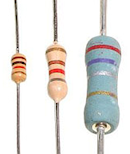
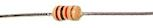
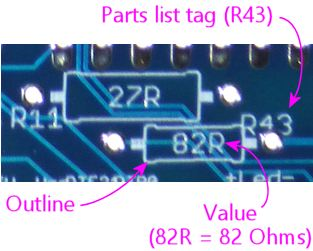
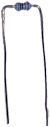
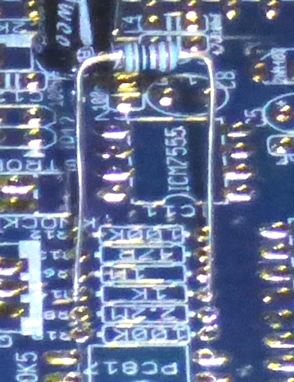
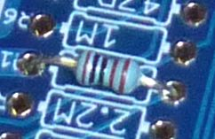
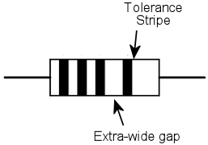
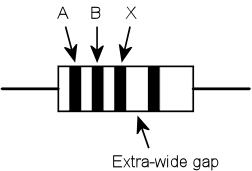
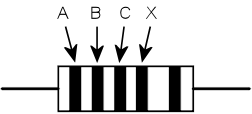

= Resistors

The resistor is one of the simplest component types. A resistor's function is (as the name suggests) to resist electric current. Electrical resistance is somewhat analogous to friction, in that resistance sloughs off some of the electrical energy going through a circuit and converts it to heat.

Technically, just about everything in a circuit has some resistance, even the wires, although that's all usually small enough that we mostly ignore it. Resistors usually have much higher resistance than what's naturally there from the wires and the rest. Resistors are useful because they let us insert a specific amount of resistance into a circuit just where we need it, to control the way current flows.

Most resistors look something like the ones pictures at right: a little roughly-cylindrical main body with a wire coming out of each end. (It's usually more of a dumbbell shape than a true cylinder, but close enough.) This main body can range in length from a few millimeters to about an inch. The body is marked with colored stripes that use a secret code to indicate the resistance value. If you buy your resistors from someone like Mouser that packages each component in a clearly marked plastic bag, you probably won't have to bother learning to read the color code, but it's explained below in case you're interested.

== Orientation
Resistors aren't polarized, meaning that they don't have a preferred direction. You can install a resistor in a circuit in either direction and it'll work the same way.

== Installing in a circuit board

All of the resistors on the Pinscape board are the same shape: little cylinders with wire leads sticking out of each end. Most of the ones on the parts list are rather tiny "thin film" resistors, most only a a few millimeters in length.

The install location for a resistor on the circuit board is marked with a little outline of the resistor showing how it'll look when installed, when viewed from straight overhead. This shows an outline of the barrel-shaped body, with lines on either side representing the wire leads.

The lines sticking out of the body-shape outline extend to the solder pads where the resistor is installed.

A resistor's wire leads will usually start out sticking straight out from the resistor body. You have to bend the leads at a 90° angle on either side of the body to fit it into the board, like this:

Use the spacing of the holes as a guide to where to make the bends. The holes are usually placed so that you simply have to bend the leads as close to the resistor body as you comfortably can. You can just bend the leads by hand, but you'll get sharper corners if you use needle-nose pliers, which can make the resistor fit into the board more easily.

Once the leads are bent to fit the hole spacing in the board, fit the ends of the leads into holes, and feed them all the way through until the resistor is seated more or less flat against the board.

As always, there's no need to force anything - just get the resistor as close to flat as you comfortably can. The fit is sometimes a little too tight to get it perfectly flat, which is okay.

Once the part is in place, hold it there, flip the board over, and solder the leads to the pads on the bottom of the board. Snip off excess length from the leads after the solder cools.

== On schematics

Resistors are represented on schematics as a jagged lines, as shown at right. They're usually marked with an *R _number_ * reference designator, such as R5 or R10. The "R" is for resistor, and the number is arbitrary, purely to match up against the parts list. Designators always have to be unique within the whole schematic, so that each part can be individually identified. Resistors on schematics are also usually labeled with the resistance value in Ohms, which we'll come to shortly. In this case, the "4.7K" label means 4.7 Kilo Ohms = 4,700 Ohms.

Somewhat confusingly, the symbol "R" is _also_ used as a substitute for the Ω symbol for Ohms, so you might see a resistor with the pair of labels "R6" and "4R7". The one with the number _after_ the R is the part label, so this is part number R6. The one with the number _before_ the R is the Ohms value. In this case, we have a number both before and after the "R", which you should read by replacing the "R" with a decimal point and using the result as a number of Ohms: so "4R7" means 4.7 Ohms. In my own schematics and boards, I prefer to keep all of the digits before the "R" and simply use regular decimal points, so I'd write 4.7R in this case. But you might see the "4R7" type notation in other people's schematics and boards. The same convention applies to the K (for Kilo Ω) and M (for Mega Ω) symbols, so you might see 4K7 instead of 4.7K, or 1M2 instead of 1.2M.

Here's a summary of the common formats:

*  *47R* means *47 Ohms*
*  *4R7* means *4.7 Ohms*
*  *47K* means *47 Kilo Ohms* = 47 kΩ = 47000 Ohms
*  *4K7* means *4.7 Kilo Ohms* = 4.7 kΩ = 4700 Ohms
*  *47M* means *47 Mega Ohms* = 47 MΩ = 47,000,000 Ohms
*  *4M7* means, you guessed it, *4.7 Mega Ohms* = 4.7 MΩ = 4,700,000 Ohm

== Selection

The main parameter for selecting a resistor is the resistance in Ohms. In some cases, it's also necessary to pick a resistor with a high enough power handling capacity in Watts.

*Resistance value (Ohms):* Every resistor has a numerical value specifying how much electrical resistance it has. The resistance is marked on most resistors via the colored stripes we just mentioned; in some cases, it's simply printed numerically instead. Either way, the value is in Ohms, which has the symbol Ω: so 100 Ohms can be written as 100Ω. Thousands of Ohms are written as Kilo Ohms, K Ohms, KΩ, or simply K, so 4.7K means 4,700 Ohms. Similarly, 1MΩ = 1M = 1 Mega Ohm = 1,000,000 Ohms.

Pay close attention to the "K" or "M", and especially pay attention to the *absence* of a "K" or "M". One of the most common mistakes that people make when reading schematics or parts lists is to assume that resistor values are always in "Kilo Ohms" even when they don't see a "K" in the Ohms value. This especially happens with LED resistors, which are sometimes really tiny values like 4.7 ohms. A lot of people see that "4.7" and think that there was supposed to be a "K" there because there's _always_ a "K" there! They think maybe the "K" was left out by accident, or it's one of those conventions where engineers leave out some implied information because everyone knows it's always there whether it's stated or not. There really are a lot of situations like that in engineering, but this isn't one of them! If there's no "K" stated, there really is no "K". "4.7 Ohms" is a perfectly valid resistor value, and it's very, very different from "4.7 K Ohms". So always pay attention to whether or not a "K" is there.

You might sometimes see a different notation in schematic drawings and on printed circuit boards. In these contexts, it's become conventional to replace the symbol Ω with the letter R, in part because of the difficulty of writing Ω on older computer systems. If you see 100R, it means the same thing as 100Ω. You might see an even stranger notation, with numbers on both sides of the "R", as in "6R8". In this case, replace the R with a decimal point: so 6R8 means 6.8Ω. Similarly, 4K7 means 4.7 KΩ. There's a method to the madness here: they use this notation because decimal points aren't always legible in schematics, and can be especially impossible to see in the tiny text silk-screened onto circuit boards.

*Wattage:* Resistors have a second rating, separate from the resistance value, specifying how much power they can handle. This is given in Watts. Typical resistors are rated for either 1/8W or 1/4W. For higher wattage values, you have to find parts specially made for the higher power.

There are no markings on a resistor's physical package to tell you the wattage value (the way the color stripes tell you the Ohms value). The only way to find the wattage is to refer to the package the resistor came in. When you're buying resistors, though, it's one of the parameters you can use to select parts.

In the parts lists in this guide, we'll always tell you if you need a specific wattage. In most cases, any wattage rating will work, because in most cases the actual power usage will be less than 1/8 W, which is almost always the smallest wattage value that they make resistors in at all. If we don't say anything about wattage, you can go by the Ohms value alone and choose a resistor with any wattage rating. In cases where a specific wattage *is* required in a parts list, it's always a *minimum* . You can use any resistor rated for that wattage or higher. For example, if a parts list calls for a 1/2W resistor, you can use a resistor with a 1/2W rating, or a 1W rating, or anything higher. But do be aware that a higher wattage rating usually means the resistor is physically larger, so don't go overboard. If you're going to use a resistor in a circuit board, you don't want to get something so huge it won't fit in its allotted space.

== Stripe color code

Most resistors are marked with a set of color stripes that tell you the resistance value of the part, using a special color code system.

=== Three, four, or five stripes

Color-coded resistors are marked with three, four, or five stripes.

If there are *three stripes* , all three stripes represent the resistance value in ohms, as explained below.

If there are *four stripes* , three of them should be grouped together and one should be set apart by an extra-wide gap. The three grouped stripes represent the Ohms value, exactly like a three-stripe resistor, and the separate fourth stripe represents the "tolerance" value. Both are described below.

If the resistor has *five stripes* , the first four represent the Ohms value, and the fifth represents the tolerance.

=== Ohms Value

The Ohms value of a resistor can be read from the group of three stripes in a three- or four-stripe resistor, or the group of four stripes in a five-stripe resistor.

The first step is to read the colors, starting with the one nearest the end. If you've already found the "tolerance" stripe, start at the opposite end from that. Otherwise, start at the stripe closest to an end.

The next step is to convert the colors to digits, using this table:

[cols="1,1,1"]
|===
|Color|Digit|Multiplier (10^X^)

|Black
|
|0
|1

|Brown
|
|1
|10

|Red
|
|2
|100

|Orange
|
|3
|1,000

|Yellow
|
|4
|10,000

|Green
|
|5
|100,000

|Blue
|
|6
|1,000,000

|Violet
|
|7
|10,000,000

|Gray
|
|8
|100,000,000

|White
|
|9
|1,000,000,000

|Gold
|
|
|0.1

|Silver
|
|
|0.01

|===

Finally, string the digits together into a number, like so:

*AB times 10^X^*  _or_  *ABC times 10^X^*

As you can see, the last stripe represents a power-of-ten multiplier. You can read it as 10^X^ , using the same color-to-digit mapping to get the X value. Or you can just use the "multiplier" value in the table above, which we wrote out for each power of ten. It's the same value either way.

You might notice that gold and silver are special cases. They represent 10^-1^ (0.1) and 10^-2^ (0.01) respectively. You'll never see them in a "digit" slot - only as a multiplier.

For example, for Yellow-Violet-Red, you'd read this as A=Yellow=4, B=Violet=7, X=Red=2, so you'd form the numeric value as

*AB times 10^X^* = *47 times 10^2^* = *47 x 100* = *4700*

That means you have a 4700 Ohm resistor, usually written as 4.7KΩ or just 4.7K. 1KΩ = 1000&Omega, and 1MΩ = 1,000,000Ω.

=== Tolerance (precision)

If the resistor has four stripes, one of them, always at one end, is the "precision" or "tolerance" stripe. If the resistor has five stripes, the fifth is the precision stripe. This extra stripe should be separated from the other stripes by an extra-wide gap, to visually identify it as standing apart from the others.

This extra stripe tells you how carefully calibrated the resistor is. Some situations call for very precisely calibrated resistors, others only need something approximate. It's more expensive to manufacture parts with better calibration, so the manufacturers offer cheaper, less precise parts for when you don't care, and pricier, better calibrated parts for when you do. This stripe tells you what sort you have in hand.

The tolerance is expressed as a plus-or-minus percentage value. A tolerance of ±10% means that the resistance of the part is within 10% of the resistor's nominal value, above or below. For example, a 100 Ohm resistor with a 10% tolerance (silver stripe) should have an actual resistance value within 10 Ohms of the nominal 100 Ohms, meaning the actual resistance should be from 90 Ohms to 110 Ohms.

If there are only three stripes, the tolerance is implicitly 20%.

Here are the code colors:

* Brown = ±1%
* Red = ±2%
* Green = ±0.5%
* Blue = ±0.25%
* Violet = ±0.1%
* Gray = ±0.05%
* Gold = ±5%
* Silver = ±10%

