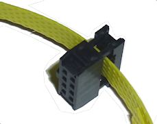
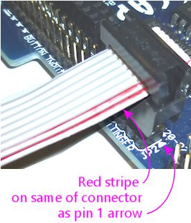

[#ribbonCables]
= Ribbon Cables

A ribbon cable is a flat, insulated cable with some number of conductors side by side, running parallel down the length of the cable.
Ribbon cables are ideal when you want to connect two (or more) like connectors together.
The flat geometry of the cable makes for good signal propagation in high-speed data connections, which is part of why these cables have long been used in the innards of PC wiring.

You can buy pre-assembled ribbon cables in certain lengths and widths (that is, the number of pins/conductors).
However, it's hard to find them in anything other than a few common widths.

Fortunately, it's easy to build your own ribbon cables.
You can get the bare cable in almost any length and width, and you can get the connectors in almost any pin count.
Building your own cables is also cheaper than buying pre-assembled cables.

To build a ribbon cable, you need two types of parts:

* The ribbon cable itself
* IDC plugs, one for each end of the cable

"IDC" stands for Insulation-Displacement Connector.
This is the type of connector normally used to build a ribbon cable.
It attaches to the cable via little teeth that pierce the insulation and grab the wires, so all you have to install one of these connectors is position and squeeze it, which clamps it onto the cable.

== Buying ribbon cable wire

The wire making up a ribbon cable is a generic part that you can buy anywhere.
Mouser sells it by the foot, and you can also buy it on eBay, Amazon, and at Fry's Electronic.

Here's a Mouser search that will turn up some suitable options:

link:https://www.mouser.com/Wire-Cable/Cable-Assemblies/Ribbon-Cables-IDC-Cables/_/N-bkree?P=1y8vnl9Z1z0wxo9Z1yzi10l&Ns=Pricing%7c0[Mouser Ribbon Cables]

(That's a search for IDC ribbon cables, no connectors, 1.27mm pitch.)

*Selecting wire:* Ribbon cable is usually sold by unit length (foot or meter).
Your vendor will probably have a giant spool and will cut the length you ask for.
When figuring the required length, measure the distance between boards that the cable will have to cover, and add in some length for bends and to leave some slack.
I usually double the apparent distance to make sure I have enough.

Apart from length, there are two main parameters when selecting cable: the number of conductors, and the wire "pitch" (the distance from one conductor to the next across the cable).

*Pitch:* For all the expansion board connectors, you need *1.27mm* pitch wire.

In general, ribbon cables have *half* the pitch of the pin headers they connect to.
The pin headers on the Pinscape expansion boards used with ribbon cable connectors are all the standard 0.1" pin pitch type, which equals 2.54mm.
The matching ribbon cable pitch is half of 2.54mm, or 1.27mm.

*Number of conductors:* The number of conductors for a given connection has to match the number of pins on the header it connects to.
For example, the plunger connector on the main expansion board (JP2) is an 8-pin (2x4) header, so it requires an 8-conductor ribbon cable.

*Splitting cables to make different widths:* You can buy ribbon cables in a variety of widths (Mouser currently carries it in even numbers from 4 to 20 conductors), so you should be able to find it in each exact width you need.

It's not strictly necessary to buy the exact width, though, thanks to a little trick.
You can easily tear a ribbon cable along the seam between any two wires to split it into two cables.
For example, if you buy a 16-conductor cable, you can split it along the seam between the 8th and 9th wires to turn it into two 8-conductor cables.
Or you can split a 24-wire cable in a 16-wire plus an 8-wire cable.
The reason I mention this is that it's often cheaper to buy a single wider cable - a 20- or 24-conductor cable, perhaps - and split it up into the narrow widths you need.

== Buying ribbon cable connectors

The specific connectors needed for the Pinscape boards are listed in the parts list.

0.1" ribbon cable connectors are standardized, so you can mix and match parts from different vendors for these.
The Pinscape parts list uses parts from the series listed below (use the series name as a search key on Mouser to find the matching parts).
These series include similar parts for different numbers of pins/conductors, in case you need to build cables for other pin header sizes.

* Kobiconn 164-9000 series, available in various sizes from 10 to 50 pins
* Wurth Elektronik WR-BHD series, available in various sizes from 6 to 64 pins

== Assembling a ribbon cable

*Step 1: Prepare the connector.* IDC plugs consist of two pieces that lock together around the cable, with the cable sandwiched between them.
New connectors usually come with the two pieces loosely assembled but not locked, with a strip of cardboard or plastic to keep them separated until you're ready to assemble them.

To prepare them for installation, you might be able to slip them off the end of the separator strip, or you might need to take the two pieces completely apart to get them free.
To separate them, just pull them apart gently.

Be careful of the jagged metal teeth on the inside surface of the lower piece.
They're razor-sharp by design, so that they can easily pierce the ribbon cable insulation when you install the connector.

Once it's free, *loosely* reassemble the connector if you had to take it apart.
*Don't* lock the two pieces together yet.
Maintain as big a gap as possible between the two pieces.
The cable has to feed into this gap.

*Step 2: Position the connector.* Fit the connector *loosely* onto the pin header where you'll ultimately plug this guy in.

If you're using a shrouded header on the board, make sure that the connector is oriented to match.
Pay particular attention to the little bump on one side of the connector - it should match up with the slot on one side of the shrouded header.
The bump and slot are the "key" that makes sure you can't plug the connector in backwards, so make sure they line up now.

*Step 3: Cut the ribbon cable to the desired width and length.* If you're using the "zip" method to split a wide ribbon cable into narrower cables, do so now to create a cable with the same number of conductors as there are pins on the connector you're attaching.

Cut the ribbon cable to the desired length.
Most ribbon cables can be easily cut with scissors.

*Step 4: Mark pin 1 on the cable.* Use an *oil-based* red Sharpie to mark one edge of the cable as the "pin 1" side.
You should use an oil-based marker because regular water-based inks won't stick to the plastic insulation.

The cable is symmetrical, so it doesn't matter which side you choose, but you should mark the cable down its whole length.
This will help you orient the connectors properly by providing a visual marker to tell you were pin 1 is on the cable.

*Step 5: Align the cable with the connector.* Find the pin 1 mark on the circuit board next to the header where this cable plugs in.
On the Pinscape boards, pin 1 is marked with a little triangular arrow at one corner:

image::images/pinhead-pin1-arrow-2.png[""]

Position the cable so that the red stripe you marked on the cable is on the same side as the pin 1 arrow.

You'll usually want the connector to be attached near one end of the cable, so position the cable accordingly.

*Step 6: Insert the cable.* Keeping the connector and cable oriented as they are, insert the end of the cable into the gap in the connector.
There cable should extend at least a little bit, perhaps an eight of an inch, out of the other end of the connector.
The cable should fit precisely across the width of the opening.

*Step 7: Lock the connector.* Take the connector off of the pin header, take care to keep the cable and connector pieces positioned as they were.
Use an IDC crimp tool or a pair of pliers to squeeze the two halves of the connector together.
Apply flat, even pressure across the whole width of the connector - it's important to press it straight down so that the teeth align properly with the individual conductors in the cable as they pierce the insulation.

Continue applying pressure until the two halves snap into place and lock together.

*Step 8: Repeat for the other end.* Repeat the whole procedure on the other end.
Be sure to align the cable properly so that the side you marked with the red stripe for "pin 1" aligns with the circuit board marking for pin 1 on the other end of the cable.

== Multiple connectors on one cable

One more thing to note about ribbon cables is that the IDC plugs aren't limited to the ends of the cable.
They can also be attached at any desired intervals along the cable.
This lets you create a single cable that connects three or more boards.

I use this feature on my own pin cab to connect two flasher panels with a single 16-pin ribbon cable:

* An IDC plug at one end of the cable plugs into the output controller
* A connector at the other end of the cable plugs into the flashers on top of the backbox
* A connector midway along the cable plugs into the flasher panel at the back of the main cabinet

