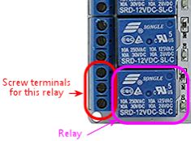
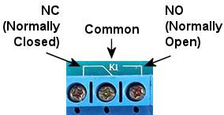

[#sainsmart]
= SainSmart Relay Board Setup

:source-highlighter: rouge
The SainSmart USB relay board is an inexpensive output controller option, and it's fairly easy to set up electrically.
It's somewhat more trouble to set up the software for these devices, though.

WARNING: DOF currently only supports the *8-channel* version of the Sainsmart USB board.
Sainsmart makes the USB boards with different numbers of relays, from 4 to 16 channels, but DOF is only programmed to recognize the 8-channel version.
Other types won't work with DOF.

The big advantage of the SainSmart boards over the LedWiz and PacLed controllers is that SainSmart boards can directly control high-power feedback devices like motors and solenoids, because they use relays instead of transistors for switching.
The LedWiz and PacLed are designed primarily for switching low-power devices like LEDs, and their power limits are too low for most motors and solenoids.
The SainSmart relays, in contrast, can handle just about anything commonly used in a pin cab.
In addition, a lot of pin cab builders prefer relay switches over the transistor-based boards just because they're a more familiar technology.

The SainSmart USB boards come in 4-relay and 8-relay versions.
You can use more than one board in your system, so you can have as many ports as you need simply by adding more boards.

The SainSmart boards are most attractive if you only plan on a relatively small set of feedback devices, and all them are mechanical.
If that describes your needs, these boards are a good option.
However, the SainSmart boards aren't the best choice if you want a decked-out cab with all the popular toys.
For one thing, they're not great if you need a lot of ports, because even though can keep adding boards as needed, the individual boards take up a lot of space.
The solid-state controllers pack more ports into less space.
The other thing that makes SainSmart boards less than ideal for a complex cab is that they don't work very well with LEDs, because they can't vary the brightness - they're strictly on/off switches.
If you're planning to use flasher LEDs or other lighting devices, you'll really want a solid-state controller (such as LedWiz, PacLed, or Pinscape), since those provide brightness control in addition to on/off switching.

WARNING: there seem to be some no-brand relay boards out there that look very much like Sainsmart boards, with the same blue relays laid out the same way, but which aren't compatible at the software level.
I'd avoid anything like this that isn't sold with clear Sainsmart branding, because the no-brand units probably won't work with DOF and the other pinball software.

== USB vs non-USB boards

When you go shopping for these boards, be aware that SainSmart sells two completely different kinds of relay boards: USB and non-USB.

* The USB type has a USB port for connecting to the PC.
This is the type we're talking about in this chapter, and it's the type you should buy if you _don't_ want to have to combine it with a separate device like an LedWiz.
* The non-USB type doesn't have any ports for connecting to a PC.
Instead, it's designed to be used with a microcontroller device like an Arduino, so it has individual control terminals for the relays that the Arduino connects to.
Don't buy this type if you're looking for something standalone.
However, this type _can_ be used as a booster for the LedWiz (more about that in xref:ledwiz.adoc#ledwizSetup[LedWiz Setup] ).

== Connecting to the PC

There are two steps required to connect the board to the PC.

First, connect the board's power terminals to your PC's power supply, as shown in the diagram below.
Connect the GND terminal to the PC power supply ground (the black wire in any of the disk connector cables coming out of the PSU), and connect the VCC terminal to +5V (the red wire in any disk connector).

For more on connecting power wires to the PC power supply, including how to build your own connectors, see xref:powerSupplies.adoc#powerSupplies[Power Supplies for Feedback] .

Second, connect the relay board to the PC via USB.
Plug a USB cable into the connector on the board, and plug the other end into an available USB port on your PC/motherboard.

These boards require software drivers to be installed on the PC.
Follow the instructions that come with the board.

== Basic wiring plan

Each relay on the board can control one feedback device (for example, one relay can control your shaker motor, another relay can control your left flipper device, etc).
You can see on the board that each relay has a group of three screw terminals next to it:

A relay is simply a mechanical switch, a lot like a regular pushbutton switch, except that it's controlled electronically by a little solenoid coil inside the relay that moves the switch lever.
The relay turns the attached device on and off by connecting and disconnecting the power to the device through the internal switch.
It's just like turning on the lights in your house with a wall switch, except that the solenoid inside the relay is what moves the switch lever up and down.

The relay's switch section has three terminals, not just two, because the relay is a "double-throw" switch.
That means that the switch can connect the center terminal (the common connection) to either of the two outside terminals.
One terminal is the "normally closed", often abbreviated to "NC", meaning that it's connected to the center terminal any time the relay is OFF ("closed" means "connected" when we're talking about a switch, and "normally" means "when the relay is OFF").
The other terminal is "normally open", or "NO", meaning that it's not connected to anything at all when the relay is OFF ("open" means "not connected"), but it is connected to the center terminal when the relay is switched ON.

Your wiring for the device should be connected to the *center* (or common) and *normally open* terminals.
Check the documentation that came with your board to identify these.
You can also usually tell by markings on the board, but these vary.
You might see the legends *NC* , *C* , and *NO* printed on the board next to the terminals.
These stand for Normally Closed, Common, and Normally Open.
You might instead see a little line diagram like this:

If you can't find any markings, look for the set of three terminals nearest the relay.
The Common is almost always the center terminal, and the Normally Open is usually the top terminal when the relay is oriented like this:

image::images/SainSmartRelayMarkings2.png[""]

Once you identify the Common and Normally Open terminals for the relay, connect your feedback device like this:

image::images/SainSmartBasicWiring.png[""]

Follow this same plan for any type of feedback device.
If the device you're connecting has specifically marked "+" and "-" terminals, be sure to connect the "-" terminal on the device to the "-" connection on the power supply.

Some types of devices have special requirements beyond the basic diagram shown above.
For example, anything with a coil needs a diode (see xref:diodes.adoc#coilDiodes[Coil Diodes] ), and many types of LEDs require current-limiting resistors (see xref:flashers.adoc#flashersAndStrobes[Flashers and Strobes] ).
We go into much more detail about many of the popular pin cab devices in xref:feedbackSect.adoc#feedbackSect[Feedback Devices] .

=== Should I wire (+) or (-) to the relay?

In the diagram above, we showed the wiring with the (+) connection from the power supply going to the relay switch, and the (-) connection going directly to the feedback device.

If you look at the "general purpose" wiring diagram for other controllers in xref:feedbackWiring.adoc#feedbackDeviceWiring[Feedback Device Wiring] , though, you'll see the opposite setup, with the (-) connection going to the controller port, and the (+) power supply connection going directly to the feedback device.
We show the same polarity in our diagrams for the individual device types as well.

So why did we show this as different for Sainsmart? It turns out that you can do it either way with Sainsmart boards.
For the solid-state boards, you _must_ use the polarity shown in xref:feedbackWiring.adoc#feedbackDeviceWiring[Feedback Device Wiring] , because the solid-state boards use transistors, which only allow current to flow in one direction.
The Sainsmart uses mechanical relay switches, though, which don't care about the direction of the current.
That makes them more flexible, letting you hook up the power wiring in either direction.

I know that I'm creating a little confusion here by showing it both ways, but there's actually a reason for it.
Maybe not a good enough reason to justify the confusion, but a reason nonetheless.
Specifically, given the choice of polarities that we get with the Sainsmart, I'd rather put the relay switch on the positive side of the circuit, because it's safer.
When you put the switch on the positive side, as shown in the diagram above, the power supply wiring to the device itself is "dead" when the device is off - there's no voltage going to it.
That eliminates any shock risk if you should accidentally touch any of the wires to the device.
When you wire things the other way, as we must do for the solid-state controllers, the positive wire is always "live", even when the device is off, so it always runs the risk of shock.
For 12V or even 24V devices, the voltage in the live wire isn't that dangerous, but it really is a safety hazard for a 50V device like a knocker coil.

So my apologies for the conflicting diagrams! I hope that this explanation clears it up, but if you still find it confusing, here's some good news: you can follow _either_ diagram with your Sainsmart wiring (the special Sainsmart diagram above or the "general purpose" diagrams shown everywhere else), and it'll work equally well either way.

== Use protective diodes

Most mechanical devices *require* protective diodes.
These are required for anything with a coil: solenoids, contactors, replay knockers, motors.

Here's the basic wiring plan:

See xref:diodes.adoc#coilDiodes[Coil Diodes] for details on what type of diodes to use and more details about how to install them.

Diodes are critical! Failing to include one where needed can result in damage to your computer motherboard, power supplies, or other equipment in your pin cab.

The Sainsmart relays are themselves coils, so they need diodes, too.
However, I think that all the Sainsmart boards already have diodes pre-installed, so it shouldn't be necessary to add your own there.

== USB disconnects and other electrical interference

I've seen a lot of reports on the forums from pin cab builders using Sainsmart units and experiencing electrical interference problems.

The most common symptom is probably USB trouble, such as the Sainsmart or some other USB device suddenly disconnecting at random.
This can be followed by the device re-connecting by itself after a few seconds, or the device might simply stay disconnected until you manually unplug it and plug it back in.
Other symptoms include random keyboard input, random feedback device activation (lights flashing randomly or solenoids firing randomly), or the PC suddenly rebooting.

If you're having any of these symptoms, the first thing to check is that all of your mechanical feedback devices are equipped with diodes.
See xref:diodes.adoc#coilDiodes[Coil Diodes] .
Devices like solenoids, contactors, and motors cause electrical interference on the power wiring, which can usually be suppressed sufficiently by properly installing a diode on each device's power connection.
The Sainsmart relays themselves have the same issue, since they use magnetic coils, but you don't usually have to worry about those because most of the boards come with suitable diodes integrated into the design.
Even so, you should check to make sure that your boards do in fact include a diode for each relay, and if not, you'll need to add one.

The second thing to try (after ensuring all necessary diodes are installed) is to add a small capacitor on each Sainsmart relay switch.
Mechanical switches create their own kind of electrical noise (called "bounce") during the brief instant when the contacts come together or separate.
This can be significant when a relay switch controls a high-current device like a coil, motor, or large LED.
You can mitigate this by adding a small capacitor across the switch contacts.

Try a capacitor around 0.1µF (which is the same as 100nF).
Use a *ceramic disc* type capacitor.
These aren't polarized, so it doesn't matter which direction you install it.

If a 100nF (0.1µF) capacitor doesn't help, or seems to reduce the problem but doesn't fix it entirely, you might experiment with other nearby capacitor sizes, from 200nF to 1µF.

Whereas diodes protect against the special type of interference that magnetic coils generate, capacitors help suppress the transient noise caused by switch contacts connecting and disconnecting.
So capacitors might be needed for any type of feedback device controlled by a relay switch - even something like an LED that doesn't need a protective diode.
However, I wouldn't bother installing any switch capacitors unless you're experiencing a problem that you can isolate to a particular device, and that device is already protected with a diode (or doesn't need one).

If the device in question is a motor, and the problem isn't solved by adding a diode and a capacitor, there's one more thing you can try: an inductor filter, also known as a choke.
Capacitors act as voltage filters, leveling out little spikes in voltage changes, whereas inductors act as electric current filters, smoothing out sudden changes in current flow.
Motors can sometimes benefit from the latter.
See "Electrical interference" in xref:shakers.adoc#shakerElectricalInterference[Shaker motors] for parts selection and a wiring diagram.

Quick summary:

* Diode:
**  *Required* for anything with a coil (solenoid, contactor, relay, motor)
**  *Not required* for non-coil devices (LEDs, lamps)
* Capacitor:
**  *Not required* for any device
** But *might be helpful* for any type of device that causes interference
** Try ceramic disc capacitors with values 100nF to 1µF
* Inductors:
**  *Not required* for any device
** But *might be helpful* for motors that cause interference
** Try inductors around 4.7µH
** Use one or two per motor, wired in series with the power wiring to the motor

== Fuses

Some cab builders include a fuse in each SainSmart output circuit.
Fuses can help protect an output controller against wiring faults or device malfunctions.
I'm usually pretty conservative on these things, so this might be surprising, but I don't think fuses are all that useful with SainSmart outputs.
The reason is that these outputs use relays, so they're pretty tough to start with.
Fuses are certainly appropriate for solid-state devices like an LedWiz, but I don't think they add much useful protection for a relay board.
If want to add them anyway, see xref:fuses.adoc#fuses[Fuses] .

== DOF Setup

If you're using my DOF R3++ version, it includes automatic SainSmart board detection and configuration.
You shouldn't have to do any of the additional config file setup described below.
Just run DOF and it should automatically find your SainSmart board.
You can skip straight to xref:#SainSmartConfigToolSetup[DOF Config Tool setup] below.

With older DOF versions, SainSmart boards require some extra setup to use with DOF.

If you haven't already set up DOF on your cab, follow the instruction in xref:DOF.adoc#dofSetup[DOF Setup] .

After DOF is set up, you have to create and edit a file called *Cabinet.xml* in the *DirectOutput > config* folder.
See xref:DOF.adoc#DOFCabinetXmlSetup[Extra controller setup] in xref:DOF.adoc#dofSetup[DOF Setup] for the basics on getting this file started.

If you're using the template Cabinet.xml file provided with my DOF setup instructions, you should find a section with a pair of lines like this:

[source,xml]
<OutputControllers> </OutputControllers>

If you got your Cabinet.xml file from another source, these lines might be missing or might have other contents in between.
If they're missing, add them directly under the line(s) that looks like this:

[source,xml]
<Name>My Pin Cab</Name>

There might be different text between the bracketed <Name> markers, but that's okay.
What's important is that you add the `<OutputControllers>` section just below the `<Name>` section.

If there was already something in the <OutputControllers> section, that's okay, too.
You just need to add the new text at the end of the existing text, just *before* the line that at the end that reads `</OutputControllers>`.

Now copy and paste the following into the file, placing it between the two `<OutputController>` markers:

[source,xml]
<FT245RBitbangController>
  <Name>Sainsmart 1</Name>
  <SerialNumber>A1234XYZ</SerialNumber>
</FT245RBitbangController>

You have to make one more change to that text: you have to edit the Serial Number and replace it with the correct value for your SainSmart board.
You might be able to find your serial number printed on your board or the packaging.
If not, the board should have come with some software (or a link to download software), which should include a program called FTDIChipList.exe.
Run that program.
This will list the serial numbers for all the similar devices in your system.

If the program lists more than serial number, you must have other devices that use the same USB chip set.
The SainSmart uses a common chip that's also used in a variety of other devices, so it's quite possible the chip finder program will discover more than one such device in your system.
If this happens, and you're not sure which of the devices is the SainSmart board, try the following:

* Exit the chip finder software
* Unplug the SainSmart board
* Run the chip finder software
* Write down the list of chips it reports
* Exit the software
* Plug in your SainSmart board and give it a few seconds to connect
* Run the chip finder software again.
Compare the new list to the list you wrote down last time.
Since the SainSmart board was unplugged last time, it shouldn't have been included in the previous list, so you should be able to identify the SainSmart board as the new entry that wasn't in the old list.

Once you determine the correct serial number, go back and edit the Cabinet.xml file to replace the fake placeholder text I provided in the template ("A1234XYZ") with the true serial number.

There's one more step.
Look for a pair of lines like this:

[source,xml]
<Toys> </Toys>

As with the previous section, you'll have to add the lines if they're not already there.
Add them just after the closing </OutputControllers> line.
And as before, if this section is already there and already contains other text, simply add the new text at the end of the existing text, just *before* the final </Toys> line.

Here's the text we're going to add to the <Toys> section:

[source,xml]
<LedWizEquivalent>
	<Name>SainsmartLWEQ 1</Name>
	<LedWizNumber>40</LedWizNumber>
	<Outputs>
		<LedWizEquivalentOutput>
			<OutputName>Sainsmart 1.01</OutputName>
			<LedWizEquivalentOutputNumber>1</LedWizEquivalentOutputNumber>
		</LedWizEquivalentOutput>
		<LedWizEquivalentOutput>
			<OutputName>Sainsmart 1.02</OutputName>
			<LedWizEquivalentOutputNumber>2</LedWizEquivalentOutputNumber>
		</LedWizEquivalentOutput>
		<LedWizEquivalentOutput>
			<OutputName>Sainsmart 1.03</OutputName>
			<LedWizEquivalentOutputNumber>3</LedWizEquivalentOutputNumber>
		</LedWizEquivalentOutput>
		<LedWizEquivalentOutput>
			<OutputName>Sainsmart 1.04</OutputName>
			<LedWizEquivalentOutputNumber>4</LedWizEquivalentOutputNumber>
		</LedWizEquivalentOutput>
		<LedWizEquivalentOutput>
			<OutputName>Sainsmart 1.05</OutputName>
			<LedWizEquivalentOutputNumber>5</LedWizEquivalentOutputNumber>
		</LedWizEquivalentOutput>
		<LedWizEquivalentOutput>
			<OutputName>Sainsmart 1.06</OutputName>
			<LedWizEquivalentOutputNumber>6</LedWizEquivalentOutputNumber>
		</LedWizEquivalentOutput>
		<LedWizEquivalentOutput>
			<OutputName>Sainsmart 1.07</OutputName>
			<LedWizEquivalentOutputNumber>7</LedWizEquivalentOutputNumber>
		</LedWizEquivalentOutput>
		<LedWizEquivalentOutput>
			<OutputName>Sainsmart 1.08</OutputName>
			<LedWizEquivalentOutputNumber>8</LedWizEquivalentOutputNumber>
		</LedWizEquivalentOutput>
	</Outputs>
</LedWizEquivalent>

You can use that exact text, with no changes, as long as you have one SainSmart unit only, and it's the 8-relay type.

If you have two SainSmart units, you first must repeat the <OutputControllers> entry we added above, again substituting the actual serial number for the second device.
And second, you must repeat the <Toys> entry we added above, but this time, change the <LedWizNumber> section to *41* (make it 42 for a third unit, 43 for a fourth unit, etc), *and* change all the *Sainsmart 1.0x* entries to *Sainsmart 2.0x* for the second unit (or 3.0x for the third unit, 4.0x for the fourth unit, etc).

If your SainSmart unit has a different number of relays (they make them with 1, 2, and 4 relays as well), go through the >Toys> text we added and delete all the sections beyond the number of relays you have.
For example, if you have a 4-relay board, you should delete the "1.05" through "1.08" sections.

[#SainSmartConfigToolSetup]
== DOF Config Tool setup

Almost done! The one remaining step is to enter your new SainSmart board into your DOF Config Tool settings.
This step is pretty easy compared to the previous one, fortunately.

* Point your browser to the link:https://configtool.vpuniverse.com/[DOF config tool]
* Click the My Account tab
* Find "Number of SainSmart Devices" in the list, and set it to "1" (or the number of these boards you've installed, if more than one)
* Click Save Settings
* Click the Port Assignments tab
* In the "Device" drop-down, select "SainSmart 1"
* Go through the port list (Port 1 through Port 8), and select the type of device that you've physically wired to each output port
* Click Save Config
* If you have more than one SainSmart board, repeat the process for each one by selecting the devices one at a time in the "Device" drop-down at the top of the page
* When done, click Save Config, then click Generate Config to download your updated DOF config files
* Unzip the downloaded files into your DOF install folder

All of this is described in the xref:DOF.adoc#dofSetup[DOF Setup] section as well.
