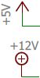
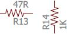
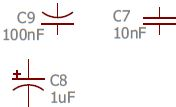
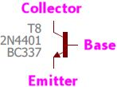
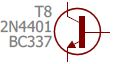
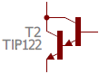
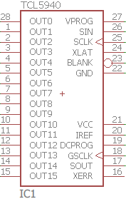
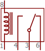
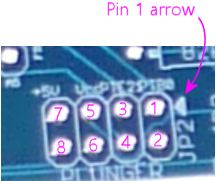

[#schematics]
= Schematics

A schematic is a map of a circuit showing the components and how they're connected to one another.

You don't have to learn how to read a schematic to build the Pinscape Controller projects, but it's a skill that might come in handy if you need to troubleshoot one of the Pinscape boards after building it.
So this section provides a very quick introduction, hopefully just enough that you can make sense of the Pinscape schematics should you ever need to look at one.

Schematics use their own special symbolic language, the way that music has its language of staffs and notes, so they can look pretty opaque at first.
A lot of electronics-for-newbies tutorials try to avoid the formalism of schematics by using pictorial circuit diagrams.
I've even used a few of those in this guide, like this one from the xref:ledResistors.adoc#ledResistors[LED Resistors] chapter, showing how to wire a current-limiting resistor into a flasher LED circuit:

That's fine for simple circuits, but it doesn't "scale up" well to large circuits with many components.
It's also a bit fuzzy, in that the little pictures of the parts could be mistaken for something else, especially if there were more than a few distinct parts in the diagram.
Warm and fuzzy might be fine for artists and puppies, but engineers don't like fuzzy.
They like clarity and precision.

Schematics were invented as a more concise and precise way of showing this kind of information.
To a large extent, a schematic is a lot like the pictographic representation above; the big difference is that we replace the pictures of the parts with symbols representing the parts.
Here's a schematic version of the circuit above:

The symbols give schematics their precision, since there's a standard set of them that everyone agrees on.
They constitute a sort of vocabulary, so you'll find yourself able to read most schematics pretty readily once you learn the basic symbol set.

== Wires

The simplest schematic symbol is a wire, which is shown as a line between two parts.

This schematic idea of a "wire" is an abstraction - it doesn't necessarily represent a literal piece of wire.
And you'll notice it doesn't say anything about how long the wire is or where it goes on the circuit board.
A schematic "wire" just represents _some_ type of electrical connection.
In the physical realization of the circuit, the schematic "wire" could be an actual piece of wire, or it could be a copper trace on a printed circuit board.
The schematic wire is just saying that the two points are connected electrically, with the details left up to whoever builds the circuit physically.
(Which also means that you could build a functionally identical circuit in different physical arrangements: on a printed circuit board, on a breadboard, with a bunch of loose parts and wires...)

When wires run directly into components as shown above, it means that the components are connected to the wires.
When wires cross over each other, though, they're _not_ automatically connected.
Here are two separate pieces of wire that aren't electrically connected to each other:

Two separate wires, not connected to each other

Some schematics show non-connected wire crossings with a little hump:

Another way of showing a non-connected wire crossing

The little hump is to make it more explicit that there's no connection.
But this seems to be more of a "beginner" convention that you don't see much in engineering schematics.
The modern practice is to use simple straight crossings.

Whenever the wires at a crossing _are_ connected, we add a big dot to indicate the connection:

Two wires connected together

The dot is also used at any connected "T" junction:

=== Cross-references

When a schematic reaches a certain level of complexity, you get so many wire lines going across such large swaths of the diagram that it gets hard to follow them all.
So there's a convention that greatly reduces the tangle of wire lines by removing long lines and replacing them with "cross-references".

A cross reference point looks like this:

The word inside the arrow-shaped box is the cross-reference label.
Sometimes you see it with the arrow box, and sometimes you see it with just the text label:

They both mean the same thing.
I like the box notation because it makes it easier to spot these points at a glance, but some engineers don't bother with them.
It's like the little humps to represent explicit "not connected" crossings: a text label by itself at the end of a wire can only mean one thing, so some engineers see the little box as redundant.

In either case, what this means is that this point in the wiring is connected to _all of the other points in the wiring_ that have the same label.
This lets you connect two points on opposite sides of the schematic without having to route a green line all the way across the page.

image::images/schematic-xref-4.png[""]

Now, that's just an oversimplified example - when the two "CLK" points are close together like that, you'd usually just draw the wire.
But imagine if those two "CLK" points were at opposite corners of a large schematic.
In that case, drawing the wire all the way across would be harder to trace than the cross-reference notation.

The label in a cross-reference is just an arbitrary name defined by the person who drew the schematic.
It doesn't mean anything within the schematic language the way that a resistor symbol means something; it's just a name for that connection point, like the name of a street.
These names are usually chosen to be somehow descriptive, but that's purely within the context of the particular circuit.

In the Pinscape expansion board schematics, you see this in a lot of the connections to the KL25Z:

This notation is necessary for many of the KL25Z connections because it's such a central component with so many things connected.
Many of the connected items are in far-flung areas of the schematic.
It would have been too hard to follow all of those green wire lines across the whole page - or worse still, across several pages.

=== Buses

In addition to the cross-reference notation, there's another wiring short-hand known as "buses" that the Pinscape schematics use in places.
A bus represents a bundle of related wires all grouped into one line on the map.

On the old Williams pinball schematics, buses are represented like this:

The thick striped wire is the bus, which represents the combination of all of those individual D0 through D7 wires going into it at the top.
This bus might run between a couple of IC chips, or it might connect many parts.
At other points along the bus, some or all of those same D0 through D7 wires would come back out of it, representing the break-out into the individual connections again.

The EAGLE notation for a bus is a little different.
I personally prefer the old Williams notation, since I think it's clearer, but the EAGLE approach is really the same idea once you learn what it looks like.
EAGLE's way of drawing this is to just use a thick blue line to represent the bus.

Some important things to note about the bus notation:

* Unlike regular wire-to-wire connections, there are no "dots" to indicate the connection points.
Any regular wire that ends at a bus line is connected to the bus.
* The wires going into the bus *aren't* connected to each other.
D0 through D7 are still all separate wires.
This is just short-hand to show the whole group of wires as a single line/bar rather than having to draw all of them individually.
* If you want a physical analogy, you can think of the bus as a shrink-wrap tube that wraps around all of the wires making up the bus.

== Ground connections

"Ground" has several meanings in electronics, so you see different symbols for it.
The most common symbol you see is this, which typically represents an "Earth" ground, meaning literally a connection to the soil, usually through the ground prong in your house's power wiring.

In the EAGLE schematics, we don't use that exact symbol, and we don't have any points where we're talking about the literal Earth ground.
You'll see these two symbols in the EAGLE schematics instead:

In our schematics, these are what's known as DC grounds.
If you think about a power supply as though it were a battery, it would have a "+" post and a "-" post.
In that way of thinking, the "-" post corresponds to the DC ground.
That's not quite the way engineers think of power supplies, though: they think of what you'd call the "-" end of the battery as 0V for "zero volts".
That's the reference point, and all of the other supply voltages are relative to that reference point - so the disk connectors on an ATX power supply, for example, have a +5V supply line and a +12V supply line, relative to that 0V.
This 0V point is what we call "ground" in a DC circuit.

Why do we have two different ground symbols, and what's "GND3"? I'm sure you already guessed that "GND" is an abbreviation for "Ground".
"GND3" stands for "Ground 3", which is a separate DC ground point in the circuit from the regular "GND".
You'll see "GND2" in other places, which is a second one.

The Pinscape schematics use the multiple grounds for two reasons.

* The first is what you might expect, which is to isolate different parts of the circuit.
The expansion boards are set up to isolate the "logic" part from the "power" part, by using separate power supplies for the two sections.
The regular "GND" point is the 0V ground connection for the PC power supply (the "logic" section), and "GND1" is the corresponding connection for the secondary power supply that powers your knocker coil and shaker motor (the "power" section).

We use the two separate symbols to suggest this separation visually.

* The second is an inelegant way handling some special needs of the circuit boards.
GND1, GND2, and GND3 in these schematics are actually all connected together.
They're given separate names because that lets us persuade EAGLE to given them different trace widths on the circuit boards, mostly so that some of the connections can handle high current loads.

All of the connected ground points use the same "triangle" symbol, which hopefully helps suggest the connection visually.

In all of these cases, the GND points are ultimately connected to the Ground connection on a power supply unit.
For a PC-style ATX power supply, the "ground" connection is the black wire in all of the disk cables coming out of the unit.

== Power connections

As with the grounds, the expansion boards use two symbols to represent power supply connections:

We use the two symbols for the same reason that we do with the grounds: because the expansion boards are designed to be connected to two separate power supplies.
One symbol, the little arrow, represents the main PC power supply.
We use the circle-plus symbol for the secondary power supply.

The power supply connections are labeled with the voltage.

Just to be clear, these power supply symbols represent power *inputs* , where you connect the circuit boards to a separate power supply unit that supplies the labeled voltage.
(As opposed to representing power outputs where the boards are generating power for something else.
That's not something we do in any of the Pinscape boards.)

== Resistors

A resistor is a simple component that adds electrical resistance (analogous to friction in a mechanical system) to a circuit.
See xref:resistors.adoc#resistors[Resistors] .

The symbol on a schematic is a jagged line.

The version on the right is the same as the version on the left, just rotated 90°.
We wanted to show that just to clarify that it means the same thing no matter how it's rotated.
The same is always true for all other component types.
Schematic writers will orient each symbol as they see fit for legibility.

A resistor on a schematic is usually accompanied by two labels, usually placed on either side of the resistor symbol.

The first is an "R" followed by a number - in the example above, R13 and R14.
This is formally called the "reference designator" for the resistor, or just the "designator".
It's an arbitrary, unique identifier for the part, primarily for cross-referencing to the parts list.
It has no meaning by itself; it's just a name.
The "R _number_ " notation is just a convention, too; in principle any sort of label would do.
But the "R" labeling for resistors is practically always used.
Designators always have to be unique throughout the schematic, so that you can identify each individual physical part.

The second label is the resistance value in Ohms.
This is usually written in one of these formats:

*  *47R* means *47 Ohms* - the "R" suffix is usually used instead of the real symbol for Ohms, Ω, probably because the Ω symbol could be mistaken for a zero, or maybe just because it was hard to enter the Ω symbol in older software
*  *4R7* means *4.7 Ohms* - an "R" sandwiched between numbers like this stands in for a decimal point; this notation is used because real decimal points aren't always legible in crowded areas or tiny fonts
*  *47K* means *47 Kilo Ohms* = 47 kΩ = 47000 Ohms; the "K" means "times a thousand Ohms"
*  *4K7* means *4.7 Kilo Ohms* = 4.7 kΩ = 4700 Ohms; as with the embedded "R", an embedded "K" replaces a decimal point, and _also_ still means "times a thousand Ohms"
*  *47M* means *47 Mega Ohms* = 47 MΩ = 47,000,000 Ohms; "M" means "times a million
*  *4M7* means, you guessed it, *4.7 Mega Ohms* = 4.7 MΩ = 4,700,000 Ohm

A resistor has two connections to the outside world.
The schematic symbol shows this as a straight line sticking out of each end.
Resistors aren't polarized, meaning the two ends are interchangeable.
There's nothing in the symbol indicating which way the resistor goes because it doesn't matter which way it goes.

== Capacitors

A capacitor is a simple component that adds electrical capacitance to a circuit, which is similar to a (very) tiny rechargeable battery.
See xref:capacitors.adoc#capacitors[Capacitors] .

The symbol for a capacitor consists of two parallel lines separated by a small gap, or one straight line and one curved line next to each other.
In some cases, there might be a little "+" sign adjacent to the straight line.

As with resistors, each capacitor in a schematic is typically accompanied by two labels.

The first label is a "C" followed by a number.
This is the capacitor's reference designator - an arbitrary ID for the part, purely for looking it up in the parts list.
It's the capacitor equivalent of the "R" number for a resistor.
It doesn't have any meaning by itself; it's just a name to look up in the parts list.
Reference designators always have to be unique throughout the whole schematic, so that you can uniquely identify every physical part that goes into the circuit.
Note that there's no absolute rule that a capacitor's designator has to start with "C", but almost everyone uses that convention, so it's practically a rule.

The second label is the capacitance value in Farads.
This is almost always in one of the following formats:

*  *100pF* means *100 pico Farads* or 100 trillionths of a Farad
*  *100nF* means *100 nano Farads* or 100 billionths of a Farad
*  *100uF* means *100 micro Farads* or 100 millionths of a Farad (this is more properly written *100µF* , but the Roman alphabet "u" is usually used instead because of pervasive ASCII chauvinism in computer software)
*  *100mF* means *100 milli Farads* or 100 thousandths of a Farad (these are extremely large capacitors that you rarely see in micro-electronics, but you might see one in a power supply; there's a 30mF capacitor in my _Whilrlwind_ 's lamp power supply circuit, and it's about the size of a soda can)

A capacitor has two connections, represented in the symbol by the lines coming out of either end.

If there's a "+" sign in the symbol, the capacitor is a "polarized" type, meaning that one end has to be connected to the positive voltage and the other end is for the negative voltage.
The "+" sign in the symbol marks the end that connects to the positive voltage.

If there's no "+" sign in the symbol, the capacitor is an "unpolarized" type, meaning it doesn't matter which end connects to which voltage.
The two ends are interchangeable (like in a resistor).

The polarized or unpolarized status is a function of the physical type of capacitor you're using.
If the schematic symbol has the "+" sign, you *must* use a polarized capacitor in the physical build.
If not, you *must* use an unpolarized capacitor.
You can generally tell if a particular physical capacitor is polarized by looking at its material type:

* A *ceramic disc capacitor* is always unpolarized
* An *electrolytic capacitor* is always polarized

There are several other types besides these, but these are the only types you'll see in the Pinscape boards.
Most of the other, more exotic types are non-polarized, including film and glass capacitors.
Tantalum capacitors are a type of electrolytic capacitor, so they _are_ polarized.

== Diodes

A diode is a semiconductor that only lets current flow in one direction, sort of an electronic one-way valve.
See xref:cmpdiodes.adoc#cmpdiodes[Diodes] .

The symbol for a diode on a schematic is an arrow with a bar:

image::images/schematic-diode-1.png[""]

Each diode on a schematic is typically accompanied by two labels.
The first is a "D _number_ " label giving the reference designator, for looking up in the parts list.
As with resistor "R" numbers and capacitor "C" numbers, this has no meaning by itself; it's just an arbitrary ID for cross-referencing with the parts list.
Almost everyone uses "D" for "diode" in these labels by convention.

The other label is the _semiconductor identifier_ for the type of diode to be used.
This is sort of like a manufacturer part number or catalog number, but it's not specific to any one manufacturer; it's a generic descriptor system that the industry uses.
Diodes don't have a simple "unit" that describes them like Ohms for resistors or Farads for capacitors, so schematic writers use this semiconductor ID to specify which part they want you to use.
For a diode, this usually starts with "1N", as in the example above, *1N4007* .
You can use this ID on sites like Mouser to search for matching parts to buy.

Diodes are inherently polarized, so they have to be wired into the circuit in the correct direction.
If you put a diode in backwards, it won't work properly (and might do damage).
The direction is indicated by which way the arrow is pointing.
On the physical diode, you should see a stripe painted on one end; that stripe corresponds to the bar that the arrow is pointing to in the schematic symbol.

== LEDs

An LED is actually just a special case of diode.
That's the "D" in the acryonym - "Light Emitting Diode" - and it's quite literal.
The schematic symbol for an LED is therefore basically the same as the symbol for a regular diode, with an embellishment to indicate that it's the special light-up kind: a couple of little arrows representing the photons flying away.

image::images/schematic-led-1.png[""]

An "LED _number_ " reference designator usually takes the place of the "D" designator for a regular diode, but there's less of a universal convention about this, so you might see other formats.
You should always see some designator, though, for looking up in the parts list.

And as with a regular diode, an LED symbol will often be accompanied by some sort of formal part ID, such as a manufacturer part number, to tell you what to buy.
This might not be present in the schematic, though, in which case you'll have to check the parts list.

== Transistors - bipolar

A bipolar transistor (or bipolar junction transistor, BJT) is a common type of transistor that's used in all sorts of circuitry as a small amplifier or an electronic switch.
See xref:transistors.adoc#transistors[Transistors] .

The symbol for a transistor consists of a thick bar with three lines sticking out, one straight line on one side, and two diagonal lines on the other side.
One of the diagonal lines has an arrow, which might point towards or away from the middle bar.

image::images/schematic-transistor-1.png[""]

If the little arrow points _away from_ the bar, the symbol represents an "NPN" transistor.
If the arrow point _towards_ the bar, it's a "PNP" transistor.

Note that the little arrow might be shown at top or bottom, and it might be on the left side or the right side.
None of that makes any difference - the symbol means the same thing no matter how it's flipper or rotated.
Schematic writers will flip the symbol top-to-bottom, or left-to-right, or rotate it at different angles, according to what's convenient to make the lines between nearby connections shorter.
It doesn't change the meaning.

The three lines represent the three connections to the transistor, called the base, collector, and emitter:

* The straight line by itself on one side is always the *base* or *B*
* The diagonal line with the arrow is always the *emitter* or *E*
* The other diagonal line is always the *collector* or *C*

On some schematics, the whole thing will be enclosed in a circle:

The circle doesn't change anything; it's just an alternative way of drawing the symbol.

Transistors have parts list tags just like other components.
These most commonly start with "T" or "Q".
As with the "R" tags for resistors and "C" tags for capacitors, these are just arbitrary tags to look up in the parts list, with no other meaning.

Transistors are also usually labeled with the semiconductor ID, like a diode is.
In the case of a transistor, this usually starts with "2N".
You might also see other part numbers, such as the "BC337" in the examples above.
When two numbers are listed for one part like this, it indicates _alternative_ parts that you can use - so in the case of T8 above, you could use a 2N4401 or BC337 interchangeably.

Transistors have to be inserted into the circuit with the three prongs in exactly the right order.
As with diodes, each prong has a different function, and the part won't work if it's not inserted correctly.
There's no standard way of marking a physical transistor to indicate which leg is which - the only way to tell is to look it up in the manufacturer's data sheet.
In the case of the Pinscape expansion boards, though, you can tell how to orient the part from the looking at the silk-screened markings on the circuit board; we'll explain that in xref:transistors.adoc#transistors[Transistors] .

== Transistors - Darlington

A Darlington transistor is a variation on the basic bipolar transistor that combines two bipolar transistors in one physical package, for greater amplification and power handling than a regular bipolar transistor can handle.
See "Darlingtons" in xref:transistors.adoc#darlingtons[Transistors] .

For the purposes of building the Pinscape boards, Darlingtons are the same in every respect as bipolars.
But they have a different symbol in a schematic, so we wanted to show you what that looks like so that you can recognize it when you see it:

The symbol is pretty literal - it looks like two regular transistors connected together, because that's just what a Darlington is.
A Darlington still has the same three external connections (base, collector, and emitter).

== Transistors - MOSFET

A MOSFET is another kind of transistor constructed in a different way from a bipolar transistor.
It performs the same transistor functions as a bipolar, but the electrical characteristics are somewhat different, so it has its own representation on a schematic:

image::images/schematic-mosfet-1.png[""]

As with bipolars, there are two types of MOSFETs, known as N-channel and P-channel MOSFETs.
The schematic symbols for the two types are almost the same, befitting their similar construction and behavior, with one subtle difference: the direction the arrow points in the middle of the diagram.
In an N-channel MOSFET, the arrow points inwards, into the middle section; in a P-channel MOSFET, it points outwards.

MOSFET symbols in a schematic are labeled like other transistors, with a reference designator (we're using a *Q* prefix here, but you might also see a *T* prefix) and a part number.
For MOSFETs, this is almost always a manufacturer part number, so there won't be any particular pattern to it; it'll just be an alphanumeric string that you can look up on Mouser and in other vendor catalogs.

Like bipolar transistors, MOSFETs have three prongs with distinct functions, and they have to be oriented properly when installed.
The prongs of a MOSFET go by different names from a bipolar's legs:

image::images/schematic-mosfet-2.png[""]

* The *Gate* is the prong off by itself on one side
* The *Source* is the prong that connects to the arrow
* The *Drain* is the remaining prong

As with bipolar transistors, there's no standard marking system to identify which leg is which on the physical part; you just have to look it up in the manufacturer's data sheet.
The Pinscape expansion boards show how the part is oriented on the silk-screened markings on the circuit boards.

== IC chips

Integrated Circuit (IC) chips are complex devices consisting of many components packed into a single package.
See xref:icchips.adoc#icchips[IC Chips] .

ICs are extremely diverse in function and physical packaging, so it's not entirely fair to lump them all into a single category.
But there are enough commonalities to how they're handled in schematics that we can make some practical generalizations.
For our purposes, an IC is a bit of circuitry all packed into a discrete physical package, with multiple connection points ("pins" or "leads" coming out of the physical chip).
The schematic treats an IC as a "black box": a bunch of wires connect it to the outside world, but what's inside is of no concern in the schematic.
As a result, the schematic symbols for ICs look pretty much like empty boxes:

Here are some features to note:

* The overall IC package is represented by a rectangular box
* We're using the term "black box" figuratively, as you can see that we haven't literally drawn the box in black ink here; "black box" is a metaphor that engineers use to talk about something with complex inner workings that we don't have to see (or understand) in order to use it
* The wires coming out of the box represent the "pins" or "leads" on the physical IC, which are the electrical connection points
* Different ICs have different numbers of pins, so you might see boxes like this with three wires coming out (such as for a voltage regulator), or a couple hundred wires (for a CPU chip), or anything in between
* The positions of the wires around the perimeter of the box don't correspond to the physical layout; this is just an abstract representation, like any other schematic symbol
* The order of the wires in the symbol doesn't reflect the ordering of the pins on the physical chip - for that you need to consult the the little number written adjacent to each wire just outside the box, which tells you the pin number on the physical chip that this wire corresponds to
* The labels written on the _inside_ of the box adjacent to the pins are mnemonics for the functions of the pins; these are purely for convenience, to help you remember the function of each pin without having to keep going back to the chip's data sheet
* The schematic symbol will usually be accompanied by a reference designator, analogous to "R5" for a resistor or "C7" for a diode; for an IC, it's usually of the form "IC10", but lots of other prefixes are used, including odd ones like "U$" - engineers started running out of unique letters for these tags at some point, so they resorted to other symbols.
The prefix might also be specific to the type of IC; for example, the Pinscape schematics use "OK" for optocouplers.
* The schematic symbol will also usually be accompanied by the manufacturer part number for the specific IC ("TLC5940" in the case of this example); some of these are generic part descriptors for parts made by many manufacturers, while others are manufacturer-specific

There are exceptions to this "black box" treatment.
Some types of ICs have specific functions that are so commonly used that they have their own unique schematic symbol that's more representative of the function.
We'll see this for optocouplers below.
Other examples include common logic gates, such as NAND and NOR gates and inverters, which sometimes (but not always) are shown with special logic symbols in place of the plain box.
The Pinscape boards don't use any of those types of symbols, but you might see them in other schematics.
For example, a NAND gate might be drawn like this:

That's a very specific notation that engineers recognize as a NAND gate, so it's sometimes used in place of the more generic "black box" notation for miscellaneous ICs.
But you might just as well see the plain black box notation; it's really up the schematic writer.
You might even see a hybrid notation that shows the NAND IC as a black box, and then _also_ draws the logic symbol inside the box.
This is just a more pictographic equivalent of the little mnemonic labels that you see in the TLC5940 diagram above, since it shows you the function of each pin visually.
For example, here's how you might see a chip that contains four NAND gates represented:

[#multiGangChips]
=== Multi-gang chips

There's another "advanced" convention that you should know about when it comes to IC chips, and even some other types of components (such as relays, as we'll see below).

Some chips come with two or four or eight copies of the same basic building block.
For example, the Pinscape boards use the PC847 chip, which consists of four separate optocouplers on one chip.
That makes it a "quad optocoupler" chip.
Pinscape also uses a "quad Darlington" chip, the ULN2064, which consists of four Darlington transistors on one chip.
This is quite common with basic components like logic gates, optocouplers, op-amps, and transistors.

In schematics, one way to represent these multi-gang chips is the generic way we saw above, where you draw a big box for the entire chip.
The ULN2064 uses a generic symbol like that in the Pinscape schematics:

So nothing new so far! But now we come to the novel part.
Sometimes, rather than using the generic black box format, schematics will represent a multi-gang part with its individual building blocks all separated from one another, _as though they were separate components_ .
EAGLE uses this approach for the PC847, that "quad optocoupler" we mentioned.
Rather than drawing it as a big box with 16 pins coming out of it - which is, in fact, exactly what the _physical_ package looks like - EAGLE draws this as though it were four separate optocouplers.
Here's an excerpt from the Pinscape "main interface board" showing one PC847 broken up into four optocoupler symbols:

If you didn't already see what we meant about how schematic symbols are "abstract", this probably really drives it home.

Two questions: Why in the world do they do this? And how are you supposed to tell that those four boxes are really one physical IC chip?

First the "why".
They do this to make the schematics more readable.
I know, it can seem like it does the opposite.
But if you think about it in terms of understanding what the circuit _does_ as opposed to how to build it out of parts, this representation is actually a lot more useful than drawing all of those 16 wires going into a black box.
With this format, you can plainly see which wires control the LEDs and which wires are connected to the photo-transistors.

There's another benefit that's not even apparent in this picture, too.
Those four boxes representing the individual optos don't have to be grouped together in one place in the schematic - they can be split up and spread out.
They really are four separate boxes as far as the schematic is concerned.
This allows the schematic writer to place each one close to the other components it's connected to, so that the wire connections are shorter and easier to follow.
The Pinscape boards keep all of the groups like this together, but if you look at some old Williams pinball schematics, you'll find that they take ruthless advantage of this ability to spread the parts around.
You'll find quad NAND gate chips with the individual gates on different pages, and dual op-amp chips with the individual op-amp blocks likewise widely separated.

Now to the second question, how you're supposed to relate the four boxes back to one physical chip.
The trick is to look for matching tags.
You can see that each individual opto in the diagram above has its own separate set of labels - each one is tagged "PC847" (the chip name) and "OK1x" (the reference designator for the parts list lookup) - as though it were a standalone part.
The designator is what gives away the secret that all of these "OK1" elements are part of the same physical chip.
And why is that? Because a designator is *always* unique across the whole schematic - like Highlander, there can be only one OK1.
The fact that the same designator appears on four symbols means that the symbols are all portions of the same physical component.

Okay, back up a sec...
I'm sure you noticed that these _aren't_ actually all labeled "OK1".
They're labeled OK1A, OK1B, OK1C, and OK1D.
But when have we ever seen a letter _after_ a number in a designator before? Never.
Tags until now always ended in a number.
You've probably already guessed what it means when you add a letter to the end: it means that we're talking about a sub-block of a multi-gang chip like this.
The physical chip is still called "OK1", but they've given these additional "A" through "D" suffixes to the individual optos within OK1 to help us distinguish them.

Those A-B-C-D suffixes aren't always used, by the way.
They're used for this particular opto, but for other types of chips, you might just see the same base designator repeated on each block.
Each block might be tagged, say, IC9, with no suffix.
The A-B-C-D suffixes aren't really all that necessary, since you can still tell which block is which in physical terms by looking at the pin numbers.
If you look at OK1A through OK1D above, you'll see that each pin is still numbered in terms of the overall 16 pins of the physical chip, the same as if it were the black-box kind of symbol.

== Optocouplers

An optocoupler is a special kind of IC chip that connects two parts of a circuit via a photo-emitter and a photo-receiver.
This provides electrical isolation between the two parts of the circuit while allowing them to transmit information across the interface.
See "Optocouplers" in xref:icchips.adoc#ic-PC817[IC Chips] .

As we mentioned above, some types of IC chips are so commonly used that they get their own schematic symbols.
The optocoupler is one of these special cases.
An optocoupler looks like this on our schematics:

image::images/schematic-opto-1.png[""]

That's a little like the NAND gate example we talked about above, in that it starts with the generic IC "black box", but then adds a pictograph inside to depict what the pins do.
An optocoupler internally consists of an LED (usually infrared) and a phototransistor (a special type of transistor that's activated when light hits it, rather than being controlled by an electrical signal), so you see the symbols for an LED and a transistor.
Just as with the mnemonic text labels inside the black box on our TLC5940 example earlier, the pictogram is just a mnemonic to help you remember what the pins do.
In terms of actually using the chip physically, you can really ignore all of that, since all you have to pay attention to is the pin numbers written on the outside wires - exactly like any generic IC chip.

Note one other deviation from more generic ICs: the Pinscape schematics use "OK" as the designator prefix instead of "IC", so in this case, "OK5" instead of "IC5".
You might also see "OC" prefixes in other people's schematics.

== Relays

A relay is an electrically-controlled mechanical switch.
An electromagnet in the relay operates a little rocker switch that connects and disconnects another circuit.
See xref:relays.adoc#relays[Relays] .

The schematic symbols for a relay vary.
Here's the format that we use in the EAGLE plans for the Pinscape boards:

image::images/schematic-relay-1.png[""]

This is a little hard to parse, because it breaks up the relay into its component parts:

* the little box at the right represents the electromagnet
* the two clusters at the left represent the mechanical switches (this particular relay has two of them, because it's a "double pole" relay, meaning it has two electrically independent switches operated by the same electromagnet)

This follows exactly the same convention that we saw for some IC chips with multiple repeated blocks - see "Multi-gang chips" xref:#multiGangChips[above] for more on that.
The short summary is that we can tell that these three little blocks are actually part of the same physical relay from their tags.
They're all tagged "K1".
Since a designator must be unique across the whole schematic, the fact that we have three things tagged K1 can only mean that they're all part of the same physical component.

As with an IC chip, the numbers on the connection points indicate the pin numbers on the physical relay.
There aren't really any conventions for how the pins on a relay are numbered; it's just something you have to look up in the data sheet for the individual device.

You might also see schematic symbols for relays that are more literal, with a pictograph for the electromagnet coil, and the whole thing enclosed in a black box like an IC chip.
For example:

== Connectors and pin headers

Circuit boards need connections to the outside world, usually in the form of some kind of plug-in connector.
We provide an overview of some of the most common types, and the ones we use on the Pinscape boards, in xref:connectors.adoc#connectors[Connectors] .

On a schematic, we draw connectors like this:

image::images/schematic-pinheader-1.png[""]

It looks a bit like a generic IC, but note that the wires all go into the box and connect to little circles.
The circles represent the pins on the connector.
The numbers next to the circles are the pin numbers, which tell you which pins they correspond to on the physical connector.
The pin numbering conventions are different for different parts; we explain our conventions in xref:connectors.adoc#connectors[Connectors] .
As always with schematic symbols, the order and arrangement of pins shown in the schematic doesn't necessarily correspond to the physical pin layout, so you have to pay attention to the pin numbers.

On the Pinscape schematics, most connectors have a "JP" label, for "jumper", as in JP7 or JP15.
(Another common convention that you'll see on other schematics is a simple "J" prefix, such as J9.) As usual, this is the reference designator, for looking up the connector in the parts list, and (as usual) it has no meaning other than to serve as a cross-reference.
You might also see a manufacturer part number, as in the example above.
Some of the connector types are generic enough that you can substitute equivalent parts from other manufacturers, so the part number might only be a suggestion to help you find a matching part.
It's always critical to match the total number of pins when substituting parts.

One subtle detail to note in the diagram above is that some of the pins might be left unconnected.
That's indicated by the simple absence of a wire connected to the pin, as in pin #16 in the example above.

You might sometimes see one (or possibly more) of the pins drawn with an "X" over it:

This means that the marked pin is meant to be snipped off on the physical pin header, and the same pin socket in the mating connector plug is meant to be blocked (literally plugged up with a little piece of plastic, so that you couldn't insert a pin there if you wanted to).
The point is to "key" the connector so that it's impossible to insert the wrong way.
When you connect the plug the right way, the blocked socket in the plug lines up with the snipped-off pin on the header, so it fits and everyone's happy.
If you try to insert it the wrong way, the blocked socket collides with one of the pins that wasn't snipped, preventing you from attaching it that way and alerting you that you've got something wrong.

The Pinscape schematics don't use keyed connectors like that anywhere, but it's something you might see on other schematics.
The Williams pinball machines do this for most of their connectors to help prevent operators from re-connecting cables the wrong way when making repairs.

=== Pin numbering on the physical connector

The pin numbers on the schematic symbol tell you which physical pin corresponds to each schematic pin.

*Single-row pin connectors:* the physical pins are numbered sequentially starting at one end.
On many boards, such as the KL25Z, they indicate this by printing a "1" next to pin 1:

You can then infer all of the other pin numbers by just counting them across the row, starting at pin 1.
Note that in the picture above, they've also helpfully labeled pin 3 at the other end.
The KL25Z does this on each header, labeling the pins at either end.

For the Pinscape boards, the convention is to show a little triangular arrow next to pin 1:

Pin 1 is always at the end with the arrow, and the rest of pins are numbered sequentially across the row (2, 3, 4...).

*Double-row pin connectors:* As with the single-row headers, look for a pin 1 marking to identify pin 1.
Some boards (including the KL25Z) mark this with a numeral "1" next to one of the pins.
The Pinscape boards use the same triangular arrow they use for single-row connectors.

image::images/pinhead-pin1-arrow-2.png[""]

For double-row headers, the numbering goes by _column_ :

