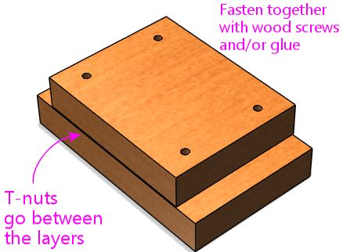
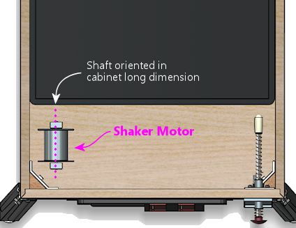

[#shakerPlan]
= A DIY shaker motor plan

This section provides instructions for building a pinball shaker motor from scratch, using fairly common and inexpensive parts.
The only parts that you have to fabricate yourself are some simple plywood pieces that require only straight cuts and some drilling.

My design is hardly the first or only plan out there - see xref:shakers.adoc#DIYDesigns[DIY Designs] in xref:shakers.adoc#shakers[Shaker motors] for a list of other plans published on various forum sites.
The reason I developed yet another design is that the existing plans all have something that makes them a little bit challenging to implement, either because they call for an obscure part or because they require some difficult metal fabrication steps.
My aim with this plan is to build it entirely with easy-to-find parts and minimal fabrication work, and still match the performance of the commercial shaker units.
I also tried to keep the finished price to a minimum.
Excluding the motor, the parts in my plan run to about $30; with a motor, the price should come in at about $50 to $60.

At the moment (2022), there's little cost advantage to building a shaker yourself, since you can buy a complete, ready-to-use unit from Pinball Life for about $100.
Even so, I like knowing that there's an easy DIY plan available, in case the retail shaker units become unavailable in the future.
The Pinball Life units will eventually sell out, and who knows if they'll restock when that happens.
Pinball parts like this historically come and go.
I expect there will again come a time when you can't buy these so easily.

Cost and availability aside, a DIY shaker has the advantage that it gives you more control over the effect than you get with an off-the-shelf unit.
The retail units (the current ones, anyway) don't provide any way to adjust the amount of weight or the geometry.
You can still gain some control over the force of the shaking effect by varying the motor speed, but that also affects the "tonal" quality of the effect, so it's not a pure strength control.
With the DIY plan laid out in this section, it's easy to fine-tune the total amount of mass in the counterweights, so you can adjust weight and motor speed independently to optimize the effect to your liking.

== Design overview

There are really just three puzzles you have to solve to design a shaker motor: what to use for the counterweights, how to attach the counterweights to the motor shaft, and how to mount the motor in the pinball machine cabinet.

This design uses fender washers as the counterweights.
They're easy to attach to almost anything, since their whole purpose is to fit over a screw, and they're fairly heavy, being made of steel.
It only takes about ten 1" diameter washers to get the 50g of weight we're after in one counterweight.

To attach the counterweights to the motor shaft, we use plywood lever arms and xref:#shaftHubs[shaft hubs] (more on those below).

The motor is mounted to the cabinet via a plywood base (which also serves to elevate the motor enough to make room for the weights to spin without hitting the floor), and it's secured to the plywood base with pipe hangers (or U-bolts, if you prefer).
Pipe hangers are common plumbing hardware for attaching metal pipes to walls and ceilings, which makes them the right shape for bolting down a cylindrical motor body.

The plywood pieces are the only things you have to fabricate.
I figure that most pin cab builders will have some plywood on hand anyway, along with a drill and some kind of saw, so plywood fabrication should be pretty approachable.
Otherwise, it's all off-the-shelf parts, and most of those are basic hardware items that you can find at the likes of Home Depot.

== Pre-fab motor brackets

Many of the DC motors that you can buy on eBay and Amazon have their own ready-made mounting brackets available.
If the motor you find has a matching bracket, I'd go ahead and buy it, since that should do a good job of securing one end of the motor to the base.
You can use that in place of one of the pipe hangers.
Most of these special brackets only attach at one end of the motor, so you'll probably still need to include one pipe hanger, to secure the end opposite the bracket.
For a shaker, it's critical to immobilize both ends of the motor body.

[#shaftHubs]
== Shaft hubs

Most of the parts in this plan are ordinary hardware store items.
The only exceptions are the motor itself, and the "shaft hubs".
Shaft hubs are fairly easy to find online - they're used a lot in hobby robotics, mostly to attach wheels to motors.
You can buy them at link:https://www.pololu.com/category/137/pololu-universal-mounting-hubs.html[Pololu] , Amazon, eBay, or Aliexpress.
They currently run about $10 a pair.

Look for something like this:

The key features are a set-screw that lets you fasten the hub to the motor shaft, and threaded holes for machine screws in the larger disk.

Pick out your motor before buying shaft hubs, because the hubs have to match the motor shaft size.
You need a hub with a center bore the same size as the motor shaft diameter.
Shaft hubs are available with center bores of 3mm, 4mm, 5mm, 6mm, 8mm, and 1/4", which are common sizes for DC motors shafts.
You should be able to find the motor's shaft size listed in specs on the seller's site.

The holes around the perimeter of the outer disk should be threaded for machine screws.
These are usually threaded for either metric M3 screws or US #4-40 screws.
Pololu makes both varieties.
When you buy the hubs, take note of the type of screw they use, because you'll need matching machine screws (3/4" or 20mm long, quantity 8) to attach the counterweights to the hubs.

== Parts list

* Motor (12VDC, dual-shaft, 4mm to 6mm shaft, power about 20W-50W, unloaded speed 3000 to 4500 RPM; see xref:shakers.adoc#motorSourcing[Selecting a motor] in xref:shakers.adoc#shakers[Shaker motors] )
*  xref:#shaftHubs[Shaft hubs] , with a central bore matching the motor shaft diameter, quantity 2
* Machine screws, sized to fit the threaded holes in the shaft hubs (typically M3 or #4-40), 3/4" (20mm) length, quantity 8
* Lock washers for the screws above, quantity 8 (optional)
* Machine screws, #10-32 x 1-1/2", quantity 8
* Machine screws, #10-32 x 3/4", quantity 4
* #10 lock washers, quantity 12 (optional)
* Hex nuts, #10-32 (preferably steel-with-nylon-insert lock nuts, also called ESN/elastic stop nuts), quantity 2
* Tee nuts, #10-32, quantity 10
* Fender washers, #10 x 1", stainless or zinc-plated steel, quantity approx.
20 (see notes below)
* Pipe hangers, quantity 2, or plumber's pipe hanger tape, sized to fit motor (see notes)
* Plywood, 1/2" thickness, about 1 sq ft
* Plywood, 3/4" thickness, about 1 sq ft

The fender washers are the main source of weight.
The goal is to get the weight up to about 50g on each side.
A typical 1" steel fender washer weighs about 5g, so about ten on each side should do the trick.
Other than their weight, there's nothing special about the washers - I specified them because they're easy to attach with nuts and bolts.
You can substitute another size of washer, or anything else of similar weight that you can figure out how to attach.

The #10-32 parts can be replaced by nearby sizes.
Use whatever's most convenient.
I used #10 for almost everything just to keep the number of distinct parts to a minimum.

The lock washers are optional, but I think it's a good idea to include them.
They help keep the screws from loosening over time due to vibration, and this thing's whole purpose is to generate a lot of vibration.

Pipe hangers are semicircular metal straps made to attach pipes to walls and ceilings.
They come in various sizes from about 1/2" to 2", so you might be able to find one that's close to the size of your motor.
You can find them at home improvement and hardware stores.
Take your motor with you to check the fit - the nominal sizes are misleading because they're based on the _inside_ diameter of the steel pipe they fit, so the actual size is always about 1/2" larger than the nominal size.
If you can't find the right size, you can substitute plumber's pipe hanger tape, which is essentially a narrow strip of perforated sheet metal that you can cut to any length with sheet metal shears, and then bend around the motor to conform to the motor body's exact size.
Be careful working with the tape - it's all sharp edges and jagged corners.
Wear heavy leather work gloves.

Instead of the pipe hangers, you might be able to substitute U-bolts.
U-bolts are easier to work with in some ways, but they're only available in certain sizes.
My motor has a standard type "775" case, which is about 44mm in diameter; it fits perfectly into 1-3/4" U-bolts, specifically link:https://www.boltdepot.com/Product-Details.aspx?product=12489.html[Bolt Depot #12489] .
You can also look for "exhaust clamps" or "muffler clamps" at an auto parts store - those are basically the same as U-bolts and might give you some additional size options, if you can't find a hardware store U-bolt in the right size.

== Construction step-by-step

Step 1: Cut two pieces of the 1/2" plywood, about 2" x 1".
These will be the "lever arms" for the counterweights.

Step 2: In each lever arm, near one end, drill a pattern of holes to match the holes in the hub for the central shaft opening plus two to four of the screw holes.
Use the shaft hub as a template, and drill slightly larger than the holes in the hub, so that screws of the matching size will slide through freely.
You really only need two screws for a strong attachment, even if your hub has four or six screw holes.

Step 3: Drill a 3/16" hole in the other end of each lever arm, with the hole center about 1/2" from the end.

image::images/diy-shaker-2.png[""]

Step 4: Attach the shaft hubs to the motor, with the large disk sides facing out.
Place them close to the motor body, but leave a little gap, so that they won't rub against the motor when spinning.
Tighten the set screws.

Step 5: Attach the lever lever arms to the shaft hubs, using machine screws that fit the shaft hub's threaded sockets.

NOTE: I specified 3/4" length screws in the parts list, but those might be slightly too long or too short for some shaft hubs.
If the fit is off (for example, if the screws stick too far out the other side of the hubs when tightened), you might need to substitute a different length.

Step 6: If you have a kitchen scale or postal scale, weigh out about 50g worth of the fender washers for each side - this should be about 10 washers per side.
Or you can just start with about 10 on each side and add or subtract some later if the shaking is too weak or too strong.

Step 7: Attach the washers to the lever arms using the #10 x 1-1/2" machine screws, lock washers, and #10 lock nuts.

Step 8: Cut a piece of the 3/4" plywood the same length as the central motor body, and slightly wider than the pipe hangers.
This will be the upper base.

Step 9: Figure where to drill for the pipe hangers by placing the motor on the base, and fitting the pipe hangers over it, pressing them down tight over the motor.
Mark the locations.
Drill holes big enough for the #10 tee nuts.

It's critical to position the pipe hangers to make a very tight fit.
The motor has to be completely immovable when the hangers are screwed down, so that it won't get dislodged by the shaking action.
Stretch out the pipe hangers as necessary for a tight fit.

NOTE: Be careful not to cover any air vent openings in the motor when positioning the pipe hangers, and also keep them clear of the electrical terminals.

Step 10: Insert the #10 tee nuts into the holes from the bottom side of the base, and pound them in until flush.

The reason we're using tee nuts, by the way, is that this arrangement lets you attach and remove the motor straps even when the base plate is mounted to the cabinet floor.
The tee nuts are permanently installed in the base plate, so the base plate effectively has threaded sockets for the motor fasteners.

Step 11: Cut a second piece of 3/4" plywood, the same length as the first one, but about 1" wider.
This will serve as the lower base.

Step 12: Fasten the upper and lower bases together, with the upper base centered as shown.
You can use a few wood screws and/or glue, as it's okay for this to be permanently attached.
Make sure this is sturdy - it obviously has to stand up to the force of the shaking.

Important! Orient the top piece so that the tee nuts installed earlier are *between* the two layers.

Step 13: Drill 3/16" holes at the corners of the lower base.
These will be used to attach the base to the cabinet floor.

Step 14: Figure where you want to install the assembly in the cabinet.

Shakers are usually installed somewhere towards the front of the cabinet, oriented with the motor shaft pointing along the *long* dimension of the cabinet, so that the shaking force is side-to-side.
The exact location isn't critical, but closer to the front (and therefore closer to the player) seems to be better.
It can be mounted close to one side or in the middle - I don't think it makes much difference.

Step 15: Once you've determined the location, use the base as a template to mark the locations for the outer corner mounting holes on the cabinet floor.
These are the holes in the *lower* base.
Drill the marked holes in the cabinet floor - the drill size should be the same as the outer barrel diameter of your #10 tee nuts.

Step 16: Install tee nuts in the cabinet floor at the locations you just drilled.
Insert the tee nuts from the *bottom* (outside) of the cabinet floor.

Step 17: Attach the motor to the base with the pipe hangers and the #10 x 3/4" screws and lock washers.
The screws should mate with the tee nuts installed earlier.

Remember that the fit has to be extremely tight, so that the motor can't move at all.
If necessary, you can add something under the motor to fill any slack.
I put some grippy rubber kitchen drawer liner under the motor in mine - that not only fills the space but also adds friction to keep the motor from rotating.

Step 18: Mount the base to the cabinet floor with #10 x 1-1/2" screws and lock washers.
The screws mate with the tee nuts you installed in the cabinet floor earlier.

== Secure the wiring

Make sure that the wires to the motor are routed so that they won't come into contact with the spinning weights.
Secure them with cable ties as needed to make sure they stay that way.

== Install a cover

A shaker motor should be fully enclosed with a sturdy cover, to keep fingers and loose parts away, and to contain ejected weights in case they come loose.

I'll leave the design of the cover up to you, but something like a plastic food storage container would work, or you could build a simple plywood box.
Many people prefer a clear cover so that they can visually check the motor without taking the cover off.

