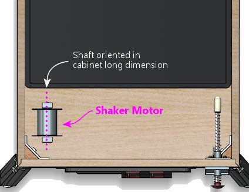
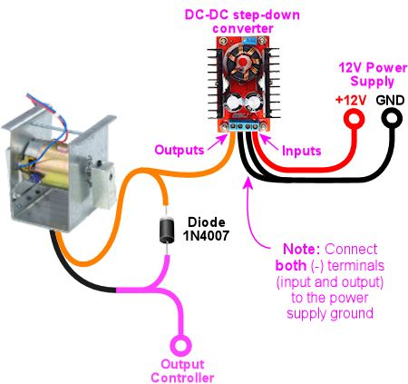
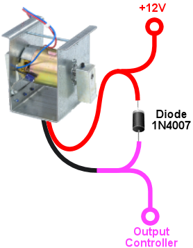
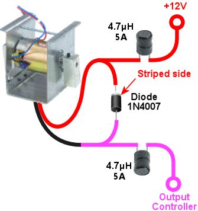

[#shakers]
= Shaker motors

The shaker motor is one of my favorite feedback toys. It does what the name suggests: it shakes the cabinet when activated. When done properly, the effect is a deep rumble that reverberates through the floor like an earthquake. Appropriately, the first arcade pinball that featured a shaker motor (as far as I know) was the earthquake-themed _Earthshaker_ (Williams, 1989).

Stern has enthusiastically embraced shakers in recent years, offering them as optional equipment in nearly all of their titles since 2010. Shakers were rare in the arcade before that, appearing only in a few titles where there was some kind of thematic connection, such as _Earthshaker_ (for obvious reasons) and _Red and Ted's Road Show_ (for the demolition theme). I think Stern realized that the tactile effect is a lot of fun for its own sake, even when it doesn't particularly tie in to the theme, which is exactly why shakers are popular in virtual cabs. You can profitably work it into pretty much any game, even older games that didn't have shakers in their original arcade versions. The DOF Config Tool database takes this to heart, liberally adding shaker effects to lots of older tables - as of this writing, the DOF database uses the shaker in 237 (!) games. Of course, DOF also faithfully reproduces the authentic usage in games like _Earthshaker_ that actually did have shakers originally. If you include a shaker, it will get plenty of use.

== Theory of operation

A shaker is simply a motor with an unbalanced weight attached to the shaft. It's like a washing machine a big heavy load on spin cycle.

== Off-the-shelf pinball shakers

You can buy ready-to-use pinball shaker units from the pinball parts vendors, including Marco Specialties and Pinball Life. Off-the-shelf kits sell for $100 to $200, depending on the target machine type.

The different kits currently available all use exactly the same shaker mechanism (as far as I can tell). The only reason there are so many different kits is that each comes with an interface board that works with a particular type of Stern machine. For a virtual cab, you actually don't need an interface board at all, because your DOF output controller will perform that function instead. So any of the Stern kits should work, and I'd just buy the cheapest one you can find, currently around $100. When the kit arrives, just throw away the Stern interface board, and plug the motor directly into your feedback device controller; see xref:#speaker_wiring[Wiring] below.

== Off-the-shelf vibration motors

There's another off-the-shelf option that's less expensive than the Stern shaker kits: replacement "vibration motors" for massage chairs and similar appliances. Some people on the forums have tried these and reported generally positive results.

You can find these on Amazon, eBay, and Aliexpress. Some are as little as $20. They're all no-brand parts from third-party sellers that come and go overnight, so I can't give you any specific model numbers or product links, but you can find options by searching the retail sites for *vibration motor* . Look for devices that have two counterweights and a speed of 4500 RPM or less. Lower speeds are better - higher speeds will feel too much like buzzing.

Be aware that there are smaller and larger versions of these motors. The smaller ones are more like cell phone buzzers, so skip those. You want one of the larger ones, sold for applications like massage chairs.

Even the largest vibration motors I've found still use smaller counterweights than the Stern units, so they'll produce a weaker shaking effect. I've seen a couple of negative comments about this from virtual cab builders. But stronger isn't necessarily better; there's an element of taste to this, plus, a less powerful unit might be more suitable if your cab is smaller and lighter than a full-sized pinball machine.

[#DIYDesigns]
== DIY designs

Shakers are simple enough that you can build one yourself for about $50 to $100 in parts. That's not much of a cost savings compared to buying one of the ready-made Stern kits, and it's actually more expensive than buying an OEM vibration motor, but some people might want to build their own just for the enjoyment of the project. A DIY shaker also gives you more control to tweak the effect to your liking, by adjusting the amount of weight and the geometry.

Hare are some detailed DIY plans you can find online:

*  xref:shakerPlan.adoc#shakerPlan[My shaker design]
*  link:https://www.vpforums.org/index.php?showtopic=14734&p=143713.html[Darkfall's plans on vpforums]
*  link:https://pinside.com/pinball/forum/topic/building-a-shaker-motor-i-have-a-couple-questions.html[RacerRik's plans on Pinside]
*  link:https://pinside.com/pinball/forum/topic/my-home-made-shaker.html#post-2408089[Waldo34's plans on Pinside] (a variation on RacerRik's plans)

The two Pinside plans closely replicate the mechanical design of the Williams and Stern shaker units (which are themselves nearly identical), so they yield nicely professional-looking results, but they're challenging to build because they require cutting, drilling, and thread-tapping steel bar stock. They also require some sheet-metal work. You need some specialized tools for all of that metal working, and the steel bar stock itself is rather expensive. Darkfall's design is easier to build because it doesn't require any metal fabrication, and it doesn't require any especially exotic parts. The first shaker I built was based roughly on Darkfall's design, and it works nicely. My only criticism is that its method for attaching the weights to the motor shaft is a bit jury-rigged and seems precarious - although, to be fair, the one I built has held together for many years now. My own design is an attempt at a more elegant and robust way to attach the weights, while still being easy and inexpensive to build. Almost all of the parts required in my plan are common hardware store items, and the only things you have to fabricate yourself are some simple plywood pieces.

=== Designing your own shaker

If you prefer to develop your own DIY plan, here are some parameters you can use as a starting point, based on what seems to work in practice for the commercial units and the DIY designs:

* Around 3000 RPM for the spin rate
* About 350 gram-centimeters (5 ounce-inches) of off-balance weight

The "gram-centimeters" figure refers to the result of multiplying the total weight of the counterweights by the distance from the shaft to the center of mass of the counterweights. It's the product of these two numbers that matters, so you should get the same effect from a 100 gram weight at 3.5cm or a 350 gram weight at 1cm, for example.

For reference, the counterweights in most of the commercial shakers are steel bar stock, 3/4" wide x 3/4" thick x 2" long, weighing 140g each. The shaft is placed 1/2" from the center of the long dimension (2").

[#motorSourcing]
=== Selecting a motor for a DIY unit

The motor is the hardest part to find when building a DIY shaker unit. There are hundreds (maybe thousands) of types of small electric motors available online, but most are unsuitable for one reason or another - they're too big, too small, use too much power, etc. It's especially hard to find all of the right properties in a dual-shaft configuration, since there just aren't that many dual-shaft motors available. A dual-shaft motor isn't an absolute requirement, but all of the DIY designs call for one, because it's easier on the motor's bearings to divide the weight into two smaller chunks than to have a single large counterweight.

The easiest way to source a suitable motor, by far, is to buy one that's marketed specifically as a replacement motor for a pinball shaker unit. Those are more expensive than comparable generic motors from eBay or Aliexpress, but you can be confident that they're suitable for the task, and you won't have to comb through hundreds of listings looking for the right specs. The pinball parts vendors currently (2022) stock several such motors:

*  link:https://www.pinballlife.com/replacement-motor-for-stern-shaker-kits.html[Pinball Life - replacement motor for Stern shaker kits]
*  link:https://www.marcospecialties.com/pinball-parts/041-5029-04.html[Marco Specialties - replacement motor for Stern shaker kits]
*  link:https://www.marcospecialties.com/pinball-parts/14-7951.html[Marco Specialties - replacement motor for 1990s Williams shakers, part 14-7951]

If you want something less expensive, or you just enjoy the hunt, here are the properties to look for in a generic motor:

[cols="1,1,3"]
|===
|Parameter|Range|Comments

|Configuration
|Dual-shaft (also called double-shaft)
|This means the rotating shaft sticks out at both ends of the motor, allowing you to attach a weight at each end.

|Voltage
|12VDC
|Most DC motors will run on a wide range of voltages (e.g., 6V-24V), so just make sure that the power supply you plan to use is within the voltage range listed for the motor. 12VDC is usually the most convenient power source in a pin cab.

|Power
|20W-50W
|The power rating gives you an idea of the mechanical force that the motor can muster, and the load it places on the power supply. A motor rated for 20-50W should have enough mechanical power for strong shaking, with a power draw at 12V of 4A or less. That's in the range that most ATX power supplies and high-power DOF controllers can safely handle. Motors with higher wattage ratings might overload your power or control systems.

|Speed (no load)
|3000-4500 RPM
|Higher speeds might feel more like buzzing than rumbling.

|Shaft diameter
|4mm-6mm or 1/4"
|This won't affect the feel of the effect, but smaller shafts might bend under the force of the shaking.

|===

For reference, here are some specific motors that virtual cab builders have used successfully in the past. It's probably impossible to find anything on this list that's more than a couple of years old - the manufacturers generally seem to do a single large production run for each model, and once that's sold out, they're gone. But it might still be worth checking, since you can sometimes the older models as remnants and used items on eBay.

* Generic 775 12V/24V 50W dual-shaft motor (available on link:https://www.amazon.com/dp/B07MBB5LBQ.html[Amazon] and link:https://www.aliexpress.com/item/2251832641125340.html[Aliexpress] as of June 2022; note that the "775" is *not* a model number or brand, but is simply a standard designation for the motor's dimensions; many other "775" motors are available that look similar but which have very different electromechanical characteristics)
* Pittman 9414H255-R2 (last seen around 2015)
* Buehler 480-0211-01 (last seen around 2015)

If you know of any other specific motor models that I should add to the list, please let me know.

NOTE: The motor in the original Williams shakers was labeled Johnson HC970. Unfortunately, that's not very helpful for finding replacement parts, because Johnson Electric apparently used this designation for a number of different OEM parts that they custom-manufactured for different customers. I've seen a couple of reports on the forums from people who found Johnson HC970 motors on eBay that turned out to be unsuitable.

=== Converting a regular motor to dual-shaft

Most shaker unit designs call for dual-shaft motors. But dual-shaft motors are relatively rare. This is the main thing that makes it so difficult to source a motor for a DIY shaker unit. One way around this to buy a regular motor, and convert it to a dual-shaft configuration.

This isn't exactly an easy solution. It requires taking the motor apart, modifying its inner workings, and putting it back together in working order. You'd have to be comfortable doing major repair work on mechanical appliances to contemplate this, and you should only consider it if you can tolerate the risk that you'll destroy the motor in the process. Most small DC motors are not at all designed to be taken apart by the end user. Attempt this only with a cheap motor that you don't mind replacing if you end up breaking it.

The basic idea is to disassemble the motor and replace its original shaft with a longer one - long enough to stick out from both ends of the motor body. The full procedure is beyond what I can document here, especially because motors aren't all exactly the same on the inside. There are some Youtube videos on the subject that you might find helpful - try searching for *convert motor to dual shaft* . Here's just a rough outline of the process:

* Open the motor casing. This usually requires using vise grips or pliers to forcibly bend back some metal tabs that hold the two halves of the main outer casing together. (I did warn you that most motors aren't designed to be taken apart!)
* Remove the whole armature/shaft assembly. Before you do, you might want to take a bunch of close-up pictures, to record how the brushes, springs, bearings, etc. are all arranged, so that you can get it all back together later. Beware that the brushes are usually spring-loaded, so small parts might go flying when you remove the shaft. You might want to work the motor inside a box or plastic bag so that flying parts don't get lost.
* Remove the shaft from the armature. In most motors, the shaft is simply press-fitted into the armature (the part with the wire coil windings), meaning that the only thing holding it in place is friction. Removing it just requires some brute force to pull or hammer it out. The fit is usually very tight, so this can take quite a bit of force.

If the shaft is long enough to start with, you might not need to replace it at all. You might be able to simply reposition the armature along the shaft so that some of the shaft sticks out the back of the motor.

* Assuming you do need to replace the existing shaft with a longer one, you'll now need to cut a piece of round steel rod to the desired length to make the new shaft. You'll need steel rod of exactly the same diameter as the original shaft. You can buy steel rod stock from Amazon or a hardware store. Cut it to the desired length, probably about 1" to 2" longer than the original shaft, using a cut-off wheel, hacksaw, etc.
* Apply some thread-locker to the new shaft so that it'll stay in place. Insert the new shaft into the armature, and position it so that enough material will stick out on each side of the motor body to provide attachment areas for the counterweights on both ends. As with removing the shaft, this is a brute-force matter of pushing or hammering it into place.
* Put the motor back together and bend the casing lock tabs back into place.

=== Enclosure

A shaker needs a sturdy cover that will contain the weights in case they ever come loose. A detached weight could become a high-speed projectile that could cause a lot of damage if not contained.

The off-the-shelf pinball shaker units all come complete with their own plastic enclosures, so that's another point in their favor. If you build a DIY plan, or buy one of the generic vibration motors mentioned earlier, you'll need to provide your own enclosure. I'd suggest a simple hand-built plywood box. (A clear acrylic cover is a nice enhancement if you build your own box, since it lets you safely observe the shaker in operation whenever you want to check that it's working properly.) You could also re-purpose a plastic food container or storage box, if it's strong enough to contain an ejected weight.

== Where to mount

On the real machines that have shakers, the units are installed somewhere near the front of the cabinet, but the exact location varies by title. I think it's just a matter of what's convenient in that machine's cabinet layout. Most of the recent Stern machines place the shaker in one of the front corners, alongside the coin box. In other machines, the shaker is behind the coin box, either centered left-to-right or off to one side.

I don't think there's much difference in effect from the different placement options, so put it wherever you have room. The only imperative, I think, is that it's better to keep the shaker close to the front of the cabinet, since that's where the player is.

In every commercial pinball setup I've seen, the motor shaft is oriented parallel to the long axis of the cabinet. I think this orientation does matter, since it creates a side-to-side shaking motion. That's probably the best direction for maximizing motion transfer, given the cabinet's proportions.

== Interaction with nudge devices

Some people have trouble with the nudge device picking up accelerations from the shaker. The nudge device is an accelerometer whose whole purpose is to detect cabinet motion, so it necessarily detects the motion that the shaker causes the same way that it detects motion from the player's nudges.

The shaker's motion shouldn't interfere with game action, even though it registers on the accelerometer. The motion from the shaker is different from nudges in that it's symmetrical, it's faster, and it's lower amplitude. The back-and-forth shaking motion should essentially cancel out on the time scale of manual nudging. Player nudges, in contrast, tend to be bigger and in one direction, and they happen on a longer time scale.

If you're having a problem with your nudge device going crazy when your shaker is on, there are two ways to address it:

* Turn down the intensity of the shaker
* Turn down the sensitivity of the nudge device

Before taking either action, you should ask yourself: What would a real pinball machine do? In other words, would that same exact shaker motor affect the ball on a real pinball machine the way it's affecting your virtual game? If the answer is yes, then the shaking effect is probably too intense, and the solution is to reduce the shaker motor speed. Shakers on the real machines don't send the ball flying around. If your shaker is at a level where it wouldn't affect the ball on a real machine, but it's affecting the virtual game to a troublesome degree, then the problem is in your nudge sensor calibration: you've turned up the sensitivity to unrealistic levels.

I'd always start by adjusting the shaker to produce a tactile effect you like, ignoring its effect on your nudge sensor. The easiest way to adjust the shaking intensity is to adjust the speed of the motor, either by adjusting the voltage or by adjusting the DOF PWM parameters; see "Speed adjustment" below. If you built a DIY shaker, you might also be able to change the shaking intensity by increasing or decreasing the amount of weight in the counterweights.

If the shaker is still causing excessive nudge interference after you've adjusted the intensity of the tactile effect to your liking, the next step is to adjust the sensitivity of your nudge device. You might balk at this suggestion, but go back to that question about real machines: does the ball fly around wildly on a real machine when the shaker is on? No, it doesn't. The thing is, most virtual cab builders initially set their nudge devices to be far too sensitive. This is natural - you want to see an immediate and obvious effect from the new toy. But it's easy to overdo this. I always urge new cab builders to go find a physical pinball machine and play around with it for a while, to see how the ball reacts in reality. If you mostly play virtual pinball, you'll probably be surprised by how "dead" a real machine feels when you nudge it. On a real machine, a ball trapped on the flipper will _not_ fly up off the flipper when you give the machine a little push, the way many people think it's supposed to work in Visual Pinball. If you want the shaker to coexist peacefully with your nudge device, you'll have to adjust your nudge device sensitivity so that it's closer to the subdued response a real ball would show.

One more thing: please don't use "dead zones" in your accelerometer setup. Dead zones are terrible. They make erratic behavior even more erratic because they create a non-linear "cliff" where there's no response at all at one level, and suddenly a huge response just a hair above that. It's better to stick with purely linear settings, like the "Gain" settings in Visual Pinball.

For more on nudge adjustments, see xref:tilt.adoc#tilt[Nudge & Tilt] .

== Speed adjustment

The amount of shaking you get out of your motor is a function of the weights, the distance they are off-axis, and the speed of the motor. It also depends on factors that aren't related to the motor itself, like where it's mounted in the cabinet, the overall weight of your cabinet, the stiffness of the legs, and the construction of the floor the machine is sitting on. The same shaker motor will produce somewhat different effects in different cabinets.

Of all of these factors, there's one that we can easily change: the speed of the motor. Once you have everything set up, you can fine-tune the effect by adjusting the motor speed up or down.

There are two ways to control the motor speed: adjusting the voltage of the power supply, and adjusting the power in software via PWM control (Pulse Width Modulation - a method of varying the power level in a digital circuit by rapidly switching the power on and off).

*Adjusting the voltage:* Most DC motors will work with a range of power supply voltages, spinning faster at higher voltages and slower at lower voltages. You can take advantage of this to adjust the motor's speed by varying the power supply voltage.

The best way to control the voltage is to connect an adjustable voltage regulator between the motor's power input and the 12V supply, as shown in the diagram below. Look for a "DC-to-DC step down converter" on eBay, and find one that has a dial or set-screw that sets the output voltage. This will let you adjust the voltage to anywhere between 0V and 12V, so that you can fine-tune the motor speed to your liking.

Select a regulator that has an amperage rating high enough for the motor (equal to or higher than the amperage the motor draws).

Note that a motor always has a minimum voltage level, below which it won't have enough torque to start spinning. The exact minimum is something you have to determine experimentally, since it depends upon the amount of load the motor is driving. If you try a low voltage and the motor stalls, don't leave the power on very long, as a stalled motor can quickly overheat. When experimenting to find the right voltage, it's safest to start with the dial turned up to the high end (12V), and gradually reduce the voltage until the speed is to your liking.

Typical wiring for a shaker motor with a DC-to-DC step-down voltage regulator to adjust the voltage supplied to the motor. Check your converter for the correct input/output terminals (don't rely on the illustration - your converter might have a different terminal arrangement). Note that the converter's (-) input and output terminals are both connected to the power supply ground.

*Adjusting with PWM:* The DOF Config Tool lets you set the power range for the shaker motor. Go to the Port Assignments page, and look for the "Shaker Motor" section on the right side of the page. This will let you set a maximum intensity, on a 1-48 scale. The default is level 48, to run the motor at full speed. Lower settings should slow down the motor; you can try different settings until you find a speed you like.

Most motors have a minimum power level they need to operate at all, so there will probably be some minimum PWM value below which your motor won't start. Don't leave the power on to the motor if it's stalled, as that can overheat it. When experimenting to find the right PWM level, it's safest to start at the maximum (48) and work down from there until the speed is to your liking.

Note that the PWM control only works if you're using a PWM-capable output controller, such as an LedWiz or Pinscape Power Board. PWM won't work with a relay-based controller such as a Sainsmart. You'll have to use the voltage adjustment approach with those.

[#speaker_wiring]
== Wiring

Follow the general wiring plan for any output device ( xref:feedbackWiring.adoc#feedbackDeviceWiring[Feedback Device Wiring] ). Connect one terminal of the shaker motor to the positive (+) power supply voltage (usually 12V). Connect the other terminal to an available port on your output controller.

A diode is required, to protect your output controller and other electronics from interference from the motor's magnetic field. See xref:diodes.adoc#coilDiodes[Coil Diodes] . If you're using a pre-built shaker assembly, it might or might not already have a diode installed; if you don't see one, assume there isn't one and add your own.

If you're using one of the off-the-shelf Stern shaker kits, and it came with an interface board for a real pinball machine (for example, a Stern SAM connector or a SPIKE connector), you won't need that interface board to use the motor in your virtual cab. Those boards are designed to interface to the specific electronics found in the various Stern machines, so they're not relevant to a virtual cab. We just need the motor itself.

If you're using the Pinscape expansion boards, you can connect the shaker directly to any MOSFET Power Board port. If you're using an LedWiz, don't connect the motor directly, as it will draw too much power for an LedWiz port; you'll need some kind of booster or amplifier circuit. See "Power limits and boosters" in xref:ledwiz.adoc#ledwizSetup[LedWiz Setup] .

*H-bridges:* If you read through old posts on the forums, you might see people say that you need an "H-bridge" to control a shaker motors. You don't. The idea got embedded at some point in the group consciousness because someone read about it on an Arduino forum and it got repeated a lot. H-bridges are useful if you need to control a motor bidirectionally, which is something that Arduino robotics hobbyists often want, but isn't necessary with a shaker motor. A shaker motor just needs to run in one direction, so you can connect a shaker directly to any feedback device controller port that can handle the motor's power level. If you're using the Pinscape expansion boards, you can run a shaker motor directly from any Power Board port. If you're using an LedWiz, you'll need a power booster circuit, the same as you'd use for any other type of high-power device like a solenoid or coil.

*LedWiz hacks:* You might also see old posts with some really scary LedWiz modifications involving soldering wires to IC pins on the LedWiz board. Ignore those. They're based on that old H-bridge notion. If you're using an LedWiz, you will need some kind of booster circuit, but that's something you can add on externally. There's no need to modify the LedWiz in any way. You just need the same sort of booster circuit you'd need for any other high-power device, as described in xref:ledwiz.adoc#LedWizPowerLimits[Power limits and boosters] in xref:ledwiz.adoc#ledwizSetup[LedWiz Setup] .

[#shakerElectricalInterference]
=== Electrical interference

Motors produce a lot of electrical noise, which can feed back into the power supply wiring and propagate into your system's logic circuits, such as the feedback controller and even the PC motherboard.

Diodes are a must, as already mentioned, because they help suppress the high-voltage transients that motors produce.

For some motors, diodes might not be enough. If you start seeing noticeable glitches when the motor is running, such as USB disconnects or random keyboard input, you might need some additional filter components.

The typical noise filtering for a motor is to add a pair of "chokes" (a type of inductor), in series with the wiring to the motor. Add one on the power input to the motor and one on the connection to the feedback controller.

Try a 4.7 µH inductor, with an amperage rating equal to or higher than your motor's operating current. Here's an example part from Mouser that should work well:

Coilcraft DR0608-472L 4.7µH, 5.8A radial inductor - link:https://www.mouser.com/search/ProductDetail.aspx?R=994-DR0608-472L.html[at Mouser]

Inductors aren't polarized, meaning they don't have a special orientation when you install them. It doesn't matter which lead connects to the "\+" side and which connects to the "-" side. (The diode, in contrast, has to be installed with its striped side going to the "+" voltage, as shown in the diagram.)

The inductors shouldn't be necessary on most virtual cabs. I haven't had a need for this with any motors on my machine. But it's something to try if you experience interference problems that seem to coincide with shaker activation. You can also add inductor filtering to any other motor-based devices that cause interference, such as gear motors, fans, and beacons.

Note that you should always keep the diode in place even when adding inductor filters. The inductors provide a different type of filtering and aren't a substitute for the diodes.

== DOF Setup

In the link:https://configtool.vpuniverse.com/[DOF Config Tool] , go to the Port Assignments page. Find the port number where you wired the shaker motor. Assign it to "Shaker".

At the right side of the page, you'll also find a section labeled "Shaker Motor" that lets you set the intensity range. If you're using a PWM-capable controller (e.g., an LedWiz or a Pinscape power board), this lets you set the range of power that DOF uses when the shaker runs. The intensity values are on a 1-48 scale, where 48 is the highest power. The default settings use the full available range. If you find that the shaking effect is too powerful when DOF activates it during game play, you can reduce the maximum intensity setting to slow down the motor. Similarly, if the motor seems too weak some of the time, or doesn't have enough power to start spinning in some cases, you can raise the minimum setting.

Note that the intensity adjustment won't work unless you're using a PWM-capable output controller. If the motor is connected through any kind of relay, such as a Sainsmart board, the DOF PWM adjustment won't work and you'll have to adjust the speed some other way, such as with a varying voltage supply (see "Speed adjustment" above).

