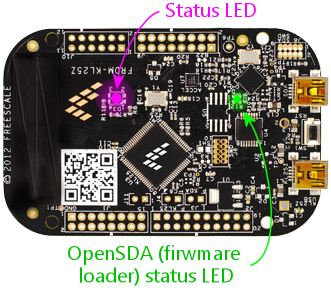

[#statusLights]
= KL25Z Status Lights

The Pinscape firmware blinks the LED on the KL25Z to indicate its system status.
This is a quick way to check if the Pinscape software is operating normally (or, at least, to check if the software _thinks_ it's operating normally, which might not always be the same thing!).
If you suspect that something's wrong, or you're not seeing expected input on the PC, the LED lets you check at a glance what the Pinscape software thinks about its current health.

Here are the various flashing patterns you might see and what they mean:

*  *Long blue/green* lights, alternating about every second: normal healthy operation.
*  *Long yellow/green* lights, alternating about every second: normal healthy operation.
The device has a good USB connection and is running normally.
However, the plunger hasn't been calibrated yet, so you should run the plunger calibration process to finish device setup.
*  *Short yellow flashes* , every couple of seconds: the device has just restarted and is trying to connect to the PC via USB.
*  *Two short red flashes* in rapid succession every couple of seconds: the USB connection to the PC was broken.
This can happen if the USB cable is physically unplugged _or_ the connection is broken at a software level.
Software disconnections can happen due to software errors, and can also happen if the Windows USB drivers intentionally disconnect.
*  *Long red/yellow* lights, alternating: USB data transmission problems are occurring.
The device still has a connection to the PC (or so it appears to the device), but the PC isn't acknowledging transmissions.
The device will try to restore the connection automatically when this occurs, so this condition is usually short-lived; the device will usually either return to normal within a few seconds or will reboot itself to try to reset the connection.
*  *Medium blue flash* , about half a second each: the TV ON delay timer is running.
This means that the power to the secondary PSU has just been turned on, and the TV ON timer is waiting for the configured delay time before turning on the TVs.
You'll only see this if the TV ON feature is enabled.
*  *Fast red/purple* , alternating: the device is out of memory.
This means that the programmed configuration is too complex.
The KL25Z has a limited amount of memory, and each feature enabled in the configuration consumes some of that.
It's possible in principle to exceed available memory by enabling too many features simultaneously.
This error should only occur _immediately after a reboot_ , since the software allocates all memory up-front during startup and uses a fixed memory configuration from that point on.
So you'll never see this happen spontaneously because of something you're doing during a pinball game session, for example.
And at the moment, it really shouldn't be possible to trigger this condition at all with any real-world configuration.
But you can do it by deliberately maxing out every possible configuration option.
If you do happen to trigger this error, it will keep happening again every time you reboot, since it's a function of the saved configuration.
The only way to clear it is to reset to the default configuration by reinstalling a fresh copy of the Pinscape software.

== Re-purposing the LED for feedback output

The status indicator LED on the KL25Z is connected to GPIO ports (three of them - one each for the LED's red, green, and blue channel), which means that it's under the control of the Pinscape software program.
That much is probably obvious given that the software uses the LED to display the status light patterns listed above.
But it also means that you can assign the LED elements as feedback device outputs.
The Config tool lets you assign the GPIO pins associated with the LED to DOF output ports, exactly like any other GPIO pins, in the Outputs list on the Setting page.

If you do assign an LED element as a DOF-controlled output port, the Pinscape software will cede the LED port to your control, and won't try to use it as a status light.
That means that the flash patterns listed above won't appear if you take over the LED for output port use.
Obviously, the LED can't serve two masters, so the Pinscape software gives precedence to your settings.

Why would you want to use the LED as a feedback device?
The main use case I see is testing.
If you want to test a new DOF configuration on your PC, for example, and you haven't set up any external feedback devices yet, the on-board LED could be used for a quick test that DOF signals are getting through to the KL25Z.

Finally, I'll point out a couple of odd quirks to the way the LED is wired on the KL25Z.

The first quirk is that the LED channels are wired in "active low" fashion, meaning that each LED color turns *on* when the voltage on its GPIO pin is *off* .
When setting up the LED elements as outputs in the Config Tool, just be sure to enable the "Active Low" option for each port.
If the LED shows the opposite of what you want (the LED is on when you want it off, off when it should be on), you probably just need to go set the Active Low option.

The second quirk is way the LED connections are wired.
The red and green LED elements are wired to GPIO ports (PTB18 and PTB19, respectively), but this is all purely internal within the KL25Z circuit board: they're not wired to any external pins.
Strangely, though, the blue LED element (PTD1) _is_ wired to an external pin.
So you can use port PTD1 to control something wired externally in addition to controlling the blue LED element.
I don't recommend doing that, since it's pretty confusing to think about, but if you were in a pinch and absolutely needed one more external GPIO pin for some external control circuit, it would work.
The blue LED would just be sort of dragged along with whatever you were doing with the external port, so you'd have to put up with the blue LED turning on and off in concert with the external circuit.

== Using PTD1 for button input

The blue segment of the status LED is wired to GPIO port PTD1, which is also wired to one of the pins on the KL25Z's main pin headers (J2 pin 12; see xref:kl25zPinOut.adoc#kl25zPinOut[KL25Z Pin Out] ).
The pin header wiring means that you can use PTD1 for other purposes besides controlling the blue LED - but if you do, it requires some special handling, because the blue LED connection is hard-wired on the board and can't be changed in software.

(The red and green segments are also wired to GPIO ports internally, but they don't have any pin header wiring, so there's no way to use those ports for anything other than the LED connections.)

You can use PTD1 as a feedback device output port simply by assigning it in the config tool.
Assigning it as a feedback output will prevent the Pinscape firmware from using it as part of the status indication.
However, it doesn't change the internal hard-wiring between PTD1 and the blue LED, so the blue LED will now turn on and off in sync with any external feedback device you wire there.
(Actually, in sync, but opposite: remember that the LED uses "active low" wiring, so the blue LED will turn ON when the output port is OFF, and vice versa.)

You can also use PTD1 as a button input, again, simply by assigning it as a button input in the Config Tool.
With this use, the blue LED segment will stop acting as part of the Pinscape status indicator; instead, it'll just light up whenever you press the button.

If you do use the PTD1 header pin for one of these uses, and it bothers you that the blue LED is affected by the port status, you can physically modify the KL25Z to sever the connection to the LED.
The procedure is described in xref:kl25zPinOut.adoc#kl25zPinOut[KL25Z Pin Out] .
Be aware that severing the blue LED connection will change the Pinscape status light patterns accordingly, since the Pinscape firmware won't be able to light up the blue LED any longer.

== OpenSDA status LED

There's a second status LED on the KL25Z: a smaller monochrome green LED, close to the USB connectors.
This one shows the OpenSDA (firmware loader) status:

* Solid green means "OK" - the OpenSDA port is connected and the boot loader is awaiting commands
* Slow flashing means that a firmware update is in progress
* Rapid flashing means that an error has occurred

If rapid flashing appears, indicating an error, you can clear it by unplugging both USB cables, waiting a couple of seconds, and then plugging the cables back in.
That should reset the device and return the status indicator to solid green.
Once an error condition appears, it stays there until you clear it manually.

If you see an error indicator, it's not due to anything you did wrong.
It's just random bugs in the KL25Z boot loader, as far as I can tell.
That part of the software comes from the KL25Z's manufacturer, so it's not something I can easily fix.
An error condition on the OpenSDA side won't affect normal Pinscape operations, so you can ignore the little green LED most of the time.
It only matters when you're trying to update the Pinscape firmware.

