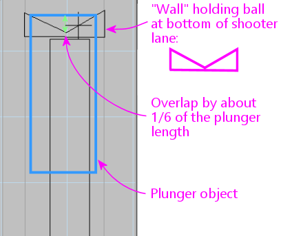

= Fixing VP Plungers

If you built one of the plunger sensor options for the Pinscape Controller, or if you bought a commercial plunger kit, you'll certainly want to use the plunger when playing simulated pinball tables. Many tables work with plungers automatically, but some don't.

Fortunately, for open systems like Visual Pinball, it's possible to edit the table files yourself, so you can often fix any games that don't already work with the plunger. This section shows you how to do this for Visual Pinball tables.

Plunger support has evolved in Visual Pinball over the years. Most Visual Pinball 10 tables should work automatically. It's much more hit-or-miss with Visual Pinball 9, though; many tables, especially older ones, lack proper support for the plunger.

Commercial game software doesn't usually give you any ability to modify the software yourself. Your only recourse for a commercial game that doesn't work is to contact the publisher's technical support people.

== How plungers are supposed to work in Visual Pinball

The "right" way for a Visual Pinball 9 table to implement a plunger is to use VP's intrinsic plunger object. VP has had built-in support for plunger devices since early releases of VP 9.

The built-in plunger object in VP automatically takes input from a USB plunger device, if you have one in your system. This works by reading the USB joystick interface, using what's called the Z axis (although you can configure this in VP's settings dialog to use a different axis, if your physical plunger device uses something different). The name "Z axis" is taken from mathematics, where it conventionally refers to the vertical axis in a 3D plot. But PC joysticks use the term loosely, to refer to "just some random third axis" - _third_ because the first two, X and Y, are the two degrees of freedom of the stick itself, left/right and forward/back. Z usually represents some other control attached to the joystick, such as a slider control or a throttle. For virtual pinball plungers, we only pretend to be a joystick, but we still have to use their notation. So we continue the PC joystick tradition of assigning idiosyncratic meanings to the mathematical axis names, using X and Y to represent accelerometer readings for nudging, and using Z to represent the plunger position.

Tables that take advantage of VP's built-in plunger feature usually "just work", because the built-in plunger itself just works (once you have it properly configured, at least).

== Why plungers don't always work in VP tables

If tables authors would always use VP's built-in plunger object, plungers would work properly in all tables.

But table authors don't always go along with this plan. A lot of VP tables, especially older tables written before about 2016, _don't_ use VP's built-in plunger feature. Instead, a lot of them reinvent the [.line-through]#wheel# plunger by using Visual Basic scripting (which is another thing built into VP) to create their own completely new object that's supposed to look and act like a plunger.

To be fair, many of the table authors that scripted their own custom plunger objects were well-meaning. The early versions of VP's plunger looked cartoonish and had a rather poor physics simulation. Table authors working on re-creations of real tables naturally wanted their tables to look good and work right, so they didn't want to settle for the poor plunger implementation in early VP 9 releases.

But well-meaning or not, all of this re-inventing created huge hassles for those of us with physical plunger devices. Many of the table authors who created their own plungers in VB scripting didn't think to read the joystick input. If a table doesn't read the joystick input, it obviously won't work with your physical plunger device, which sends information via the joystick input.

VP's built-in plunger was overhauled around version 9.9.5 to give it a photo-realistic appearance and to make its physics work properly, both for desktop play using keyboard input, and for cabinet play with a physical plunger device. The new plunger was carried over into VP 10 and has been a part of VP 10 from the beginning. So newer tables - those written later in VP 9's tenure, and anything written for VP 10 - mostly use the new plunger object and mostly "just work". The only exceptions among newer tables are a few written by authors who were accustomed to the bad old way of doing things and didn't get the memo about the built-in plunger overhaul. But those should be increasingly rare as time goes on, and I certainly hope no one is still using the bad old way for new tables at this point.

How do you fix a table that ignores the joystick input? Unfortunately, it's not easy - but it can be done. Basically, you have to rip out all of the scripted plunger code in the table, and substitute the "real" built-in plunger object instead. The thing that makes this difficult is that there's not a simple, rote procedure you can follow, because every table that re-invented the plunger re-invented it in its own way. You have to look at each table individually to find its plunger scripting code and the associated table objects so you can remove all of that. But there are two rays of sunlight here. The first is that most table authors didn't actually reinvent their custom plungers from whole cloth - most did a copy-and-paste job from another table. So once you've fixed a few tables, you'll start recognizing common patterns, and it'll become easier each time. The second nice thing is that you don't really have to write any new code - mostly it's just a matter of deleting all of the custom plunger code so that the built-in plunger can take over. The table scripts will end up simpler and cleaner when you're done with them. At any rate, I'll try to give you the outline of a procedure that works for many tables, but be warned that it still takes some work on your part; it's not a simple "recipe" that you can apply mechanically.

== Why plungers don't always work, part II

There's actually one more reason that plungers don't always work in VP. This one's a lot easier to fix than the first one.

Remember how I said that the built-in plunger in older versions of VP had bad physics? The situation was so bad that the bad physics actually interfered with ordinary desktop use, even if you didn't have a joystick attached. So a lot of table authors who used the built-in plunger as the basis of their scripted re-inventions _explicitly disabled the joystick input_ so that desktop users wouldn't have to put up with the bugs.

So for some tables, you'll find that there's already a proper built-in plunger object present, and that all you have to do is tick a box in the settings to re-enable joystick input.

== How to fix a VP table

Here's my procedure for fixing VP tables with broken plungers. Be warned that this isn't a simple recipe you can follow mechanically; it's more of an outline.

Before starting, save a backup copy of the table! We're going to go into the table definition and do some major surgery. It's possible to hopelessly screw up the table this way, and sometimes the easiest way to get back to a working state is to scrap all of your changes and start over from the original working version. You'll feel better about messing around with the table's innards if you have a backup copy tucked away that you can easily restore if things go haywire.

If you're already adept at using VP, you probably just need a quick overview of the steps at a high level:

* First, check for a Plunger object in the table. If it's there:
** Make sure *Enable mechanical plunger* is enabled in its properties
** Make sure it's positioned so that it can hit the ball
** Make sure it's visible
** Set its style to Custom, and set the image to CustomWhiteTip or CustomBlackTip (see xref:#lookNice[Making the built-in plunger look nice] below)
* If there's not already a Plunger object, try adding one, setting it up to use the new "Custom" visual style and positioning it so that can hit the ball when fired
* Delete any playfield objects (ramps, walls, lights, EMReels) that are being used to draw the scripted plunger on-screen
* Go through the table's scripts and delete all of the old plunger-related scripting code

If you're not a VP power user, read on for a more detailed explanation.

=== Open the table in the VP editor

Fire up VP. Open the table in the editor (not in "playing" mode).

=== Look for an existing plunger object

The first step is always to find out if there's already a built-in plunger object. Many (maybe most) of the tables with scripted plungers _also_ have a built-in plunger object that's used as a helper for some of the scripted operations.

If there is a built-in plunger, it might be hidden or located somewhere off the table or in a remove corner of the table where it can't interact with the ball. So it might not be obvious that it even exists when you look at the table layout in the editor.

The easiest way to find this object is as follows:

* Edit > Select Element (or Ctrl+Shift+E)
* Look through the list for something called "Plunger" or something similar, like "Plunger1"
* Click it in the list
* Click Select - a rectangular outline should light up somewhere in the layout showing where the object is positioned
* Close the dialog

=== Enable mechanical plunger

If you successfully found a plunger object in the previous step:

* Select the object as described above
* If the properties window isn't already showing, click Options in the left panel to bring it up
* In the State section, make sure the *Visible* box is checked
* In the State section, if *Park Position* is set to 0, change it to 0.16667
* In the State section, make sure the box for *Enable mechanical plunger* is checked
* If the *Enable mechanical plunger* box _wasn't_ already checked, this might be all you need to do to fix it! This might be one of those tables where the original author disabled joystick input (this is the option that does that) because of the old physics bugs it caused for desktop users. Checking the box re-enables the joystick input, so the table might suddenly start working. Save the table, fire it up in "play" mode, and test it out. If the on-screen plunger tracks your physical plunger and launches the ball properly, you're done! If it _mostly_ works at this point but the plunger is too weak or too strong, see "Other physics adjustments" below.

=== Try moving the plunger object

If you found a plunger object, but "Enable mechanical plunger" didn't turn out to be a magic one-step fix, there's another simple thing we can try before we have to dig deeper into the table.

A lot of table authors who "re-invented" the plunger did so by tying their scripted object to a real plunger, and kept it from getting involved in the physics by moving it somewhere out of the way where it couldn't hit the ball. You might be able to see this easily just by looking at the table layout - the plunger might be obviously off in left field somewhere. But in some cases, this might not be visually apparent. Some table authors just move it back a few pixels from the ball position, so that it gets tantalizingly close but can't actually hit the ball.

So the thing we can try now is moving it into the proper position.

The first thing to do is to make sure the object is movable. If the object lights up with a gray rectangle when selected, it's "locked", meaning VP won't let you move it. But we have the key! Right-click it and un-check "Locked" in the context menu. If it lights up in blue when selected, it's already unlocked and movable.

If the object is obviously off in left field somewhere, try moving it into the shooter lane area. If it's already more or less in the shooter area, try moving it further up on the playfield (in the upwards direction on the editor screen).

It can be hard to visually parse VP's editor screen, because everything is so schematic (just a few black lines showing the rough outline of each object) and there can be so many things overlapping in one area. Most games have an arrangement something like shown below, with a "wall" object shaped like a little wedge that holds the ball in place at the bottom of the shooter lane, just above where the plunger strikes. That's the key point for aligning the plunger. It has to overlap that wedge-shaped wall slightly - by about 1/6 of the plunger length - in order to hit the ball.

You won't find this exact layout on all tables, so don't be overly literal about looking for this exact picture. You might not find a "wedge" wall like this at all. It's a common motif, but every VP table author does things their own unique way. You might find a differently shaped wall in roughly the same area, or no wall at all.

There's also usually a bunch of other stuff overlapping in the same area, so even if the wedge is there, it might be hard to visually separate from all of the other objects. If you're having trouble identifying which squiggle belongs to which object, remember that you can select an object by clicking on it. This will at least highlight it so that you can see which of the lines belong to this one object, and it'll show its name and object type in the Properties window, which can help identify its purpose.

Once you've moved the plunger into what appears to be the proper position, test again in "play" mode. Again, check if the on-screen plunger tracks the motion of the physical plunger (it's a great sign if so), and check if you can launch the ball.

=== Other physics adjustments

If you can make the plunger work at all with the changes we've covered so far, you might still need to make some further adjustments to make it work _well_ . In particular, if the launch speed is too slow or too fast (for example, the ball doesn't make it all the way up the lane even when you pull the plunger all the way back and release), you can adjust that by changing the plunger properties. Here's how:

* Select the plunger object
* Bring up the Properties window
* Adjust the Mech Strength property: _increase_ the number if the launch is too slow, _decrease_ it if the launch is too strong

=== Removing a double image

Some tables use their own objects to simulate the visuals of the plunger, hiding the real plunger by positioning it somewhere out of sight. Moving it back into its proper position for the sake of the physics will also make it appear at the proper position visually, so you might now have _two_ plungers showing up on-screen.

The easiest way to fix this is to make the built-in plunger object invisible:

* Select the plunger object
* Bring up the Properties window
* Un-check the Visible box under the State section

That leaves the built-in plunger working as far as the physics go, but hides its visuals, so you get the custom graphics that the table author designed.

Personally, though, I prefer to do the opposite: I prefer to switch tables to use the built-in visuals instead. This usually looks much better than the old scripted visuals. The "new" built-in plunger in VP looks photo-realistic, plus it's very smoothly animated. The custom scripted graphics in many older tables look okay, and some look great, but almost all of them have really choppy animation with just a few "stops" the plunger can appear at.

Getting rid of the old graphics can be a bit of work, so be prepared.

The first step is to change the built-in plunger to use the new visual style that actually looks nice. Existing plunger objects in older tables are always set up to use one of the old visual styles, which all looked crappy. See "Making the built-in plunger look nice" for the procedure.

The rest is a matter of ripping out the game's custom scripted plunger graphics. The procedure is exactly the same as "Replacing the scripts" below, since you want to get rid of the scripts and use the built-in object instead.

=== Adding a new plunger

If the table you're working with doesn't have a built-in plunger object at all, you've got a bigger job ahead of you.

The first step, at least, is easy. You add a new plunger and move it into position. Adding the object is just a matter of clicking the "Plunger" button in the left pane in the VP editor, then clicking on the playfield where you want to position it.

Make sure that the following options are set in the Properties for the new plunger object:

* Enable mechanical plunger
* Visible

Repeat the steps above under "Try moving the plunger object" to get it into the proper position.

[#lookNice]
=== Making the built-in plunger look nice

If you had to create a new plunger object, or you're working with a pre-existing plunger object, chances are that it's using one of the old visual styles that look cartoonish or bad.

The trick to making the built-in plunger look nice is to switch it to the "Custom" style. It's a fairly long procedure, but it's all very straightforward:

* Create a *new* VP table
* On the menu, select Table > Image Manager
* Find CustomWhiteTip in the image list and select it
* Click the Export button
* Save the file somewhere on your local hard disk
* Close the Image Manager dialog and discard the new table
* Go back to the table we were working on
* On the menu, select Table > Image Manager
* Click the Import button
* Find and select the CustomWhiteTip.png file that you saved from the new table above
* Close the Image Manager dialog
* Select the plunger object
* Bring up the Properties window
* In the Color & Formatting section, select PlungerTypeCustom in the Type drop-list
* In the Image drop list, select CustomWhiteTip

Note that there's also a CustomBlackTip object you can use if you prefer a plunger with a black rubber tip - this fits some tables better. You can also create your own original texture if you're familiar with how 3D texture mapping works. That's a bit of an arcane process, though, which is beyond the scope of this chapter.

Note also that there are a bunch of other properties in the Color & Formatting section that let you further customize the drawing, such as setting the diameter of the plunger rod and how many loops of the spring are shown. You can tweak those to get the visuals just right for the table.

=== Removing the old plunger scripts

Now to the hard part: getting rid of the table's custom plunger scripts.

This is only necessary if you weren't able to get the plunger working by enabling (or creating) and properly positioning a built-in VP plunger object, as outlined above. It's also necessary if you already got the plunger working in terms of the physics but you want to get rid of the old scripted graphics.

====  Delete fake plunger objects

Start by looking for objects on the playfield around the plunger area that serve no apparent purpose. These will often be one of the following types:

* Wall
* Ramp
* Light

The most likely thing will be a big rectangular object (of one of the types above) covering roughly the same area where the plunger appears. These will usually be somewhat larger than the plunger.

If you find such an object, check its property list to see if it has an associated image in the Color & Formatting section. If so, check what the image looks like in the Image Manager:

* On the menu, select Table & Image Manager
* Find the named image in the list
* Click it and look at the thumbnail

If the image looks like a plunger photo, that clinches it - you've found exactly what we're looking for.

If there's no image, though, it might still be an object of interest. The scripts might be assigning an image in Visual Basic land instead of using the object properties directly. If the object is in the right area, you can make a guess that it's what we're looking for.

If you don't find anything on the playfield, you might try looking at the Backdrop. This is an extremely hacky hack that some table authors use to force an object to appear on top of the table - the "Backdrop" is a sort of super-layer that gets drawn on top of everything (the opposite of what you'd guess from its name!). You might find something called an EM Reel object there:

* Click Backdrop in the left pane
* Note that the Backdrop view is rotated 90 degrees from the regular view, so the plunger area is at the top right in this view
* Look for one or more rectangular objects of type EM Reel around the plunger area

If you find something matching the description - a ramp, wall, light, or EM Reel in the right area and possible with the right image type, try deleting it. Just select it with the mouse and press the Delete key on the keyboard.

Note that might have to "unlock" the object before you can delete it. If it lights up with a gray rectangle instead of blue, it's locked. Right-click it and un-check "Locked" from the context menu.

One good sign that you found the right object is that _there's another object right behind it_ that looks exactly the same. A lot of table scripts use a big stack of objects piled one on top of the other as a series of flip-book animation frames. The Visual Basic scripts will make one of the objects visible at a time to animate the plunger motion. If you find a stack of 10 or 20 identical objects in the same spot, you've found an animation flip book. Just keep selecting and deleting them until they're all gone.

====  Delete scripts

The next (and fortunately last) step is hard to express as a recipe. You're going to be somewhat on your own here. What you have to do now is find and delete scripting code that refers to those objects we deleted above.

If you're good at reading Visual Basic code, you can go through the script and look for subroutines related to the plunger. When you find one, you can usually just delete it outright, from the line that says "Sub _name_ " to the matching "End Sub".

A lot of tables with plunger scripts are actually pretty helpful about grouping all of the plunger scripts together in one place. You might find a section marked with comment like this:

[source,vb]
----
'**********************************************************
' Plunger scripts
'
----

If you find something like that, you can try selecting everything that follows that looks plunger-related (based on the names of the subroutines, for example) and deleting it.

If you don't want to pore over the script, there's a pretty easy trial-and-error way of finding the trouble spots. Specifically, you can rely on the fact that all of the plunger scripts will probably make reference to the playfield objects we just deleted. Whenever any of those references are encountered at run-time, Visual Basic will halt the program and throw up an error message telling you that the code is referring to a non-existent object. VB is usually pretty good about showing you exactly where each error occurs, by highlighting the error line in the editor, so this can be a quick and reliable way to find each error and remove the code.

* Run the game
* Wait for Visual Basic to throw up an error message
* If you don't get any errors immediately, try pressing and holding the Enter key on the keyboard to pull back the plunger. Let it pull all the way back, then release the Enter key to release the plunger. If there are any scripts that rely on deleted objects, one of them should trigger an error at some point during this process.
* If you don't get any errors with the keyboard, try again with your plunger device. Hook up the device, move the plunger around, and see if any errors occur at any point.
* Find the line of code where the error occurred
* Delete the code:
** If the error location is in a Sub..End Sub section that looks totally plunger-related, delete the entire Sub..End Sub section
** If the error location isn't in a Sub at all, it's probably "initialization" code that runs at table startup. Just delete _that one line_ that contains the error
** If the code is inside a Sub called something like Table_Init, it's also initialization code. Just delete the one line containing the error.
** If the code is inside a Sub called something like Table_KeyDown or Table_KeyUp, it's keyboard handler code. Don't delete the whole routine; just delete the line that's causing the error.
* Go back and repeat this whole process until the game runs reliably

In most cases, tables with plunger scripting use subroutines that are fairly self-contained and dedicated to the plunger operations. So when you find an error, you can usually just delete the entire subroutine that contains the error line: that is, all lines from the nearest *Sub _name_* that precedes the error line to the nearest *End Sub* that follows it.

Something that's likely to happen during this process is that you might delete one subroutine block that _another_ subroutine calls. So after you delete the code with the first error, run again, and you'll probably hit a _new_ error in code that's trying to call the code you just deleted.

Getting the table working now is usually just a matter of repeating this seek-and-destroy mission until until you stop getting errors.

====  If all else fails

In some cases, the "delete code until it starts working" approach can backfire. Some tables are just too complicated, with Visual Basic code that's too intertwined, for mere code deletion to work. You sometimes have to rework the code a bit instead.

If you know VB well enough, you can analyze the code and figure out what you have to change. If you're not a VB power user, well, it's a bit beyond scope of this section to turn you into one. My advice would be to ask nicely for help on the forums - maybe you can find the original table authors and persuade them to update the table to modern standards, or enlist help from one of the many Visual Pinball power users on the forums.

