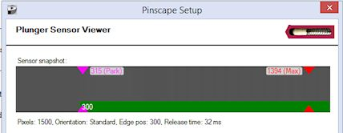
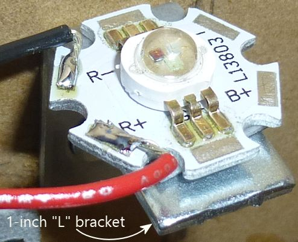
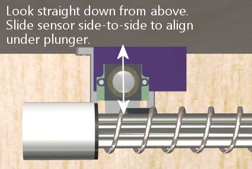
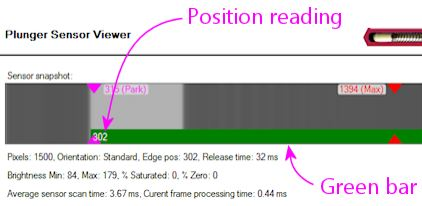

[#tcd1103]
= Plunger Setup (TCD1103)

image::images/tcd1103-overview-1.png[""]

CAUTION: *Beta Test Alert! This section is new and barely tested.* This is a brand new sensor design added in April 2020, with little or no field testing so far - just my own lab-bench work putting together the design. 
In my testing, it's been performing extremely well, so I'm publishing the design in the hope that other people will find it useful as well. 
But be aware that if you build one, you'll be a very early adopter. 
There might be errors or omissions in the plans here that we'll have to work out. 
I'd be very interested in hearing from you if you do build one! Let me know if you run into any problems or have any ideas to improve the design, and if you actually deploy it, definitely let me know how it works for you in real everyday use.

The original Pinscape plunger system, first published back in 2015, was based on a special type of optical sensor called a "linear image sensor", meaning all of its pixels are arranged into a single row (in contrast to a normal camera sensor, which has a rectangular array of pixels). 
The particular linear image chip we used, known as the TSL1410R, was an improbably perfect fit - literally - for plunger sensing, because it consisted of a row of sensor pixels about 3" long, exactly the length of travel of a standard pinball plunger. 
By placing the 3" sensor window adjacent to the plunger, and placing a light source on the other side of the plunger, the sensor was able to determine the plunger position by scanning the pixels for the shadow cast by the plunger along the 3" window.

Sadly, the manufacturer stopped making that 3" sensor a long time ago, and there's nothing else like it on the market, so this hasn't been an option lately for new pin cab builds. 
There are some excellent alternatives, particularly the xref:aedr8300.adoc#aedr8300[AEDR-8300 quadrature sensor] and the xref:pot.adoc#pot[sliding potentiometer] design. 
But none of the other available designs has the special charm of an imaging sensor, which is that it's completely "non-contact", meaning that there's no mechanical connection between the sensor and the plunger, and thus no moving parts to wear out over time. 
Operating a standard ball shooter involves a lot of force and high speeds, which inevitably causes some wear on the sensor parts if they have to be mechanically connected and move at the same high speeds and jerky accelerations. 
(Another non-contact sensor has recently been added: the xref:VCNL4010.adoc#VCNL4010[VCNL4010 proximity sensor] . 
But it's not as precise as I'd like.)

That's why I'm pleased to present a new option that brings back the non-contact, all-optical approach, using a different sensor that you actually can buy (as of 2020). 
The new design isn't quite the same as the old one, because the new sensor is rather different. 
Whereas the old sensor had that gigantic 3" pixel array, the new sensor described in this section has a pixel array that's only about 8mm (about 1/3") long. 
But despite its much smaller physical size, the new sensor actually has more pixels than the old one! Each pixel is just much smaller, obviously. 
To bridge the gap between the 3" plunger travel and the 8mm sensor window, we have to add something the old design didn't need: optics. 
We need a lens, to focus an image of the plunger on the tiny sensor. 
It's the same principle your iPhone camera uses to project a tiny image of the Eiffel Tower onto the tiny CCD chip inside the phone.

The need for a lens makes the system a little more complex than the old one, which is unfortunate. 
But the lens has a major upside, too, which is that a focused image gives us better accuracy in determining the plunger position. 
The old "shadow" image was inherently fuzzy, so it didn't take full advantage of the native pixel resolution of the sensor. 
With a lens involved, we can capture a much sharper image, which lets us determine the plunger position with greater precision. 
The new sensor has higher native resolution than the old one to start with, so when we add in focusing optics, we get a system with significantly better performance than the old one (which was already very good).

== Introducing the TCD1103 sensor

The Toshiba TCD1103 is an optical linear image sensor chip. 
This is similar to the image sensor in a digital camera, but rather than having a rectangular array of pixels like in a camera, the TCD1103 has all of its pixels arranged into a single row. 
That's the "linear" part. 
To be more specific, the TCD1103 has 1500 pixels in a row about 8mm long.

With a US quarter, for scale:

This sensor can be made into a limited sort of optical camera by fitting it with a lens to focus an image onto the pixel file. 
We can use this to track the the plunger position by pointing the camera at the plunger, with the pixel file oriented along the plunger's axis of motion. 
The camera will see an image of the plunger, and as the plunger moves back and forth, we'll see the image move along the pixel file. 
With a little image analysis, the software can figure out where the tip of the plunger is along the pixel file, which in turn tells us how far back the plunger is being pulled.

To keep the image analysis simple, we'll set up the plunger so that it creates a certain image pattern on the sensor. 
We'll put a bright white wrapper on the tip of the plunger, so that the end of the plunger stands out as a clear bright area in the image, and we'll place a dark (matte black) background behind the plunger, to create high contrast between the plunger tip and the background. 
This makes it easy for the software to find the end of the plunger in the image: it just looks for the edge between the dark background and the bright spot at the plunger tip.

This is probably my favorite plunger sensor out of all the current options.
It can read the plunger position to a very high degree of precision, thanks to the 1500-pixel resolution of the TCD1103 and the focusing optics; the plunger position can be reliably determined to better than one part in a thousand over its range of travel, which works out to around 1/400 of an inch. 
The sensor is fast, capturing images about every 4ms, or 250 times a second, which allows the software to accurately track the high-speed motion when you pull back and release the plunger. 
And it has the inherent "non-contact" advantage of an imaging system: there's no mechanical contact between the plunger and the sensor, so there are no moving parts in the sensor to wear out.

The only disadvantage of this sensor system is that it's a bit complex to build, in that it requires the lens, a mounting apparatus, and some extra electronics to interface the sensor to the KL25Z. 
The plans presented below include parts lists, 3D-printable designs for the mounting bracket, and a custom circuit board layout with all the interface electronics, so you won't have to improvise any of the elements yourself.
Most of it is just a matter of gathering the necessary parts from various sources, and we'll give you details on exactly what to buy and where to look for it. 
But there is one special task required that does add a degree of difficulty, which is that the circuit board uses surface-mount (SMD) parts. 
That can be a little intimidating if you haven't done SMD soldering before. 
If you're willing to give it a shot, you might find that it's not actually not that hard, and we include detailed instructions to try to make it as approachable as possible. 
But it is a task that many people find intimidating, so I wanted you to be aware of what you're getting yourself into.

== Bill of materials

This project requires a fairly large set of parts. 
A few have to be custom-made, and the rest are off-the-shelf items, mostly things that are easy to find. 
Here's the full list:

* Standard pinball plunger assembly; see "Plunger" in xref:cabParts.adoc#ballShooterAssembly[Cabinet Parts List] for part numbers
* M12 lens, 16mm focal length, 1/2.7" image format. 
These can be found on Amazon and other online vendors for under $10. 
Make sure to match our specs for focal length and image format. 
Some lenses will list compatibility with multiple image formats; that's fine as long as 1/2.7" is included among the compatible formats.

Note that the figure *1/2.7"* is the image format that the lens is designed for, which corresponds to the sensor size. 
It looks confusingly similar to the "f/" figure that's always quoted with lenses for real cameras, but it's a completely different thing. 
(The "f/" number is a measure of the lens aperture size, which determines its light-gathering power. 
It's a dimensionless ratio.) Many of the vendors selling M12 lenses seem to be confused about this, so you might see weird figures like f/2.7" or f/16mm, which are of course bogus. 
I've also seen "megapixels" figures like 3MP or 5MP, which are meaningless with a lens. 
If you find a candidate lens whose seller seems too confused to quote the proper specs, you might want to look elsewhere rather than guessing at what the seller really meant.

* M12 lens holder with 20mm mounting-screw spacing and an overall height of 14mm, as depicted in the diagram below. 
Most of the ones I've seen for sale match these size specs, but there are some other sizes available, so check the product dimensions against the diagram. 
The mounting screw spacing is critical, to fit our circuit board and mounting bracket designs, and the height is important because it affects the range of adjustment for focusing the lens. 
Suitable lens mounts are available from Amazon and other online vendors for about $5 for a pack of 10. 
(The lens mounting can't be 3D-printed, because the threading patterns for the lens and mounting screws are too fine.)

* M12 lock ring, to help keep the lens from moving once you've set the focus properly. 
M12 lenses usually come with these, but you can also find them as separate parts if needed, on Amazon and other sites. 
Look for "M12 lock ring".
* 3D-printed mounting bracket. 
No special materials are needed; any type of plastic print material should produce acceptable results. 
The design can be printed on a home 3D printer, or by an online service such as link:https://all3dp.com/[All3DP] or link:https://shapeways.com/[Shapeways] . 
Ordering it through an online service should run under $10. 
The plans are available here:
link:http://mjrnet.org/pinscape/downloads/tcd1103/TCD1103_bracket.stl[TCD1103_bracket.stl]

* Custom circuit board. 
You can have this fabricated by OSH Park, Elecrow, or other PCB makers; we explain the procedure below. 
The custom board at OSH Park costs about $6.50. 
The EAGLE plans are here:
link:http://mjrnet.org/pinscape/downloads/tcd1103/tcd1103-interface-board-smd.zip[tcd1103-interface-board-smd.zip]

* PCB stencil. 
This is another custom part that you can fabricate from the EAGLE plans for the board, for about $8. 
This is optional but recommended, since it makes the SMD soldering work much easier. 
We describe the procedure for ordering a stencil below.
* The electronic components for the circuit board. 
See the TCD1103 section in xref:partslist.adoc#tcd1103PartsList[Electronic Parts List] .

Important: *don't* break the seal on the TCD1103 sensor chip's anti-static bag until you're ready to solder. 
Don't even open it long enough to peek at the chip. 
The chip is sensitive to ambient humidity, so the packaging was prepared at the factory under super-dry conditions and sealed against moisture. 
It's important to keep the packaging sealed until you're ready to install the chip. 
See the "Warning on humidity" xref:#humidityWarning[below] .

* 
1W red LED, to serve as a light source. 
Suitable LEDs are readily available on Amazon and eBay. 
I like the "star" LED type depicted at right. 
These are fairly easy to solder, and the base serves as a heat sink and is easy to attach to a mounting bracket. 
If you happen to have extra 3W RGB star LEDs of the type often used in xref:flashers.adoc#flashersAndStrobes[flasher panels] , you can use one of those, with just its red channel powered.
* A 10Ω, 2W resistor for the LED
* A 1" metal "L" bracket, to serve as a mounting bracket for the red LED. 
You can find these at any hardware store or home improvement store.
* Thermally conductive paste or tape (also known as "heat sink" paste or tape), for attaching the LED to the "L" bracket
* M2-0.4 x 12mm (also known as 2mm x 0.4mm x 12mm) machine screws, quantity 2, for attaching the lens mount to the bracket. 
Note that the lens mount I'm using takes *M2* metric screws, but some other types might use *#2* screws instead (the non-metric sizing system, which is _almost_ but not quite the same size). 
#2 x ½" should fit if you need the non-metric type. 
Check the product page for the lens mount you buy, but I've never seen anyone bother to say which type is needed, so you might have to end up guessing. 
I'd just buy both screw types (M2x12mm _and_ #2x½") to be sure you have the right one on hand when it comes time to assemble everything.
* #6 x 1/2" wood screws, quantity 3, to fasten the sensor bracket and light source to the cabinet wall

== Tools for SMD soldering

This circuit board uses all SMD parts, most of which have small, closely-spaced pin pads - especially the star of the show, the TCD1103 sensor chip. 
SMD chips are difficult to solder the old-fashioned way (that is, using a soldering iron to heat each pin and melt solder onto it individually). 
In fact, regular soldering is practically impossible in this case because of the physical design of the TCD1103, which has all of its pins fully concealed _under the chip_ , with no exposed metal that you can hit with the soldering iron. 
Soldering this type of part requires a whole different technique.

But the "whole different technique" is actually _easier_ than regular soldering, given the right tools. 
The industry didn't migrate to SMD parts to make assembly harder, after all! Granted, the main motivation was that SMD assembly is easier for robots, but it's also faster and easier for hand-assembly if you have the right tools.

The right tools consist of:

* SMD soldering paste. 
Solder paste is the secret sauce that makes SMD assembly easy. 
When cold, it's a tacky paste (as you might guess from the name). 
It lets you stick the parts to their assigned places on the board, and holds them there until the heating step. 
When heated, it melts into a combination of liquid solder and "flux", which helps confine the solder to the metal pads and keeps the solder from forming shorts to adjacent pads. 
You just heat up the whole board to solder-melting temperatures, and all the parts are simultaneously soldered to their proper places.
It's almost magic. 
(This is also what makes it so much easier than regular soldering: you don't have to laboriously heat each connection point individually. 
You just heat the whole board at once.)

A popular choice that I've seen many people recommend is Chip Quik SMD291SNL50T3, available in 50g tubs for about $17 from Amazon, SparkFun, and other online sites. 
That's lead-free, so it's somewhat easier on your household air quality than leaded solders. 
I've also had great luck with MG Chemicals 4860P-35G, although that comes in a tube that's better suited for small jobs with a few pads.

* A solder stencil for the board we're building. 
This is a plastic or metal sheet with holes etched to match all the SMD pin pads on the board.
It (obviously) has to be custom-made for the board. 
A stencil isn't absolutely required, as you _can_ apply the solder paste by hand to the individual pads. 
But it's quite difficult to get the right amount of solder in the right places with a complex board like this one, especially given how tiny many of the pads are. 
A stencil makes it easy: you position the stencil over the board, align the holes with the pads, smear a glob of solder paste over the whole stencil, and wipe off the excess. 
This leaves the paste deposited wherever there was a hole in the stencil, which should exactly line up with the pads on the board. 
You can have the stencil made at OSH Park's sister site, link:https://oshstencils.com/[OSH Stencils] , for about $8. 
It increases the overall project cost, but it makes the assembly process so easy and reliable that I think it's well worth it.
* A heat gun. 
You can also use a toaster oven or a skillet on a stovetop, but for a small board like this, I prefer a heat gun, since it's easy to control and easy to see what you're doing. 
Specialized heat guns for SMD soldering are available, but they're expensive, and I've found that a cheap hardware-store heat gun works just fine for a small board like this one. 
I have a heat gun from Harbor Freight Tools that cost about $20, which I've successfully used to solder many small SMD boards.
* Tweezers or forceps. 
Optional, but very helpful for manipulating small parts. 
I found a pair of anti-static tweezers on Amazon (Vetus Pro ESD-safe fine-tip curved tweezers, model ESD-15, $2-$10 from various Web sellers) that have worked well for me.
* PCB jigs. 
Optional; you can also just use some spare blank circuit boards if you have them. 
These are just some plastic pieces the same thickness as the circuit boards (typically 1.6mm) to place around the board to keep in place while you're working with the stencil. 
It's the thickness that counts, which is why spare blank circuit boards work as improvised jigs; the idea is to make a flush surface around the edges of the boards with something of the same thickness. 
If you order the stencil from OSH Stencils, they'll throw in a jig set for $6.
* Solder paste spatula/spreader. 
Professional metal and plastic spreaders are available at professional prices, but most hobbyists just use something improvised, like a putty knife from a hardware store. 
Old expired credit cards are supposed work pretty well, too. 
OSH Stencils throws in a credit-card sized plastic spreader as a freebie with each order.

== Order the circuit board

You can have the circuit board custom-made at link:https://oshpark.com/[OSH Park] , link:https://elecrow.com/[Elecrow] , or any other circuit board maker.

The EAGLE plans for the board are available here:
link:http://mjrnet.org/pinscape/downloads/tcd1103/tcd1103-interface-board-smd.zip[tcd1103-interface-board-smd.zip]

Since this board is small, I'd highly recommend OSH Park if you're in the US. 
They're inexpensive, fast, top quality, and their ordering process is delightfully easy:

* Open the link:https://oshpark.com/[OSH Park] site in your browser
* Upload the *.brd* file from the EAGLE plans linked above
* Click through to the ordering page and place the order

OSH Park will send you three copies of the board for about $6.50.

*Ordering from other vendors:* If you prefer to order the boards from Elecrow or another PCB vendor, the process is a little more complex. 
Other vendors don't usually accept EAGLE .brd files like OSH Park does. 
Instead, they require you to upload a format known as "Gerber" files. 
The reason we don't just include the Gerbers in the ZIP is that they have to be generated separately for every PCB maker, using a "design rules" file provided by your chosen manufacturer. 
You use EAGLE to generate the Gerbers once you have the design rules file from your PCB vendor. 
It's easier than it sounds, but requires a couple of extra steps on your part. 
The full procedure is explained in xref:expanFab.adoc#expanFab[Fabricating the Expansion Boards] . 
Follow the instructions there, using the .sch and .brd files from the ZIP download linked above. 
That chapter also has tips on selecting a PCB vendor, and instructions on how to place an order with the typical vendors. 
You can use the same PCB manufacturing options recommended in that chapter for the expansion boards - the same options will work equally well with the sensor board.

== Order an SMD stencil

As mentioned earlier, I highly recommend using a stencil to aid in the SMD soldering for this project. 
This circuit board has a lot of small and closely-spaced pads; it's difficult to get the solder paste in the right place by hand. 
A stencil adds to the cost, but it makes the solder paste placement easy and reliable. 
You're much more likely to be successful on the first try with this board if you use a stencil.

You can order a stencil from OSH Park's sister site, link:https://oshstencils.com/[OSH Stencils] . 
Or, if you're having your boards made by link:https://elecrow.com/[Elecrow] or another PCB maker, you can have them make the stencil along with the board order. 
(Note that you can always mix and match vendors, too. 
OSH Stencils might be cheaper for the stencil even if you order the board from Elecrow, so I'd check pricing at both sites before finalizing your order.)

The ordering process at OSH Stencils is a little more complex than OSH Park's, but it's not too difficult:

* Go to link:https://oshstencils.com/[OSH Stencils] in your browser
* Click *Upload design* and select the .brd file from the ZIP linked above. 
You might be prompted to create an account or log in, so that the upload can be stored for later access.
* In the uploaded file list, you should see three entries, with suffixes *.gbp* (bottom stencil), *.gtp* (top stencil), and *.gko* (board outline).
* The bottom stencil ( *.gbp* ) for this project is empty, so you should simply delete it from the list by clicking the big red X at the right
* Make sure that the other two are set to their proper types in the drop lists: *.gtp* should be *top stencil* and *.gko* should be *board outline* . 
The site usually gets these right automatically, but check, and change the drop list settings if they don't already match.
* In the *Project* name box at the top left, enter a name for the project, and click Create Project
* In the Project Name column of the file list, set each project to the new project name
* Click *Generate Stencils* at the top right
* This will take you to a Projects list view. 
Click on the project name in the list to open it, then click on the Top Stencil item to preview it. 
The preview layout should look like the arrangement of solder pads on the board.
* In the Stencil Settings, select your preferred options for the stencil. 
You can read about the various options in the site's help/FAQ pages, but here's what I'd recommend:
** Material type: Polyimide film, 5mil
** Border size: 0.75

If you plan to mass-produce the board, you'll want to upgrade the material to stainless steel. 
It's durable enough to make probably hundreds of copies, but it'll add about $5 to the cost. 
Polyimide is a plastic film that's cheaper but less durable; it's what I'd choose if you only plan to make a few copies.

* Click *Add this Stencil to Cart* at the top right
* Go to the cart and check out to complete the order

*Ordering stencils from other PCB vendors:* If you're ordering the PCBs through Elecrow or another vendor, they usually give you the option to also make the SMD stencils as part of the order. 
That's a "checkbox" option with most of the other PCB vendors - you just check a box on the order form saying you want to include the stencils, and they automatically generate the stencils from the same Gerber files you prepared for the PCBs. 
There will probably be some other options that you have to choose, such as stencil material, thickness, border size, and whether or not a "frame" is included. 
Since this is a small and relatively simple board, I'd just choose the cheapest options. 
In any case, you *don't* need a frame - frames are mostly for factory machines that apply the solder paste mechanically, and since those are industrial equipment with $100K+ price tags, I'm going to guess you don't have one at home. 
(And if you do, you know way more about PCB stencils than I do!)

== Fabricate the 3D-printed bracket

The plans for the mounting bracket can be downloaded here:
link:http://mjrnet.org/pinscape/downloads/tcd1103/TCD1103_bracket.stl[TCD1103_bracket.stl]

No special materials are required for this print job. 
You can print this on a home printer, or use any online vendor. 
I've had great results with link:https://all3dp.com/[All3DP] lately; they have a pricing engine that gets quotes from several vendors, which found good prices for the parts I've tried. 
I've also used link:https://shapeways.com/[Shapeways] for several projects, and I've always had good results with them.

The printed part actually has two components, printed together into a single block using the "model airplane" approach. 
The main component is the bracket itself, and the smaller attached component is a spacer that goes between the circuit board and the lens mount, to position the lens mount properly above the sensor chip. 
To separate the two parts, use scissors or wire cutters to snip the little plastic strut connecting them. 
You can trim off and discard the strut.

== Install the plunger

While you're waiting for the circuit board and 3D print job to arrive, you can get the plunger itself set up in your cab. 
The sensor doesn't have any mechanical connection to the plunger, so you don't have to wait for the rest of the parts to install the plunger. 
There's also nothing special you have to do to install it; just set it up like a regular pinball plunger. 
See "Plunger" in xref:cabHardware.adoc#cabPlunger[Cabinet Hardware Installation] for assembly instructions.

== Set up a reflector on the plunger

We have to make one small modification to the standard plunger assembly. 
We're going to replace the standard rubber tip that's normally included in a real plunger with a reflective paper cylinder. 
This cylinder will serve as a reflector, which will show up as a clear, bright region in the image on the sensor.

We use the paper reflector for a few reasons. 
One is that white paper is more reflective than the white rubber they use in the plunger tips, so we'll get a brighter image with a paper reflector. 
Another is that the rubber tips are rounded at the end, and we'll get a shaper edge in the image (which is what the software looks for) with a squared end. 
A third reason is that we can make the paper reflector a little bigger than the rubber tips, which will give us more leeway in aiming the lens, which makes installation easier.

* Remove (or skip installing) the rubber tip at the end of the plunger. 
If you bought complete ball shooter assembly with the rubber tip already installed, you can remove it simply by pulling it off the end; it's just held on by friction.
* Grab some ordinary white paper, letter size
* Cut three strips lengthwise: 1/2", 1/2", and 3/4"

* Using cellophane tape or masking tape, tape one end of one of the 1/2" strips to the plunger tip, aligning one edge of the paper with the e-clip that holds the spring on.

* Tightly wrap the strip around the plunger to form a cylinder.

* Tape down the end of the strip
* Repeat with the second 1/2" strip
* Repeat with the 3/4" strip
* You should now have a 3/4"-long paper cylinder at the end, about the same diameter as the e-clip

* Check clearance with your flipper switches by pulling the plunger all the way back and making sure that the paper cylinder doesn't catch on the switches. 
If you don't have enough clearance, you can try wrapping the paper strip a little more tightly, or you can trim a little of the length off one of the strips and re-wrap it.

Q: "Why the different strip widths?" A: To make the outer edge sharper. 
We want the sensor image to see a sharp edge at the end of the plunger, so that the software can identify the boundary between the plunger and the dark background as clearly as possible. 
A clear, sharp edge in the image makes the position reading more accurate and stable. 
I noticed that if you make the whole strip the same width, some of the inner windings can poke out a bit beyond the end of the overall cylinder, which can make the edge a little softer in the image. 
Making the inner layers narrow makes them less likely to jut out.

Q: "Why isn't this a 3D-printed part?" A: It certainly could be! But I figured it would be better to save the extra expense given that it's easy enough to craft this out of paper. 
Plus, the point is to create a reflective surface that will show up well in the sensor images, and white paper is a better material for that.

== Install a dark backdrop above the plunger

The next step in setting up our little photo studio is to is to place a dark backdrop behind the plunger. 
And by "behind", we really mean "above", because the camera is going to be positioned near the floor of the cab pointing up at the plunger.

The dark backdrop is there to ensure that the white reflector we just installed at the end of the plunger stands out with good contrast in the sensor images. 
That'll make it easier for the software to get a solid reading on the plunger position when analyzing the sensor images.

All you need to do is to install some matte black material just above the plunger. 
Be sure to use something with a matte finish, not anything shiny. 
Black felt is probably the ideal choice, but black construction paper also worked well in my tests.

I'll leave the details of how to install this up to you, since the most convenient arrangement will depend on how your cab is laid out. 
You'll almost certainly have something already positioned just above the plunger - either the underside of your TV, or the bottom of your "apron". 
Whatever is there, it should be enough to fasten black paper or black felt to the bottom of it. 
I'd try to cover the whole area around the plunger, from front to back and about an inch on either side.

If you have lights in your flipper buttons, you might also consider installing something to block that light, so that it doesn't hit the black backdrop. 
That probably isn't strictly necessary, but given that this is an optical sensor, the less stray light the better.

== Warning on static electricity

As with many electronic parts, the TCD1103 is sensitive to static electricity. 
This chip is actually *very* sensitive to static, even more so than most other components, so please take extra care handling it. 
all the normal procedures needed for any static-sensitive parts apply (see xref:staticSafety.adoc#staticSafety[Static Electricity Precautions] ), but I'd be extra vigilant with this part because of its high sensitivity.

[#humidityWarning]
== Warning on humidity

As though static electricity weren't enough to worry about, the TCD1103 chip is also sensitive to humidity - at least, it is during the soldering process. 
After soldering the part, humidity won't affect it, so you don't have to worry about ongoing problems if you live in a humid climate. 
But humidity is a big issue for this type of chip during the soldering process, because of the high temperatures involved. 
Any moisture that leaches into the chip's plastic casing can form steam bubbles when the chip is heated for soldering, and these can vent explosively, cracking the plastic case and destroying the internal wiring and silicon parts.

When you buy this chip from a reputable vendor like Mouser or DigiKey, they'll ship it in a sealed, moisture-proof plastic bag, which keeps the chip dessicated during storage. 
*Don't open the bag until you're ready to solder the chip,* to ensure that it's not exposed to ambient humidity too early.

The packaging should include an indicator card (sealed inside the moisture-proof bag with the chip), with chemical indicator spots that turn different colors according to humidity exposure. 
When you first open the bag, immediately check the indicator card to make sure it shows the proper color (instructions will be printed on the card). 
The indicator card is there to ensure that the seal on the bag was intact throughout the storage period, so as long as it shows the proper color when you first open the bag, the chip is safe to solder.

(Note that the indicator card will start changing colors quickly after you open the bag, since your house is almost certainly more humid than the dessicated conditions required for storage. 
That's okay! The card isn't there to check your house's humidity; it's there to assure you that the package seal wasn't broken during storage. 
It's only important to check the indicator when you first open the package.)

Once the packaging is opened, the part will start absorbing ambient moisture from the air, but fairly slowly. 
It remains safe to solder for up to *120 hours* (five days) after opening the bag. 
This assumes that your ambient relative humidity level is 60% or below; if you live in an especially humid area, the safe period will be shorter. 
The best bet is always to keep the bag sealed until just before you're ready to assemble the board. 
And no need to panic or rush once you do; you'll certainly be safe for several hours no matter how humid your climate is.

I wouldn't count on moisture-proof handling and packaging if you bought from a cheaper source like eBay or Aliexpress. 
If there's no indicator card enclosed, I'd assume that the backing procedure described below is required.

*Re-drying the part:* If you're not certain that the chip was kept free of moisture during storage and shipping, there's a procedure for "baking" it to restore it to a safe, dry condition. 
You should do this if any of these apply:

* Your chip didn't come with a moisture indicator card in the packaging
* The indicator card showed excessive moisture when you opened the package
* You opened the packaging but didn't complete soldering within 120 hours (less if you live in an especially humid climate)

The procedure for baking the chip is simple. 
You just need to pop it in an oven, toaster oven, or under a heat lamp, where you can maintain a temperature of 125° C (about 250° F) for 24 hours. 
After keeping it in a 250° F environment for 24 hours, take the chip out and let it cool.

The baking procedure will gently release any trapped moisture. 
After baking, the chip is once again safe for soldering, and should remain so for up to 120 hours, as though you had just taken it out of its packaging.

== Build the circuit board

Be sure to read the sections above about *static electricity* and *humidity* dangers. 
Please observe all the precautions diligently - the TCD1103 can be easily destroyed by improper handling.

This board uses surface-mount parts, so it can be a little intimidating if you haven't done SMD soldering before, but it's not as hard as it might seem. 
If you're new to this, you might want to take a look at a tutorial or two to get an idea of what's involved and some tips on technique; try a Web search for "SMD stencil tutorial". 
I'd once again recommend using the stencil with this project because of the small parts involved.

The SMD stencil soldering process works like this:

* Set up your work area on a large flat surface, like a workbench or kitchen table
* Put down a fairly large pice of cardboard or heavy paper (butcher paper, for example)
* It's easiest to hold everything in place using a PCB jig set - acrylic corner pieces the same thickness as the board, that you can place around the board to keep it from sliding around and to form a uniform flat surface for a couple of inches around the board's perimeter. 
You can also use some spare boards for this, placing them around the perimeter of the board you're building.
* Tape down the board and the jig pieces to the work surface, using masking tape. 
Be sure not to cover up any of the SMD pads on the subject board with tape.
* Place the stencil over the board and line up the holes in the stencil with the solder pads on the board. 
Tape it down to the work surface (leaving all the holes uncovered, of course).
* Scoop a big glob of solder paste onto the board on one side
* Use the spreader to smear it across the board to the other side to form a thick layer, pressing it down as you go to force it through the holes
* Now do another sweep with the spreader in the reverse direction, this time scraping off as much of the top layer as you can, so that the only paste remaining is the paste that squeezed through the holes. 
Return the excess paste to the tub.
* Carefully peel the stencil off of the board
* Clean any remaining paste off of the stencil and return it to the tub
* You should now have a nice clean layer of paste on each of the solder pads on the board. 
Check the alignment to make sure that the pads line up reasonably well. 
You don't have to get the alignment perfect! Solder paste is very forgiving; its affinity for the metal pads will make it ball up nicely on the pads when heated even if you got a fair amount outside the lines.
* Place the parts! Use tweezers for the smaller parts.
** Match the parts to the pads on the board using the "designator" - R1, C1, etc
** As you place the parts, press down on them gently with the tweezers to stick them to the paste
** Resistors aren't polarized, so it doesn't matter which direction they go
** Capacitor C1 isn't polarized, so its orientation doesn't matter
** Capacitor C2 *is* polarized, so its orientation does matter. 
The part's plastic base has an asymmetrical shape that serves as the orientation guide. 
Match the shape to the outline printed on the board.

** The transistor's (Q1) orientation should be obvious from the pad layout
** Make sure that the sensor chip is oriented correctly: the white circle printed on the board in the corner of the corresponds to the "index" mark - a dot - printed on the *bottom* of the chip next to pin 1. 
Note that the index mark is printed on the bottom of the chip, so you'll have to do a little spatial reasoning to keep track of where it goes when you flip the chip over.image:images/tcd1103-index-mark.png[""]

** The other IC chip (IC2) also needs to be oriented properly, in this case by matching the little half-moon notch on the chip to the notch printed on the circuit board outline
* Once all the parts are placed, it's time to solder. 
The basic pattern for SMD soldering is to heat the whole board *gradually* for about 60 to 120 seconds, so that nothing cracks or pops from thermal expansion, then keep it hot enough to melt the solder for about 30 to 60 seconds. 
The natural surface tension of the melted solder will make it flow over the pins and pads, so the goal is simply to melt the solder across the whole board for long enough for this flow process to happen. 
Then we can let the board cool, again going gradually to avoid thermal shock. 
Everything should freeze into place as the solder sets. 
I prefer the heat gun method:
** Remove the board from the work surface and put it on something heat-safe
** Set the heat gun to low
** Point the gun at the board and hold it about an inch from the board, straight above
** Make small circles over the board to heat the board evenly
** Do this for about 60 seconds. 
This is the ramp-up phase - we're trying to heat the board gradually here so that there's no thermal shock.
** Set the gun to high, continuing to point it at the board and make small circles
** Watch the solder paste; in 30-60 seconds, it should start melting; it'll change from the dull gray paste color to bright silver
** Once all the solder is melted, continue heating for about 10 or 20 seconds more to let the solder flow over the pins and pads
** Now gradually back the gun away from the board - two inches for a few seconds, three inches for a few seconds, etc. 
Keep going like this for about 30 seconds.
** Turn off the gun
** Let the board cool
* Once the board has cooled, there's still one part that has to be soldered the old-fashioned way, namely the ribbon cable connector. 
Insert that through the holes and solder the pins on the bottom side of the board. 
Be sure to protect the TCD1103 while the board is flipped over, by putting down some cardboard or paper on the work surface.

You can skip the ribbon cable connector if you plan to use hook-up wire instead of a ribbon cable. 
I'd recommend the ribbon cable with this board, not only because it's easier (in my opinion), but because it makes a cleaner signal path for the high-speed data signals this sensor uses.

=== Install the ribbon cable

Remember to continue being careful about static electricity while handling the board. 
The CCD chip remains sensitive to static even after soldering. 
(Humidity is no longer a worry after soldering, though.)

If you're using the ribbon cable connector, the next step is to attach the cable. 
You should already have soldered the connector to the board (see above). 
The connector comes in two pieces: a base with the pins sticking out, and a clip that fits over the top. 
The base is the part that you solder to the board. 
If you separated the top clip part during soldering, put it back, but only loosely - you want to leave a bag between the two parts big enough for the cable. 
If the clip is still in place, loosen it to open up a gap for the cable.

image::images/aedrAssembly16.png[""]

Slip the ribbon cable into the opening. 
If your cable has a stripe down one side (usually red), oriented the cable so that the stripe is on the side with the little white triangle printed on the circuit board. 
The triangle printed on the board and the stripe on the cable both represent "pin 1" in the wiring.

If your cable *doesn't* have a stripe, you should add one with a red marker. 
It's best to use a permanent marker with *oil-based ink* for this, because water-based inks tend to rub off of the plastic insulation too easily. 
Draw a stripe down the whole length of the cable along one side. 
(It doesn't matter which side you pick.)

The cable should just barely fit into the gap in the connector. 
This is part of the design, to make sure the cable is positioned properly side-to-side. 
Let the end of the cable extend about 1/4" past the clip.

Once the cable is positioned properly, get out some pliers. 
There's actually a specialized IDC crimper tool for this job, but ordinary pliers work well enough if you're careful. 
Carefully apply pressure to the top of the clip. 
Start at one side of the clip, push it down just a little bit there, then gradually move to the other side. 
Work back and forth a few times until the clip is all the way down and snaps into the locks. 
It's better to do this gradually so that you force the wire down fairly evenly and keep it close to level side-to-side.

Be careful not to dislodge the soldered pins on the bottom of the board! If you have a spare copy of the board, you can put the spare board under the assembled board, with the connector pins going through the holes in the spare board. 
This will let you apply pressure to the bottom of the board without applying pressure to the bottom of the pins.

Finally, install the IDC connector at the far end of the cable. 
This is the plug that connects to the expansion board header. 
This is almost exactly like attaching the soldered connector.

Be sure to line up pin #1 on the plug with pin #1 on the cable. 
On the plug, you should find a small triangle or arrow at one corner, embossed in the plastic. 
(It can be hard to spot since it's just a little bump, but it should be there.) That's the pin #1 side. 
Make sure that lines up with the red stripe on the cable. 
When you plug the cable into the expansion board, this side should also line up with the triangle printed on the expansion board next to the header, which is yet another pin #1 marking.

== Connect and test

Before installing the sensor in the cabinet, it's a good idea to connect it to the KL25Z and test it out, to make sure the hardware is working correctly. 
This will also let you use the Config Tool's plunger sensor viewer to view the live images coming in on the sensor, which you'll need to be able to do during the installation process to aim and focus the lens.

Before connecting the sensor, it's a good idea completely unplug the KL25Z to remove power. 
You should unplug the KL25Z USB cables even if the PC is powered off, because most PCs continue to power USB devices even when the main PC power is off.

Continue to be careful about static electricity when working with the sensor board. 
The CCD chip is highly static-sensitive even after soldering.

=== Connect to the expansion boards

If you're using the Pinscape expansion boards, simply plug the ribbon cable connector into the main expansion board's "Plunger" header. 
Be sure to line up the "pin 1" triangle printed on the expansion board with the red stripe on the cable.

=== Connect to a standalone KL25Z

If you're using a standalone KL25Z, I'd still recommend using the ribbon cable connector. 
That provides a cleaner signal path than ordinary hook-up wire would, which is important for this sensor because it uses high-speed data signals. 
The easiest way to connect the ribbon cable to a standalone KL25Z is using the xref:plungerBreakout.adoc#plungerSensorBreakoutBoard[plunger sensor breakout board] :

* Plug the ribbon cable into one header on the breakout board (it doesn't matter which one), lining up the red stripe on the cable with the "pin 1" triangle printed on the board
* Connect the pins on the other header on the breakout board as follows:
** Breakout board *3.3V* to KL25Z P3V3 (pin 8 on J9)
** Breakout board *GND* to KL25Z GND (pin 12 or 14 on J9)
** Breakout board *D0* to Kl25Z PTE21 (pin 3 on J10)
** Breakout board *B0* to KL25Z PTB0 (pin 2 on J10)
** Breakout board *E20* to KL25Z PTE20 (pin 1 on J10)
** Breakout board *D5* to KL25Z PTE22 (pin 5 on J10)

If you're already using some of those GPIO pins for other purposes, you can use different pins for the sensor connections, with a few constraints. 
First, the wire that we connected to PTE21 requires a PWM-capable pin. 
Second, the wire we connected to PTB0 requires an analog-input (ADC) pin. 
The other two connections (the ones assigned to PTE20 and PTE22) don't have any special requirements, so they can be reassigned to any free GPIO pins. 
The Config Tool will show you the allowable GPIO ports for each connection when you configure the sensor in the Settings page, and you can also check xref:kl25zPinOut.adoc#kl25zPinOut[KL25Z Pin Out] for the full list of GPIO pin capabilities.

=== Configure the software

* You should have the sensor connected to the KL25Z at this point, as explained above
* Connect the KL25Z to the PC using USB cables as normal
* Bring up the Pinscape Config Tool on the PC
* Go to the Settings page
* Scroll down to the plunger setup section
* In the Plunger Type drop list, select *TCD1103*
* If you're using a standalone KL25Z, check that the GPIO pin assignments match your wiring. 
If you didn't use the default pin assignments, click on the pin name boxes and update the pin assignments to match the pins you actually wired. 
Note that the "fM (Master Clock)" and "OS (output signal)" connections have special requirements that limit the choice of GPIO pins; the Config Tool will show you the valid pins for those. 
If you wired those connections to GPIO pins that aren't allowed, you'll have to change wiring to valid pins as shown in the Config Tool.
* If you're using the expansion boards, there's no need to select the pin assignments, since they're pre-determined in the expansion board wiring
* At the bottom of the page, click *Program KL25Z* to save the changes to the KL25Z firmware

=== Initial testing

We won't be able to get sharp images on the sensor until we install the lens, which we'll come to shortly, but we can at least do some rough initial testing to see if the sensor is responding to light at all. 
Basic light reception is good enough to verify that the soldering process was successful and that the software is configured correctly. 
I find it very helpful to do these tests before attempting the full installation, so that I don't have to wonder if the basic wiring is working while trying to align the lens.

* Return to the main page in the Config Tool
* Click on the Plunger icon to bring up the plunger viewer

NOTE: During testing, *don't* point any light sources directly at the sensor. 
Overexposing a CCD can cause a cascade effect that maxes out all the pixels and gets them stuck like that until you reset power.
Ambient light in a normally lit room should be enough to see a response on the sensor.

The plunger viewer shows the image being received on the sensor. 
Remember that this sensor only has a single row of pixels, so you shouldn't expect to see a full rectangular image like on a normal camera. 
Instead, the image is just a single line of pixels. 
The viewer screen expands this into a wide bar, but at each point along the bar (left to right), you're only seeing a single pixel value.

Without a lens installed, the image is so unfocused that it can really only show the ambient light level. 
The CCD sensor is extremely sensitive to light (especially at the red end of the spectrum), so if the sensor is sitting out in the open and you have the lights on in the room, the whole viewer should look fairly uniform, from dark gray to light gray, depending on how bright the ambient light in the room is. 
(Don't pay any attention to the green bar; without a lens to form a focused image, the software can't get a good read on the plunger position, so the green bar will probably jump around randomly.)

Typical snapshot with the sensor working. 
The pixels appear with a fairly uniform shade of gray. 
This particular snapshot has the sensor in a shaded area, so it's not picking up much light. 
With more ambient light, the pixels will be lighter gray or closer to white, but should still look fairly uniform. 
If the pixels look "noisy", with a lot of variation from one pixel to the next and a lot of rapid fluctuation, there might be a problem in the wiring or pin assignments.

The most basic test you can do is to completely cover the sensor with something opaque. 
You should see the sensor view change to darker gray, still fairly uniform across the image. 
Uncovering the sensor should return to a lighter gray or white image. 
It's okay if it's not completely black when covered and not completely white when uncovered. 
The important thing is to see a clear response to different light levels - brighter pixels when the sensor is exposed to light, darker pixels when it's shaded.

Another test you can try is to cover a portion of the sensor, using an opaque piece of thick paper or cardboard. 
If you cover a portion of the sensor window (holding the paper right up against the sensor), you should see a corresponding section of the pixels in the viewer window darken. 
Without a lens, you'll only be able to see a very coarse and blurry image, but it should still be possible to see that a section of the sensor is shaded.

If you see the expected responses to these tests, the sensor is working! You can proceed to the cabinet installation below. 
If the sensor doesn't respond as expected, the first troubleshooting step is to confirm that all the GPIO pins for the sensor are assigned correctly in the Settings page.
Carefully check each pin assignment against the physical wiring - the sensor won't work at all if even one pin assignment is wrong. 
(Incorrect pin assignments shouldn't cause any permanent damage to the electronics, though.)

If the pin configuration looks right, you might try a power cycle reboot of the KL25Z. 
Overexposing the sensor beyond a certain point can cause a cascade effect that blinds all the pixels, which can last until you power cycle the chip.
That's something you can do by accident when you're handling the board during testing, so it can be worth trying a power cycle reset.

If the pin assignments are all correct and power cycling doesn't help, you probably have a problem in the soldering. 
Check all the solder joints carefully (I'd use a magnifying glass).
If you spot any solder joints that don't look properly connected, you can try using a fine-tipped soldering iron to heat the joint long enough to melt the solder. 
That's often all you need to do to fix a bad SMD joint - the natural surface tension in the melted solder will usually "heal" a bad joint.

=== What it looks like if it's _not_ working

The typical appearance if the sensor isn't wired correctly is a "noisy" image - pixels radpily fluctuating with different shades of gray, and random variation from one pixel to the next. 
The KL25Z reads pixels from the sensor through a GPIO analog input pin, so if the sensor isn't working, the analog pin will typically read random electrical noise, which shows up in the visualization as random and rapidly changing pixel brightness. 
When the CCD is working, the pixel readings tend to be stable over time and vary smoothly across nearby pixels.

If the pattern on the image viewer isn't "noisy", but doesn't respond as expected to changing light levels or to a partially covered sensor window, the sensor might actually be working; the problem might simply be that your ambient lighting is too strong or too weak. 
In other words, you might be overexposing or underexposing the sensor. 
If the sensor viewer is showing a uniform dark gray or black, try increasing the ambient light level in the room, and repeat the basic tests; if it's showing uniform bright gray or white, try decreasing the ambient light level.

== Wire the light source

For the light source, I recommend a 1W red LED of the "star base" type. 
You can find these on eBay and Amazon.

A 3W RGB LED will work equally well, because that's a combination of 1W red, blue, and green LEDs in a single housing. 
You can just wire up the red segment and leave the blue and green segments unused, which will make the light the same as a 1W red LED. 
Note that it might seem like powering the other segments could only be better in terms of providing even more illumination, but I'd actually recommend against that because we don't want to overexpose the images. 
1W worth of red light seems to be just about the perfect amount in my testing.

The reason we use a red LED as the light source is that the TCD1103's peak sensitivity is at the red end of the visible spectrum. 
The sensor actually responds to light across the whole spectrum, so it's not absolutely required that we use a red light source; it's just that it's most sensitive to red light, so a red light source is the most efficient. 
We might need more power with a blue light to get a good exposure level.

* Figure how long a wire you'll need to reach from the light source, which will be installed at roughly the front right corner of the cabinet, to a connection point for your 5V power supply
* Cut a length of red hook-up wire and a length of black wire long enough to reach
* Strip about 1/4" of insulation from each end of each wire
* Solder one end of the red wire to the "+" pad of the star LED (or the "R+" or "RED+" pad, if you're using an RGB LED). 
As always, the best soldering technique is to hold the wire and pad firmly together, press the soldering iron tip against the junction, wait a few seconds for the parts to heat, and then touch the solder to the *parts* ( *not* the soldering iron tip) until the solder melts and flows freely over both the wire and pad. 
Then remove the soldering iron tip and let the joint cool for about 10 seconds while holding everything perfectly still. 
For joining loose parts like this, I find it's a lot easier if you use clamps or paperweights to hold everything in place while you're working.

* Solder one end of the black wire to the "-" pad of the star LED (or the "B-" or "BLACK-" pad, if it's an RGB LED).
* Cut the red wire at some point along its length, perhaps 10" or so from the LED end
* Strip about 1/2" of insulation from the two new ends of the wire
* Solder the new wire ends to the leads of a 10Ω, 2W resistor
* Wrap electrical tape or heat-shrink tubing around the exposed resistor leads, to protect against accidental short-circuits with other exposed metal parts in the cab. 
( *Don't* cover the body of the resistor - that could make it overheat.)

* Attach the LED to a 1" "L" bracket, using glue, paste, or double-sided adhesive tape. 
I recommend a thermally conductive "heat sink" tape, since that'll make the bracket into part of the heat sink for the LED. 
Assuming you're using the "star" type, the aluminum star base is already a good heat sink by itself, but it doesn't hurt to add more cooling surface area given that we're going to leave this LED running continuously.

== Assemble the sensor

* Fit a lock ring onto the lens, and screw it all the way to the top of (the wide part of the lens)

* Screw the lens into the lens mount

* Fit the sensor/lens spacer from the 3D-printed bracket over the sensor chip

* Assemble the mounting bracket, circuit board (with spacer), and lens/mount combo as shown below. 
Use M2 or #2 screws (whichever type fits your lens mount) to fasten the parts together. 
Tighten the screws just enough to hold the lens in position _loosely_ - tight enough that there's enough friction to hold its position, but still loose enough that you can move it back and forth by hand. 
We'll need to be able to fine-tune the alignment later when we install it in the cab, so you want it to still be mobile at this point.

== Install the sensor

The sensor has to be carefully positioned to satisfy three constraints:

* It has to be a certain distance from the plunger vertically, so that the range of the plunger's travel will just fill the lens's field of view
* It has to be at a certain point along the plunger's travel front-to-back, so that the image can capture both ends of the plunger's travel range
* It has to be positioned side-to-side so that the lens points straight at the plunger

The mounting bracket has slotted holes to give you a little wiggle room to fine-tune the position and aim, but it's still important to get the overall initial position right.

WARNING: Be prepared for a little bit of trial and error to find the ideal position. 
Given that we're using cheap no-brand lenses, I'm not sure how consistent the optics will be from sample to sample. 
There might be enough variation in the field of view that you might have to move the bracket a little bit up or down from what worked for me.

Here's the positioning that worked for me. 
This is based on the 3D-printed mounting bracket plans earlier in this chapter. 
Obviously, it's the position of the sensor that matters, not the position of the bracket per se. 
But the sensor position relative to the bracket is predictable, as long as we're all using the same bracket design, so it's easier to work in terms of positioning the bracket.

* Use the *bottom of the plunger e-clip* as the starting point
* Measure *8" straight down* along the cabinet wall, and mark this as the position of the *top of the bracket*
* From this point, measure *5/8" towards the rear of the cabinet* , and mark this as the *left side of the bracket*
* Now just fit the bracket so that its top left corner (as viewed in the diagram above) fits the corner spot we just marked

Don't worry too much about getting the measurements exact. 
The mounting bracket has slotted holes that will let you fine-tune the final positioning based on what you see in the sensor viewer, plus I tried to leave a little margin of error in these measurements so that it'll still work if you're a little off. 
Besides, as I warned earlier, your lens optics might be a little different from mine, so my measurements might not be quite right for your setup anyway.

* Use the sensor bracket as a template to figure the screw hole positions
* Try to center the screws in the slots so that you have maximum room to adjust in both directions
* Drill 3/32" diameter pilot holes (about 1/4" deep) at the marked positions
* Install the bracket using two #6 x 1/2" wood screws
* Leave the screws a little loose for now so that you can adjust the angle of the bracket when we test it in the image viewer below

== Install the light source

The light source is the next (and final) piece to install. 
You should already have wired the LED and fastened it to an "L" bracket for mounting in the cab. 
Now you just need to find a convenient place for it and install it.

I recommend placing the light source close to the sensor, at about the same level vertically as the lens. 
If you have room, I'd put it on the side of the sensor closer to the front of the cab, but I think it'll work fine on the other side, since these LEDs are very bright and not very directional.

Install the LED's "L" bracket using a #6 x 1/2" wood screw. 
I like to drill a pilot hole (3/32" diameter, about 1/4" deep) first for this type of screw.

== Aim and focus

Now we have to align the sensor so that it gets a clear view of the plunger through the lens, across the plunger's whole travel range.

There are two parts to this. 
The first is to position the sensor side-to-side so that it's aligned with the plunger axis. 
The second is to adjust it front-to-back so that the plunger tip stays in view across its whole travel range. 
For that second step, we should only have adjust the angle of the bracket, so you shouldn't have to move the screws fastening it to the wall - there should be enough range in the slots that we can rotate the bracket to get the right alignment.

You can start the side-to-side alignment by visual inspection. 
Looking straight down at the plunger, slide the sensor side-to-side along the bracket until the lens looks to be centered under the plunger.

image::images/tcd1103-align-2.png[""]

How precise do we have to be?
The sensor's field of view side-to-side is only one pixel wide, which translates to a fraction of a millimeter along the plunger.
The "target" that we're trying to image - the white paper reflector - is about a centimeter wide. 
So we only have to get our little one-pixel sliver to overlap that centimeter-wide target. 
It's a broadside-of-the-barn situation.

Even so, aligning it by eye is just a first step, to get us into the right neighborhood. 
To find the final position, we have to see what the sensor sees. 
Luckily, the Config Tool lets us do just that.

* If your dark backdrop isn't currently installed, put some kind of temporary dark backdrop in place - a piece of dark paper that you can lay on top of the cabinet above the plunger should be adequate.
* Turn on the LED light source
* Bring up the plunger viewer in the Config Tool (run the Config Tool and click the "plunger" icon on the main page)

What we're looking for is a clear bright-colored region that fills about a quarter of the field. 
That's the paper reflector we installed at the tip of the plunger. 
You might also see some faint alternating dark and light stripes; those are images of the spring and the plunger shaft.

If you don't see the bright region corresponding to the reflector, try sliding the sensor side-to-side on the bracket. 
You might have to hunt around a little bit before the plunger comes into view.

When you find the reflector, you should then fine-tune the position to try to get it as close to the center-line as possible. 
That will give you the clearest image, and it should also help better tolerate vibration and small shifts in alignment. 
The plunger shaft usually has a little bit of play that lets it move around by a couple of millimeters in normal action, plus you have to expect all the parts to move around a little bit over time.

*Front-to-back positioning:* Now that you have the reflector in view, the Pinscape firmware should be locking onto the plunger position. 
You should see this as a green bar showing the current position reading.

The goal now is to get the position reading (with the plunger at rest) to be at about 300. 
Do this by *twisting* the mounting bracket to re-aim the lens front-to-back. 
The slots in the mounting bracket are there to allow a little rotation like this.

*Check the full travel range:* Check that the leading edge of the reflector stays in view across the whole travel range:

* Pull the plunger all the way back
* Also push it forward, compressing the barrel spring as far as you can

It's only important for the *leading edge* to stay in view, since that's what the software looks for to find the position. 
It's fine if part of the reflector goes past the end of the window when the plunger is pulled all the way back.

If either end is out of view, try adjusting the mounting bracket rotation again to get it into view.

Things to watch out for:

* What if you simply can't get both ends of the range in view, because the field of view isn't wide enough for the travel range?
This means that the sensor is too close to the plunger.
The positioning I recommended is based on testing with my M12 lens with 16mm focal length, but I'm not sure how consistent these cheap no-brand lenses are from batch to batch. 
It's possible that the field of view won't be quite the same with different lenses, which might mean you have to adjust the distance between the sensor and the plunger. 
If the field of view isn't wide enough, you'll have to increase the distance.
* What if the bright region starts disappearing halfway along the travel range?
This probably means that the sensor's pixel window isn't close enough to parallel to the plunger, so that the plunger moves "diagonally", relative to the sensor, as you pull it back.
In this case, you'll have to try to get the sensor lined up better with the plunger axis, by rotating the sensor slightly on the mounting bracket.

*Focus:* We're almost done. 
The next step is to focus the lens. 
Use the viewer window to observe the leading edge, at the left side of the view. 
Adjust the lens to get the sharpest edge you can.

*Finalize:* Lock everything down in the calibrated position. 
Tighten the screws that hold the sensor to the bracket and the screws that hold the bracket to the cab wall. 
Set the focus lock ring, by screwing it down the lens until it locks against the lens holder.

Keep an eye on the plunger viewer throughout, to make sure that you don't knock things too far out of alignment while tightening any of the fasteners. 
I always find that things move around at least a little bit any time I adjust a screw, so do just a little bit at a time, monitor the effects in the viewer, and re-adjust the lens alignment as needed.

*Calibrate:* There's one last step, which is to run the calibration procedure in the Config Tool. 
This lets the software determine the resting position of the plunger on the sensor and measure its range of motion, so that it can report the position in terms that pinball simulators like Visual Pinball can understand. 
The simulators need the numbers to be expressed on an abstract scale where "zero" is the resting position, so the calibration procedure is needed to figure the translation between the raw pixel positions on the sensor and the abstract scale that the simulators use.

The calibration procedure can be accessed from the Config Tool's plunger viewer screen. 
Simply click the *Calibrate* button and follow the on-screen instructions.

