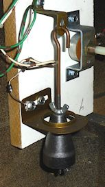
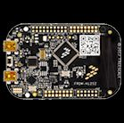
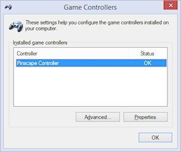
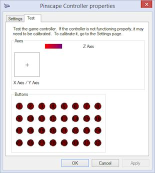
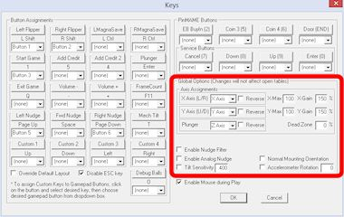

[#tilt]
= Nudge & Tilt

Nudging and tilting are essential aspects of real pinball for any serious player. 
A simulation has to do these well to be convincing.

It's easy to set up good nudge and tilt handling on a virtual cabinet, thanks to a type of sensor known as an accelerometer. 
We'll explain the specifics of setting everything up shortly. 
First, though, some background information to explain why you want this.

[#nudgeInterference]
== Nudging vs tilting

_Nudging_ and _tilting_ are two separate things to pinball people, but this can be a little confusing because casual players often use them interchangeably. 
To be sure we're all talking about the same thing, let's define our terms.

*Nudging* is an attempt to influence the motion of the ball by pushing, bumping, wiggling, shaking, lifting, and otherwise moving the pinball machine. 
A reasonable amount of nudging is fair play. 
It's one more way of interacting with the game. 
It's integral to pinball's uniquely mechanical nature; it's part of what makes pinball different from video games.

*Tilting* is the result of too much nudging. 
A tilt occurs when the machine decides that the player is nudging too aggressively. 
The machine penalizes the player by immediately ending the current ball and canceling any bonus.

== On real machines

It's hardly worth explaining how nudging works on a real machine, since it's intuitive everyday physics. 
However, if your past experience with pinball is entirely virtual, your intuition about it might be a bit distorted, since the PC pinball simulators tend to exaggerate it quite a bit compared to reality. 
You really should find a physical pinball machine and play around with it to calibrate yourself. 
The real thing is rather subdued and subtle compared to PC simulations, mostly because real balls and cabinets are a lot heavier than they act in most PC pinball games.

Tilting is a more interesting topic, since most people haven't had a chance to look inside a real machine to see exactly how it works. 
A real machine enforces the tilt limits with something called a "tilt bob". 
This is a simple mechanical sensor that goes back to the early days of pinball.

A tilt bob is a free-swinging pendulum surrounded by a metal ring. 
Both the pendulum and the ring are connected to opposite ends of an electric circuit, so if the two come into contact, it closes the circuit, just like tripping a switch. 
Shoving or lifting the machine makes the pendulum swing, and if it swings enough to come into contact with the ring, it triggers the tilt switch. 
The sensitivity of the tilt can be changed by adjusting the spacing between the pendulum and ring. 
The weight at the end of the pendulum is usually cone-shaped, so the distance can be adjusted by moving the weight up or down on the pendulum arm. 
This lets operators make tilting easier or harder according to how much abuse they want their machines to put up with.

Newer electronic games usually give you warnings for the first couple of contacts between pendulum and ring, and tilt if you exceed the warning limit. 
The warning count is adjustable in the operator menu on newer games, giving the operator another way to adjust the tilt sensitivity. 
Older EM machines usually tilted immediately on the first contact.

The tilt bob is the standard on modern machines, but if you look at older machines you'll sometimes find other types of tilt switches, in addition to or instead of a tilt bob. 
For example, some 1960s machines had a ball that could roll up and down a track inside the cabinet, to detect if someone tried to lift up the front of the machine.

=== Slam tilt

In addition to the tilt bob, most real machines also have something called a "slam tilt" switch. 
This is a weighted leaf switch inside the coin door, which can be set off by sudden forward accelerations, such as someone kicking the front of the machine. 
It's really more of a "slam" detector than a "tilt" detector; you wouldn't set one off with any amount of nudging. 
The real machines include them mostly to deter excessive abuse by frustrated players.

I personally wouldn't go out of my way to include a slam tilt switch on a virtual cabinet, but if you install a real coin door, it'll probably have one built-in. 
Visual Pinball and PinMAME have support for this switch as an input, so you can attach it if you wish. 
See xref:coinDoor.adoc#coinDoor[Coin Door] for more on that.

== Virtual nudging, part 1: the sensor

In my opinion, there's only one type of nudge sensor worth considering: a digital accelerometer. 
If you're planning to buy one of the commercial plunger kits, it'll have one built in. 
Otherwise, I recommend buying a Freescale KL25Z (which costs about $15) and installing the Pinscape software (free). 
The KL25Z comes fully assembled; all you have to do is plug in a USB cable. 
It has an excellent on-board accelerometer, and the Pinscape software is compatible with VP's nudge input system.

In the early days of virtual pinball cabs, digital accelerometers weren't readily available, so people came up with various other schemes. 
I wouldn't recommend any of these for a new build, but for the sake of historical interest, I've included a xref:#oldNudge[summary of older methods] at the end of the chapter.

== Virtual nudging, part 2: the software

Visual Pinball has two completely different ways of handling nudge input, to accommodate the two main ways VP is used: desktops and cabinets.

*For desktop users,* VP accepts "digital" nudges via the keyboard. 
VP lets you enter three types of keyboard nudges: forward (by pressing the space bar), left (by pressing /), and right (by pressing Z). 
This keyboard convention was invented by the earliest desktop PC pinball games, long before VP's time, and has been the universal standard ever since. 
When you press one of these keys, VP simulates a single sharp nudge in the corresponding direction.

I call these keyboard nudges "digital" because you can't control the intensity or duration. 
VP at least gives you a small amount of control over the direction, but even that's severely limited, in that there are just the three fixed directions to choose from.

*For cabinet users,* VP accepts "analog" nudges, via the joystick USB interface. 
VP doesn't expect you to hook up an actual joystick; it just uses the joystick interface because it's a simple, standard device type on Windows. 
The way you use this is to connect a device that _pretends_ to be a joystick, but actually sends accelerometer readings.

VP interprets joystick nudge input by reading the X and Y axes from the joystick, and treating them as the amount of X and Y acceleration. 
Importantly, this allows for varying degrees of strength in the nudging. 
It also allows VP to detect the direction of the motion - side-to-side and front-to-back. 
Since each axis is analog, these can combine to represent nudging in any direction and at any strength.

== Virtual tilting

As with nudging, VP has two different approaches to tilting, geared respectively to desktop and cabinet users.

VP's default approach is geared towards desktop users, who use only simulated nudging via the keyboard. 
In this case, nothing "real" is moving, so VP has to judge when enough is enough entirely within the simulation. 
This is usually handled in the scripting (programming) code for each individual table, and it's usually based on a timing model where you're limited to a certain number of nudges within a certain time frame. 
If you press the nudge keys faster than allowed by this limit, the table tilts.

The scripted approach doesn't work for accelerometers, because the accelerometer input comes in through the joystick, not the keyboard. 
The accelerometer doesn't press the keys no matter how hard you shake the machine. 
To make up for this, VP has its own internal simulation of a tilt bob. 
Whenever the physical accelerometer detects motion, VP feeds the motion into its simulated tilt bob. 
When the simulated bob swings too wildly, VP sends a "center tilt" key press to the game script so that it can register the tilt.

There's a third approach that I prefer to either of these, which is to install a real tilt bob in your cabinet. 
This is the most realistic solution because it detects the physical motion of the cabinet exactly like the real machines do. 
This captures all the nuances of your cabinet's actual motion, which is too complex for VP's simple model to simulate realistically.

[#VPNudgeConfig]
== Installing an accelerometer

The Pinscape controller software and the commercial plunger kits are programmed to feed their accelerometer readings to VP using exactly this joystick interface. 
The whole setup is almost entirely plug-and-play with any of these devices. 
Just plug the device into your PC with a USB cable. 
Windows and VP should recognize it as a joystick.

The commercial plunger kits come ready to use out of the box. 
For the Pinscape controller, you'll have to install the Pinscape firmware, described in xref:kl25zSoftwareSetup.adoc#kl25zSoftwareSetup[KL25Z Software Setup] .

For best results, you'll want to attach your device to the floor of your cabinet. 
The device should be fixed firmly in place, because you want it to move with the cabinet and experience the same accelerations that the cabinet does when the player nudges the machine.

If you're using a commercial plunger kit, check its documentation for the recommended positioning and orientation.

For the KL25Z, you should mount it flat on the cabinet floor, preferably near the middle front, with the edges of the KL25Z card parallel to the sides of the cabinet. 
As long as it's parallel to the sides, the orientation is up to you. 
You can position it with the USB cable connectors at the front, back, left, or right, whichever is most convenient. 
You just have to tell the software which way it's positioned so that it can adjust the readings accordingly.

image::images/kl25zOrientation.png[""]

Valid orientations for the KL25Z, as viewed from above. 
Position with the edges of the card parallel to the sides of the cabinet, around the front middle of the cab.

*Do I need to add rubber foam to isolate it from vibration?* Probably not. 
I've seen a lot of posts on the forums suggesting that you need some kind of soft padding to isolate the accelerometer from vibrations coming from the speakers, solenoids, and so on, as though it were an LP player in an audiophile's stereo system. 
But I think that advice is based on the mistaken idea that the accelerometer is "triggered" by motion. 
That might have been true of the older, kludgier nudge devices that people used before accelerometers became popular, but it's not true with accelerometers. 
An accelerometer is a measuring instrument, not an alarm. 
It isn't _triggered_ by motion - it _measures_ motion, quantitatively. 
It distinguishes between a little motion and a lot of motion, and all points in between, and the data it sends to the pinball simulator reflects the amount of motion measured, on a linear scale. 
It's not an all-of-nothing, on-or-off sort of thing. 
If the accelerometer picks up the tiny sub-millimeter motions of the cabinet from the speakers, it sends correspondingly tiny signals to the pinball game, and the pinball game responds with proportionally tiny effects on the ball's motion, which (when things are adjusted properly) are so small that they're invisible. 
There shouldn't be any need to filter them out. 
If you think about it, the steel balls in a physical pinball machine are themselves affected by all the same sorts of cabinet vibrations - they're not wrapped in foam.
If you install an accelerometer and find that speaker vibrations are in fact causing anomalous nudge input, my first impulse would be to reduce the "gain" setting in the pinball simulator. 
Small vibrations causing big effects suggests more than anything that the pinball simulator is amplifying the input way too much.

== How to configure Visual Pinball for an accelerometer

Visual Pinball handles accelerometer input via the joystick interface. 
all the pinball nudge devices (including Pincsape and all the commercial plunger kits) are set up to work this way by default, so there's usually nothing you have to do with the device other than plug it in to a USB port.
The only configuration you have to do is to VP itself.

*Quick device test:* Before firing up VP, it's a good idea to make sure your accelerometer device is working properly. 
VP doesn't give you any feedback at all about whether there's even a device present, let alone if it's working, so you can save yourself some frustration by checking to make sure Windows recognizes the device and can see the acceleration input.

First, make sure the device is plugged in to a USB port. 
Now press Windows+R to bring up the Windows "run program" box, type in *joy.cpl* , and press Enter. 
This should launch the USB joystick control panel, which should show a list of attached joystick devices. 
Find your accelerometer device in the list. 
For example, if you're using Pinscape, you should see a "Pinscape Controller" entry in the list.

image::images/QQQIcon.png[""]

If you don't see your device listed, Windows didn't recognize it as a joystick. 
Check your device's documentation or contact the vendor for advice, or ask on one the forums (e.g., the link:https://www.vpforums.org/index.php?showforum=29.html[vpforums cab builders group] ). 
I'd advise against messing around with Device Manager or trying to install or update device drivers. 
Joysticks don't usually need device drivers in the first place, so that's almost never the problem (unless your device's documentation specifically says otherwise).

Double-click the list entry for your device. 
This will bring up the "Test" window, which lets you see the raw joystick input the device is sending to Windows.

WARNING: *DON'T use the "calibration" feature.* Windows calibration isn't suitable for nudge devices; it'll distort the readings and cause erratic behavior in VP. 
See xref:#doNotCalibrate[below] for more information.

For nudging, the thing to pay attention to is the "X Axis / Y Axis" box with the little "\+" inside. 
The "+" shows the current X/Y axis reading from the joystick, which is where the nudge device reports the accelerometer data.

If you haven't yet installed your device in the cabinet, you can pick up the device and tilt it in different directions. 
Gravity is a type of acceleration, so as you tilt the device, it should report an acceleration in whichever direction is pointing up. 
(That sounds backwards, I know. 
But you can thank Einstein for this bit of disillusionment in the name of science. 
It turns out that the right way to think about it isn't that gravity is pulling us down, but that the ground is pushing us up. 
That contradicts our subjective experience of it, I know, but only in the same way that the Earth going around the sun contradicts our subjective experience of that everyday phenomenon.)

If you've already bolted down the device inside your cab, you can test it simply by nudging the cabinet. 
You should see the "+" dance around when you push the cabinet, and the distance it moves from the center should be proportional to the strength of the push.

Don't worry too much about the particulars of the motion. 
The important thing is that you can make the "\+" move left, right, up, and down in response to tilting the device. 
Note that many accelerometers are sensitive enough to pick up rather minute vibrations, so you'll probably see the "+" jiggling around a little bit even when you're not nudging the cabinet or tilting the device. 
As long as it's staying very close to the center, a little random motion is normal. 
However, the difference between the random motion at rest and the response to a nudge should be large and obvious: you shouldn't be seeing a lot of motion when the device is at rest, just a little random jiggling.

If the "+" is moving around as expected, the accelerometer working, and you can move on to setting up Visual Pinball. 
If you're not seeing any motion on the X/Y axis display, or the motion doesn't correlate with physical accelerations you apply to the device, something's not working properly. 
You might need to contact the vendor or ask on one of the forums for help.

[#doNotCalibrate]
WARNING: *DON'T use Windows calibration!* The Windows joystick setup dialog has a "Calibrate" button, and if you're like most people, clicking it will be all but irresistible. 
But resist! The Windows calibration is designed for actual joysticks. 
It's all wrong for nudge devices. 
If you run the calibration on a nudge device, it will screw up the nudge readings, and you'll see erratic behavior in VP. 
footnote:footnote-1[*Some technical details on why Windows joystick calibration is bad for accelerometers.* The purpose of the Windows joystick calibration is to normalize the input range of a mechanical joystick so that it matches Windows's internal definition of the range. 
Joysticks send position data to Windows saying how far left-to-right they are and how far front-to-back they are. 
The joystick defines the range of those readings in whatever quirky unit system it wants to use. 
For example, it might say that fully left equals -1000 units and fully right equals +1000 units. 
But many mechanical joysticks can't actually reach the limits of their defined ranges, simply because the stick hits the physical stops before getting all the way to +/-1000 units. 
The point of the Windows calibration is to measure the _actual_ range that the mechanal stick can traverse, by asking you to move your joystick to each limit point and observing the reading. 
Windows then stores those min/max measurements, and applies a correction factor to all subsequent readings so that whatever reading the joystick reported at the maximum position is translated into the nominal -1000/+1000 maximum point of the joystick's desired unit system. 
This works great with real joysticks, but it's both unnecessary and harmful for accelerometers. 
It's unnecessary because accelerometers are pre-calibrated to report physically accurate numbers; applying any "correction" factor to a number that's already physically accurate will only make the number less accurate. 
Windows calibration is actively harmful for accelerometers because it's more or less impossible to give the calibration tool an accurate full-scale reading, which is the key piece of data that the calibration tool collects. 
There's no good way with an accelerometer to apply a smooth, steady, and accurate full-scale deflection for long enough that the calibration tool can accurately read it. 
(Well, there is one way: for an accelerometer whose full scale is +/- 1g, you can use the Earth's gravity to apply a 1g acceleration to one axis at a time, but only if you can hold the accelerometer perfectly still, with that particular axis pointing straight up and down.) The resulting bad data that the calibration tool collects will be applied as bad normalization factors to every subsequent reading, which will distort the VP nudge input. 
The problem is even worse than it appears, because Windows applies the normalization factor separately to the positive and negative side of each axis - so the "corrections" won't only be in accurate, but they'll also be lopsided. 
That'll make left/right and front/back nudges weirdly asymmetric and non-linear.]

But don't worry, there's no permanent harm if you did click the button at some point. 
You can easily undo it. 
Go to the Settings tab in the joystick dialog (the one pictured above), then click "Reset to default". 
That'll erase the Windows calibration data.

*Setting up Visual Pinball:* Start by bringing up the VP editor. 
(In some versions, you have to cancel out of the initial file selector dialog to reach the editor.) In the Preferences menu, select Keys to bring up the keyboard dialog. 
The accelerometer settings are in the "Global Options" area.

Here are the key things to set:

*  *Enable Analog Nudge:* Check this box to enable accelerometer input. 
VP ignores the joystick input if this box isn't checked.
*  *X-Gain* and *Y-Gain:* These determine the strength of the nudge effect in the simulation for a given physical acceleration. 
Higher numbers make the effect of the same nudge stronger, lower numbers make it weaker. 
In most cases, the X-Gain and Y-Gain numbers should match. 
Finding the ideal settings for your system requires experimentation. 
For now, start with the defaults and finish setting up the rest of the options. 
We'll explain how to find ideal settings below.
*  *Enable Nudge Filter:* Check this box to tell VP to "filter" the raw accelerometer data to make the nudge effect more consistent and stable. 
The filter tries to cancel out certain types of systematic measurement errors that are common with these devices. 
Without the filter, the raw accelerometer data can make the ball "drift" as though the playfield were slightly tilted. 
The filter is optional, though, since any type of processing like this can introduce artifacts of its own. 
I recommend enabling the filter initially; you can always experiment with it later once you have the basic setup working to see if you prefer the unfiltered input.
*  *Tilt sensitivity:* If you check the box, it enables a _simulated_ tilt bob within VP, with the number specifying how easily it triggers a tilt. 
Higher numbers make tilts easier to trigger. 
*Disable this if you're using a real tilt bob* , since the simulated tilt bob is redundant.
*  *Axis assignments:* In the Axis Assignments box, there's a drop list next to each of "X Axis (L/R)" and "Y Axis (U/D)" that lets you assign a different joystick control to the axis. 
In most cases, you should leave these at the default settings, unless your nudge device's documentation tells you otherwise. 
The defaults are the obvious mappings: "X Axis (L/R)" = "X Axis" and "Y Axis (U/D)" = "Y Axis". 
Make sure the Reverse boxes are un-checked.

After you set all the options, click OK to close the dialog, then *close all VP windows* to exit VP.
It's important to *completely* close VP after changing these settings, since VP won't reload the new settings until you close the program and launch a brand new session.

*VP 9 vs VP 10:* Before going on, one really important thing to be aware of is that VP 9 and VP 10 require radically different Gain settings. 
If you're using both versions on your system, you'll have to find the right gain settings for each version separately, because they don't translate across the versions. 
The rule of thumb is that VP 9 settings should be approximately 10 times higher than VP 10 settings.

For example, if a Gain of 100 works well for you in VP 10, you'll probably set the VP 9 Gain to about 1000. 
The ratio might not end up being exactly 10 to 1 on your machine, since the ideal settings vary by system and according to your taste, but it should be in that ballpark.

*Finding the ideal X/Y Gain settings:* I'm afraid I can't just give you one-size-fits-all numbers to plug in to the X/Y Gain boxes. 
The ideal settings for your system depend on the particulars of your machine: which nudge device you're using, your CPU speed, your graphics card, your personal taste, and even which games you're playing.

The way to find the right settings is by experimenting, by running a game and testing different nudges to see what kind of effect they have on the ball. 
It's easiest to do this when a ball is sitting in the plunger chute or captured with a flipper. 
Give the cabinet a push and see how strong the reaction is. 
Try different strengths of pushes and see if the reaction seems natural or not.

Follow this procedure to adjust settings:

* Open a game of your choice in the VP editor
* Run the game
* Test some nudges and see if the effect feels natural
* If the effect feels too strong (the simulation overreacts to slight nudges), you'll need to *reduce* the gain settings
* If the effect feels too weak, you'll need to *increase* the gain settings
* Quit out of the game and return to the editor
* Bring up the Keys dialog via the Preferences menu
* Increase or decrease the Gain settings as you decided above: try large changes at first (double or halve the settings, perhaps), and make smaller changes as you zero in on the sweet spot
* Click OK to close the dialog
*  *Close all VP windows* . 
This step is crucial because VP won't load the new settings until you *completely* exit the program and restart it.
* Re-launch VP from the desktop and start over

While you're testing the nudge strength, also observe the _direction_ of the ball's response and make sure it seems appropriate. 
A forward push should make the ball move up/down, not side-to-side, and a sideways push should make the ball move side-to-side rather than up/down. 
If these seem backwards, you might either have your device oriented incorrectly, or you might need to adjust the "Axis Assignments" in the VP setup.

WARNING: *Remove other joysticks:* Visual Pinball won't work correctly for nudging if you have multiple joystick devices connected to your system. 
Some game controllers that don't physically look like joysticks _act_ like joysticks as far as VP is concerned, so if you're having any problems getting nudge working, try disconnecting all USB game controllers apart from your nudge device.

=== What's realistic?

The ideal strength of the effect is of course up to you. 
One of the great things about virtual pinball is that it doesn't have to be perfectly realistic: parts don't have to break, the playfield paint never has to get worn down, and nudge reactions can be as wild as you want.

If you want to calibrate for realism, though, it's a really good idea to find a real machine and play a few games, paying special attention to the way a real ball reacts to nudges. 
Run the same kinds of tests suggested above, such as nudging with a ball sitting in the plunger chute or trapped on a flipper. 
Gauge how much force it takes to make the ball jump a noticeable distance off the flipper when trapped. 
If you're accustomed to desktop pinball, you'll probably be surprised at how much force is required to get even a slight reaction on a real machine, let alone sending the ball flying an inch or two off the flipper the way a keyboard nudge does in desktop play.

One thing that can be hard to get accustomed to if you're coming from a desktop pinball background is the idea that accelerometers are analog devices. 
In desktop pinball, nudging is a "digital" action: you push a button and the ball jumps a certain fixed amount. 
In a virtual cab with an accelerometer, though, a nudge doesn't have a single fixed amount of force in the game. 
The simulated response should be proportional to the physical force you apply. 
Don't think of the cabinet as a giant space bar that you press to get that digital nudge. 
You shouldn't expect or want the ball to make that same fixed digital jump every time you give the cabinet the slightest touch. 
The reaction should be proportional to how hard you nudged. 
It's okay if there's no obvious reaction to a very slight nudge; go back to the real machine and see how much force it takes before you see any reaction at all.

It's fine to calibrate for an exaggerated version of reality if that's what you prefer, but it's still worthwhile to get a visceral idea of what the real thing looks like, as a reference point. 
I personally find that a slightly exaggerated degree of reaction feels about right on VP; calibrating for reality leaves things a little too flat in the virtual version.

=== What about interference from the shaker or subwoofer?

One of the frequently asked questions by new cab builders is whether cabinet vibrations from the game itself, such as from the audio system or from the shaker motor, will cause unwanted accelerometer feedback. 
This seems like a reasonable worry when you consider that accelerometers are designed to pick up tiny motions.

Here's a sanity-check question to ask yourself. 
Do real pinball machines have the same sources of vibration? Obviously they do. 
Do these same vibrations on a real pinball affect the ball noticeably? Obviously they don't. 
So, should vibrations that don't affect the ball in a real game affect the ball in a virtual game? Or put another way: is the simulation accurate if it responds differently from a real game to the same vibrations?

This brings us back to the point above in "What's realistic?", that virtual pinball tends to exaggerate the effect of nudging. 
If you _do_ see interference from your shaker motor or audio system, it's a very good sign that you have the Gain settings turned up well above realistic levels. 
Go back to the accelerometer settings in VP and make further adjustments to find a happy medium for the Gain level: high enough that the ball responds to your intentional nudges, but low enough that the ball doesn't go veering off every time the music plays loud.

In practice, some cab builders do have problems finding this happy medium in Gain settings. 
In my opinion, the accuracy of the accelerometer is the crucial factor here. 
I've found the KL25Z accelerometer to be excellent for virtual cab use, so if you're using a different nudge device and simply can't find the happy medium, you might consider adding a KL25Z with the Pinscape software. 
The KL25Z is inexpensive (about $15), and the nudge feature is easy to set up, just a matter of plugging in the USB cable and installing the Pinscape software. 
The Pinscape software happily coexists with other I/O devices (LedWiz, PacLed, other plunger kits, button encoders, etc), so you can use it for its nudge features alone even if you've already decided on other devices for other functions.

== Setting up FX2/FX3 to work with an accelerometer

Pinball FX2 and FX3 can also simulate nudging using an accelerometer, but they don't use the joystick interface that the Pinscape Controller and most other nudge devices use. 
Instead, they require input through the XBox controller interface.

To bridge the gap, there's a program called link:https://www.x360ce.com/[ *x360ce* ] that can make a joystick device emulate an XBox controller. 
That can reportedly be used to make a joystick-based accelerometer work in FX2/FX3.

I don't use this in my own system, so I don't have any details about how to set it up. 
If anyone wants to write up instructions, I'll be happy to include them here.

== Installing a real tilt bob

The best option for a tilt bob is to buy a real one from a pinball parts supplier (see xref:resources.adoc#resources[Resources] ). 
They cost about $10 to $20. 
You could also fashion one yourself, but the real ones are cheap enough that it's probably not worth the added effort.

On a real machine, the tilt bob is usually installed on the left side wall near the front of the machine. 
This is the best place for it because the player will primarily be nudging the machine near the front. 
If you haven't already installed your playfield TV and flipper buttons, be careful to pick a spot that won't get in the way of anything.

Electrically, wire the tilt bob just like a button or switch. 
As with all buttons, you'll run two wires between the bob and your key encoder device: the "common" or "ground" wire, and a wire connected to the input port you'll use for the tilt key. 
On the bob, one wire connects to top of the pendulum, and the other connects to the ring. 
It doesn't matter which wire goes to which end. 
The bob parts are usually all metallic, so you can attach the wires anywhere that's convenient. 
The standard tilt bob assemblies for real machines include screw terminals for the wires.

image::images/TiltBobWiring.png[""]

Screw terminals (arrows) for connecting switch wires to a standard pinball tilt bob assembly

If your key encoder has a pre-programmed port for "tilt" or "T" key, use that. 
If your encoder is programmable, attach it to any port, and program that port to send the "T" key.

Button wiring is described in more detail in xref:buttons.adoc#pinscapeButtonInputs[Pinscape Button Inputs] .

[#VPTiltBobConfig]
== How to configure VP for a mechanical tilt bob

As far as Visual Pinball is concerned, the tilt bob is simply another keyboard input. 
If you installed a physical tilt bob as described above, it will send a "T" key press to the PC whenever the tilt bob makes contact, as though you typed "T" on the keyboard.

VP didn't originally support real tilt bobs at all, since VP was initially designed for desktop PCs, before anyone even thought of virtual pin cabs. 
Support for tilt bobs had to be retrofitted into VP later in its evolution, and like most retrofits, the support isn't quite seamless. 
But with a little tweaking, we can fix that and make it work right for virtual cabs.

The way that VP handles the "T" key input is simply to pass it through to the Visual Basic script that controls the table. 
That's really what's "not quite seamless" about VP's handling of tilt bobs: most table scripts are programmed for desktop play, so they don't expect a real tilt bob to be present.

Fortunately, most table scripts use a single, shared script file for the nudge key handling. 
That means we can modify most of our installed tables simply by updating this one shared script file. 
What's more, we don't even have to edit the main shared script file by hand. 
The shared script has a "plug-in" design that lets us change some of its behavior by placing a script file with a certain name in a certain VP folder.

Just for reference, here's what the standard shared script does. 
When the "T" key is pressed, the default script performs a "fake" keyboard nudge, applying a brief acceleration to the physics model so that the ball's motion is deflected a little bit. 
The script also keeps a count of "T" key presses, and uses a timer to keep track of when they occur. 
If several "T" key presses occur within a few seconds, the script sends a "tilt switch" signal to the game's ROM. 
The counter and timer serve as a crude approximation of a real tilt bob: the idea is that too many of these fake nudges too quickly should count as a tilt.

Here's what we _want_ to happen instead. 
Since we're using a real accelerometer, we don't need or want the fake nudges. 
And since we're using a real tilt bob, we don't need the crude approximation of the tilt bob provided by that counter/timer system. 
Our _real_ tilt bob already registered a real tilt, so we don't need the script to make any further decisions about it - we just want to send the tilt switch signal directly to the game's ROM. 
That's what would happen in the real version of the game, so it's what we want to happen in the simulation, too.

Here's how you can fix the shared script to accomplish this:

* For VP 10.4 and later:
** Go to your Visual Pinball program folder
** Open the *Scripts* folder you find there
** Find the file `NudgePlugIn_mjrAccelAndTilt.vbs` , and rename it to `NudgePlugIn.vbs`
* For VP versions before 10.4:
** Go to your Visual Pinball program folder
** Open the *Tables* folder you find there
** Download link:http://mjrnet.org/pinscape/downloads/NudgePlugIn.vbs[NudgePlugIn.vbs] and place it in the *Tables* folder (make sure the filename is `NudgePlugIn.vbs` )
* Double-check your keyboard encoder device setup to make sure that your tilt bob is set to generate *T* key presses
* In Visual Pinball, go to Settings > Keyboard, and make sure that the keyboard key for "Mech Tilt" is set to "T". 
That's the default, but it's worth checking that it didn't get changed accidentally.

If you read through xref:software.adoc#SoftwareCustomizationLog[Pinball Software Setup] , you might recall my advice about setting up a text file where you record your customizations. 
This would be a good thing to add to that file now, so you'll remember it if you have to set up VP again at some point.

You should now have proper tilt bob handling for most tables. 
Virtually all modern tables with electronic displays should work with this, because the VP versions of those tables almost always use the shared scripts.

You'll probably run into some exceptions - tables that don't use the shared scripts, and so don't benefit from this custom version of the shared script. 
This is especially likely for older "EM" or "electro-mechanical" tables from the 1960s and earlier, the type with mechanical score reels. 
The VP versions of these older tables often use custom scripts for tilt handling, because the shared scripts are designed with more modern games in mind. 
The symptom you'll see in these older tables is that they behave in the weird "default" way described earlier. 
That is, when your tilt bob fires, you'll see a "fake nudge" in the game rather than a Tilt condition.

Whenever you run into an older table that behaves like this, you'll have to do some hand-editing of its script. 
That'll require a little sleuthing work on your part, since you'll find the right section in the table's custom script code and replace it by hand. 
Here's the basic procedure:

* Open the table in the VP editor
* Open the script window (View > Script in VP 10, Edit > Script in VP 9)
* Search for the text "KeyDown". 
You should find some code that looks something like this:
+
[source,vb]
----
Sub Table1_KeyDown(ByVal keycode)
  if keycode = 20 Then
    Nudge 90,2
    TiltIt
  end if
End Sub
----

* If you can find code like that with a test for `if keycode = 20 then` or `if keycode = keyBangBack then` , then all you have to do is delete the line that starts with "Nudge".
* If you can't find a line exactly like that, but you find similar lines with tests like `if keycode = CenterTiltKey` , you should simply add a new block of code like this just after the Sub line:
+
[source,vb]
----
if keycode = 20 then
  TiltIt
end if
----
* This is where some sleuthing comes in. 
You'll have to replace the line that reads "TiltIt" in the example above with whatever the equivalent in the actual script is. 
Look for the code that handles the similar cases, such `if keycode = CenterTiltKey` , and copy what it does, _except_ that you should omit any lines that start with `Nudge` .

If you can't find code that looks like this, or you can't make enough sense of the code to see how to make these changes, try asking in the forums. 
Lots of people on the forums are adept at coding these scripts, so someone should be able to help you figure out the necessary changes.

== How to configure VP for a "virtual" tilt bob

What if you don't want to install a physical tilt bob, but you still want VP to detect tilt conditions when players get too aggressive with nudging? In this case, you can enable VP's simulated software tilt bob. 
The simulated tilt bob will monitor the accelerometer nudge input, and will generate a press of the space bar key when the simulated tilt bob swings too far.

We're talking about this situation:

* You're using an accelerometer
*  *But* you're *not* using a physical tilt bob

This is really easy to configure, since the simulated tilt bob is a built-in feature in VP.

* Set up your accelerometer, and xref:#VPNudgeConfig[configure it in VP]
* Follow the the procedure to xref:#VPTiltBobConfig[configure VP for a mechanical tilt bob] , even though you're not actually using one - this will make VP treat the software tilt bob the same way it would treat a mechanical one, which is just what we want when using an accelerometer
* Go to the VP *Keys* dialog, and check the box to enable the *Tilt sensitivity* setting

The last step is what enables the simulated tilt bob - the dialog refers to it rather obliquely as "Tilt Sensitivity".

The number in the Tilt Sensitivity setting lets you control how much nudging it takes to trigger a tilt condition. 
Higher numbers make it more sensitive. 
There's no rule for what this setting has to be - it's just a matter of experimenting with it to get the feel you prefer, by playing games and testing how much nudging it takes to trigger a tilt. 
If it feels too easy to trigger a tilt, increase the number.

[#oldNudge]
== Older nudging schemes

In the early days of virtual pinball cabinets, it wasn't as easy to find digital accelerometers as it is today. 
So early cab builders had to resort to other approaches for nudging. 
There's no reason to think about any of these for a new build: digital accelerometers are simply the right tool for the job, plus they're cheap and easy to use. 
But for the sake of historical interest, we'll survey the schemes that older cabinet builders used.

Buttons:: It's not exactly subtle, but one way of telling the machine you want to nudge it is to provide a button that inputs a "nudge" command to the software.
+
This is a direct carry-over from desktop pinball games, where you nudge by pressing a keyboard key (usually the space bar). 
Early cabinet builders just ported this idea to the cabinet by including nudge buttons.
+
Button nudging is simple, but it's not very satisfying in a cabinet, because it's not anything like how you play real pinball. 
So cab builders started looking for ways to detect cabinet motion.

Mercury switches:: It's not common these days, but at one time there was a popular kind of light switch (the kind on the wall in your house) that had a little capsule of liquid mercury inside. 
The switch wires stuck into the capsule at one end. 
Moving the switch lever up would tilt the capsule so that the mercury ran to the end with the wires. 
Mercury is of course a conductive metal, so when the mercury spilled over the wires, it closed the connection and turned on the light. 
Moving the switch lever down made the mercury run to the other end, away from the wires, breaking the connection and turning off the light.
+
The point of these switches was to be quieter than regular mechanical light switches, since there was nothing inside to go CLICK. 
But cabinet designers realized they had another use. 
Because of the flowing mercury inside, you can use them as simple motion detectors. 
If you position one of these switches with the mercury capsule almost horizontal, with just at a slight tilt, a little push will send the mercury inside sloshing and make a momentary switch connection. 
If you wire one of these to the nudge key input on the PC, you can simulate a "nudge" key press by giving the cabinet a shove.
+
This approach eliminates the need for pressing buttons, so it acts a bit more like real nudging. 
But it's still pretty crude in that it can't detect how hard each nudge is. 
It's purely binary: nudge or no nudge.

Weighted joysticks:: What we're really after is a way to detect not just when the cabinet is nudged, but how hard the nudge is. 
One way to do this is to use a joystick as a pendulum: hang the joystick upside down, so that the stick is pointing straight down. 
Put a weight on the end of the stick to give it some inertia. 
When you nudge the machine, the inertia of the weight will make the stick want to stay in place, which means that it appears to move in the opposite direction of the nudge, relative to the machine. 
By reading the joystick position, we can see how far it moves from center, which is a rough analog to the amount of force in the nudge.
+
This gives us the comparative strength of the nudge that we're after, so it's the best idea yet. 
But it's a fairly complex mechanical system. 
Most people who set these up find it difficult to get them to behave consistently. 
It's hard to keep the joystick precisely centered when everything's at rest, and the weight tends to swing back and forth after a nudge, which can generate spurious aftershocks. 
It's also hard to control the sensitivity, since the spring force and damping friction in the joystick aren't usually adjustable.

Old video game motion controllers:: The next better approach is to use a motion controller from an old video game. 
These generally look like joysticks to the PC, and inside they have an electronic accelerometer that senses when the controller is tilted or moved. 
This is very similar in principle to the weighted joystick, but it's easier to set up mechanically.
+
This approach came closest to the modern accelerometer solution. 
The downsides are that you had to find an old video game to scavenge, and that the accelerometers in these old controllers weren't very good by modern standards. 
In addition, many were designed for proprietary video game consoles rather than PCs, so you need additional software to make them emulate joysticks. 
More software, more problems.

