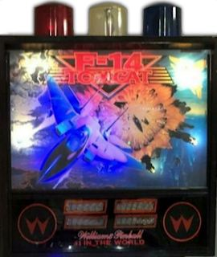
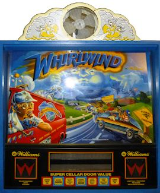
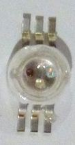

[#toppers]
= Backbox Toppers

Toppers are extra decorations on top of the backbox, such as _The Addams Family_ 's cloud or _Whirlwind_ 's fan. 
A few titles over the years included toppers as original equipment, but not all that many, so they were a great novelty feature that helped a machine stand out from the crowd in an arcade. 
In more recent times, pinball collectors have become fond of adding after-market toppers to every machine in their collections that didn't already have one from the factory.

Virtual cab builders like their toppers as well, but often for different reasons. 
For the real pinball machines, toppers are mostly about novelty and decoration. 
In the virtual world, in contrast, toppers tend to be more about function than decoration. 
There are certain feedback devices that just won't fit anywhere else, particularly fans and beacons. 
We virtual cab builders tend to view the topper area primarily as free space for feedback toys.

I think it's worthwhile in a virtual cab to take both views of the topper - it's a functional feature, but it's also part of the artwork. 
We all put a lot of effort into our cabs and want them to look as great as they play, so it's worth thinking about how to incorporate the topper elements into our visual themes. 
It's nice for the topper to feel like a natural extension of the cabinet art, rather than just a bunch of gadgets bolted on top.

Let's start with a look at how some of the real machines used toppers to enhance their visual theming, to get some ideas about how we can do the same thing.

== What makes a good topper?

The obvious place to start looking for ideas for a virtual cab topper is in the real machines. 
If you do a Web search for "pinball topper", you'll find all sorts of after-market toppers for sale. 
Most of these are add-ons for machines that didn't have factory toppers, though, and for the most part they're not all that imaginative (in my opinion, at least). 
A lot of them are just acrylic signs that copy some of the cabinet artwork, and most of the rest are some little doo-dad that's vaguely related to the theme.

The best toppers on the real machines, for the most part, are the ones that came as factory equipment. 
Many of those were thoughtfully integrated into the theme and formed a part of the overall artwork. 
One of my favorite examples is the taxi cab roof sign from _Taxi_ (Williams, 1988). 
It's the perfect icon for the game's theme, but it also meshes with the backglass art, sitting right on top of the taxi depicted in the art. 
It's a clever extension of the backglass painting into the 3D space above the backbox.

Along the same lines, a number of police-themed pinballs over the years featured rotating beacons, or even complete police-car light bars, as toppers. 
Police themes are nearly as common in pinball as in CBS dramas, so there are lots of examples, but the canonical one is _High Speed_ (Williams, 1986), where the beacon fits into the backglass art using exactly the same trick as _Taxi_ 's roof sign:

A beacon isn't just a passive decoration, either. 
It can be an active part of the game action, lighting up and spinning in sync with events in the game. 
It's no wonder they used these over and over on the real machines. 
They even used them in a few cases where it's hard to see any relation to the theme. 
One curious example is _F-14 Tomcat_ (Williams, 1987), which had not one, not two, but _three_ beacons.

I wouldn't consider this one to be good integration of topper and theme. 
Even so, it's understandable why Williams used beacons so often, since they add not just an extra decoration, but also a functional element, in the form of a light show.

Another great functional topper is the fire bell on _Fire!_ (Williams, 1987). 
It's the sort of bell you'd expect to see on an antique fire wagon, so it's a good theme icon, even if it doesn't meld as seamlessly with the artwork as the _Taxi_ sign and _High Speed_ beacon. 
Like the police beacons, it's an active part of the game's sensory effects - it has a solenoid hammer that rings the bell when certain events occur in the game.

Yet another brilliant functional topper is the cloud-shrouded fan on _Whilrlwind_ (Williams, 1990). 
It's the perfect active toy for the theme; the fan activates during multiball modes and other events in the game, creating a tactile sensory effect from the blowing air. 
The cloud shape of the enclosure meshes with the backglass artwork, extending the stormy sky in the art into the space above the backbox.

The somewhat similar cloud topper on _The Addams Family_ (Midway, 1992) takes the same approach, and also serves as the top of the Addams mansion, whose roof extends out of the frame at the top of the backglass. 
It doesn't have anything as dramatic as the _Whirlwind_ fan, but it has flashers inside that simulate a lightning storm when you start a multiball mode.

_Funhouse_ (Williams, 1990) didn't have a topper as original equipment, but here's an example where someone came up with an add-on topper that's as good as anything that came out of the factory. 
link:https://hpb.at/pinball/funhouse.htm[Heinz-Peter Bader] . 
designed this topper for his own _Funhouse_ . 
He took a vanity mirror light - the kind with a row of big round bulbs, like in the stereotypical actor's dressing room mirror lights - and filled it out with party bulbs in assorted colors, then put it on top of the machine with the bulbs pointing up. 
(I've seen at least one other similar _Funhouse_ topper mentioned in a pinball forum, so I'm not sure who came up with the idea first, but this is certainly a nice implementation in any case.)

Photo courtesy of Heinz-Peter Bader

It's interesting to compare this design to the various after-market commercial toppers for _Funhouse_ that the "mods" companies sell. 
The bulb topper works so well because it's perfectly in scale and it captures the carnival atmosphere of the theme, plus it's a natural extension of the backglass artwork (which is already festooned with little marquee bulbs) into the space above. 
In contrast, all the commercial topper I've seen for _Funhouse_ just reiterate something from the artwork, without feeling like part of it: a giant "Admit One" ticket, a cut-out of Rudy.
They do nothing to merge with the backglass art.

== Virtual cab toppers

Virtual cab builders usually take a utilitarian view of the topper, focusing on the functional elements. 
There's a fairly standard set of feedback devices that most cab builders incorporate in their toppers:

*  xref:blowers.adoc#blowers[Fan]
*  xref:beacons.adoc#beacons[Beacons]
*  xref:flashers.adoc#flashersAndStrobes[Flashers]
*  xref:flashers.adoc#strobes[Strobes]

Most cabs have at least one of these, and many use all them.
They're all great additions functionally. 
Beacons, flashers, and strobes all make nice light shows, and a fan adds a wonderful tactile element that movie theaters would market as a "4D experience" with a $10 ticket surcharge.

But does a big pile of devices make for a "theme"?
Well, from one perspective, it actually does.
One way to see a virtual cab is as a whole arcade's worth of pinball tables in one box. 
So you could say that the theme is "all the pinballs" - which makes "all the topper toys" an apt fit.

Personally, though, I like the idea of giving a virtual cab some kind of theme more personalized than "all the pinballs". 
I discuss that idea a bit in xref:cabArt.adoc#cabinetArt[Cabinet Art] . 
If you _are_ giving your machine a specific theme, I think it's also a nice touch if you can extend your theme to the toppers.

Of course, functionality is still the starting point in choosing which devices to include. 
I'd never suggest that you should forego a fan just because your theme doesn't have an obvious connection to air circulation. 
But maybe you can find ways to work some of the functional elements into your theme, even though the theme isn't the reason you included them. 
For example, on my cab, I came up with a custom plastic enclosure for the fan that's meant to look like a star-burst, to go along with the outer space theme of my cab graphics. 
So I didn't really try to make the functionality of the fan fit the theme, but I did at least try to work its shape into the visual layout. 
(If you're interested in my specific topper design, you can find some more details xref:#pinscapeTopper[below] .

image::images/topper-pinscape-fan.png[""]

Some ideas for how to work your toppers into a theme:

* Brainstorm for natural real-world "topper" items fitting your theme, like _Taxi_ 's sign topper.
* Think about custom enclosures for one or more of the items. 
The fan is perhaps the most obvious enclosure to customize (like I did on my cab), since you need some sort of enclosure anyway, and it's easy to build around a bare motor-and-blade fan core. 
You could also create your own custom covers for beacons or strobes, or work them into a larger enclosure like a police-car light bar.
* Consider versions of the topper devices or exterior finishes that fit your theme. 
For example, if you're using a steam-punk theme, give your toppers a Victorian industrial look, with brass finishes and exposed rivets.

[#pinscapeTopper]
=== The Pinscape topper

The topper design that I came up with for my own pin cab is very specific to my theming, so I doubt it'll be of much interest to most pin cab builders other than as one more example. 
But in case anyone wants to reproduce it or use it as a starting point, here are some details about the design.

Most of the topper is made from off-the-shelf parts:

* A row of five standard pinball flasher domes with high-power RGB LEDs inside is arrayed across the front edge. 
These are simply wired in parallel with the main flasher board at the back of the playfield, so they always light up at the same time and in the same colors as the main flashers. 
See xref:flashers.adoc#flashersAndStrobes[Flashers and Strobes] for details on setting up a standard flasher panel.
* A pair of Peterson 771 dome-shaped rotating beacons, one in red and one in blue. 
See xref:beacons.adoc#beacons[Beacons] .
* A pair of "22 LED white strobes" that you can find on eBay. 
See xref:flashers.adoc#flashersAndStrobes[Flashers and Strobes] .

The centerpiece is a custom-built fan with a 3D-printed plastic enclosure.

The fan is built with a generic 12V DC motor with a 1/4" shaft, mated to a press-on plastic blade. 
The blade is a part originally used in microwave ovens, Thorgren model number 6C2504C1, in black. 
This happens to be the same OEM part that Williams used for the topper fan in _Whirlwind_ , so I was delighted to be able to find the exact same part. 
But don't worry if you can't find that particular blade; eBay has lots of similar fan blades that look just about the same. 
Just look for a 6" fan blade with a shaft bore that's the same size as your motor's shaft. 
A good search term to try is *6" fan blade* .

To mount the fan motor, I rigged a simple bracket using sheet metal. 
I don't have any tricks to suggest here; the bracket I came up with isn't particularly clever or elegant. 
You just need something that you can attach to the motor body to hold it at the right height above the backbox roof.

For more on building a fan like this from parts, and for details on how to wire a fan to your output controller, see xref:blowers.adoc#blowers[Fans] .

The fan enclosure is designed to fit between the beacon domes, to create the impression that the enclosure and domes are connected. 
The area around the fan opening is meant to suggest a blazing sun, in a sort of cartoonish style.

You can download 3D plans for my fan enclosure in STL format here:

link:http://mjrnet.org/pinscape/downloads/PinscapeFanEnclosure.zip[mjrnet.org/pinscape/downloads/PinscapeFanEnclosure.zip]

Note that the ZIP file contains "front half" and "back half" models in addition to the full model. 
I created the half models to fit the limits of the specific manufacturing process I used, so these probably won't be useful unless you happen to use a printer with very similar constraints, but I included them just in case.

There's one more detail worth mentioning: the fan enclosure is decked out with lighting. 
(If you want to see it in action, I made a short video: link:https://www.youtube.com/watch?v=wJ1czPnjvDQ[www.youtube.com/watch?v=wJ1czPnjvDQ] .)

The fan enclosure has two types of lighting. 
The first is one of those common 5050 RGB LED strips, installed around the perimeter of the front fan opening. 
This is the same type of LED strip normally used for xref:lightStrips.adoc#lightStrips[under-cab lighting] . 
If you look carefully at the fan enclosure model, you'll see a little lip on the inside of the opening, about 1 centimeter deep. 
That's the mounting surface for the LED strip. 
The strip is mounted on the inside of this lip, so that the LEDs face inwards towards the center of the opening. 
This creates a nice ambient light effect inside the fan. 
I wired the LED strip straight to my undercab lighting, so it shows the same colors as the undercab lights. 
That creates a nice effect with the output in DOF set to show the "undercab complex" effects, which changes the LED strip colors in response to game events. 
It makes the fan interior lighting fairly dynamic.

The second bit of lighting installed in the fan consists of nine high-power RGB LEDs, arranged around the perimeter of the opening, facing forward. 
Again, looking carefully at the STL model, you'll see a small circular hole in each of the "points" of the star-burst shape. 
These holes are the right size for typical 3W RGB LEDs, of the same type commonly used for RGB flashers, but in this case, _without_ the aluminum "star" base that's usually used for the flashers. 
You can find these LEDs on eBay by searching for "3W RGB LED" - they look like this:

These are actually the same LEDs used in the "star base" type. 
The only difference is that they're sold as bare LEDs, not mounted to the aluminum heat sink base. 
The procedure for wiring them is the same as for wiring the flasher LEDs; see xref:flashers.adoc#flashersAndStrobes[Flashers and Strobes] for more on that.

The method I used to mount the LEDs in the fan enclosure is inelegant and a little tricky (it takes some manual dexterity and a bit of patience), but it worked well and has held up well over the several years since I built it. 
I started by soldering hookup wire to the LEDs, with just enough wire between adjacent LEDs to reach from one hole to the next. 
The LEDs are wired *in series* , meaning that the "+" side of one LED connects to the "-" side of the next LED, and so on down the chain. 
There are no resistors in this chain - just the wires and the LEDs. 
Once all the wiring was soldered, I arranged all the LEDs into the desired locations, poking out through the star-burst holes.
This is the part that requires dexterity and patience.

And now for the part that's truly inelegant. 
To secure the LEDs in place, I stuffed some packing foam into the pockets behind the LEDs. 
I tried some other approaches, the best hope being 3M VHB tape (which is pretty amazing for many similar applications), but that didn't work; it's hard to get anything adhesive to stick to 3D-printed plastic, since the surface tends to be uneven and powdery. 
The packing foam turned out to work surprisingly well, and it has the nice feature that it's easy to remove if any of the LEDs ever needs to be replaced or if a solder joint ever breaks.

image::images/Fan-cover-LED-wiring-closeup.jpg[""]

Controlling the 3W perimeter LEDs is almost a whole separate project. 
There are two main parts:

* The first is the power supply for the 3W LEDs. 
Wiring LEDs in series means that you need to supply them with a voltage that's higher than the *sum* of the V~F~ ("forward voltage") values for all the LEDs.
For 9 of the 3W RGB LEDs, this works out to about 33V. 
So I used a DC-to-DC step-up buck converter to convert power from a 12V supply to 33V. 
(You can find such step-up converters on eBay; they run about $10 for the size needed here.)
* The second part is something to control the LEDs. 
You could just wire them to your DOF output controller, and assign them to one of the existing DOF device types, such as the strobes or under-cab lights. 
I wanted something a little unusual, though, which required some more custom electronics. 
What I wanted was to coordinate the LEDs with both the strobes and the beacons: when the strobes fire, I want the LEDs to flash white, and when the beacons run, I want the LEDs to flash rapid red and blue patterns like a modern police cruiser. 
You might be able to produce something like this with DOF directly, but it seemed easier in this case to build a little microcontroller project instead. 
As usual with microcontrollers, GPIO pins provide the connections to the outside world: GPIO input pins connect to the DOF outputs for the strobes and beacons, so that the controller can monitor DOF activations on those devices, and GPIO output pins connect to the fan LEDs, via MOSFETs. 
I wrote a small custom program for the microcontroller that watches the input connections from DOF, and when it sees one of them activate, it generates the appropriate light show on the fan LEDs.

The ZIP file linked above (with the 3D design for the fan enclosure) contains a hand-drawn schematic for my controller circuitry, and the pass:[C++] control program for the Trinket. 
The program is designed to be compiled and downloaded into the Trinket with the Arduino IDE. 
I apologize for the rough appearance of the schematic; this is directly from my original working notes, and I haven't had a chance to clean it up into a proper presentation.

Reviewing this circuit plan with fresh eyes, I see a couple of changes I'd suggest, if you plan to deploy this in your own cab:

** Add a diode (1N4007 should work nicely) in series between each optocoupler cathode (pin 2 of the PC817) and the DOF output controller port, with the striped end of the diode on the DOF port side. 
This will avoid any danger of feeding back the beacon/strobe supply voltage into the optocoupler LED. 
(LEDs don't typically have very high reverse voltage tolerance on their own.)
** You _might_ need to add a capacitor, connected across the Trinket power supply pins, to filter electrical noise from the rest of the system. 
You'll know this is necessary if the Trinket randomly resets or behaves erratically; if it's stable, don't worry about this. 
If you see any glitchy behavior, try adding a 0.1uF capacitor with its leads connected to the Trinket's BAT and GND terminals. 
Position it as close to the Trinket as practical. 
If erratic behavior persists, try different size capacitors, even up to large sizes like 1000uF. 
Sometimes two capacitors in parallel work even better than one, such as a 0.1uF and a 100uF. 
(Larger capacitors, 100uF and above, are usually electrolytic, which have a "+" and "-" side, so be sure to connect the marked "-" lead to the GND terminal. 
Smaller "disk" capacitors aren't polarized. 
See xref:capacitors.adoc#capacitors[Capacitors] for more if you're not sure.)

Note that my circuit design doesn't use conventional current-limiting resistors for the LEDs. 
Instead, it uses a feedback loop on the MOSFETs to throttle the current through the LEDs. 
I did it this way mostly because I was curious about how to create a current-limiter circuit like that. 
I don't think it's all that much better than the simpler approach with ordinary resistors, since ultimately it's just using the MOSFETs as variable resistors and burning off the extra power as heat, just as fixed resistors would. 
But it seems to work nicely, and it does have the slight advantage that you don't have to figure out the right resistor size for each channel; the feedback circuit amounts to a little analog computer that does the math for you each time you apply power.

