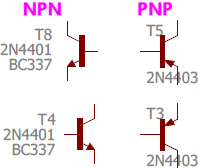
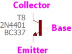
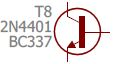
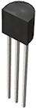
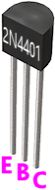
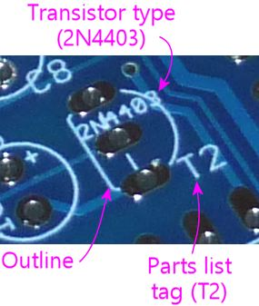
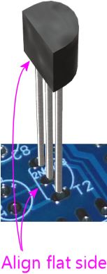
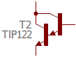

[#transistors]
= Transistors

A transistor is a fundamental semiconductor component that acts like an electronic valve, with a control signal that determines how much current can flow through the transistor. This ability can be used for amplifying a small signal into a bigger one and for electronic switching. Virtually all modern electronic computing is based on logic gates constructed from transistors acting as switches.

"Transistor" is an umbrella term for several rather different types of semiconductor devices, based on different physical effects, with considerably different behavior in a circuit. They're all lumped together under the name "transistor" because of the ability they have in common to function as amplifiers and switches.

This chapter is about the *bipolar junction transistor* , which is what people usually mean when they talk about a "transistor" without saying specifically which kind. The BJT was the first type of transistor that was widely produced, and was by far the most widely used until the 1980s, when its dominance was supplanted by a different type called the MOSFET (the subject of the xref:mosfets.adoc#mosfets[next chapter] ). Even though MOSFETs are more numerous these days (mostly because they're the transistors underlying nearly all integrated circuit chips), BJTs are still foundational to modern electronics, and they're extremely useful devices that are still widely used as discrete components (that is, outside of integrated circuit chips). We're including them in this guide for all of those reasons, but more specifically because the Pinscape boards use a few of them.

== Static electricity warning

Transistors are sensitive to static electricity. Refer to xref:staticSafety.adoc#staticSafety[Static Electricity Precautions] for tips on handling static-sensitive parts.

== NPN and PNP

Transistors (the BJT type) come in two varieties: NPN and PNP. These are essentially mirror images in terms of the voltage polarities of the signals they work with. The P's and N's in each abbreviation are for "positive" and "negative" (although in a very specific and technical way that you shouldn't take to refer to simple voltage polarities).

The main thing you have to know about NPN vs PNP transistors when you're building a circuit is simply that they're different types, and that you can never swap one for the other. If a particular part in a schematic or circuit board plan calls for an NPN, you must use an NPN transistor there, and likewise for PNP.

== On schematics

The schematic symbol for a transistor consists of a thick bar with three lines sticking out, one straight line on one side, and two diagonal lines on the other side. One of the diagonal lines has an arrow, which might point towards or away from the middle bar.

If the little arrow points _away from_ the bar, the symbol represents an "NPN" transistor. If the arrow point _towards_ the bar, it's a "PNP" transistor.

Note that the little arrow might be shown at top or bottom, and it might be on the left side or the right side. None of that makes any difference - the symbol means the same thing no matter how it's flipper or rotated. Schematic writers will flip the symbol top-to-bottom, or left-to-right, or rotate it at different angles, according to what's convenient to make the lines between nearby connections shorter. It doesn't change the meaning.

The three lines represent the three connections to the transistor, called the base, collector, and emitter:

* The straight line by itself on one side is always the *base* or *B*
* The diagonal line with the arrow is always the *emitter* or *E*
* The other diagonal line is always the *collector* or *C*

Pay attention to where the arrow is, because that's the real key to decoding the symbol. Remember that the symbol can be flipped top-to-bottom or left-to-right, or it can be rotated. But _the arrow is always the emitter_ , no matter where it's positioned. The line on the opposite side of the bar from the arrow is always the base, and the arrow-less line on the same side of the bar is always the collector.

Transistors have parts list tags just like other components. These most commonly start with "T" or "Q". As with the "R" tags for resistors and "C" tags for capacitors, these are just arbitrary tags to look up in the parts list, with no other meaning.

Transistors are also usually labeled with the semiconductor ID, like a diode is. In the case of a transistor, this usually starts with "2N". You might also see other part numbers, such as the "BC337" in the examples above. When two numbers are listed for one part like this, it indicates _alternative_ parts that you can use - so in the case of T8 above, you could use a 2N4401 or BC337 interchangeably.

On some schematics, the transistor symbol will be enclosed in a circle:

The circle doesn't change anything; it's just an alternative way of drawing the symbol.

== Physical packaging

Transistors come in many shapes and sizes. There seem to be about 20 industry-standard package types for through-hole transistors (the kind with leads that you insert through holes in a circuit board). There are probably quite a few more non-standard proprietary packages as well.

The Pinscape boards only use one package type, known as TO-92, which looks like a little black half-cylinder about 5mm on a side, with three leads sticking out the bottom.

== Orientation

The TO-92 case is an industry-standard shape and size, but oddly, they didn't standardize the order of the leads while they were at it. If you want to figure out which lead is the base, which is the collector, and which is the emitter, you have to look at the data sheet for the part you're using. For example, if you look at the data sheet for the 2N4401 transistor, it'll include a little diagram like this:

In the diagram, E = emitter, B = base, C = collector.

Other transistors in the exact same TO-92 package might have the leads in a completely different order.

Even though they didn't standardize the lead order for the TO-92 package itself, they _do_ always use the same lead order for a given transistor. Every 2N4401 in a TO-92 case will use the same lead order shown above.

Printed circuit boards take advantage of that fixed lead order for each specific transistor type to give you a handy orientation key for each transistor, printed right on the circuit board. If you look at the outline for any transistor in a TO-92 case, you'll see that the outline (as usual) matches the shape of the transistor when you view it from straight overhead. The outline has that same half-circle shape with one side flattened. That flat side is the orientation key. Just line up the flat side on the transistor with the flat side on the printed outline.

== Installing in a circuit board

Orient the transistor to match outline printed on the circuit board as shown above. Fit the three leads through the corresponding three holes in the circuit board. Feed the leads through the board until the part is seated as close to the board as you can comfortably get it without forcing it.

Hold the part in place, flip the board over, and solder the three leads to the solder pads. When the solder cools, snip the excess length from the leads.

== Selection

Transistors don't have a simple "unit" that describes them, the way we have Ohms for resistors or Farads for capacitors. Instead, schematics and parts lists will specify a particular transistor to use, by part number.

Transistor part numbers starting with "2N" refer to common, generic transistor types that are made by many manufacturers to the same specs. Many other transistors are identified by a manufacturer's proprietary part number. Manufacturer-specific part numbers don't follow any particular standard format, as they're up to each company to define.

In either case, use the part number listed in the schematic or parts list to search for a matching part at Mouser or another vendor.

It's always best to use the exact part listed, but many transistors have mutually compatible substitutes available. Try a Google search for a term like "2N4401 equivalent" if you can't find the exact original part specified.

All of the NPN and PNP transistors used in the Pinscape boards are used for their switching function. That makes them largely interchangeable with other transistors that are described as "small signal transistors". If you can't find the exact option for a transistor in the Pinscape parts list, you can probably substitute any other "small signal transistor" that meets these requirements:

* It's the same basic type (NPN or PNP) as the original
* Its maximum collector current (I~C~ , typically listed in the "Absolute Maximums" section of the data sheet) is at least as high as the value listed for the original part in its data sheet
* Its maximum emitter-base voltage (V~EBO~ ) is 12V or higher
* Its maximum collector-emitter voltage (V~CEO~ ) is 12V or higher
* It has the same case type (TO-92, TO-220, etc), to ensure that the leads will fit in the same solder pad holes in the circuit board
* Its leads (emitter, base, collector) are in the same order, so that you can plug it in the same way. (Alternatively, it can be in the _reverse_ order, as long as you remember to rotate it 180° from the way it's depicted on the circuit board when installing it, to match the reversed lead order.)

Note that those rules are specifically for the Pinscape boards. If you're trying to make similar substitutions for other circuit boards, you should those specs for V~EBO~ and V~CEO~ from "12V or higher" to "at least as high as the value listed on the original part list". I was just trying to save you the trouble of looking those up for the Pinscape parts, since in those cases you wouldn't need specs higher than 12V.

[#darlingtons]
== Darlington transistors

A Darlington transistor isn't really a different type of transistor; it's just a different kind of physical packaging. But it's worth mentioning because it looks a little different on schematics.

A Darlington is a pair of NPN or PNP transistors, linked together inside a single physical package. To the "outside world", it looks and acts very much like a single NPN or PNP transistor. What makes these devices useful is that the linkage of the two transistors greatly increases the amplification power - the first transistor amplifies the input signal, and the second transistor amplifies that _amplified_ signal, so it's like multiplying the two together. A circuit designer can accomplish the exact same thing by wiring two transistors together the same way, but this is such a common trope in circuit design that it's convenient to have it available as a single part. It's one less discrete part to install when you're building a board.

On a schematic, a Darlington is drawn as a pair of regular transistors:

This schematic symbol is so similar to the symbols for two individual transistors that it's kind of hard to distinguish whether it's a single Darlington or two regular transistors. The tell-tale is that there's only one reference designator and part number shown for the pair. The other way you can tell (although less definitively) is that the two individual transistor symbols are drawn so closely together, with almost no "base" line in the second transistor symbol. If they were were in fact meant to be discrete parts, they'd probably be spaced out a little more.

Physically, a Darlington is just like a regular NPN or PNP. Like the regular kind, it has three leads, labeled Base, Collector, and Emitter. You install it in a circuit board just like the regular kind of transistor.

