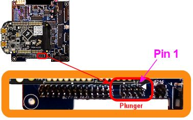

[#vl6180x]
= Plunger Setup (VL6180X Distance Sensor)

I should start by saying that I don't consider this to be a very good option. 
I'm including it because it's easy to set up and fairly cheap, so it might be appealing to some people on those grounds. 
It also has the virtue of being a non-contact sensor, so it won't suffer any wear and tear from use. 
But its accuracy and speed are too low for me to recommend it. 
It's only accurate to about 1 centimeter, which translates to chunky animation of the on-screen plunger (the best available Pinscape plunger sensors are accurate to better than 1/100 of a centimeter). 
It's also comparatively slow, which makes it less responsive than other options. 
With those warnings in mind...

The VL6180X is a distance measuring sensor that works by sending out pulses of IR light aimed at a target, detecting the reflected pulses with a photosensor, and measuring the round-trip travel time of each pulse. 
It uses the travel time to determine the distance, using the known speed of light in air.

To use this for a virtual pinball plunger sensor, the basic idea is install the sensor at a fixed position just beyond the end of the plunger, with the sensor pointing at the tip of the plunger. 
As you pull back the plunger, the distance between the sensor and the plunger increases. 
The sensor's distance measurement tells us the plunger's current position.

== VL6180X vs. VL53L0X

The VL53L0X is a newer chip from the same manufacturer with similar distance measurement features. 
It's not an outright replacement for the VL6180X, as it's not software-compatible and doesn't have exactly the same features. 
Its main advantage over the older chip is that it has a much higher maximum ranging distance, up to about 200cm vs only 10cm for the VL6180X. 
However, there's a tradeoff: it's considerably slower than the VL6180X. 
The VL6180X completes a distance measurement in about 13ms, whereas the VL53L0X requires at least 19ms, and is happiest at about 35ms. 
In my testing, the newer chip doesn't have any accuracy improvements over the old one.

Given the tradeoffs, I don't see any reason to use the VL53L0X over the VL6180X for plunger sensing. 
The longer range of the newer chip doesn't make any difference for us since we don't even need the full range of the older chip, and the reduced speed is a negative. 
If the newer chip's accuracy were noticeably better, that would make it more of a contest, but both chips seem to have about the same (poor) accuracy.

== Electronics

You can buy pre-assembled VL6180X circuit boards from several robotics hobby companies.
This is lucky for us, because the bare chips are rather challenging to work with.
The pre-fab boards make them easy to use.

Here are three options:

*  link:https://www.pololu.com/product/2489[Pololu] ($12)
*  link:https://www.adafruit.com/product/3316[Adafruit] ($14)
*  link:https://www.sparkfun.com/products/12785[Sparkfun] ($25, also sold at Mouser.com)

all these options are pretty much equivalent.
They all provide easy-to-solder terminals for all connections, and they all have the necessary on-board voltage regulators and level shifters to interface the VL6180X with the KL25Z. 
Any of these boards can be used directly with the KL25Z hardware and Pinscape software; the only thing you have to do is run a few wires between the KL25Z and the sensor board.

The instructions below are designed around the Pololu board. 
I chose that one as the reference point because it's the cheapest and smallest option. 
You can substitute one of the others if you prefer, but be aware that you'll have to adapt the instructions below for any differences in the board you choose. 
The other boards are all very similar, so this shouldn't be difficult, but keep it mind as you build the project.

=== Wiring the board

The breakout boards all come fully assembled, except for external wire connections. 
The only thing we have to do is attach the wires between the board and the Pinscape controller.

Your board might come with a set of pin headers that you can optionally solder to the pads on the board. 
You can use these if you'd like, but I'd actually recommend soldering wires directly to the pin pads instead of using the pin headers. 
Using the pins creates a bit of extra work, since you'll have to build an extra connector to plug into the pins. 
I'd skip the pins and solder wires directly to the board terminals, since you really shouldn't ever need to disconnect the wires from the sensor board. 
We _will_ use pluggable connectors at the other end, where we plug into the Pinscape board, so you'll still be able to easily unplug the whole assembly if you ever need to remove it from the cabinet.

I recommend 24 AWG stranded wire for the connections, but the exact gauge isn't important, as these wires carry extremely low power.

You'll need five wires, about three feet long each. 
Before cutting the wires, check the length you'll need by measuring the distance the wire will have to traverse to reach from your plunger housing to the Pinscape unit (the KL25Z or main expansion board). 
Take into account any extra length you need to route it around your PC motherboard or other obstructions.

Strip about 1/4" of insulation from each end of each wire.

Solder one wire to each of the following terminals on the board:

* VIN (Adafruit and Pololu) or VCC (Sparkfun) ( *not* VDD or 2.8V)
* GND
* SDA
* SCL
* GPIO0/CE (Pololu), SHDN (Adafruit), or IO0 (Sparkfun)

Note that your board will have some other terminals besides those listed above. 
You can simply leave other terminals unwired.

Be careful about the "VIN" voltage input terminal! This one can be a little confusing because some of the boards have two "V" terminals. 
One is for the input voltage: this is the one we want to connect. 
The other is for the output of the on-board 2.8V voltage regulator. 
We *don't* want to connect anything to the 2.8V output. 
On the Adafruit board, the 2.8V output is plainly labeled as "2v8", while it's more obscurely labeled on the Pololu board as "VDD". 
In either case, just leave this terminal unconnected.

[#expHdrDiagram_vl6180]
=== Expansion board wiring

For the expansion board connector, build a 4x2 crimp pin housing ( link:https://www.mouser.com/search/ProductDetail.aspx?R=855-M20-1070400[housing] , link:https://www.mouser.com/search/ProductDetail.aspx?R=855-M20-1160042[pins] ).
First crimp a pin to the end of each wire (see xref:crimpPins.adoc#crimpPins[Crimp Pins] ).
Insert the pins in the housing, following the diagram below for the pin placement.

It would be a good idea to put a mark of some kind on the housing in the corner next to pin 1 - the pin marked with the arrow on the diagram above. 
That will make it easier to remember which side aligns with the "pin 1" arrow marker on the circuit board when you plug in the connector.

=== Standalone KL25Z wiring

For the standalone KL25Z, I recommend using the xref:plungerBreakout.adoc#plungerSensorBreakoutBoard[plunger sensor breakout board] .
Then you can just plug it into the breakout board.

* Build the expansion board connect as described above
* Build the ribbon cable connector exactly as described above, as though you were using the expansion boards
* Follow the instructions in xref:plungerBreakout.adoc#plungerSensorBreakoutBoard[Plunger Sensor Breakout Board] to build the breakout board
* Connect the following wires between the breakout board and the KL25Z:
** Breakout board *3.3V* to KL25Z P3V3 (pin 8 on J9)
** Breakout board *GND* to KL25Z GND (pin 12 or 14 on J9)
** Breakout board *B0* to KL25Z PTB0 (pin 2 on JP10)
** Breakout board *E20* to KL25Z PTE20 (pin 1 on JP10)
** Breakout board *D0* to KL25Z PTE21 (pin 3 on JP10) (Yes, the label on the breakout board is different in this case)

If you prefer to use your own ad hoc wiring, see "Plug it in" below for the list of KL25Z GPIO connections.

== Physical installation

I haven't come up with a reference design for the housing for this sensor, so you'll have to come up with something on your own. 
The basic idea is to mount the sensor at a fixed position in your cabinet so that it faces the tip of the plunger head-on. 
The point is to measure the distance between the sensor and the plunger.

There have been several commercial virtual pinball plunger kits available over the years that were also based on IR proximity sensors, so we can look to them as examples for how we might set this up. 
All of those used a plastic tube surrounding the plunger, with the sensor installed at the far end of the tube, facing the plunger tip. 
The plastic tube serves dual purposes: it provides a place to mount the sensor, and it shields the whole area from stray light that could interfere with the sensor's readings. 
The VL6180X actually doesn't actually need such shielding as much as the older sensors used in the commercial kits do, since it has a "laser ping" design that's pretty good at ignoring ambient light, but even so, it wouldn't hurt.

Choosing a material for the tube: This isn't as simple as it might seem! Intuitively, it seems like any kind of opaque material would be good. 
But the sensor uses infrared light (technically, 850 nm), and many materials that look opaque to our eyes are actually transparent to IR. 
The common 3D printer plastics PLA and ABS are both partially transparent to IR, so it would somewhat defeat the purpose to use them for a light shield. 
Black PETG is supposed to be nearly opaque to IR, so it might be a better choice. 
It might also be a good idea to make the inside surface texture of the tube or cover somewhat rough, to minimize reflections. 
A smooth surface that readily reflects the signal might be worse than no cover at all.

Choosing the sensor mounting position: Make sure that the sensor is far enough away from the end of the plunger's range of motion that the plunger won't ever hit the sensor. 
Remember that the plunger springs forward about half an inch from its resting position, because the barrel spring on the front can compress a bit. 
Leave a gap of at least 1 centimeter (about half an inch) if possible.

When you mount the board, be sure to mount it with the component side facing the plunger.

Here's what the Pololu board looks like. 
The sensor is the little black box in the middle with two small holes (one hole is the laser emitter, the other is the photosensor). 
The sensor chip looks the same on all the boards, but the layout of the terminals and the other parts varies slightly.

== Plug it in

*Expansion boards:* Once you've built the connector as shown above, simply plug it into the plunger connector on the main expansion board.
Make sure the plug orientation is correct by match pin 1 in the housing (see the xref:#expHdrDiagram_vl6180[diagram] ) with the pin 1 triangle printed on the expansion board.

*Standalone KL25Z:* If you're using the plunger sensor breakout board (recommended), build the expansion board connector as described above, and just plug it in to the pin header on the breakout board.
Be sure pin 1 on the plug (see the xref:#expHdrDiagram_vl6180[diagram] ) to pin 1 on the board, which is marked with a little white triangle printed next to the header.

image::images/plunger-breakout-pin1.png[""]

If you prefer to use your own ad hoc wiring, connect the wires between the board and the KL25Z as shown below.

[cols="1,1"]
|===
|Sensor Board Pin|KL25Z Pin

|3.3V
|P3V3 (JP9-8)

|GND
|GND (JP9-10)

|SDA
|PTE20 (JP10-1)

|SCL
|PTE21 (JP10-3)

|GPIO0/CE
|PTB0 (JP10-2)

|===

Note that the last pin, GPIO0/CE, has different names on some of the boards: it might be labeled IO0 or SHDN.
It's the same pin in any case; the different board makers just chose to give it different labels.

The illustration below shows the Pololu board.
Be sure to adjust the pin ordering if you're using a different board.
Just match the labels shown on the diagram to the labels printed on your board.

Note that the three GPIO ports listed above are only suggestions.
If you're already using the same ports for other functions, you can assign the sensor inputs to other ports using the Config Tool.
Any free GPIO ports can be used with this sensor (it doesn't have any special requirements for particular ports).
The power and ground wires aren't configurable, though, so connect those as shown.

== Software setup

Once you have the sensor physically installed and plugged in, run the Pinscape Config Tool on your PC.
Go to the Settings page.
(If you have multiple Pinscape units installed, choose the Settings page for the unit that's plugged into your new plunger sensor.)

Go to the Plunger Sensor section.
Select VL6180X in the "sensor type" popup.

(If the VL6180X option isn't available in the plunger sensor list, you probably have an older version of the Config Tool.
Updating to the latest version should add the option.)

If you're using the expansion boards, the pin settings will be set up automatically.

If you're using the standalone KL25Z, set the pin assignments for the three pins (SDA, SCL, and GPIO0/CE) to match the pins you connected on the KL25Z.
The SDA and SCL pins should match the pins you wired to the like-named terminals on the sensor board.
The last one, GPIO0/CE, goes by different names on the different boards: on the sensor board, it will be labeled as GPIO0/CE, IO0, or SHDN, depending on which type of board you have.

Save the new settings by clicking "Program KL25Z" at the bottom of the window.

You should now test and calibrate the plunger.
Return to the home screen in the Config Tool and click the Plunger icon for the unit with the sensor attached.
This will let you look at the raw sensor input.
Move the plunger and make sure it seems to be tracking properly.

If the sensor is working properly, click the Calibrate button in the plunger viewer window to begin the calibration process, and follow the on-screen instructions.

If the sensor doesn't seem to be working, go back to the Settings screen and double-check the sensor pin assignments.
Make sure that none of the pins are marked with warning icons (image:images/pinwarn.png[""]).
Check each wire and make sure that it goes to the proper pin on each end (KL25Z and sensor board).
Check that each GPIO port assignment on the settings page matches up with the physical pin on the KL25Z and connects to the corresponding terminal on the sensor board.

=== Jitter filtering

The VL6180X generates distance readings in millimeters, but it's really only accurate to about a centimeter, so the millimeter numbers it comes up with are pretty much just wild guesses.
As a result, the readings fluctuate quite a bit from one reading to the next, even when the target is standing still.
With a stationary object, you'll see the readings jump around constantly within about 5mm of the true distance, plus or minus.
This is annoying and unrealistic during virtual pinball play, because it makes the on-screen plunger dance around nervously when the real plunger is standing still.

The Pinscape firmware offers a "jitter filter" to deal with this.
The jitter filter lets you set a range for ignoring random fluctuations.
As long as the random noise from the sensor stays within the range, the device ignores the fluctuations and reports a stable, stationary plunger.
The on-screen plunger only moves when the sensor readings move outside of the noise window.

To enable the jitter filter, run the Pinscape Config Tool and go to the Plunger Viewer window.
There's a setting in this window for the jitter filter.
To adjust it, start with the filter at zero, and gradually increase it until the green bar showing the filtered reading stops jumping around.
Use the smallest value that gives you acceptable results, because larger values will reduce the usable precision during play.

=== Backwards operation

If the on-screen plunger moves backwards from the real plunger, you can fix it in the software without reinstalling the sensor.
Open the Pinscape Config Tool.
In the row for the controller, click the Plunger icon.
Check the box for "Reverse orientation".
(If it's already checked, un-check it.) This tells the software to reverse the readings from the sensor, so that it acts like it was installed in the opposite orientation.

