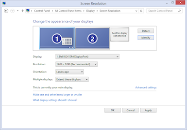
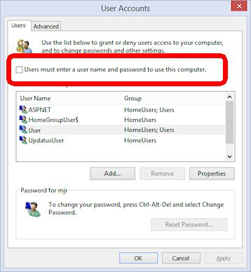

= Windows Setup

Once you have the PC hardware set up, the next step is to install Windows.

We won't try to provide a Windows installation tutorial here, since the Web has much more comprehensive information on that than we could provide here - and you probably won't need to look at any of that anyway, since Microsoft has managed to make the process fairly automatic in most cases. But we do have some recommendations for settings specifically for pin cabs.

So continue below after you've gone through the basic Windows installation procedure.

== DON'T turn off UAC

User Account Control (UAC) is a Windows security feature added in Windows Vista, and present in all Windows versions since, that makes Windows ask for your permission when an application tries to do something that affects core resources in the operating system, such as altering a system registry setting.

You might see advice on the forums telling you to turn off UAC to avoid those prompts. I recommend ignoring that advice. *Leave UAC enabled.*

I recommend *against* disabling UAC because doing so can cause software compatibility problems. UAC is an integral part of modern Windows systems, and removing it actually changes the way Windows works internally, which can break some application software. If you're technically inclined and curious about the details, see Mark Russinovich's article in Microsoft's TechNet Magazine, June 2007, link:https://docs.microsoft.com/en-us/previous-versions/technet-magazine/cc138019(v=msdn.10).html[Inside Windows Vista User Account Control] . For a less technical explanation, try a Google search for "Why not disable UAC". Disabling UAC also increases your vulnerability to system damage from malware and unintentional software bugs.

Any advice you see about disabling UAC is likely outdated. The notion comes from the early days of Windows Vista, when UAC was first introduced. A lot of software at the time wasn't properly designed for the tighter security rules added in Vista, so some people resorted to disabling UAC in an attempt to keep their old software running. As time has gone on, though, most software has been updated to work properly, and UAC itself has been improved to make it less intrusive.

== Arrange monitors

If you're using multiple monitors, Windows will combine their display areas into a single large virtual desktop.

Windows lets you adjust the way the monitors are arranged within the virtual desktop via a control panel. The idea is that if you have two physical monitors sitting side by side on a desk, you can arrange the virtual desktop to match. To reach this control panel, bring up the Display control panel, then click Adjust Resolution.

This control panel shows a diagram of how the physical monitors are lined up across the virtual desktop. You can drag the monitors in the diagram to rearrange them. How you arrange your monitors is mostly up to you, but there's one important rule you should follow:

*The main display should be at the upper left of the virtual display area.*

Note that the "main display" isn't necessary display #1. The numbering is just a way to identify the monitors and is somewhat arbitrary. The "main display" is simply the one you designate as such using the "Make this my main display" button in the control panel.

I recommend the following layout:

* Make your playfield monitor the main display
* Arrange the monitors in a single row
* Make sure the main display is at the left end of the row

Some versions of Windows only allow certain monitors to be the main display, so you might not have the option to make your playfield monitor the main one. If you can't, you should still arrange things so that the main monitor is at the left end of the row.

The reason I recommend this arrangement is that some software, notably VPinMAME, can have odd problems if the main monitor isn't at the left extreme of the virtual desktop. Windows internally assigns the "origin" of the pixel coordinate space to the top left of the main monitor, so any monitor that's to the left of this (or above it) in the virtual desktop area will have negative pixel coordinates. Some software (like VPinMAME) gets confused by the negative coordinates. If you don't follow this advice about the layout, VPinMAME won't be able to properly remember your screen layout, because it incorrectly interprets negative coordinates as errors.

== Turn off "Sticky Keys"

Most pinball software uses the Shift keys to control the flippers. Windows has an accessibility feature called "Sticky Keys" that locks the shift keys on if you press them several times in a row. The feature is well-intentioned - it's there to help people who have difficulty pressing several keys at once - but it interacts horribly with pinball games. It can make the flipper get stuck in the up position after a bunch of rapid flips.

Sticky Keys is an accessibility feature, so you'll find it on the "Ease of Access Center" control panel, which you can find in the main Control Panel window.

On most versions of Windows, you can also find this control panel by pressing Windows+S ("Search") and typing "Sticky Keys" into the box. Look for "Change how your keyboard works" or "Make the keyboard easier to use" in the search results.

Once you find the dialog, look for the checkbox labeled "Turn on Sticky Keys". Make sure it's un-checked.

== Automatic login

Windows normally asks you for a username and password every time you start up the computer. This is great for office or work PCs. It's not great for pin cabs, where you want to be able to turn on the machine and get straight to playing pinball. It's a little crazy to have to get out the keyboard and log in first.

Fortunately, Windows lets you disable the login requirement, so that the machine boots straight to the Windows desktop each time you turn it on. Here's the procedure:

* Press Windows+R ("Run Program")
* Type *netplwiz* into the Run box and press Enter. This should bring up the advanced user accounts control panel (titled "User Accounts" on most Windows versions).

* Look for the checkbox "Users must enter a user name and password to use this computer" (circled on the screen shot above). Un-check this box.
* Click OK to confirm the changes.
* A new dialog should appear asking you to enter the credentials to use to sign in automatically when Windows reboots. Enter the username and password you wish to use and click OK.

The next time you boot, Windows should automatically log in to the account you selected and go straight to the desktop.

== Remove (or don't install) anti-virus software

On any gaming PC, it's best to minimize the number of background tasks running. Background tasks take CPU time away from the main program that's running. This can have a visible effect on the animation in a game, since even a very short interruption in the animation updates can cause momentary glitches and stutters.

Probably the most important background task to get rid of is third-party antivirus or anti-malware software. Virtually all of these programs use significant system resources and will noticeably hurt game performance. If you built the PC yourself and did a fresh install of Windows, you can simply elect not to install any third-party security software. If you bought a pre-built PC, and the vendor larded it up with "free trial" security software, I'd remove it all.

It might seem crazy in this day and age to run a PC without any security software, and I certainly wouldn't recommend going without on an ordinary PC, but a pin cab isn't an ordinary PC. The difference is that you'll probably only use it for playing pinball - not for browsing random Web sites, opening random emails, or downloading random programs. As long as you're careful about what you install, your risk of encountering any malware should be small. Stick to the well-known pinball programs and add-ons, and always get them from reputable sites.

An exception: you can (and should) leave the built-in Windows security features enabled, particularly Windows Defender and the Windows Firewall. Those have a negligible impact on system performance, and they provide a good baseline level of protection.

== Backing up your system data

Everyone knows how important it is to back up the data on a PC, in case you ever need to recover from hardware failures, accidental file deletions, or malware attacks. It's a lot of work to set up all the software on a pin cab, so backups are as important for a pin cab as for any other PC.

The approach I've used for a long time is to back up to external USB hard disks. Those are reliable and fairly inexpensive, and most of them come bundled with backup software. More recently I've added cloud backup as a second layer of protection. There are several good on-line backup services that run about $10/month for reasonable storage quotas.

Here are some things I consider important when setting up your backup plan:

* It should be *automatic* . It should run on a schedule so that you don't have to remember to run it yourself. It's too easy to put it off or forget about it entirely if you have to do it manually. The cloud backup services make this particularly easy.
* The media should be *offline* between backup sessions, meaning not physically connected computer you're backing up. This will protect your data in case of a hardware failure (such as a power spike that fries everything connected to the computer) or a system-wide malware infection. If you back up to an external USB disk, simply unplug it from the computer after each backup.
* Better still, the media should be *off-site* , at a physically separate location. This will protect your data in case of a whole-house disaster like a fire or flood. This is a big benefit of cloud services.
* Backups should be *versioned* . Versioning is particularly critical for malware protection, because an infection might not be immediately apparent, so your most recent backup might include infected files without your knowing it. Keeping multiple versions lets you go back in time to a point before the infection. Versioning is also a nice safety net in general - it lets you go back to an older working configuration if something goes wrong with a software update, for example.
* The backup software should do a whole-disk scan. If you have to manually choose the files that get backed up, you'll inevitably miss something important. I always prefer starting with a default that includes everything on the disk, and then manually selecting files to exclude.
* The backup scan should *include the Windows registry* as part of the backup, since Windows itself and many application programs store a lot of important configuration data there.

