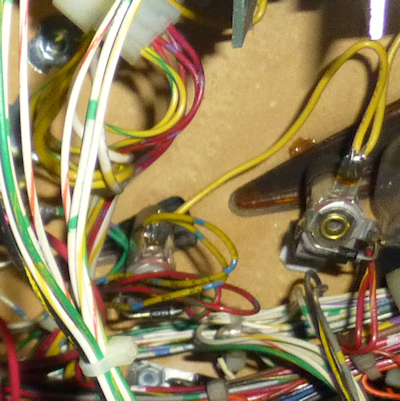

[#wire]
= Wire

One electrical component that you'll use a lot of in a pin cab is wire.

I'd recommend buying about 100' up front if you're setting up a basic cab without feedback devices, and at least 200' if you're installing feedback devices.

For most uses in a pin cab, I'd recommend 22 AWG stranded wire.

It's a good general-purpose type that will work for practically everything, from button wiring to feedback devices.

For a few special cases, like power wiring and speaker wiring, I recommend 18 AWG stranded.

24 AWG works as well as 22 gauge for most purposes, and it's a little cheaper, so you can mostly use 24 if you want to save a little money.

However, you'll still want some 22 AWG on hand because 24 gauge is a little thin for some of the higher-power items, particularly motors (shaker motor, gear motor, and fan).

See the current-limit table below for some guidance on this.

The thing I like about 22 AWG is that it has enough power capacity for just about everything in a cab, so you don't have to think too much about power limits if it's your default wire type.

== Stranded or solid

Wire comes in two basic types: stranded and solid.

Solid wire has a single piece of metal making up the wire.

Stranded wire is made by winding several finer pieces of wire together into a bundle.

The electrical properties of stranded and solid wire are pretty similar.

For a low-power application like a pin cab, there's little difference between the two types electrically.

For our purposes, the main differences come down to the mechanical properties.

Mechanically, stranded wire has the advantage.

It's more flexible, less susceptible to metal fatigue, and works better with crimp connectors.

== Copper or tinned copper

Generic hookup wire generally uses plain copper as the conductor.

There's also an upgraded type of conductor known as tinned copper, where the copper strands are coated with a thin layer of tin.

The tin layer inhibits oxidation, so tinned wire is more durable, especially when the wiring might be exposed to water or high humidity.

It's also more expensive; tinned copper wire costs about 2-3X as much as plain copper hookup wire.

I personally think plain copper is perfectly adequate for a pin cab, since you'll probably keep it indoors and treat it gently.

That said, the pinball manufacturers deemed it worth the extra cost, because you'll find tinned wire throughout most real machines.

But I think that's part of the tradition of building the real ones like tanks, which they have to do because so many are deployed in public spaces.

== Gauge selection

Here are my quick rules of thumb for picking wire gauges.

If you follow these, you should end up with safe wiring, without having to give a lot of though to each individual run:

* For all feedback devices, use 22 AWG
* For button wiring and other low-power logic signals, use 24 AWG (or 22 AWG if you prefer to minimize the different types you have to keep on hand)
* For speaker wiring and high-voltage power wiring (e.g., wires connecting power supplies to 120V), use 18 AWG

=== More details about wire gauge

The "gauge" or "AWG" number tells you the diameter of the wire (specifically, of the metal conductor part).

The gauge scale is kind of backwards: larger AWG numbers mean thinner wire.

18 AWG is thicker than 22 AWG.

How do you choose a gauge? There are two constraints that generally bracket the size of wire you can use for a given function:

* The current carrying requirement of the function, which sets a minimum thickness
* What kind of connectors the wire will fit into

The thicker the wire (or the lower the gauge), the more current it can carry.

To be really safe in terms of current capacity, you could always just use the thickest wire you can find.

But thicker wire has a few downsides, too.

It's harder to work with than thinner wires, and it's more expensive.

What's more, there's a limit to how thick a wire will fit into a given connector.

You don't want a wire that's too thick to fit a terminal that you have to connect it to.

So it's not as simple as "bigger is better".

What you really want is wire that's thick enough to safely carry the current needed for its particular function, but not too much thicker than that.

If you do a little Web research, you can find lots of tables of "ampacity" - current capacity by wire gauge.

Unfortunately, most of the tables have different numbers, because there are a lot of factors that go into the calculations, such as insulation type and what kind of environment the wire will be used in.

For your convenience, I'm going to provide my own table below, but keep in mind that these are only approximations.

I think they're pretty conservative, though, because most ampacity calculations are based on _continuous_ current levels.

For a pin cab, most devices are only used intermittently.

Continuous usage is a much more rigorous requirement, because current limits are all about heat dissipation; a wire that only carries power intermittently doesn't have as much heat to dissipate.

So for most pin cab devices, I think the numbers below represent a generous margin of safety.

For devices that you plan to run continuously (light strips, for example), you might consider bumping up to the next thicker gauge if you want to be cautious.

[cols="1,1"]
|===
|AWG gauge|Max Amps

|16
|22

|17
|19

|18
|16

|19
|14

|20
|11

|21
|9

|22
|7

|23
|4.7

|24
|3.5

|25
|2.7

|26
|2.2

|===

I highlighted the 18, 22, and 24 gauges in the table because these are the sizes I find most useful in a pin cab.

You should be able to wire everything in your cab with a supply of each of these three sizes.

From the table, you can see that 22 AWG wire has a capacity of about 7A.

The highest power devices in a pin cab tend to be shaker motors, gear motors, and knocker coils, and those all run at around 3 to 4 Amps.

That's why I like 22 AWG as my "standard" wire type throughout the cab: it has high enough capacity to handle anything in the cab, but it's still a fairly thin wire, which makes it easy to work with and relatively inexpensive.

24 gauge has a capacity of about 3.5A, which makes it suitable for most of the "other" uses (besides heavy-duty devices like shaker motors) in a pin cab.

24 AWG is appropriate for everything carrying logic signals, like button wiring, and for low-current lighting devices like button lamps and flipper button LEDs.

24 gauge is a bit cheaper than 22, so you might prefer to use it wherever possible.

But you shouldn't use it for larger mechanical devices like shaker motors and knocker coils, since those need a little more current capacity than 22 gauge can safely carry.

You can also see that 18 gauge has a very high capacity of 16A.

That's plenty for the main power connections, such as the wires between the power supply and the Pinscape expansion board.

It's also a good size for speaker wiring.

== Labeling, color-coding and color striping

One thing you'll notice as you get into your project is that these machines use a _lot_ of hookup wire.

You'll be running wires to buttons and feedback devices spread around the cabinet.

Many of these wires will connect to central "switchboards", particularly the key encoder and feedback controllers.

That will make for a rat's nest of wires around those central points.

For maintenance purposes down the road, it's awfully nice if you can tell which wire is which at those junction points where you have lots of wires coming together.

The obvious way to do that is to use a unique insulation color for each wire.

But that's not really possible, because there are only about ten color choices available for common hookup wire (white, gray, black, yellow, orange, red, green, blue, purple, and brown).

That's not nearly enough for all of the separate wiring functions in a pin cab.

Your key encoder will have about 20 wires coming into it, and your feedback controller might have 30 to 50.

You'll also have four or five different power supply connections to keep track of (ground, 5V, 12V, 24V, etc).

That adds up to around 100 separate functions.

With only ten colors to work with, we'll obviously have to re-use some colors for more than one function.

The place I like to start for assigning the colors is the power supply connections.

These connect to practically everything in the cab, and they're especially important to keep track of, since getting them wrong can cause damage.

So a consistent convention is really helpful.

The main power supply lines are the "ground" or 0V (zero volts) line, which connects to practically everything, and the 5V and 12V power supply connections.

The convention I like to follow here is the same one that virtually all PC power supplies use:

* Black = ground
* Red = 5V
* Yellow = 12V

If you have a typical rainbow assortment of eight to ten insulation colors, that leaves five to seven unique colors for everything else.

Which obviously isn't enough to assign a unique solid color to each of perhaps 50 to 100 separate connections to buttons, feedback devices, and speakers.

The easy way to deal with this is to reuse colors.

That's what I did in my own cab.

It's not ideal, but you can at least try to use separate colors for adjacent connections.

For example, rotate the colors for adjacent ports on your button controller, and use different colors for two buttons situated near each other.

Reusing colors is easier during setup, but it can make future maintenance work more tedious and error-prone.

If you want to be more methodical about it, and give every wire a unique appearance, for easier tracing, there are a couple of techniques available.

The first is that you can attach tags or labels to either end of each wire, with printed legends naming the function.

This has the advantage that you don't have to go look at a separate chart of wire colors; you can see the intended function of each wire just by looking at the label.

But I've never found wire tags to be a very satisfactory solution over the long run, because they tend to fade or fall off over time.

They can also get in the way and become cluttered, especially in places where a bunch of wires come together (like the connections to a button controller).

The second approach, which is what they do in the real pinball machines, is to use "color striping".

That is, you paint a stripe down the length of each wire, so that the wire isn't just "white", but "white with green stripe", say.

This lets you create many unique color schemes with just a few base insulation colors.

Some examples of wires with color-striped insulation (from the bottom of a Williams playfield from the 1980s).

The stripes on the white base color insulation are the most obvious, but if you look closely you can see that the dark green wire at the left is striped with yellow, and the various yellow and red wires are striped in different colors.

The real machines group related connections into a common base color, to make it easier to remember the purpose of each wire.

For example, a group of switches might all use green as the base color, with a different stripe color for each switch.

That's a good technique to apply to your virtual cab, if you decide to use color striping.

Alas, it's not easy to buy color-striped wire off-the-shelf.

Marco Specialties and Planetary Pinball Supply sell it, but I've found that they both tend to have only a few color combinations in stock at any given time, so it's difficult to set up a full collection.

The other downside is that their wire runs about 2-3X what you'd pay for generic hookup wire, because the type they sell uses tinned copper (see above).

You can find striped wire from a few other Web vendors as well, but the ones I've been able to find have very limited color and gauge selections.

If you want to use striped wire, you might actually be better off creating your own rather than trying to buy it.

There's a clever DIY system for creating your own striped wire out of the cheaper solid-color wire.

Some of the home-brew pinball people use this.

(Yes, there really is such a thing as home-brew pinball - people who build _physical_ pinball machines of their own design from scratch.) Here's a page on the subject on one of the DIY pinball sites:

link:https://pinballmakers.com/wiki/index.php?title=Construction.html#Color_Coding[Color coding - pinballmakers.com]

Their approach is as follows:

* Start with a collection of ordinary hookup wire in assorted solid colors.

These will serve as the base colors.
* Get a set of *oil-based* Sharpies or similar permanent markers in assorted colors.

These will be used for the stripe colors.

Oil-based inks are a must for this - regular water-based inks won't adhere to the plastic insulation.

(I've tried it; the ink will just end up all over your hands.)
* As you dispense wire, use one of the oil-based markers to stripe it.
* To make the striping more automatic, set up a dispenser that feeds the wire through a slot that the marker sits on top of.

The pinballmakers site suggests using a PVC T joint to hold the pen.

The great thing about this approach is that you don't have to buy a hundred spools of wire with unique color combos.

You just need a basic rainbow assortment of the common single-insulation-color wire, plus a small assortment of markers.

And it doesn't add a lot of extra prep work, since you create the color striping as you spool out the wire.

