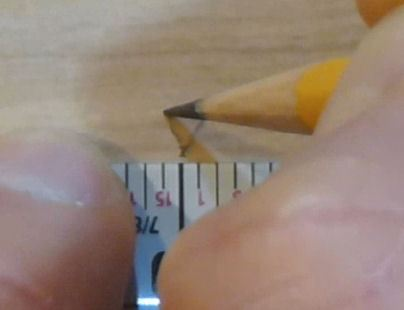

= A Few Woodworking Tips

I'm such a woodworking newbie that I'm a little shy about including a section on "tips". But I'm doing it anyway, because I've come across a few useful things that don't seem to be widely advertised, and I want to pass them along. This isn't even remotely a tutorial on woodworking - it's just a few miscellaneous ideas that I've found helpful.

I picked up most of the tips here from Web tutorials and Youtube videos. You can easily find these tips and much more with a little online research. But the Web is vast, so sometimes it's nice to have a curated list of highlights from someone who's not just trying to pad out a listicle.

== Measuring and marking lines

If you're accustomed to marking measurements on a board with a little "tick" mark with a pencil, here's a slightly different method that's no more work, but really improves my accuracy.

* Put your pencil tip right against the mark on the tape or ruler at the point you want to mark
* Make a diagonal stroke out to the right

image::images/tape-measure-v-1.jpg[""]

* Put your pencil tip back at the same tape/ruler mark
* Make a second diagonal stroke out to the left

Now you have a little "V", with the point of the "V" exactly at the measured location.

The repeatability of my measurements improved noticeably when I starting using this technique. The old tick mark method leaves a surprising amount of fuzziness, mostly because the little line is never perfectly straight (not when I draw it, anyway). The "V" marks a single point, instead of a line, so you can see exactly where the measurement was supposed to be.

== Tape measures

The best measuring tool for many woodworking tasks is a tape measure. I used to think rulers were better when you needed an accurate measurement, but a tape measure is actually better for woodworking in many cases, if you use it right. The key is the little hook on the end.

When you want to measure from the edge of a board, hook the tape onto the edge you want to measure from, and pull the tape tight across the board to find the point to mark. The hook sets the zero point exactly at the edge of the board. This is much more precise than trying to align a ruler with the edge.

Here are two tips for getting better accuracy out of your tape measure:

* The little hook on the end of the tape is *supposed to be* loose like that. I always thought the looseness in my old tape measure was from age - I thought the little rivets holding the hook on had loosened up over time. But the sliding hook is actually a feature, not a bug. It's there to precisely account for the thickness of the hook itself. When you attach the hook to the outside edge of a board, pull it tight, and the hook will align so that your reading on the tape corresponds to the distance from the edge of the board. When you're measuring the inside of a space, push the hook up against the wall you want to measure from, so that the hook slides all the way inward, and now the reading on the tape is precisely the distance from the thing it's pressed up against.
* Use *the same tape measure* for all measurements that have to align with each other or be consistent with each other. Tape measures (and rulers as well) can have a fair amount of variation when you compare them side by side - it seems typical to see differences of 1/32" to 1/8" over distances of a few feet. Even a variation as large as 1/8" over 3' is better than 99.5% accuracy, which is great in most contexts, but those fractions of an inch can really matter in woodworking. Anyway, you can make those errors cancel out in most cases simply by using the same tape measure for all related measurements. That way, at least the readings will all be off by the same amount, so they'll line up with each other after cutting.

By the same token, if you need a measurement to line up with some pre-fab part (a metal trim piece, say), measure that part with the same tape measure rather than relying on the specs. Or just use the part itself as a ruler. Don't count on every part to match the specs perfectly; a lot of this stuff isn't manufactured to the highest precision.

Buying tip: I find it really helpful to have a tape where every tick mark on the tape is marked with a number. I have an older tape that only has numbers on the inch marks, and a newer tape with every 1/16th tick mark individually numbered. I've made more mistakes than I'd like to admit reading the old tape, where I misread a 1/16th tick because I wasn't paying close enough attention or I didn't have good enough lighting. It's harder to screw that up when the number is printed right on top of the mark you're reading.

Comparison of tape measure markings. Every 1/16" mark is numbered on the top tape. On the bottom tape, only the inches are numbered, and you have to infer the fractions - which isn't exactly hard, but it's more error-prone. On the other hand, the bottom tape is narrower, which makes it easier to hold the edge flat against a board to precisely line up a mark. My ideal would be a narrow tape like the bottom one with every tick mark clearly numbered like the top one.

== Sawing on the "right" side of the line

If you start with a board that's 12" wide, and you use a saw to cut it exactly in half, how wide are the two resulting pieces? Strangely, the answer isn't 6". It's actually more like 5-15/16". What happened to the missing 1/8"? It basically vanished into thin air. Well, almost: it got converted into sawdust. The technical term for this is the "kerf" of the blade - the width of the slit that the blade makes as it cuts through the board. You can easily see this in action by making a cut partway into a board.

Partial cut, showing the slit that the saw leaves as it cuts. Woodworkers call the width the "kerf" of the blade.

The usual goal when you're sawing a board is to produce a finished board that's an exact target width. You don't want it to be "about" the desired width, give or take a few sixteenths. You want the result to be just what you measured.

The way to get the finished board to match the measured size is to place the blade on the outside of the cut line. In other words, position the saw so that the entire width of the blade is within _leftover_ part of the board. Align the inside face of the saw blade (the face closer to the keeper part of the board) with the cut line. That way, the slit that the saw cuts will be taken out of the leftover part, leaving exactly the measured size for the keeper part.

How you apply this varies a little bit with different types of saws:

* For a table saw, making a rip cut using the fence, the keeper part is the side that goes against the fence. The fence gauge should always be calibrated to the distance between the fence and the blade, so the reading on the gauge should reliably give you the width of the finished piece that comes out of the saw on the fence side.
* For a cross-cut with a table saw, using a sled or miter gauge (rather than the fence), mark the cut line on the board, and align the cut line against the saw blade so that the whole width of the blade is on the leftover side of the line.
* For a track saw, mark the cut line on the board, and position the track so that it's on top of the keeper side of the board, with the edge of the track right up against the cut line.

== Drilling clean holes

The big problem that everyone encounters when drilling plywood is splintering on the back side of the board, where the bit exits.

This seems to be a vexing problem for a lot of people, given the bounty of How To pages about it on the Web. The usual advice is to always use brand new drill bits, or to use special bits like stepped bits or Forstner bits. It's hard to argue with the notion that a sharp bit will drill cleaner than a dull one, but it's hard to imagine anyone actually follows advice that you should treat your drill bits as single-use disposables. And the special bits have their uses, but none of them can fix the back-side splintering problem by themselves. The splintering happens because of the way plywood is constructed, not because of the type of drill bit you're using.

Another approach you often see recommended is to drill halfway through from each side, meeting in the middle. This avoids back-side splintering by essentially eliminating a back side. That can indeed fix the splintering problem, but I've found that it often creates a new problem, which is that it's difficult to get the two half-holes to align perfectly. There's usually at least a tiny offset between them, no matter how careful you are. You can pre-drill with a small pilot bit to mark the center point on both sides, but even then, the accuracy is limited to the non-zero size of the pilot hole. In some cases, a slight offset might not matter, but it can be problematic when precision is required, such as when you need a good fit for a bolt.

*What actually works:* There's only one technique I've found that really works, and the good news is that it works reliably, with almost any drill bit. It's also pretty easy. The technique that works is to *use a backing board* . In other words, take a piece of flat scrap material that you don't mind drilling an extra hole in, and clamp it tightly to the back of the board, behind where you're drilling the hole. Tight clamping is the key - it's what makes this work. Now just drill straight through from the top side.

The whole reason splintering happens in the first place is that the veneer tends to bend outwards just before the bit penetrates it. As the bit gets close to breaking through, it cuts away at the veneer from the inside, making it thinner and thinner. This reaches a point where the veneer is so thin and fragile that the pushing force of the bit overwhelms the cutting action, bending the super-thin fragment of veneer outwards instead of cutting it. The wood grain holds this bit of bending veneer together and pulls it up and away from the board for some distance away from the hole, resulting in those torn splinters around the exit point of the drill.

The backing board fixes this by providing an extra layer of strength outside the veneer that holds the veneer flat until the bit is all the way through.

I almost always get clean holes on both sides of the board when using this technique, as long as the backing board is clamped tightly enough. This works for regular spiral bits, Forstner bits, and hole saws.

== Cutting rectangular openings

It's easy to cut a rectangular opening with a jigsaw, but I've never been able to get professional looking results. My jigsaw cuts always end up at least a little crooked. I get much nicer results with a router and an edge guide, but it's extremely tedious to cut a large opening in a thick board this way, because you have to make multiple passes. You're only supposed to route about 1/4" of depth at a time. The router also produces a ridiculous amount of sawdust.

The best solution I've found for cutting large openings is to combine the jigsaw and router methods, in a two-step procedure:

1. Make a rough cut with a jigsaw, leaving a safety margin of perhaps 1/8" inside the bounds you want to cut

2. Finish each side with a router and a straight bit, using an edge guide to get a straight line at the final boundary

For the initial cut with the jigsaw, drill holes near the four corners big enough for the jigsaw blade. Make sure that the holes are inset from the final corners far enough that you don't drill any material outside the lines. Now use the jigsaw to make a rough cut along each edge, staying well within the final outline. The point is to maintain a safety margin so that if the jigsaw swerves off course, you'll be able to stop it before it cuts anything outside the final outline. Any jagged lines at this point don't matter because they're all inside the interior of the cutout, which is going to end up being entirely removed when we're done.

After the rough opening is finished, you can use the straight router bit to trim back each edge to the final cut line. You can set the router bit height to the full thickness of the board, since we don't have to make a "plunge" cut into the board. We're just going to nibble away at the edge until we reach the cut line. This is what makes this approach faster than doing the whole thing with the router bit: when using just the router, you have to make the cut in 1/4" depth increments, because router bits can burn the board if you try to cut deeper than that all at once. But this way, we're going in from the side instead of straight down, so we can do a little bit at a time sideways instead of a little bit at a time in depth.

For the routing steps, I work on one edge at a time. I clamp a straight edge to the work piece to serve as the guide, parallel to the cut line, offset by the distance between the router bit and the outside of the router base plate. The guide can simply be a straight piece of plywood, or any other good straight edge, such an aluminum level. You can measure the distance on the router itself, but I find it works much better to make a test cut against a straight edge and measure the distance between the straight edge and the cut. Then you just position the straight edge the exact same distance from the line you want to cut. Clamp it to the board. Position the router bit in the jigsaw opening, making sure it's in a completely open area, not in contact with any wood at this point. Turn on the router and let it come up to speed. Gently and gradually move the bit into the target edge, until the base reaches the straight edge. Slowly move the router along the straight edge. Stop a little short of the corners, to make sure you don't put a dent into the corner that goes outside the box. Repeat for each edge.

By the way, this technique also works for other shapes with straight edges, such as the triangular(-ish) cutout for the plunger in the front wall of a pin cab.

== There's a right direction when routing

Routers have a preferred direction for moving them across a work piece. I didn't really appreciate what this meant even after reading about it in my router's instruction manual, but it's actually kind of important.

With most routers, you're supposed to move the router clockwise when you're routing the inside of an opening, and move it counter-clockwise when routing outside a perimeter. (Check your router's manual to make sure it agrees, but I think it's universal - it's a function of the bit spin direction, which I think is standardized across all manufacturers.)

The preferred direction is important because it stabilizes the router's motion, helping you keep the router under control. When the bit contacts the work piece, it applies a force to the whole router. Moving in the preferred direction helps directs this force for good rather than evil - it tends to push the router towards the work piece, which keeps the motion stable and under your control. If you move the router in the backwards direction, the contact force can make the router kick and jerk away from the work piece, often with enough force to momentarily overwhelm your steering guidance. Apart from the obvious danger of injury, this can easily ruin the workpiece by jerking the router away from the intended cut line.

I keep a cheat-sheet with a diagram of the rule on my workbench, so that it's in view whenever I use the router.

