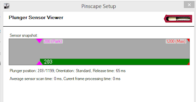

[#zbLaunchBall]
= ZB Launch Ball

Zeb (aka Steve) of link:http://www.zebsboards.com[Zeb's
Boards] came up with a clever feature for his plunger kit that lets the plunger double as a Launch Ball button, for tables like _Medieval Madness_ or _Terminator 2: Judgment Day_ that were
plunger-less in their original arcade versions.  The Pinscape software
has the same feature, which we call ZB Launch Ball in homage to its
inventor.  This section explains how to set it up.

The point of the ZB Launch Ball feature is to let you eliminate the
need for a separate, physical Launch Ball button on your cabinet, by
using your plunger in place of the Launch button for tables that used
the Launch button (instead of a plunger) in the original arcade
version.  Some pin cab builders choose to include _both_ a
plunger and a Launch Button when designing their cabs, but some people
think that looks too cluttered, and would prefer to install just the
plunger, like on most of the real machines.  If you prefer that
cleaner look without the extra button, the ZB Launch feature is really
useful, because it lets you operate the tables that require the Launch
button even though you don't have a Launch button installed.  Plus,
even if you install both controls, ZB Launch can still be a nice
convenience feature, since many of us are so accustomed to using the
plunger that we reach for it reflexively even for games that don't use
it.  It's nice to have the plunger just work at those times.

== How it works

The ZB Launch Ball feature kicks in whenever you're playing table in
Visual Pinball that was originally plunger-less.  It _only_ works
with plunger-less tables.  It doesn't do anything when you're playing
a conventional table with a conventional plunger.

When the ZB Launch feature engages, pulling back and releasing the plunger
translates into a momentary press of the Launch Ball button.  You can
also press the plunger forward slightly to simulate pressing the
Launch button.  Pressing the plunger forward and holding it there
simulates pressing and holding the button, which is useful for a few
tables (such as _Championship Pub_) that do something special on
long presses of the button.

How does Pinscape know that the table is plunger-less?  That's the
clever part.  Zeb's idea was to use a fake LedWiz feedback device to
let the pinball software switch the feature on and off in the plunger
controller.  When the fake device is "on", the controller knows that
ZB Launch Ball is in effect.  This fake device is now standard in the
online DOF Config Tool: it's the device called "ZB Launch Ball".  The
DOF Config Tool database has entries for this device all of the
plunger-less tables.

== Prerequisites

To use ZB Launch, you need DOF to be installed and working, even if
you're not using DOF for anything else.  DOF is needed because it's
what sends the signal to the Pinscape device telling it when ZB Launch
Ball mode should be enabled.  See xref:DOF.adoc#dofSetup[DOF Setup] if you haven't
already installed it.  Follow the instructions to install the DOF
software on your PC and set up a Pinscape device using the online DOF
Config Tool (link:https://configtool.vpuniverse.com[configtool.vpuniverse.com]).

You'll also have to set up your plunger sensor, configure it, and make
sure it's working.  Be sure you've gone through the plunger
calibration process in the Pinscape Config Tool, because the ZB Launch
feature depends upon the plunger resting position being properly
calibrated.  (*Don't* use the joystick calibration in the Windows
joystick control panel.  That's a whole different thing that interacts
poorly with Pinscape.)

== How to set it up

After you have the prerequisites ready, here's how you set up
the ZB Launch feature:

* Run the Pinscape Config Tool and go to the Settings page
* Scroll down to the *ZB Launch Ball setup* section
* Make sure the *Enabled* box is checked
* Ignore the "Output port number" field for now
* Select the keyboard key or joystick button you want Pinscape to send
to the PC to simulate Launch Ball button presses.  The Enter key is
the default because that's what VP normally uses.  If you've changed
VP to use a different key, select that key instead.

* The push distance determines how far forward you have to push the
plunger to activate a simulated button press.  You can leave this
at the default setting for now; you can go back and change it later
if this proves to be too sensitive or not sensitive enough.

* Scroll all the way down to the *Feedback device outputs*
section, and go to the bottom of the port list.  Click the green
"+" button in the empty row at the end.  This will create a new
port of type "Virtual".  That means it's not connected to anything
physical, which is perfect for the ZB Launch Ball port.  Click
somewhere in this row.  This brings up a box that lets you change
the port type.  Click "ZB Launch Port".  This will add a little
red "Launch Ball" button icon in the row.  If you scroll back
up to the ZB Launch Ball setup section, you'll see that this
port has been entered into the "Output port number" field.

* Get out a piece of paper and a *big red marker* and write down the port
number you just assigned

* You're all set with the Config Tool setup, so click *Program
KL25Z* at the bottom of the window to save the changes

* In your browser, go to the DOF config tool (link:https://configtool.vpuniverse.com[configtool.vpuniverse.com])

* Go to the Port Assignments page.  Select your Pinscape unit
from the "Device" drop list.

* Remember the *big red marker* number we wrote down a minute
ago?  Find that same port number in the list.  Open its drop list and
select "ZB Launch Ball".

* Click the Generate Config button, download the ZIP file that
creates, and unpack it into your DirectOutput folder.  This
will install updated DOF files with the new port assignment.

Try testing a couple of plunger-less tables as described below.  Try a
popular table like _Medieval Madness_, since that's likely to
have the right default settings already in place in the DOF Config
Tool database.

== How to test a table

* Load the table in Visual Pinball
* Run the table (press F5)
* Start a game
* When a ball is in the chute, try pulling back and releasing the plunger
* If everything's working, the ball should launch as though you pressed
the Launch button

== Troll bombs and laser cannons

There are a few tables where the Launch Ball button has special uses
in the middle of ball (as opposed to the normal use, of launching the
ball from the plunger chute at the start of a ball), such as:

* Firing the cannons in _Star Trek: The Next Generation_
* Using a troll bomb in _Medieval Madness_
* Firing the cannon in _Terminator 2: Judgment Day_

However, by default, the ZB Launch Ball feature doesn't work at most
of those odd times.  The default DOF Config Tool database is set up so
that ZB Launch only works when a ball is in the plunger chute.  If you
find this annoying (which I do), you'll be pleased to know that you
can fix it.  It just takes a tiny bit of work customizing your
configuration in the DOF Config Tool.

The trick is change the ZB Launch Ball output port setting in the DOF
configuration so that it's *always on* while playing the table in
question.  The default DOF configuration doesn't do that; it only
turns ZB Launch on when a ball is in the plunger chute, for a normal
start-of-ball launch.  That's why the default setup misses cases like
the laser cannons in _ST:TNG_ and the troll bombs in _MM_.
I think it's set up this way out of an abundance of caution, the
concern being that the regular plunger action is disabled whenever ZB
Launch is enabled.  But I personally don't see any downside to leaving
ZB Launch enabled full-time for a game like _ST:TNG_ that doesn't
even have a regular plunger.  Leaving it enabled all the time catches
all of the special cases like the laser cannons and troll bombs.  (You
obviously shouldn't do this for games that also need regular plunger
input, since it would make the regular plunger unusable, but you
wouldn't usually want to use ZB Launch with plunger-equipped tables in
the first place.)

Here's the full procedure:

* Open the link:https://configtool.vpuniverse.com[DOF Config Tool] in your browser
* Log in
* Go to the Table Configs tab at the top
* For each table you want to fix:
** Select the table in the drop list
** Find the *ZB Launch Ball* row
** Enter *ON* in the right column
** Click *Save Changes* at the bottom
* After you've edited all of the tables you want to fix, click *Generate Config* at the bottom
to generate the new .ini files; that'll automatically download a ZIP file with the new .ini files
when it's done
* Unpack the .ini files from the ZIP file into your DOF Config folder

[#zblTroubleshooting]
== Troubleshooting

If it's not working, here are some things to try:

* Make sure you *haven't* used the calibration process in
the Windows joystick control panel.  If you have (or if you're
not certain you haven't):

** Press Windows+R, type `joy.cpl`, press Return
** Find the Pinscape Controller device in the list and double-click it
** Go to the Settings tab
** Click "Reset to defaults".
* Make sure you've gone through the plunger calibration process
using the Pinscape Config Tool plunger dialog.
* In the Pinscape Config Tool plunger dialog, check that the on-screen
plunger position is displayed at the "Park" position when the actual
plunger is at rest.  The park position is shown by purple arrows;
the current plunger position is the green bar. 
* In the Pinscape Config Tool plunger dialog, check that the
on-screen sensor readings respond properly when you move the
physical plunger.
* Make sure that it's possible to push the plunger forward (against
the barrel spring) by about half an inch from the park position.
It's important to have a little room for motion forward of the park
position, because that's what triggers the simulated button press.
In the Pinscape Config Tool plunger dialog, make sure the green
bar moves properly (to the left of the purple "park" arrow) when
you push the plunger forward.
* The ZB Launch Ball feature depends on DOF, so make sure DOF is
working properly with other devices when you run the same table that
you're having trouble with.  See "Troubleshooting" in
xref:DOF.adoc#DOFTroubleshooting[DOF Setup] if DOF isn't working.
* The particular table you're running in Visual Pinball must be configured for ZB
Launch Ball in the DOF configuration.  To check:
** Open the link:https://configtool.vpuniverse.com[DOF Config Tool]
** Log in
** Go to the Table Configs tab
** Select the table you're playing from the drop list
** Find the *ZB Launch Ball* box in the right column
** Make sure there's something in the box
** To get the plunger to activate properly, your DOF device configuration
has to be set up to use *ZB Launch Ball*, not the regular *Launch Ball*.

** Open the link:https://configtool.vpuniverse.com[DOF Config Tool]
** Log in
** Go to the Port Assignments tab
** Select your Pinscape device from the drop list
** Find the *big red marker* port number from the setup procedure
** Make sure it says *ZB Launch Ball*
** Double-check that it *doesn't* just say *Launch Ball* - that's a whole different thing.
It has to say *ZB Launch Ball*

* Let's test that the DOF signal is getting through properly:

** Launch Visual Pinball
** Load a popular plunger-less table like _Medieval Madness_
** Don't run it yet!
** In the VP editor window, click on the *Plunger* button in the left pane
** Click in an empty area in the middle of the playfield to create a plunger
** In the Properties window for the new plunger, make sure *Enable Mechanical Plunger* is check-marked
** Run the table
** Find the new plunger we created above - it should be sitting out there in the middle of the playfield
** Try moving your physical plunger back and forth
** Watch that new on-screen plunger to see if it moves
** If the new plunger _doesn't_ move, that's good.  The DOF signal is getting through properly.  DOF is working; the problem lies elsewhere.
** If the new plunger _does_ move,
the DOF signal is *not* getting sent to the Pinscape device.  When the DOF signal is getting sent properly, Pinscape *disables* the regular plunger
motion, because it knows that this is a Launch Ball button table that doesn't take regular plunger input.  So if the plunger is still moving, Pinscape isn't getting the signal.  The thing to focus on is why the DOF signal isn't getting
sent properly.  Go back through the setup process and double-check all of
the port assignments, in both the Pinscape Config Tool and the DOF Config Tool.
Go through the DOF troubleshooting steps ( xref:DOF#DOFTroubleshooting[DOF Setup] ).

